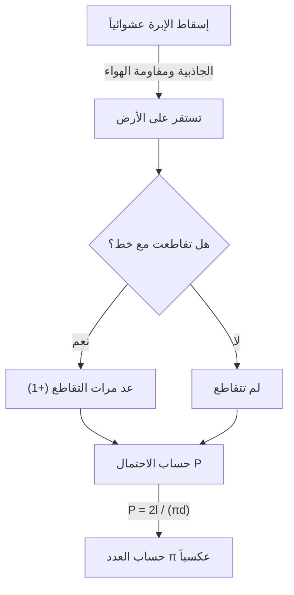

# ما هي إبرة بوفون؟

يزخر عالم الرياضيات بحقائق مدهشة تبدو مخالفة للحدس، ونظريات جميلة تربط بين ظواهر تبدو غير مترابطة للوهلة الأولى. ومن بين أشهر هذه المسائل وأكثرها إثارة مسألة **"إبرة بوفون"** (Buffon's needle problem).

طُرحت هذه المسألة عام 1733 على يد عالم الطبيعة والرياضي الفرنسي جورج لوي لوكلير، كونت دو بوفون (Georges-Louis Leclerc, Comte de Buffon)، وتم حلها لأول مرة عام 1777.

والمدهش في هذه المسألة أنها تتيح حساب أحد أهم الثوابت الرياضية وهو **العدد π** من خلال فعل فيزيائي عشوائي بسيط وهو "إسقاط إبرة عشوائياً على الأرض". تُعد هذه المسألة من أقدم المسائل في نظرية الاحتمالات الهندسية (Geometric probability)، وتُعتبر اكتشافاً رائداً يُمهّد الطريق لطريقة مونت كارلو (Monte Carlo method) اللاحقة.

في هذه المقالة، نشرح بالتفصيل وبأسلوب واضح مسألة **إبرة بوفون** بدءاً من صياغة المسألة، مروراً بالبرهان الرياضي، وصولاً إلى تقدير العدد π باستخدام المحاكاة الحاسوبية الحديثة.

## الإعداد الأساسي للمسألة

صياغة مسألة إبرة بوفون بسيطة للغاية.

1. على أرضية مستوية، تُرسم خطوط متوازية عديدة بمسافة ثابتة $d$ بين كل خطين.
2. نحضر إبرة واحدة بطول $l$.
3. نُسقط هذه الإبرة عشوائياً على الأرض.

عندئذٍ، كان السؤال الذي طرحه بوفون هو: **"ما احتمال أن تتقاطع الإبرة الساقطة مع أحد الخطوط المتوازية المرسومة على الأرض؟"**

يوضح المخطط التالي التدفق المفاهيمي لهذه التجربة.



هنا، لتبسيط المسألة، نأخذ حالة **الإبرة القصيرة** حيث يكون طول الإبرة $l$ أقل من أو يساوي المسافة بين الخطوط $d$ (أي $l \le d$). في ظل هذا الشرط، لا يمكن للإبرة أن تتقاطع مع أكثر من خط واحد في الوقت نفسه.

## النمذجة الرياضية واشتقاق الاحتمال

لحل هذه المسألة رياضياً، يجب تحديد حالة الإبرة بقيم عددية (بارامترات). نفترض أن موقع الإبرة واتجاهها عند سقوطها على الأرض عشوائيان تماماً.

لتحديد موقع الإبرة، نعرّف المتغيرين التاليين:

1. $x$: المسافة العمودية من مركز الإبرة إلى أقرب خط متوازٍ.
2. $\theta$: الزاوية الحادة (أو القائمة) التي تصنعها الإبرة مع الخطوط المتوازية.

### نطاق قيم المتغيرات

أولاً، لنفكر في القيم الممكنة لكل متغير.

- **بالنسبة للمسافة $x$:** يقع مركز الإبرة في مكان ما بين خطين متجاورين. بما أننا نأخذ المسافة إلى أقرب خط، فإن القيمة الدنيا لـ $x$ هي $0$ (عندما يكون مركز الإبرة على الخط)، والقيمة القصوى هي $\frac{d}{2}$ (عندما يكون مركز الإبرة في منتصف المسافة بين خطين). أي أن $0 \le x \le \frac{d}{2}$. بما أن الإبرة تُسقط عشوائياً، فإن $x$ يتبع **توزيعاً منتظماً** في هذا النطاق. دالة الكثافة الاحتمالية هي $\frac{2}{d}$.
- **بالنسبة للزاوية $\theta$:** تأخذ الزاوية بين الإبرة والخط المتوازي قيماً من $0$ (عندما تكون الإبرة موازية للخط) إلى $\frac{\pi}{2}$ (90 درجة، عندما تكون عمودية عليه). بسبب التماثل، لا حاجة لاعتبار زوايا أكبر. إذن $0 \le \theta \le \frac{\pi}{2}$. اتجاه الإبرة أيضاً عشوائي، لذا يتبع $\theta$ **توزيعاً منتظماً** في هذا النطاق. دالة الكثافة الاحتمالية هي $\frac{2}{\pi}$.

المتغيران $x$ و $\theta$ مستقلان عن بعضهما، لذا فإن دالة الكثافة الاحتمالية المشتركة $f(x, \theta)$ لزوج محدد $(x, \theta)$ تُعطى بجداء دالتي الكثافة:

$$
f(x, \theta) = \frac{2}{d} \times \frac{2}{\pi} = \frac{4}{d\pi}
$$

### شرط التقاطع

بعد ذلك، لنفكر في الشرط اللازم لتقاطع الإبرة مع خط.
تتقاطع الإبرة مع الخط عندما يكون الطول العمودي من مركز الإبرة إلى طرفها أكبر من أو يساوي المسافة $x$ إلى أقرب خط.

طول الإبرة هو $l$، وبالتالي المسافة من المركز إلى الطرف هي $\frac{l}{2}$.
عندما تكون الزاوية $\theta$، فإن المسافة العمودية (الإسقاط) التي يشغلها نصف الإبرة هي $\frac{l}{2} \sin \theta$.

وبالتالي، يُعبَّر عن شرط تقاطع الإبرة مع الخط بالمتباينة التالية:

$$
x \le \frac{l}{2} \sin \theta
$$

### حساب الاحتمال

يُحسب احتمال تقاطع الإبرة مع الخط $P$ بتكامل دالة الكثافة المشتركة $f(x, \theta)$ على المنطقة التي تحقق شرط التقاطع.

$$
P = \iint_{\text{منطقة التقاطع}} f(x, \theta) \, dx \, d\theta
$$

حدود التكامل المحددة هي: $\theta$ يتغير من $0$ إلى $\frac{\pi}{2}$، و $x$ يتغير من $0$ إلى القيمة الحدية للتقاطع $\frac{l}{2} \sin \theta$.

$$
P = \int_{0}^{\frac{\pi}{2}} \int_{0}^{\frac{l}{2} \sin \theta} \frac{4}{d\pi} \, dx \, d\theta
$$

أولاً، نحسب التكامل الداخلي بالنسبة لـ $x$:

$$
\int_{0}^{\frac{l}{2} \sin \theta} \frac{4}{d\pi} \, dx = \frac{4}{d\pi} \left[ x \right]_{0}^{\frac{l}{2} \sin \theta} = \frac{4}{d\pi} \left( \frac{l}{2} \sin \theta - 0 \right) = \frac{2l}{d\pi} \sin \theta
$$

ثم نحسب التكامل الخارجي بالنسبة لـ $\theta$:

$$
P = \int_{0}^{\frac{\pi}{2}} \frac{2l}{d\pi} \sin \theta \, d\theta = \frac{2l}{d\pi} \int_{0}^{\frac{\pi}{2}} \sin \theta \, d\theta
$$

تكامل $\sin \theta$ هو $-\cos \theta$، وبالتالي:

$$
\int_{0}^{\frac{\pi}{2}} \sin \theta \, d\theta = \left[ -\cos \theta \right]_{0}^{\frac{\pi}{2}} = (-\cos \frac{\pi}{2}) - (-\cos 0) = -0 - (-1) = 1
$$

وبالتالي، فإن الاحتمال المطلوب $P$ هو:

$$
P = \frac{2l}{d\pi} \times 1 = \frac{2l}{\pi d}
$$

هذه هي الصيغة الأساسية لـ **إبرة بوفون**. احتمال تقاطع الإبرة مع خط يساوي ضعف طول الإبرة $l$ مقسوماً على حاصل ضرب العدد π في المسافة بين الخطوط $d$.

## تقدير العدد π (طريقة مونت كارلو)

تحتوي الصيغة المشتقة $P = \frac{2l}{\pi d}$ على $\pi$ بشكل رائع. عند حلها بالنسبة لـ $\pi$، نحصل على:

$$
\pi = \frac{2l}{P d}
$$

تعني هذه المعادلة أنه إذا عرفنا الاحتمال $P$، يمكننا حساب العدد π. بالطبع، لا يمكن معرفة الاحتمال الحقيقي $P$ إلا بإجراء عدد لا نهائي من التجارب، ولكن يمكن الحصول على قيمة تقريبية لـ $P$ بإسقاط الإبرة عدداً كبيراً من المرات في تجربة فعلية.

نرمز لعدد مرات إسقاط الإبرة الإجمالي بـ $N$، ولعدد مرات التقاطع بـ $C$.
عندما يكون عدد التجارب $N$ كبيراً بما فيه الكفاية، فإنه وفقاً لقانون الأعداد الكبيرة، يقترب الاحتمال التجريبي $\frac{C}{N}$ من الاحتمال النظري $P$.

$$
P \approx \frac{C}{N}
$$

بالتعويض في المعادلة السابقة، نحصل على صيغة لتقريب العدد π:

$$
\pi \approx \frac{2l \cdot N}{C \cdot d}
$$

تكون العملية الحسابية أبسط ما يمكن عندما يتساوى طول الإبرة $l$ مع المسافة بين الخطوط $d$ (أي $l = d$). في هذه الحالة تصبح الصيغة أكثر بساطة:

$$
\pi \approx \frac{2N}{C}
$$

أي أنه يكفي ضرب عدد مرات إسقاط الإبرة في 2 وقسمته على عدد مرات التقاطع للحصول على العدد π!

### المحاكاة بلغة Python

إسقاط الإبرة يدوياً آلاف المرات عمل شاق للغاية (رغم وجود رياضيين في التاريخ أجروا تجارب بآلاف المرات فعلياً). في العصر الحديث، يمكن محاكاة هذه التجربة بسهولة باستخدام الحاسوب.

فيما يلي مثال بسيط على كود Python لمحاكاة تجربة إبرة بوفون وتقدير العدد π.

```python
import random
import math

def buffons_needle_simulation(num_trials, l, d):
    """
    دالة لمحاكاة إبرة بوفون وتقدير العدد π

    :param num_trials: عدد مرات إسقاط الإبرة
    :param l: طول الإبرة
    :param d: المسافة بين الخطوط المتوازية
    :return: القيمة المقدّرة للعدد π
    """
    crosses = 0
    
    for _ in range(num_trials):
        # توليد المسافة x عشوائياً من مركز الإبرة إلى أقرب خط (من 0 إلى d/2)
        x = random.uniform(0, d / 2.0)
        
        # توليد زاوية الإبرة theta عشوائياً (من 0 إلى π/2)
        theta = random.uniform(0, math.pi / 2.0)
        
        # التحقق من تحقق شرط التقاطع
        if x <= (l / 2.0) * math.sin(theta):
            crosses += 1
            
    # معالجة استثنائية لتجنب الخطأ في حالة عدم حدوث أي تقاطع
    if crosses == 0:
        return float('inf')
        
    # حساب القيمة المقدّرة للعدد π
    estimated_pi = (2.0 * l * num_trials) / (d * crosses)
    return estimated_pi

# إعداد المعاملات
N = 1000000  # عدد التجارب (مليون مرة)
needle_length = 1.0
line_distance = 1.0

# تنفيذ المحاكاة
estimated_pi = buffons_needle_simulation(N, needle_length, line_distance)

print(f"عدد التجارب: {N:,} مرة")
print(f"العدد π المقدّر: {estimated_pi}")
print(f"العدد π الفعلي:  {math.pi}")
print(f"الخطأ:           {abs(math.pi - estimated_pi)}")
```

عند تشغيل هذا الكود، يتم إسقاط عدد كبير من الإبر الافتراضية باستخدام أرقام عشوائية، ويمكن التحقق من الحصول على قيمة تقريبية للعدد π بدقة عالية جداً تقارب $3.1415...$. تُسمى هذه الطريقة في الحصول على حلول تقريبية لمسائل احتمالية باستخدام الأرقام العشوائية **طريقة مونت كارلو**.

## الخلاصة

تبدو إبرة بوفون للوهلة الأولى مجرد لعبة مصادفة فيزيائية، لكن خلفها تقوم نظرية رياضية راسخة. إن اندماج الأحداث العشوائية (الاحتمالات) والأشكال الهندسية (الخطوط المستقيمة والقطع المستقيمة) والعدد اللانسبي المطلق $\pi$ في معادلة واحدة بسيطة يُجسّد جمال الرياضيات.

كما أن لهذه المسألة أهمية تاريخية بوصفها أصل طريقة مونت كارلو التي لا غنى عنها في العلوم والتكنولوجيا الحديثة. فمن محاكاة الأنظمة المعقدة إلى حساب التكاملات التي يصعب حلها تحليلياً، لا تزال أفكار بوفون تدعم عالمنا بأشكال متعددة حتى اليوم.

لماذا لا تُحضر ورقة وقلماً وبعض أعواد الأسنان لتجرب بنفسك جزءاً من هذا التاريخ الرياضي العظيم في منزلك؟
