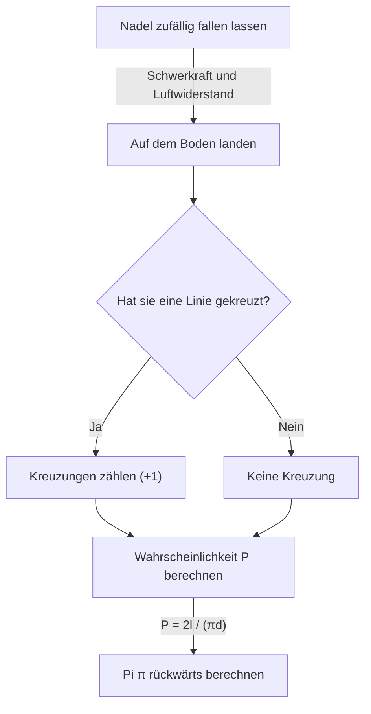

# Was ist das Buffonsche Nadelproblem?

In der Welt der Mathematik gibt es viele schöne Theoreme, in denen erstaunliche Tatsachen, die der Intuition widersprechen, oder scheinbar unzusammenhängende Ereignisse wunderbar miteinander verbunden sind. Eines der berühmtesten und faszinierendsten Probleme unter ihnen ist das **Buffonsche Nadelproblem**.

Dieses Problem wurde 1733 von Georges-Louis Leclerc, Comte de Buffon, einem französischen Naturforscher und Mathematiker des 18. Jahrhunderts, vorgeschlagen und 1777 erstmals gelöst.

Überraschenderweise besagt dieses Problem, dass man durch den extrem physischen und zufälligen Akt des "zufälligen Fallenlassens einer Nadel auf den Boden" eine der wichtigsten Konstanten in der Mathematik bestimmen kann, **Pi $\pi$**. Dies ist als eines der frühesten Probleme der geometrischen Wahrscheinlichkeit bekannt und war eine bahnbrechende Entdeckung, die als Pionier der späteren Monte-Carlo-Methode gelten kann.

In diesem Artikel werden wir ausführlich und leicht verständlich von der Problemstellung des **Buffonschen Nadelproblems**, seinem mathematischen Beweis bis hin zur Schätzung von Pi durch Simulation mit modernen Computern erklären.

## Grundlegende Einstellung des Problems

Die Problemstellung der Buffonschen Nadel ist sehr einfach.

1. Auf einem flachen Boden werden viele parallele gerade Linien in gleichen Abständen $d$ gezeichnet.
2. Eine einzelne Nadel der Länge $l$ wird vorbereitet.
3. Diese Nadel wird zufällig (willkürlich) auf den Boden fallen gelassen.

Zu diesem Zeitpunkt lautet das von Buffon vorgeschlagene Problem: **"Wie groß ist die Wahrscheinlichkeit, dass die fallen gelassene Nadel eine der auf dem Boden gezeichneten parallelen Linien kreuzt?"**

Das folgende Diagramm zeigt den konzeptionellen Ablauf dieses Experiments.



Um das Problem zu vereinfachen, betrachten wir hier den Fall einer **kurzen Nadel**, bei dem die Länge der Nadel $l$ kleiner oder gleich dem Abstand der parallelen Linien $d$ ist ($l \le d$). Unter dieser Bedingung wird die Nadel niemals zwei oder mehr gerade Linien gleichzeitig kreuzen.

## Mathematische Modellierung und Ableitung der Wahrscheinlichkeit

Um dieses Problem mathematisch zu lösen, ist es notwendig, den [Zustand](https://kenji.blog/de/p/state-management-history-redux-context-recoil-zustand/) der Nadel zu quantifizieren (zu parametrisieren). Wenn die Nadel auf den Boden fällt, gehen wir davon aus, dass ihre Position und Ausrichtung völlig zufällig sind.

Um die Position der Nadel zu bestimmen, definieren wir die folgenden zwei Variablen.

1. $x$ : Der vertikale Abstand von der Mitte der Nadel zur nächsten parallelen Linie.
2. $\theta$ : Der spitze Winkel (oder rechte Winkel), der von der Nadel und den parallelen Linien gebildet wird.

### Möglicher Wertebereich der Variablen

Lassen Sie uns zunächst überlegen, welche Werte jede Variable annehmen kann.

- **Bezüglich des Abstands $x$:** Die Mitte der Nadel fällt irgendwo zwischen zwei benachbarte parallele Linien. Da wir den Abstand zur nächsten Linie betrachten, ist der Mindestwert von $x$ $0$ (wenn sich die Mitte der Nadel auf der Linie befindet) und der Höchstwert $\frac{d}{2}$ (wenn sich die Mitte der Nadel genau in der Mitte zwischen zwei Linien befindet). Das heißt, $0 \le x \le \frac{d}{2}$. Da die Nadel zufällig fallen gelassen wird, folgt $x$ in diesem Bereich einer **Gleichverteilung**. Die Wahrscheinlichkeitsdichtefunktion ist $\frac{2}{d}$.
- **Bezüglich des Winkels $\theta$:** Der von der Nadel und der parallelen Linie gebildete Winkel nimmt einen Wert von $0$ an, wenn die Nadel parallel zur geraden Linie ist, bis $\frac{\pi}{2}$ (90 Grad), wenn sie senkrecht ist. Aus Symmetriegründen ist es nicht erforderlich, größere Winkel als diesen zu betrachten. Daher gilt $0 \le \theta \le \frac{\pi}{2}$. Da die Ausrichtung der Nadel ebenfalls zufällig ist, folgt auch $\theta$ in diesem Bereich einer **Gleichverteilung**. Die Wahrscheinlichkeitsdichtefunktion ist $\frac{2}{\pi}$.

Da die Variablen $x$ und $\theta$ unabhängig voneinander sind, wird die gemeinsame Wahrscheinlichkeitsdichtefunktion $f(x, \theta)$, dass sie ein bestimmtes Paar $(x, \theta)$ annehmen, als Produkt ihrer jeweiligen Wahrscheinlichkeitsdichtefunktionen ausgedrückt.

$$
f(x, \theta) = \frac{2}{d} \times \frac{2}{\pi} = \frac{4}{d\pi}
$$

### Kreuzungsbedingungen

Betrachten Sie als Nächstes die Bedingungen, unter denen die Nadel eine gerade Linie kreuzt.
Die Nadel kreuzt eine gerade Linie, wenn die vertikale Länge von der Mitte der Nadel bis zu ihrem Ende größer oder gleich dem Abstand $x$ zur nächsten Linie ist.

Da die Länge der Nadel $l$ ist, beträgt die Länge von der Mitte bis zum Ende $\frac{l}{2}$.
Wenn der Winkel $\theta$ ist, beträgt der Abstand, den diese Hälfte der Nadel in vertikaler Richtung einnimmt (projizierte Länge), $\frac{l}{2} \sin \theta$.

Daher wird die Bedingung, dass die Nadel eine gerade Linie kreuzt, durch die folgende Ungleichung ausgedrückt.

$$
x \le \frac{l}{2} \sin \theta
$$

### Berechnung der Wahrscheinlichkeit

Die Wahrscheinlichkeit $P$, dass die Nadel eine Linie kreuzt, wird durch Integration der gemeinsamen Wahrscheinlichkeitsdichtefunktion $f(x, \theta)$ über den Bereich erhalten, der die Kreuzungsbedingung erfüllt.

$$
P = \iint_{\text{Schnittbereich}} f(x, \theta) \, dx \, d\theta
$$

Der spezifische Integrationsbereich ist dort, wo sich $\theta$ von $0$ bis $\frac{\pi}{2}$ ändert und sich $x$ von $0$ bis zum Grenzwert der Kreuzung $\frac{l}{2} \sin \theta$ ändert.

$$
P = \int_{0}^{\frac{\pi}{2}} \int_{0}^{\frac{l}{2} \sin \theta} \frac{4}{d\pi} \, dx \, d\theta
$$

Zuerst berechnen wir das innere Integral in Bezug auf $x$.

$$
\int_{0}^{\frac{l}{2} \sin \theta} \frac{4}{d\pi} \, dx = \frac{4}{d\pi} \left[ x \right]_{0}^{\frac{l}{2} \sin \theta} = \frac{4}{d\pi} \left( \frac{l}{2} \sin \theta - 0 \right) = \frac{2l}{d\pi} \sin \theta
$$

Als Nächstes berechnen wir das äußere Integral in Bezug auf $\theta$.

$$
P = \int_{0}^{\frac{\pi}{2}} \frac{2l}{d\pi} \sin \theta \, d\theta = \frac{2l}{d\pi} \int_{0}^{\frac{\pi}{2}} \sin \theta \, d\theta
$$

Da das Integral von $\sin \theta$ $-\cos \theta$ ist,

$$
\int_{0}^{\frac{\pi}{2}} \sin \theta \, d\theta = \left[ -\cos \theta \right]_{0}^{\frac{\pi}{2}} = (-\cos \frac{\pi}{2}) - (-\cos 0) = -0 - (-1) = 1
$$

Daher ist die erforderliche Wahrscheinlichkeit $P$ wie folgt.

$$
P = \frac{2l}{d\pi} \times 1 = \frac{2l}{\pi d}
$$

Dies ist die Grundformel der **Buffonschen Nadel**. Die Wahrscheinlichkeit, dass die Nadel eine Linie kreuzt, ist das Zweifache der Länge der Nadel $l$, geteilt durch das Produkt aus Pi $\pi$ und dem Intervall der Linien $d$.

## Schätzung von Pi (Monte-Carlo-Methode)

Die abgeleitete Formel $P = \frac{2l}{\pi d}$ enthält auf wunderbare Weise $\pi$. Wenn man dies nach $\pi$ auflöst, ergibt sich Folgendes.

$$
\pi = \frac{2l}{P d}
$$

Diese Gleichung bedeutet, dass Pi $\pi$ berechnet werden kann, wenn nur die Wahrscheinlichkeit $P$ bekannt ist. Natürlich kann die wahre Wahrscheinlichkeit $P$ ohne eine unendliche Anzahl von Versuchen nicht bekannt sein, aber indem man die Nadel in einem tatsächlichen Experiment viele Male fallen lässt, kann ein ungefährer Wert von $P$ erhalten werden.

Sei $N$ die Gesamtzahl der Fälle, in denen die Nadel fallen gelassen wurde, und $C$ die Anzahl der Fälle, in denen die Nadel eine Linie kreuzte.
Wenn die Anzahl der Versuche $N$ groß genug ist, nähert sich nach dem Gesetz der großen Zahlen die empirische Wahrscheinlichkeit $\frac{C}{N}$ der theoretischen Wahrscheinlichkeit $P$ an.

$$
P \approx \frac{C}{N}
$$

Das Einsetzen in die vorherige Gleichung ergibt eine Formel zum Ermitteln des Näherungswerts von Pi $\pi$.

$$
\pi \approx \frac{2l \cdot N}{C \cdot d}
$$

Die einfachste Berechnung ist, wenn die Nadellänge $l$ und das Linienintervall $d$ gleich sind ($l = d$). Zu diesem Zeitpunkt wird die Formel noch einfacher.

$$
\pi \approx \frac{2N}{C}
$$

Mit anderen Worten, teile einfach das Zweifache der "Anzahl, wie oft die Nadel fallen gelassen wurde" durch die "Anzahl, wie oft sie sich kreuzte", und Pi wird erhalten!

### Simulation mit Python

Das tausendfache Fallenlassen einer Nadel von Hand ist eine sehr mühsame Aufgabe (obwohl es historisch gesehen Mathematiker gibt, die tatsächlich Tausende von Experimenten durchgeführt haben). Heute können wir dieses Experiment problemlos mit einem Computer simulieren.

Nachfolgend finden Sie ein einfaches Codebeispiel, in dem Python verwendet wird, um das Buffonsche Nadelexperiment zu simulieren und Pi zu schätzen.

```python
import random
import math

def buffons_needle_simulation(num_trials, l, d):
    """
    Eine Funktion zur Simulation der Buffonschen Nadel und zur Schätzung von Pi
    
    :param num_trials: Wie oft die Nadel fallen gelassen werden soll
    :param l: Länge der Nadel
    :param d: Intervall paralleler Linien
    :return: Geschätztes Pi
    """
    crosses = 0
    
    for _ in range(num_trials):
        # Generiere zufällig den Abstand x von der Mitte der Nadel zur nächsten Linie (0 bis d/2)
        x = random.uniform(0, d / 2.0)
        
        # Generiere zufällig den Winkel theta der Nadel (0 bis pi/2)
        theta = random.uniform(0, math.pi / 2.0)
        
        # Prüfe, ob die Kreuzungsbedingung erfüllt ist
        if x <= (l / 2.0) * math.sin(theta):
            crosses += 1
            
    # Ausnahmebehandlung, um Fehler zu vermeiden, falls sie sich nie kreuzt
    if crosses == 0:
        return float('inf')
        
    # Schätzungsberechnung von Pi
    estimated_pi = (2.0 * l * num_trials) / (d * crosses)
    return estimated_pi

# Parametereinstellungen
N = 1000000  # Anzahl der Versuche (1 Million Mal)
needle_length = 1.0
line_distance = 1.0

# Führe die Simulation aus
estimated_pi = buffons_needle_simulation(N, needle_length, line_distance)

print(f"Anzahl der Versuche: {N:,} Mal")
print(f"Geschätztes Pi:      {estimated_pi}")
print(f"Tatsächliches Pi:    {math.pi}")
print(f"Fehler:              {abs(math.pi - estimated_pi)}")
```

Das Ausführen dieses Codes lässt eine große Anzahl virtueller Nadeln mithilfe von Zufallszahlen fallen, und es kann bestätigt werden, dass ein Näherungswert für Pi von $3.1415...$ mit sehr hoher Genauigkeit erhalten wird. Die Methode, Zufallszahlen zu verwenden, um auf diese Weise Näherungslösungen für probabilistische Probleme zu finden, wird **Monte-Carlo-Methode** genannt.

## Zusammenfassung

Die Buffonsche Nadel scheint auf den ersten Blick ein reines physikalisches Glücksspiel zu sein, aber dahinter verbirgt sich eine solide mathematische Theorie. Die Art und Weise, wie zufällige Ereignisse (Wahrscheinlichkeit), geometrische Formen (Linien und Liniensegmente) und die ultimative irrationale Zahl $\pi$ zu einer einzigen einfachen mathematischen Formel verschmelzen, verkörpert die Schönheit der Mathematik.

Darüber hinaus ist dieses Problem als Ursprung der Monte-Carlo-Methode, die für die moderne Wissenschaft und Technologie unverzichtbar ist, von historischer Bedeutung. Die Simulation komplexer Systeme und die Berechnung von Integralen, die analytisch schwer zu lösen sind, Buffons Idee unterstützt unsere Welt auch heute noch in verschiedenen Formen.

Warum nicht etwas Papier, einen Stift und ein paar Zahnstocher vorbereiten und einen Teil dieser großartigen mathematischen Geschichte zu Hause erleben?
