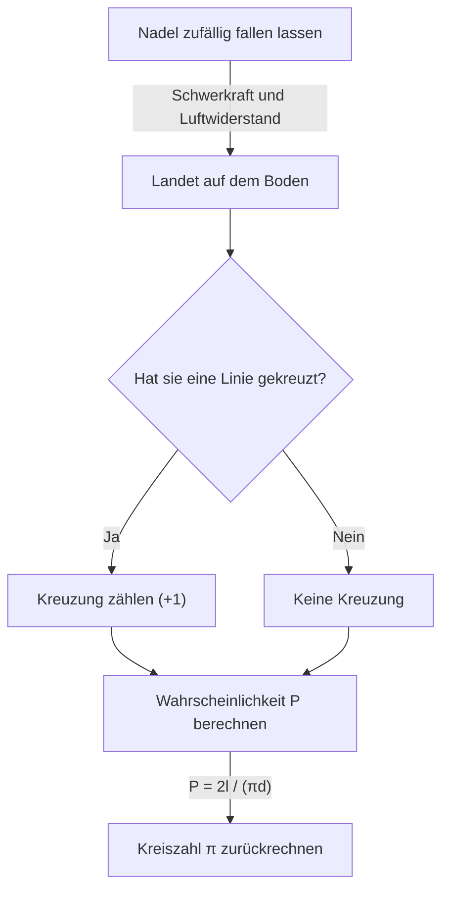

# Was ist Buffons Nadel?

In der Welt der Mathematik gibt es viele erstaunliche Fakten, die der Intuition widersprechen, und wunderschöne Theoreme, die scheinbar unzusammenhängende Phänomene brillant miteinander verbinden. Eines der berühmtesten und faszinierendsten Probleme darunter ist **„Buffons Nadel"** (Buffon's needle problem).

Dieses Problem wurde 1733 vom französischen Naturforscher und Mathematiker des 18. Jahrhunderts, Georges-Louis Leclerc, Comte de Buffon, aufgestellt und 1777 erstmals gelöst.

Erstaunlicherweise zeigt dieses Problem, dass eine der wichtigsten mathematischen Konstanten – die **Kreiszahl $\pi$** – durch den äußerst physischen und zufälligen Akt des „zufälligen Fallenlassens einer Nadel auf den Boden" bestimmt werden kann. Es gilt als eines der frühesten Probleme der geometrischen Wahrscheinlichkeit (Geometric probability) und war eine bahnbrechende Entdeckung, die als Vorläufer der Monte-Carlo-Methode (Monte Carlo method) angesehen werden kann.

In diesem Artikel erklären wir **Buffons Nadel** ausführlich und verständlich – von der Problemstellung über den mathematischen Beweis bis hin zur Schätzung der Kreiszahl durch Simulation mit modernen Computern.

## Grundlegende Problemstellung

Die Problemstellung von Buffons Nadel ist bemerkenswert einfach.

1. Auf einem flachen Boden sind zahlreiche parallele Linien im gleichmäßigen Abstand $d$ gezeichnet.
2. Eine einzelne Nadel der Länge $l$ wird vorbereitet.
3. Die Nadel wird zufällig auf den Boden fallen gelassen.

Die von Buffon gestellte Frage lautet: **„Wie groß ist die Wahrscheinlichkeit, dass die gefallene Nadel eine der auf dem Boden gezeichneten parallelen Linien kreuzt?"**

Das folgende Diagramm zeigt den konzeptionellen Ablauf dieses Experiments.



Hier betrachten wir zur Vereinfachung des Problems den Fall einer **kurzen Nadel**, bei der die Nadellänge $l$ kleiner oder gleich dem Linienabstand $d$ ist ($l \le d$). Unter dieser Bedingung kann die Nadel niemals mehr als eine Linie gleichzeitig kreuzen.

## Mathematische Modellierung und Herleitung der Wahrscheinlichkeit

Um dieses Problem mathematisch zu lösen, müssen wir den Zustand der Nadel quantifizieren (parametrisieren). Wir nehmen an, dass Position und Ausrichtung der Nadel beim Auftreffen auf dem Boden vollständig zufällig sind.

Zur Bestimmung der Nadelposition definieren wir die folgenden zwei Variablen.

1. $x$: Der senkrechte Abstand vom Mittelpunkt der Nadel zur nächsten parallelen Linie.
2. $\theta$: Der spitze Winkel (oder rechte Winkel) zwischen der Nadel und den parallelen Linien.

### Wertebereich der Variablen

Zunächst überlegen wir, welche Werte jede Variable annehmen kann.

- **Abstand $x$:** Der Mittelpunkt der Nadel fällt irgendwo zwischen zwei benachbarte parallele Linien. Da wir den Abstand zur nächsten Linie betrachten, ist der Minimalwert von $x$ gleich $0$ (wenn der Mittelpunkt der Nadel auf einer Linie liegt) und der Maximalwert gleich $\frac{d}{2}$ (wenn der Mittelpunkt genau in der Mitte zwischen zwei Linien liegt). Das heißt, $0 \le x \le \frac{d}{2}$. Da die Nadel zufällig fallen gelassen wird, folgt $x$ einer **Gleichverteilung** über diesen Bereich. Die Wahrscheinlichkeitsdichtefunktion beträgt $\frac{2}{d}$.
- **Winkel $\theta$:** Der Winkel zwischen der Nadel und den parallelen Linien reicht von $0$, wenn die Nadel parallel zu den Linien liegt, bis $\frac{\pi}{2}$ (90 Grad), wenn sie senkrecht steht. Aufgrund der Symmetrie müssen wir keine größeren Winkel berücksichtigen. Daher gilt $0 \le \theta \le \frac{\pi}{2}$. Da auch die Ausrichtung der Nadel zufällig ist, folgt $\theta$ ebenfalls einer **Gleichverteilung** über diesen Bereich. Die Wahrscheinlichkeitsdichtefunktion beträgt $\frac{2}{\pi}$.

Da die Variablen $x$ und $\theta$ voneinander unabhängig sind, ergibt sich die gemeinsame Wahrscheinlichkeitsdichtefunktion $f(x, \theta)$ für ein bestimmtes Paar $(x, \theta)$ als Produkt der einzelnen Wahrscheinlichkeitsdichtefunktionen.

$$
f(x, \theta) = \frac{2}{d} \times \frac{2}{\pi} = \frac{4}{d\pi}
$$

### Kreuzungsbedingung

Als Nächstes betrachten wir die Bedingung dafür, dass die Nadel eine Linie kreuzt.
Die Nadel kreuzt eine Linie, wenn die senkrechte Ausdehnung vom Mittelpunkt der Nadel bis zu ihrer Spitze größer oder gleich dem Abstand $x$ zur nächsten Linie ist.

Da die Nadellänge $l$ beträgt, ist der Abstand vom Mittelpunkt zur Spitze $\frac{l}{2}$.
Bei einem Winkel $\theta$ beträgt die senkrechte Distanz, die diese Hälfte der Nadel einnimmt (die projizierte Länge), $\frac{l}{2} \sin \theta$.

Daher wird die Bedingung für eine Kreuzung der Nadel mit einer Linie durch die folgende Ungleichung ausgedrückt.

$$
x \le \frac{l}{2} \sin \theta
$$

### Berechnung der Wahrscheinlichkeit

Die Wahrscheinlichkeit $P$, dass die Nadel eine Linie kreuzt, wird durch Integration der gemeinsamen Wahrscheinlichkeitsdichtefunktion $f(x, \theta)$ über den Bereich erhalten, der die Kreuzungsbedingung erfüllt.

$$
P = \iint_{\text{Kreuzungsbereich}} f(x, \theta) \, dx \, d\theta
$$

Die konkreten Integrationsgrenzen sind: $\theta$ variiert von $0$ bis $\frac{\pi}{2}$, und $x$ variiert von $0$ bis zum Kreuzungsschwellenwert $\frac{l}{2} \sin \theta$.

$$
P = \int_{0}^{\frac{\pi}{2}} \int_{0}^{\frac{l}{2} \sin \theta} \frac{4}{d\pi} \, dx \, d\theta
$$

Zunächst berechnen wir das innere Integral bezüglich $x$.

$$
\int_{0}^{\frac{l}{2} \sin \theta} \frac{4}{d\pi} \, dx = \frac{4}{d\pi} \left[ x \right]_{0}^{\frac{l}{2} \sin \theta} = \frac{4}{d\pi} \left( \frac{l}{2} \sin \theta - 0 \right) = \frac{2l}{d\pi} \sin \theta
$$

Dann berechnen wir das äußere Integral bezüglich $\theta$.

$$
P = \int_{0}^{\frac{\pi}{2}} \frac{2l}{d\pi} \sin \theta \, d\theta = \frac{2l}{d\pi} \int_{0}^{\frac{\pi}{2}} \sin \theta \, d\theta
$$

Da das Integral von $\sin \theta$ gleich $-\cos \theta$ ist,

$$
\int_{0}^{\frac{\pi}{2}} \sin \theta \, d\theta = \left[ -\cos \theta \right]_{0}^{\frac{\pi}{2}} = (-\cos \frac{\pi}{2}) - (-\cos 0) = -0 - (-1) = 1
$$

Somit ergibt sich die gesuchte Wahrscheinlichkeit $P$ wie folgt.

$$
P = \frac{2l}{d\pi} \times 1 = \frac{2l}{\pi d}
$$

Dies ist die grundlegende Formel von **Buffons Nadel**. Die Wahrscheinlichkeit, dass die Nadel eine Linie kreuzt, entspricht dem Doppelten der Nadellänge $l$, geteilt durch das Produkt aus der Kreiszahl $\pi$ und dem Linienabstand $d$.

## Schätzung der Kreiszahl π (Monte-Carlo-Methode)

Die hergeleitete Formel $P = \frac{2l}{\pi d}$ enthält auf elegante Weise $\pi$. Löst man nach $\pi$ auf, erhält man:

$$
\pi = \frac{2l}{P d}
$$

Diese Gleichung bedeutet, dass wir die Kreiszahl $\pi$ berechnen können, wenn wir die Wahrscheinlichkeit $P$ kennen. Natürlich erfordert die wahre Wahrscheinlichkeit $P$ unendlich viele Versuche, aber durch häufiges Fallenlassen der Nadel in einem tatsächlichen Experiment können wir eine Näherung von $P$ erhalten.

Sei $N$ die Gesamtzahl der Nadelwürfe und $C$ die Anzahl der Kreuzungen mit einer Linie.
Wenn die Anzahl der Versuche $N$ ausreichend groß ist, nähert sich gemäß dem Gesetz der großen Zahlen die empirische Wahrscheinlichkeit $\frac{C}{N}$ der theoretischen Wahrscheinlichkeit $P$ an.

$$
P \approx \frac{C}{N}
$$

Setzt man dies in die vorherige Gleichung ein, erhält man eine Formel zur Näherung der Kreiszahl $\pi$.

$$
\pi \approx \frac{2l \cdot N}{C \cdot d}
$$

Die einfachste Berechnung ergibt sich, wenn Nadellänge $l$ und Linienabstand $d$ gleich sind ($l = d$). In diesem Fall vereinfacht sich die Formel weiter.

$$
\pi \approx \frac{2N}{C}
$$

Mit anderen Worten: Man kann die Kreiszahl bestimmen, indem man einfach die doppelte Anzahl der Nadelwürfe durch die Anzahl der Kreuzungen teilt!

### Python-Simulation

Tausende Male von Hand eine Nadel fallen zu lassen, ist eine äußerst mühsame Aufgabe (obwohl es in der Geschichte tatsächlich Mathematiker gab, die Tausende solcher Experimente durchführten). In der heutigen Zeit können wir dieses Experiment leicht mit einem Computer simulieren.

Im Folgenden finden Sie ein einfaches Python-Codebeispiel, das Buffons Nadelexperiment simuliert und die Kreiszahl schätzt.

```python
import random
import math

def buffons_needle_simulation(num_trials, l, d):
    """
    Funktion zur Simulation von Buffons Nadel und Schätzung der Kreiszahl

    :param num_trials: Anzahl der Nadelwürfe
    :param l: Länge der Nadel
    :param d: Abstand der parallelen Linien
    :return: Geschätzte Kreiszahl
    """
    crosses = 0
    
    for _ in range(num_trials):
        # Zufällige Erzeugung des Abstands x vom Mittelpunkt der Nadel zur nächsten Linie (0 bis d/2)
        x = random.uniform(0, d / 2.0)
        
        # Zufällige Erzeugung des Nadelwinkels theta (0 bis pi/2)
        theta = random.uniform(0, math.pi / 2.0)
        
        # Prüfen, ob die Kreuzungsbedingung erfüllt ist
        if x <= (l / 2.0) * math.sin(theta):
            crosses += 1
            
    # Ausnahmebehandlung, um Fehler zu vermeiden, wenn keine Kreuzung auftritt
    if crosses == 0:
        return float('inf')
        
    # Berechnung der geschätzten Kreiszahl
    estimated_pi = (2.0 * l * num_trials) / (d * crosses)
    return estimated_pi

# Parametereinstellungen
N = 1000000  # Anzahl der Versuche (1 Million)
needle_length = 1.0
line_distance = 1.0

# Simulation ausführen
estimated_pi = buffons_needle_simulation(N, needle_length, line_distance)

print(f"Anzahl der Versuche: {N:,}")
print(f"Geschätzte Kreiszahl: {estimated_pi}")
print(f"Tatsächliche Kreiszahl: {math.pi}")
print(f"Fehler:                 {abs(math.pi - estimated_pi)}")
```

Wenn Sie diesen Code ausführen, wird eine große Anzahl virtueller Nadeln mithilfe von Zufallszahlen fallen gelassen, und Sie können überprüfen, dass eine sehr genaue Näherung von $3,1415...$ – dem Wert der Kreiszahl – erzielt wird. Diese Technik, bei der Zufallszahlen verwendet werden, um Näherungslösungen für probabilistische Probleme zu finden, wird als **Monte-Carlo-Methode** bezeichnet.

## Zusammenfassung

Auf den ersten Blick mag Buffons Nadel wie ein bloßes Spiel des physischen Zufalls erscheinen, doch dahinter verbirgt sich eine solide mathematische Theorie. Die Art und Weise, wie zufällige Ereignisse (Wahrscheinlichkeit), geometrische Formen (Geraden und Strecken) und die ultimative irrationale Zahl $\pi$ in einer einzigen einfachen Formel verschmelzen, verkörpert wahrhaft die Schönheit der Mathematik.

Darüber hinaus hat dieses Problem als Ursprung der Monte-Carlo-Methode, die für die moderne Wissenschaft und Technologie unverzichtbar ist, eine große historische Bedeutung. Von der Simulation komplexer Systeme bis zur Berechnung von Integralen, die analytisch schwer zu lösen sind – Buffons Idee unterstützt unsere Welt bis heute in vielfältiger Form.

Warum nicht Papier, Stift und ein paar Zahnstocher bereithalten und dieses großartige Stück Mathematikgeschichte zu Hause selbst erleben?
