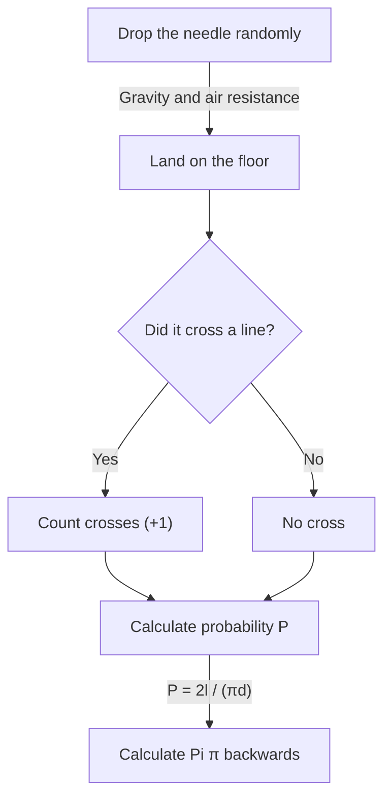

# What is [Buffon's Needle](https://kenji.blog/en/p/buffons-needle/)?

In the world of mathematics, there are many beautiful theorems where astonishing facts that counter intuition or seemingly unrelated events beautifully connect. One of the most famous and fascinating problems among them is **Buffon's needle problem**.

This problem was proposed in 1733 by Georges-Louis Leclerc, Comte de Buffon, an 18th-century French naturalist and mathematician, and was first solved in 1777.

Surprisingly, this problem states that through the extremely physical and random act of "dropping a needle randomly on the floor", one can determine one of the most important constants in mathematics, **Pi $\pi$**. This is known as one of the earliest problems in geometric probability and was a groundbreaking discovery that can be said to be a pioneer of the later Monte Carlo method.

In this article, we will explain in detail and in an easy-to-understand manner, from the problem setting of **[Buffon's Needle](https://kenji.blog/en/p/buffons-needle/)**, its mathematical proof, to the estimation of Pi by simulation using modern computers.

## Basic Setting of the Problem

The problem setting of Buffon's needle is very simple.

1. On a flat floor, many parallel straight lines are drawn at equal intervals $d$.
2. A single needle of length $l$ is prepared.
3. This needle is dropped randomly on the floor.

At this time, **"What is the probability that the dropped needle will cross one of the parallel lines drawn on the floor?"** is the problem proposed by Buffon.

The following diagram shows the conceptual flow of this experiment.



Here, to simplify the problem, we consider the case of a **short needle**, where the length of the needle $l$ is less than or equal to the interval of the parallel lines $d$ ($l \le d$). Under this condition, the needle will never cross two or more straight lines at the same time.

## Mathematical Modeling and Derivation of Probability

To solve this problem mathematically, it is necessary to quantify (parameterize) the state of the needle. When the needle falls on the floor, we assume its position and orientation are completely random.

To determine the position of the needle, we define the following two variables.

1. $x$ : The vertical distance from the center of the needle to the nearest parallel line.
2. $\theta$ : The acute angle (or right angle) formed by the needle and the parallel lines.

### Possible Range of Variables

First, let's consider what values each variable can take.

- **Regarding distance $x$:** The center of the needle falls somewhere between two adjacent parallel lines. Since we consider the distance to the nearest line, the minimum value of $x$ is $0$ (when the center of the needle is on the line), and the maximum value is $\frac{d}{2}$ (when the center of the needle is exactly midway between two lines). That is, $0 \le x \le \frac{d}{2}$. Since the needle is dropped randomly, $x$ follows a **uniform distribution** in this range. The probability density function is $\frac{2}{d}$.
- **Regarding angle $\theta$:** The angle formed by the needle and the parallel line takes a value from $0$ when the needle is parallel to the straight line, to $\frac{\pi}{2}$ (90 degrees) when it is perpendicular. From symmetry, there is no need to consider angles larger than this. Therefore, $0 \le \theta \le \frac{\pi}{2}$. Since the orientation of the needle is also random, $\theta$ also follows a **uniform distribution** in this range. The probability density function is $\frac{2}{\pi}$.

Since the variables $x$ and $\theta$ are independent of each other, the joint probability density function $f(x, \theta)$ that they take a specific pair $(x, \theta)$ is expressed as the product of their respective probability density functions.

$$
f(x, \theta) = \frac{2}{d} \times \frac{2}{\pi} = \frac{4}{d\pi}
$$

### Crossing Conditions

Next, consider the conditions for the needle to cross a straight line.
The needle crosses a straight line when the vertical length from the center of the needle to its end is greater than or equal to the distance $x$ to the nearest line.

Since the length of the needle is $l$, the length from the center to the end is $\frac{l}{2}$.
When the angle is $\theta$, the distance this half of the needle occupies in the vertical direction (projected length) is $\frac{l}{2} \sin \theta$.

Therefore, the condition for the needle to cross a straight line is expressed by the following inequality.

$$
x \le \frac{l}{2} \sin \theta
$$

### Calculation of Probability

The probability $P$ that the needle crosses a line is obtained by integrating the joint probability density function $f(x, \theta)$ over the region satisfying the crossing condition.

$$
P = \iint_{\text{Intersecting region}} f(x, \theta) \, dx \, d\theta
$$

The specific range of integration is where $\theta$ changes from $0$ to $\frac{\pi}{2}$, and $x$ changes from $0$ to the limit value of crossing $\frac{l}{2} \sin \theta$.

$$
P = \int_{0}^{\frac{\pi}{2}} \int_{0}^{\frac{l}{2} \sin \theta} \frac{4}{d\pi} \, dx \, d\theta
$$

First, we calculate the inner integral with respect to $x$.

$$
\int_{0}^{\frac{l}{2} \sin \theta} \frac{4}{d\pi} \, dx = \frac{4}{d\pi} \left[ x \right]_{0}^{\frac{l}{2} \sin \theta} = \frac{4}{d\pi} \left( \frac{l}{2} \sin \theta - 0 \right) = \frac{2l}{d\pi} \sin \theta
$$

Next, we calculate the outer integral with respect to $\theta$.

$$
P = \int_{0}^{\frac{\pi}{2}} \frac{2l}{d\pi} \sin \theta \, d\theta = \frac{2l}{d\pi} \int_{0}^{\frac{\pi}{2}} \sin \theta \, d\theta
$$

Since the integral of $\sin \theta$ is $-\cos \theta$,

$$
\int_{0}^{\frac{\pi}{2}} \sin \theta \, d\theta = \left[ -\cos \theta \right]_{0}^{\frac{\pi}{2}} = (-\cos \frac{\pi}{2}) - (-\cos 0) = -0 - (-1) = 1
$$

Therefore, the required probability $P$ is as follows.

$$
P = \frac{2l}{d\pi} \times 1 = \frac{2l}{\pi d}
$$

This is the basic formula of **Buffon's needle**. The probability that the needle crosses a line is twice the length of the needle $l$, divided by the product of Pi $\pi$ and the interval of the lines $d$.

## Estimating Pi (Monte Carlo Method)

The derived formula $P = \frac{2l}{\pi d}$ beautifully includes $\pi$. Solving this for $\pi$ gives the following.

$$
\pi = \frac{2l}{P d}
$$

This equation means that if only the probability $P$ is known, Pi $\pi$ can be calculated. Of course, the true probability $P$ cannot be known without an infinite number of trials, but by dropping the needle many times in an actual experiment, an approximate value of $P$ can be obtained.

Let $N$ be the total number of times the needle is dropped, and $C$ be the number of times the needle crossed a line.
If the number of trials $N$ is large enough, by the law of large numbers, the empirical probability $\frac{C}{N}$ approaches the theoretical probability $P$.

$$
P \approx \frac{C}{N}
$$

Substituting this into the previous equation gives a formula for finding the approximate value of Pi $\pi$.

$$
\pi \approx \frac{2l \cdot N}{C \cdot d}
$$

The easiest calculation is when the needle length $l$ and the line interval $d$ are the same ($l = d$). At this time, the formula becomes even simpler.

$$
\pi \approx \frac{2N}{C}
$$

In other words, simply divide twice the "number of times the needle was dropped" by the "number of times it crossed", and Pi is obtained!

### Simulation with Python

Dropping a needle thousands of times by hand is a very laborious task (although historically, there are mathematicians who actually conducted experiments thousands of times). Today, we can easily simulate this experiment using a computer.

Below is a simple code example using Python to simulate Buffon's needle experiment and estimate Pi.

```python
import random
import math

def buffons_needle_simulation(num_trials, l, d):
    """
    A function to simulate Buffon's needle and estimate Pi
    
    :param num_trials: Number of times to drop the needle
    :param l: Length of the needle
    :param d: Interval of parallel lines
    :return: Estimated Pi
    """
    crosses = 0
    
    for _ in range(num_trials):
        # Randomly generate distance x from the center of the needle to the nearest line (0 to d/2)
        x = random.uniform(0, d / 2.0)
        
        # Randomly generate angle theta of the needle (0 to pi/2)
        theta = random.uniform(0, math.pi / 2.0)
        
        # Check if the crossing condition is satisfied
        if x <= (l / 2.0) * math.sin(theta):
            crosses += 1
            
    # Exception handling to avoid errors if it never crosses
    if crosses == 0:
        return float('inf')
        
    # Estimation calculation of Pi
    estimated_pi = (2.0 * l * num_trials) / (d * crosses)
    return estimated_pi

# Parameter settings
N = 1000000  # Number of trials (1 million times)
needle_length = 1.0
line_distance = 1.0

# Execute the simulation
estimated_pi = buffons_needle_simulation(N, needle_length, line_distance)

print(f"Number of trials: {N:,} times")
print(f"Estimated Pi:     {estimated_pi}")
print(f"Actual Pi:        {math.pi}")
print(f"Error:            {abs(math.pi - estimated_pi)}")
```

Running this code drops a huge number of virtual needles using random numbers, and it can be confirmed that an approximate value of Pi of $3.1415...$ is obtained with very high accuracy. The method of using random numbers to find approximate solutions to probabilistic problems in this way is called the **Monte Carlo method**.

## Summary

Buffon's needle seems at first glance to be a mere physical game of chance, but there is a solid mathematical theory behind it. The way random events (probability), geometric shapes (lines and line segments), and the ultimate irrational number $\pi$ merge into a single simple mathematical formula embodies the beauty of mathematics.

Also, this problem holds historical importance as the origin of the Monte Carlo method, which is indispensable for modern science and technology. Simulating complex systems and calculating integrals that are difficult to solve analytically, Buffon's idea still supports our world in various forms today.

Why not prepare some paper, a pen, and a few toothpicks, and experience a part of this great mathematical history at home?
