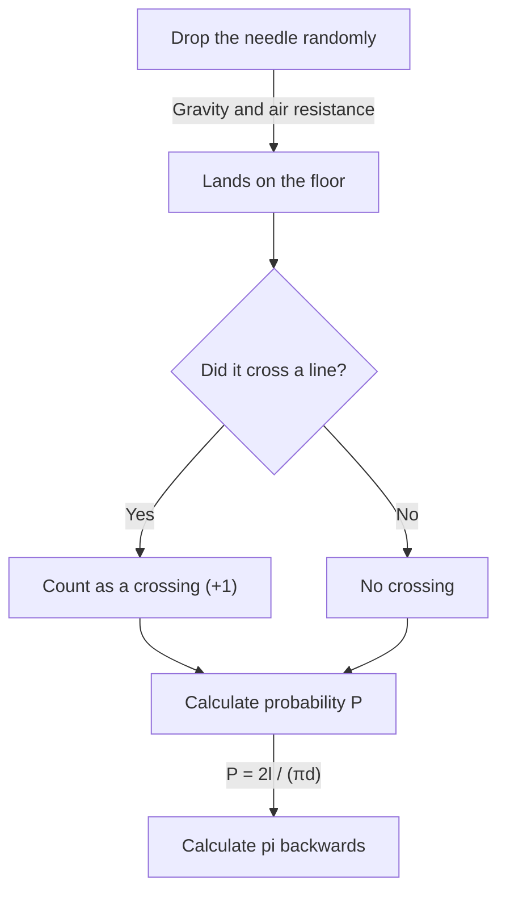

# What Is Buffon's Needle?

The world of mathematics contains many surprising facts that defy intuition, and beautiful theorems that brilliantly connect seemingly unrelated phenomena. Among the most famous and fascinating of these problems is **"Buffon's Needle"** (Buffon's needle problem).

This problem was posed in 1733 and first solved in 1777 by Georges-Louis Leclerc, Comte de Buffon, an 18th-century French naturalist and mathematician.

Remarkably, this problem demonstrates that one of the most important constants in mathematics — **pi $\pi$** — can be determined through the highly physical and random act of "dropping a needle randomly onto a floor." It is known as one of the earliest problems in geometric probability, and was a groundbreaking discovery that can be considered a precursor to the Monte Carlo method.

In this article, we provide a detailed and accessible explanation of **Buffon's Needle**, covering the problem setup, its mathematical proof, and the estimation of pi through simulation using modern computers.

## Basic Problem Setup

The setup of Buffon's needle problem is remarkably simple.

1. On a flat floor, numerous parallel lines are drawn at equal intervals of $d$.
2. A single needle of length $l$ is prepared.
3. The needle is dropped randomly onto the floor.

The question Buffon posed was: **"What is the probability that the dropped needle crosses one of the parallel lines drawn on the floor?"**

The following diagram shows the conceptual flow of this experiment.



Here, to simplify the problem, we consider the **short needle** case where the needle length $l$ is less than or equal to the line spacing $d$ ($l \le d$). Under this condition, the needle can never cross more than one line at a time.

## Mathematical Modeling and Derivation of the Probability

To solve this problem mathematically, we need to quantify (parameterize) the state of the needle. We assume that the position and orientation of the needle when it lands on the floor are completely random.

To determine the needle's position, we define the following two variables.

1. $x$ : The perpendicular distance from the center of the needle to the nearest parallel line.
2. $\theta$ : The acute angle (or right angle) between the needle and the parallel lines.

### Range of Variables

First, let us consider what values each variable can take.

- **Distance $x$:** The center of the needle falls somewhere between two adjacent parallel lines. Since we consider the distance to the nearest line, the minimum value of $x$ is $0$ (when the center of the needle is on a line) and the maximum value is $\frac{d}{2}$ (when the center of the needle is exactly midway between two lines). That is, $0 \le x \le \frac{d}{2}$. Since the needle is dropped randomly, $x$ follows a **uniform distribution** over this range. The probability density function is $\frac{2}{d}$.
- **Angle $\theta$:** The angle between the needle and the parallel lines ranges from $0$ when the needle is parallel to the lines, to $\frac{\pi}{2}$ (90 degrees) when perpendicular. By symmetry, we need not consider angles beyond this. Therefore, $0 \le \theta \le \frac{\pi}{2}$. Since the needle's orientation is also random, $\theta$ follows a **uniform distribution** over this range. The probability density function is $\frac{2}{\pi}$.

Since the variables $x$ and $\theta$ are independent of each other, the joint probability density function $f(x, \theta)$ for a specific pair $(x, \theta)$ is expressed as the product of their individual probability density functions.

$$
f(x, \theta) = \frac{2}{d} \times \frac{2}{\pi} = \frac{4}{d\pi}
$$

### Crossing Condition

Next, let us consider the condition for the needle to cross a line.
The needle crosses a line when the vertical extent from the center of the needle to its tip is greater than or equal to the distance $x$ to the nearest line.

Since the needle's length is $l$, the distance from the center to the tip is $\frac{l}{2}$.
When the angle is $\theta$, the vertical distance occupied by this half of the needle (the projected length) is $\frac{l}{2} \sin \theta$.

Therefore, the condition for the needle to cross a line is expressed by the following inequality.

$$
x \le \frac{l}{2} \sin \theta
$$

### Calculating the Probability

The probability $P$ that the needle crosses a line is obtained by integrating the joint probability density function $f(x, \theta)$ over the region satisfying the crossing condition.

$$
P = \iint_{\text{crossing region}} f(x, \theta) \, dx \, d\theta
$$

The specific integration bounds are: $\theta$ varies from $0$ to $\frac{\pi}{2}$, and $x$ varies from $0$ to the crossing threshold $\frac{l}{2} \sin \theta$.

$$
P = \int_{0}^{\frac{\pi}{2}} \int_{0}^{\frac{l}{2} \sin \theta} \frac{4}{d\pi} \, dx \, d\theta
$$

First, we compute the inner integral with respect to $x$.

$$
\int_{0}^{\frac{l}{2} \sin \theta} \frac{4}{d\pi} \, dx = \frac{4}{d\pi} \left[ x \right]_{0}^{\frac{l}{2} \sin \theta} = \frac{4}{d\pi} \left( \frac{l}{2} \sin \theta - 0 \right) = \frac{2l}{d\pi} \sin \theta
$$

Next, we compute the outer integral with respect to $\theta$.

$$
P = \int_{0}^{\frac{\pi}{2}} \frac{2l}{d\pi} \sin \theta \, d\theta = \frac{2l}{d\pi} \int_{0}^{\frac{\pi}{2}} \sin \theta \, d\theta
$$

Since the integral of $\sin \theta$ is $-\cos \theta$,

$$
\int_{0}^{\frac{\pi}{2}} \sin \theta \, d\theta = \left[ -\cos \theta \right]_{0}^{\frac{\pi}{2}} = (-\cos \frac{\pi}{2}) - (-\cos 0) = -0 - (-1) = 1
$$

Therefore, the desired probability $P$ is as follows.

$$
P = \frac{2l}{d\pi} \times 1 = \frac{2l}{\pi d}
$$

This is the fundamental formula of **Buffon's Needle**. The probability that the needle crosses a line equals twice the needle length $l$ divided by the product of pi $\pi$ and the line spacing $d$.

## Estimating Pi (Monte Carlo Method)

The derived formula $P = \frac{2l}{\pi d}$ beautifully contains $\pi$. Solving for $\pi$, we get:

$$
\pi = \frac{2l}{P d}
$$

This equation means that if we know the probability $P$, we can calculate pi $\pi$. Of course, the true probability $P$ requires an infinite number of trials, but by dropping the needle many times in an actual experiment, we can obtain an approximation of $P$.

Let $N$ be the total number of needle drops, and $C$ be the number of times the needle crosses a line.
When the number of trials $N$ is sufficiently large, by the law of large numbers, the empirical probability $\frac{C}{N}$ approaches the theoretical probability $P$.

$$
P \approx \frac{C}{N}
$$

Substituting this into the previous equation gives us a formula for approximating pi $\pi$.

$$
\pi \approx \frac{2l \cdot N}{C \cdot d}
$$

The simplest calculation occurs when the needle length $l$ and line spacing $d$ are equal ($l = d$). In this case, the formula simplifies further.

$$
\pi \approx \frac{2N}{C}
$$

In other words, you can find pi simply by dividing twice the number of needle drops by the number of crossings!

### Python Simulation

Dropping a needle thousands of times by hand is an extremely tedious task (though historically, there have been mathematicians who actually performed thousands of such experiments). In modern times, we can easily simulate this experiment using a computer.

Below is a simple Python code example that simulates Buffon's needle experiment and estimates pi.

```python
import random
import math

def buffons_needle_simulation(num_trials, l, d):
    """
    Function to simulate Buffon's needle and estimate pi

    :param num_trials: Number of needle drops
    :param l: Length of the needle
    :param d: Spacing between parallel lines
    :return: Estimated value of pi
    """
    crosses = 0
    
    for _ in range(num_trials):
        # Randomly generate distance x from the needle's center to the nearest line (0 to d/2)
        x = random.uniform(0, d / 2.0)
        
        # Randomly generate needle angle theta (0 to pi/2)
        theta = random.uniform(0, math.pi / 2.0)
        
        # Check if the crossing condition is satisfied
        if x <= (l / 2.0) * math.sin(theta):
            crosses += 1
            
    # Exception handling to avoid errors when no crossings occur
    if crosses == 0:
        return float('inf')
        
    # Estimate pi
    estimated_pi = (2.0 * l * num_trials) / (d * crosses)
    return estimated_pi

# Parameter settings
N = 1000000  # Number of trials (1 million)
needle_length = 1.0
line_distance = 1.0

# Run the simulation
estimated_pi = buffons_needle_simulation(N, needle_length, line_distance)

print(f"Number of trials: {N:,}")
print(f"Estimated pi:     {estimated_pi}")
print(f"Actual pi:        {math.pi}")
print(f"Error:            {abs(math.pi - estimated_pi)}")
```

When you run this code, a large number of virtual needles are dropped using random numbers, and you can verify that a very accurate approximation of $3.1415...$ — the value of pi — is obtained. This technique of using random numbers to find approximate solutions to probabilistic problems is called the **Monte Carlo method**.

## Conclusion

At first glance, Buffon's needle may seem like a mere game of physical chance, but behind it lies a solid mathematical theory. The way random events (probability), geometric shapes (lines and line segments), and the ultimate irrational number $\pi$ merge together in one simple formula truly embodies the beauty of mathematics.

Furthermore, this problem holds historical significance as the origin of the Monte Carlo method, which is indispensable to modern science and technology. From simulations of complex systems to calculating integrals that are difficult to solve analytically, Buffon's idea continues to support our world in various forms to this day.

Why not grab some paper, a pen, and a few toothpicks, and experience a piece of this great mathematical history at home?
