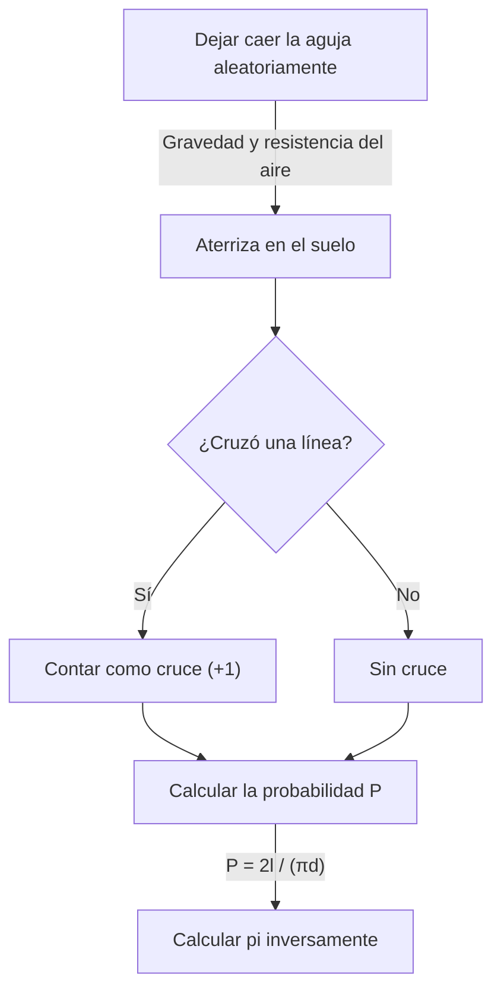

# ¿Qué es la aguja de Buffon?

El mundo de las matemáticas contiene muchos hechos sorprendentes que desafían la intuición y hermosos teoremas que conectan brillantemente fenómenos aparentemente inconexos. Entre los problemas más famosos y fascinantes se encuentra **"la aguja de Buffon"** (Buffon's needle problem).

Este problema fue planteado en 1733 y resuelto por primera vez en 1777 por Georges-Louis Leclerc, conde de Buffon, naturalista y matemático francés del siglo XVIII.

Sorprendentemente, este problema demuestra que una de las constantes más importantes de las matemáticas — el **número pi $\pi$** — puede determinarse mediante el acto sumamente físico y aleatorio de "dejar caer una aguja aleatoriamente sobre el suelo". Es reconocido como uno de los primeros problemas de probabilidad geométrica (Geometric probability) y fue un descubrimiento revolucionario que puede considerarse un precursor del método de Monte Carlo (Monte Carlo method).

En este artículo, proporcionamos una explicación detallada y accesible de **la aguja de Buffon**, cubriendo el planteamiento del problema, su demostración matemática y la estimación de pi mediante simulación con computadoras modernas.

## Planteamiento básico del problema

El planteamiento del problema de la aguja de Buffon es notablemente simple.

1. Sobre un suelo plano, se trazan numerosas líneas paralelas a intervalos iguales de $d$.
2. Se prepara una sola aguja de longitud $l$.
3. La aguja se deja caer aleatoriamente sobre el suelo.

La pregunta que planteó Buffon fue: **"¿Cuál es la probabilidad de que la aguja caída cruce una de las líneas paralelas trazadas en el suelo?"**

El siguiente diagrama muestra el flujo conceptual de este experimento.



Aquí, para simplificar el problema, consideramos el caso de la **aguja corta**, donde la longitud de la aguja $l$ es menor o igual al espaciado entre líneas $d$ ($l \le d$). Bajo esta condición, la aguja nunca puede cruzar más de una línea a la vez.

## Modelado matemático y derivación de la probabilidad

Para resolver este problema matemáticamente, necesitamos cuantificar (parametrizar) el estado de la aguja. Suponemos que la posición y orientación de la aguja cuando cae al suelo son completamente aleatorias.

Para determinar la posición de la aguja, definimos las siguientes dos variables.

1. $x$: La distancia perpendicular desde el centro de la aguja hasta la línea paralela más cercana.
2. $\theta$: El ángulo agudo (o recto) entre la aguja y las líneas paralelas.

### Rango de las variables

Primero, consideremos qué valores puede tomar cada variable.

- **Distancia $x$:** El centro de la aguja cae en algún punto entre dos líneas paralelas adyacentes. Como consideramos la distancia a la línea más cercana, el valor mínimo de $x$ es $0$ (cuando el centro de la aguja está sobre una línea) y el valor máximo es $\frac{d}{2}$ (cuando el centro de la aguja está exactamente a medio camino entre dos líneas). Es decir, $0 \le x \le \frac{d}{2}$. Como la aguja se deja caer aleatoriamente, $x$ sigue una **distribución uniforme** sobre este rango. La función de densidad de probabilidad es $\frac{2}{d}$.
- **Ángulo $\theta$:** El ángulo entre la aguja y las líneas paralelas va desde $0$, cuando la aguja es paralela a las líneas, hasta $\frac{\pi}{2}$ (90 grados), cuando es perpendicular. Por simetría, no es necesario considerar ángulos mayores. Por lo tanto, $0 \le \theta \le \frac{\pi}{2}$. Como la orientación de la aguja también es aleatoria, $\theta$ sigue igualmente una **distribución uniforme** sobre este rango. La función de densidad de probabilidad es $\frac{2}{\pi}$.

Dado que las variables $x$ y $\theta$ son independientes entre sí, la función de densidad de probabilidad conjunta $f(x, \theta)$ para un par específico $(x, \theta)$ se expresa como el producto de sus funciones de densidad de probabilidad individuales.

$$
f(x, \theta) = \frac{2}{d} \times \frac{2}{\pi} = \frac{4}{d\pi}
$$

### Condición de cruce

A continuación, consideremos la condición para que la aguja cruce una línea.
La aguja cruza una línea cuando la extensión vertical desde el centro de la aguja hasta su punta es mayor o igual a la distancia $x$ a la línea más cercana.

Dado que la longitud de la aguja es $l$, la distancia desde el centro hasta la punta es $\frac{l}{2}$.
Cuando el ángulo es $\theta$, la distancia vertical que ocupa esta mitad de la aguja (la longitud proyectada) es $\frac{l}{2} \sin \theta$.

Por lo tanto, la condición para que la aguja cruce una línea se expresa mediante la siguiente desigualdad.

$$
x \le \frac{l}{2} \sin \theta
$$

### Cálculo de la probabilidad

La probabilidad $P$ de que la aguja cruce una línea se obtiene integrando la función de densidad de probabilidad conjunta $f(x, \theta)$ sobre la región que satisface la condición de cruce.

$$
P = \iint_{\text{región de cruce}} f(x, \theta) \, dx \, d\theta
$$

Los límites de integración concretos son: $\theta$ varía de $0$ a $\frac{\pi}{2}$, y $x$ varía de $0$ al umbral de cruce $\frac{l}{2} \sin \theta$.

$$
P = \int_{0}^{\frac{\pi}{2}} \int_{0}^{\frac{l}{2} \sin \theta} \frac{4}{d\pi} \, dx \, d\theta
$$

Primero, calculamos la integral interior con respecto a $x$.

$$
\int_{0}^{\frac{l}{2} \sin \theta} \frac{4}{d\pi} \, dx = \frac{4}{d\pi} \left[ x \right]_{0}^{\frac{l}{2} \sin \theta} = \frac{4}{d\pi} \left( \frac{l}{2} \sin \theta - 0 \right) = \frac{2l}{d\pi} \sin \theta
$$

Luego, calculamos la integral exterior con respecto a $\theta$.

$$
P = \int_{0}^{\frac{\pi}{2}} \frac{2l}{d\pi} \sin \theta \, d\theta = \frac{2l}{d\pi} \int_{0}^{\frac{\pi}{2}} \sin \theta \, d\theta
$$

Dado que la integral de $\sin \theta$ es $-\cos \theta$,

$$
\int_{0}^{\frac{\pi}{2}} \sin \theta \, d\theta = \left[ -\cos \theta \right]_{0}^{\frac{\pi}{2}} = (-\cos \frac{\pi}{2}) - (-\cos 0) = -0 - (-1) = 1
$$

Por lo tanto, la probabilidad buscada $P$ es la siguiente.

$$
P = \frac{2l}{d\pi} \times 1 = \frac{2l}{\pi d}
$$

Esta es la fórmula fundamental de **la aguja de Buffon**. La probabilidad de que la aguja cruce una línea es igual al doble de la longitud de la aguja $l$ dividido por el producto del número pi $\pi$ y el espaciado entre líneas $d$.

## Estimación de pi (método de Monte Carlo)

La fórmula derivada $P = \frac{2l}{\pi d}$ contiene elegantemente $\pi$. Resolviendo para $\pi$, obtenemos:

$$
\pi = \frac{2l}{P d}
$$

Esta ecuación significa que si conocemos la probabilidad $P$, podemos calcular el número pi $\pi$. Por supuesto, la verdadera probabilidad $P$ requiere un número infinito de ensayos, pero al dejar caer la aguja muchas veces en un experimento real, podemos obtener una aproximación de $P$.

Sea $N$ el número total de lanzamientos de la aguja y $C$ el número de veces que la aguja cruza una línea.
Cuando el número de ensayos $N$ es suficientemente grande, por la ley de los grandes números, la probabilidad empírica $\frac{C}{N}$ se aproxima a la probabilidad teórica $P$.

$$
P \approx \frac{C}{N}
$$

Sustituyendo esto en la ecuación anterior, obtenemos una fórmula para aproximar el número pi $\pi$.

$$
\pi \approx \frac{2l \cdot N}{C \cdot d}
$$

El cálculo más sencillo ocurre cuando la longitud de la aguja $l$ y el espaciado entre líneas $d$ son iguales ($l = d$). En este caso, la fórmula se simplifica aún más.

$$
\pi \approx \frac{2N}{C}
$$

¡En otras palabras, se puede encontrar pi simplemente dividiendo el doble del número de lanzamientos entre el número de cruces!

### Simulación en Python

Dejar caer una aguja miles de veces a mano es una tarea extremadamente tediosa (aunque históricamente, ha habido matemáticos que realizaron miles de estos experimentos). En la actualidad, podemos simular fácilmente este experimento utilizando una computadora.

A continuación se muestra un ejemplo sencillo de código en Python que simula el experimento de la aguja de Buffon y estima pi.

```python
import random
import math

def buffons_needle_simulation(num_trials, l, d):
    """
    Función para simular la aguja de Buffon y estimar pi

    :param num_trials: Número de lanzamientos de la aguja
    :param l: Longitud de la aguja
    :param d: Espaciado entre las líneas paralelas
    :return: Valor estimado de pi
    """
    crosses = 0
    
    for _ in range(num_trials):
        # Generar aleatoriamente la distancia x del centro de la aguja a la línea más cercana (0 a d/2)
        x = random.uniform(0, d / 2.0)
        
        # Generar aleatoriamente el ángulo theta de la aguja (0 a pi/2)
        theta = random.uniform(0, math.pi / 2.0)
        
        # Verificar si se cumple la condición de cruce
        if x <= (l / 2.0) * math.sin(theta):
            crosses += 1
            
    # Manejo de excepciones para evitar errores cuando no hay cruces
    if crosses == 0:
        return float('inf')
        
    # Estimación de pi
    estimated_pi = (2.0 * l * num_trials) / (d * crosses)
    return estimated_pi

# Configuración de parámetros
N = 1000000  # Número de ensayos (1 millón)
needle_length = 1.0
line_distance = 1.0

# Ejecutar la simulación
estimated_pi = buffons_needle_simulation(N, needle_length, line_distance)

print(f"Número de ensayos: {N:,}")
print(f"Pi estimado:       {estimated_pi}")
print(f"Pi real:           {math.pi}")
print(f"Error:             {abs(math.pi - estimated_pi)}")
```

Al ejecutar este código, se lanza un gran número de agujas virtuales mediante números aleatorios, y se puede verificar que se obtiene una aproximación muy precisa de $3,1415...$ — el valor de pi. Esta técnica de usar números aleatorios para encontrar soluciones aproximadas a problemas probabilísticos se denomina **método de Monte Carlo**.

## Conclusión

A primera vista, la aguja de Buffon puede parecer un simple juego de azar físico, pero detrás de ella se esconde una sólida teoría matemática. La forma en que los eventos aleatorios (probabilidad), las formas geométricas (rectas y segmentos) y el número irracional por excelencia $\pi$ se fusionan en una fórmula sencilla encarna verdaderamente la belleza de las matemáticas.

Además, este problema tiene una importancia histórica como origen del método de Monte Carlo, indispensable para la ciencia y la tecnología modernas. Desde simulaciones de sistemas complejos hasta el cálculo de integrales difíciles de resolver analíticamente, la idea de Buffon sigue sustentando nuestro mundo de diversas formas hasta el día de hoy.

¿Por qué no preparar papel, un bolígrafo y algunos palillos de dientes para experimentar en casa una parte de esta gran historia de las matemáticas?
