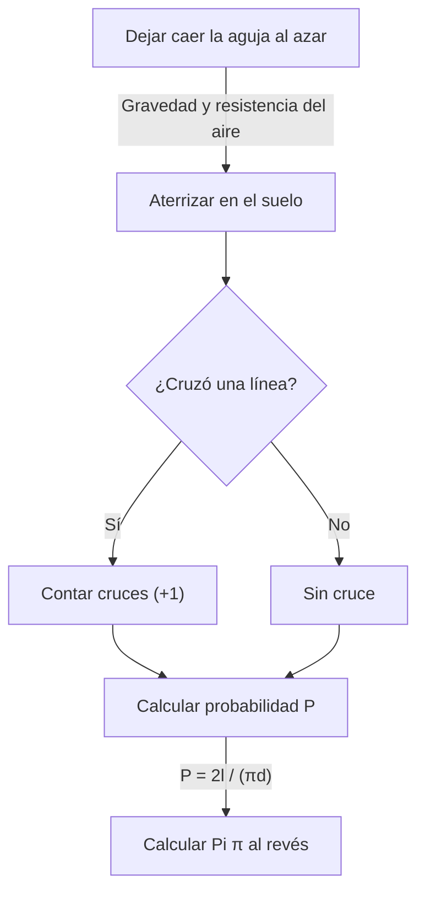

# ¿Qué es la aguja de Buffon?

En el mundo de las matemáticas, existen muchos teoremas hermosos donde hechos asombrosos que van en contra de la intuición o eventos aparentemente no relacionados se conectan de manera hermosa. Uno de los problemas más famosos y fascinantes entre ellos es el **problema de la aguja de Buffon**.

Este problema fue propuesto en 1733 por Georges-Louis Leclerc, Conde de Buffon, un naturalista y matemático francés del siglo XVIII, y fue resuelto por primera vez en 1777.

Sorprendentemente, este problema establece que a través del acto extremadamente físico y aleatorio de "dejar caer una aguja al azar en el suelo", se puede determinar una de las constantes más importantes de las matemáticas, **Pi $\pi$**. Esto se conoce como uno de los primeros problemas en probabilidad geométrica y fue un descubrimiento revolucionario que se puede decir que es un pionero del posterior método de Montecarlo.

En este artículo, explicaremos en detalle y de una manera fácil de entender, desde el planteamiento del problema de **la aguja de Buffon**, su demostración matemática, hasta la estimación de Pi mediante simulación utilizando computadoras modernas.

## Planteamiento básico del problema

El planteamiento del problema de la aguja de Buffon es muy simple.

1. En un piso plano, se dibujan muchas líneas rectas paralelas a intervalos iguales $d$.
2. Se prepara una sola aguja de longitud $l$.
3. Esta aguja se deja caer al azar (aleatoriamente) en el suelo.

En este momento, **"¿Cuál es la probabilidad de que la aguja caída cruce una de las líneas paralelas dibujadas en el suelo?"** es el problema propuesto por Buffon.

El siguiente diagrama muestra el flujo conceptual de este experimento.



Aquí, para simplificar el problema, consideramos el caso de una **aguja corta**, donde la longitud de la aguja $l$ es menor o igual al intervalo de las líneas paralelas $d$ ($l \le d$). Bajo esta condición, la aguja nunca cruzará dos o más líneas rectas al mismo tiempo.

## Modelado matemático y derivación de la probabilidad

Para resolver este problema matemáticamente, es necesario cuantificar (parametrizar) el estado de la aguja. Cuando la aguja cae al suelo, asumimos que su posición y orientación son completamente aleatorias.

Para determinar la posición de la aguja, definimos las siguientes dos variables.

1. $x$ : La distancia vertical desde el centro de la aguja hasta la línea paralela más cercana.
2. $\theta$ : El ángulo agudo (o ángulo recto) formado por la aguja y las líneas paralelas.

### Rango posible de variables

Primero, consideremos qué valores puede tomar cada variable.

- **Con respecto a la distancia $x$:** El centro de la aguja cae en algún lugar entre dos líneas paralelas adyacentes. Dado que consideramos la distancia a la línea más cercana, el valor mínimo de $x$ es $0$ (cuando el centro de la aguja está en la línea), y el valor máximo es $\frac{d}{2}$ (cuando el centro de la aguja está exactamente a medio camino entre dos líneas). Es decir, $0 \le x \le \frac{d}{2}$. Dado que la aguja se deja caer al azar, $x$ sigue una **distribución uniforme** en este rango. La función de densidad de probabilidad es $\frac{2}{d}$.
- **Con respecto al ángulo $\theta$:** El ángulo formado por la aguja y la línea paralela toma un valor de $0$ cuando la aguja es paralela a la línea recta, a $\frac{\pi}{2}$ (90 grados) cuando es perpendicular. Por simetría, no hay necesidad de considerar ángulos mayores a este. Por lo tanto, $0 \le \theta \le \frac{\pi}{2}$. Dado que la orientación de la aguja también es aleatoria, $\theta$ también sigue una **distribución uniforme** en este rango. La función de densidad de probabilidad es $\frac{2}{\pi}$.

Dado que las variables $x$ y $\theta$ son independientes entre sí, la función de densidad de probabilidad conjunta $f(x, \theta)$ que toman un par específico $(x, \theta)$ se expresa como el producto de sus respectivas funciones de densidad de probabilidad.

$$
f(x, \theta) = \frac{2}{d} \times \frac{2}{\pi} = \frac{4}{d\pi}
$$

### Condiciones de cruce

A continuación, considere las condiciones para que la aguja cruce una línea recta.
La aguja cruza una línea recta cuando la longitud vertical desde el centro de la aguja hasta su extremo es mayor o igual a la distancia $x$ a la línea más cercana.

Dado que la longitud de la aguja es $l$, la longitud desde el centro hasta el extremo es $\frac{l}{2}$.
Cuando el ángulo es $\theta$, la distancia que esta mitad de la aguja ocupa en la dirección vertical (longitud proyectada) es $\frac{l}{2} \sin \theta$.

Por lo tanto, la condición para que la aguja cruce una línea recta se expresa mediante la siguiente desigualdad.

$$
x \le \frac{l}{2} \sin \theta
$$

### Cálculo de probabilidad

La probabilidad $P$ de que la aguja cruce una línea se obtiene integrando la función de densidad de probabilidad conjunta $f(x, \theta)$ sobre la región que satisface la condición de cruce.

$$
P = \iint_{\text{Área de intersección}} f(x, \theta) \, dx \, d\theta
$$

El rango específico de integración es donde $\theta$ cambia de $0$ a $\frac{\pi}{2}$, y $x$ cambia de $0$ al valor límite de cruce $\frac{l}{2} \sin \theta$.

$$
P = \int_{0}^{\frac{\pi}{2}} \int_{0}^{\frac{l}{2} \sin \theta} \frac{4}{d\pi} \, dx \, d\theta
$$

Primero, calculamos la integral interna con respecto a $x$.

$$
\int_{0}^{\frac{l}{2} \sin \theta} \frac{4}{d\pi} \, dx = \frac{4}{d\pi} \left[ x \right]_{0}^{\frac{l}{2} \sin \theta} = \frac{4}{d\pi} \left( \frac{l}{2} \sin \theta - 0 \right) = \frac{2l}{d\pi} \sin \theta
$$

A continuación, calculamos la integral externa con respecto a $\theta$.

$$
P = \int_{0}^{\frac{\pi}{2}} \frac{2l}{d\pi} \sin \theta \, d\theta = \frac{2l}{d\pi} \int_{0}^{\frac{\pi}{2}} \sin \theta \, d\theta
$$

Dado que la integral de $\sin \theta$ es $-\cos \theta$,

$$
\int_{0}^{\frac{\pi}{2}} \sin \theta \, d\theta = \left[ -\cos \theta \right]_{0}^{\frac{\pi}{2}} = (-\cos \frac{\pi}{2}) - (-\cos 0) = -0 - (-1) = 1
$$

Por lo tanto, la probabilidad requerida $P$ es la siguiente.

$$
P = \frac{2l}{d\pi} \times 1 = \frac{2l}{\pi d}
$$

Esta es la fórmula básica de **la aguja de Buffon**. La probabilidad de que la aguja cruce una línea es el doble de la longitud de la aguja $l$, dividida por el producto de Pi $\pi$ y el intervalo de las líneas $d$.

## Estimación de Pi (Método de Montecarlo)

La fórmula derivada $P = \frac{2l}{\pi d}$ incluye maravillosamente $\pi$. Resolver esto para $\pi$ da lo siguiente.

$$
\pi = \frac{2l}{P d}
$$

Esta ecuación significa que si solo se conoce la probabilidad $P$, se puede calcular Pi $\pi$. Por supuesto, la verdadera probabilidad $P$ no se puede conocer sin un número infinito de pruebas, pero dejando caer la aguja muchas veces en un experimento real, se puede obtener un valor aproximado de $P$.

Sea $N$ el número total de veces que se deja caer la aguja, y $C$ el número de veces que la aguja cruzó una línea.
Si el número de pruebas $N$ es lo suficientemente grande, por la ley de los grandes números, la probabilidad empírica $\frac{C}{N}$ se acerca a la probabilidad teórica $P$.

$$
P \approx \frac{C}{N}
$$

Sustituyendo esto en la ecuación anterior se obtiene una fórmula para encontrar el valor aproximado de Pi $\pi$.

$$
\pi \approx \frac{2l \cdot N}{C \cdot d}
$$

El cálculo más fácil es cuando la longitud de la aguja $l$ y el intervalo de línea $d$ son iguales ($l = d$). En este momento, la fórmula se vuelve aún más simple.

$$
\pi \approx \frac{2N}{C}
$$

En otras palabras, simplemente divide el doble del "número de veces que se dejó caer la aguja" por el "número de veces que cruzó", ¡y se obtiene Pi!

### Simulación con Python

Dejar caer una aguja miles de veces a mano es una tarea muy laboriosa (aunque históricamente, hay matemáticos que realmente realizaron experimentos miles de veces). Hoy en día, podemos simular fácilmente este experimento utilizando una computadora.

A continuación se muestra un ejemplo de código simple que usa Python para simular el experimento de la aguja de Buffon y estimar Pi.

```python
import random
import math

def buffons_needle_simulation(num_trials, l, d):
    """
    Una función para simular la aguja de Buffon y estimar Pi
    
    :param num_trials: Número de veces que se deja caer la aguja
    :param l: Longitud de la aguja
    :param d: Intervalo de líneas paralelas
    :return: Pi estimado
    """
    crosses = 0
    
    for _ in range(num_trials):
        # Generar aleatoriamente la distancia x desde el centro de la aguja hasta la línea más cercana (0 a d/2)
        x = random.uniform(0, d / 2.0)
        
        # Generar aleatoriamente el ángulo theta de la aguja (0 a pi/2)
        theta = random.uniform(0, math.pi / 2.0)
        
        # Comprobar si se cumple la condición de cruce
        if x <= (l / 2.0) * math.sin(theta):
            crosses += 1
            
    # Manejo de excepciones para evitar errores si nunca cruza
    if crosses == 0:
        return float('inf')
        
    # Cálculo de estimación de Pi
    estimated_pi = (2.0 * l * num_trials) / (d * crosses)
    return estimated_pi

# Configuración de parámetros
N = 1000000  # Número de pruebas (1 millón de veces)
needle_length = 1.0
line_distance = 1.0

# Ejecutar la simulación
estimated_pi = buffons_needle_simulation(N, needle_length, line_distance)

print(f"Número de pruebas: {N:,} veces")
print(f"Pi estimado:       {estimated_pi}")
print(f"Pi real:           {math.pi}")
print(f"Error:             {abs(math.pi - estimated_pi)}")
```

La ejecución de este código deja caer una gran cantidad de agujas virtuales utilizando números aleatorios, y se puede confirmar que se obtiene un valor aproximado de Pi de $3.1415...$ con una precisión muy alta. El método de utilizar números aleatorios para encontrar soluciones aproximadas a problemas probabilísticos de esta manera se llama **método de Montecarlo**.

## Resumen

La aguja de Buffon parece a primera vista ser un mero juego físico de azar, pero hay una sólida teoría matemática detrás de ello. La forma en que los eventos aleatorios (probabilidad), las formas geométricas (líneas y segmentos de línea) y el último número irracional $\pi$ se fusionan en una sola fórmula matemática simple encarna la belleza de las matemáticas.

Además, este problema tiene importancia histórica como el origen del método de Montecarlo, que es indispensable para la ciencia y tecnología modernas. Al simular sistemas complejos y calcular integrales que son difíciles de resolver analíticamente, la idea de Buffon todavía apoya a nuestro mundo en diversas formas hoy en día.

¿Por qué no preparar un poco de papel, un bolígrafo y algunos palillos, y experimentar una parte de esta gran historia matemática en casa?
