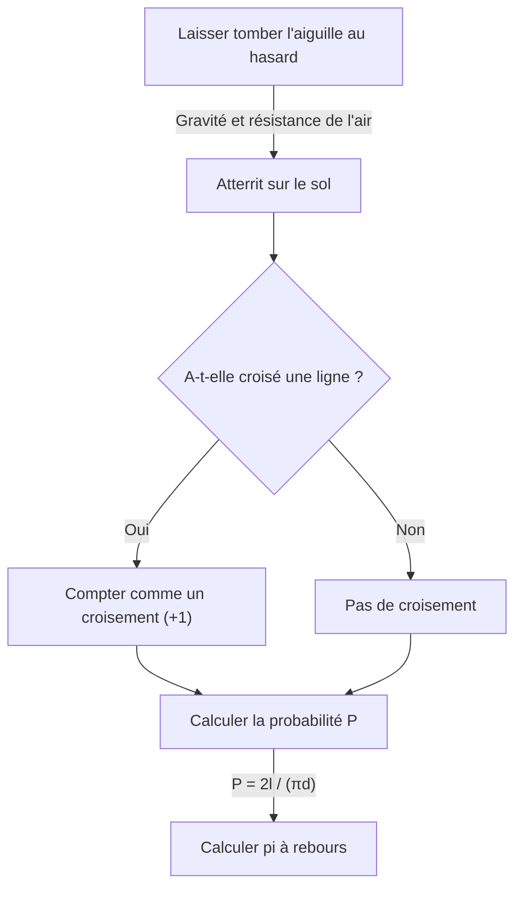

# Qu'est-ce que l'aiguille de Buffon ?

Le monde des mathématiques regorge de faits surprenants qui défient l'intuition et de magnifiques théorèmes qui relient brillamment des phénomènes apparemment sans rapport. Parmi les problèmes les plus célèbres et les plus fascinants figure **« l'aiguille de Buffon »** (Buffon's needle problem).

Ce problème a été posé en 1733 et résolu pour la première fois en 1777 par Georges-Louis Leclerc, comte de Buffon, naturaliste et mathématicien français du XVIIIe siècle.

De manière remarquable, ce problème démontre que l'une des constantes les plus importantes des mathématiques — le **nombre pi $\pi$** — peut être déterminée par l'acte éminemment physique et aléatoire de « laisser tomber une aiguille au hasard sur le sol ». Il est reconnu comme l'un des premiers problèmes de probabilité géométrique (Geometric probability) et constitue une découverte révolutionnaire qui peut être considérée comme un précurseur de la méthode de Monte-Carlo (Monte Carlo method).

Dans cet article, nous expliquons de manière détaillée et accessible **l'aiguille de Buffon**, depuis la formulation du problème jusqu'à la preuve mathématique, en passant par l'estimation de pi par simulation avec des ordinateurs modernes.

## Formulation de base du problème

La formulation du problème de l'aiguille de Buffon est remarquablement simple.

1. Sur un sol plat, de nombreuses lignes parallèles sont tracées à intervalles réguliers de $d$.
2. On prépare une seule aiguille de longueur $l$.
3. L'aiguille est lâchée au hasard sur le sol.

La question posée par Buffon est : **« Quelle est la probabilité que l'aiguille tombée croise l'une des lignes parallèles tracées sur le sol ? »**

Le diagramme suivant illustre le déroulement conceptuel de cette expérience.



Ici, pour simplifier le problème, nous considérons le cas d'une **aiguille courte** où la longueur de l'aiguille $l$ est inférieure ou égale à l'espacement des lignes $d$ ($l \le d$). Sous cette condition, l'aiguille ne peut jamais croiser plus d'une ligne à la fois.

## Modélisation mathématique et dérivation de la probabilité

Pour résoudre ce problème mathématiquement, nous devons quantifier (paramétrer) l'état de l'aiguille. Nous supposons que la position et l'orientation de l'aiguille lorsqu'elle tombe sur le sol sont complètement aléatoires.

Pour déterminer la position de l'aiguille, nous définissons les deux variables suivantes.

1. $x$ : La distance perpendiculaire du centre de l'aiguille à la ligne parallèle la plus proche.
2. $\theta$ : L'angle aigu (ou droit) entre l'aiguille et les lignes parallèles.

### Plage de valeurs des variables

Tout d'abord, examinons les valeurs que chaque variable peut prendre.

- **Distance $x$ :** Le centre de l'aiguille tombe quelque part entre deux lignes parallèles adjacentes. Puisque nous considérons la distance à la ligne la plus proche, la valeur minimale de $x$ est $0$ (lorsque le centre de l'aiguille est sur une ligne) et la valeur maximale est $\frac{d}{2}$ (lorsque le centre de l'aiguille est exactement à mi-chemin entre deux lignes). C'est-à-dire $0 \le x \le \frac{d}{2}$. Comme l'aiguille est lâchée au hasard, $x$ suit une **distribution uniforme** sur cet intervalle. La fonction de densité de probabilité est $\frac{2}{d}$.
- **Angle $\theta$ :** L'angle entre l'aiguille et les lignes parallèles va de $0$, lorsque l'aiguille est parallèle aux lignes, à $\frac{\pi}{2}$ (90 degrés), lorsqu'elle est perpendiculaire. Par symétrie, il n'est pas nécessaire de considérer des angles plus grands. Par conséquent, $0 \le \theta \le \frac{\pi}{2}$. L'orientation de l'aiguille étant également aléatoire, $\theta$ suit aussi une **distribution uniforme** sur cet intervalle. La fonction de densité de probabilité est $\frac{2}{\pi}$.

Puisque les variables $x$ et $\theta$ sont indépendantes l'une de l'autre, la fonction de densité de probabilité conjointe $f(x, \theta)$ pour une paire spécifique $(x, \theta)$ s'exprime comme le produit de leurs fonctions de densité de probabilité individuelles.

$$
f(x, \theta) = \frac{2}{d} \times \frac{2}{\pi} = \frac{4}{d\pi}
$$

### Condition de croisement

Ensuite, considérons la condition pour que l'aiguille croise une ligne.
L'aiguille croise une ligne lorsque l'étendue verticale du centre de l'aiguille à sa pointe est supérieure ou égale à la distance $x$ à la ligne la plus proche.

Puisque la longueur de l'aiguille est $l$, la distance du centre à la pointe est $\frac{l}{2}$.
Lorsque l'angle est $\theta$, la distance verticale occupée par cette moitié de l'aiguille (la longueur projetée) est $\frac{l}{2} \sin \theta$.

Par conséquent, la condition de croisement de l'aiguille avec une ligne s'exprime par l'inégalité suivante.

$$
x \le \frac{l}{2} \sin \theta
$$

### Calcul de la probabilité

La probabilité $P$ que l'aiguille croise une ligne est obtenue en intégrant la fonction de densité de probabilité conjointe $f(x, \theta)$ sur la région satisfaisant la condition de croisement.

$$
P = \iint_{\text{région de croisement}} f(x, \theta) \, dx \, d\theta
$$

Les bornes d'intégration concrètes sont : $\theta$ varie de $0$ à $\frac{\pi}{2}$, et $x$ varie de $0$ au seuil de croisement $\frac{l}{2} \sin \theta$.

$$
P = \int_{0}^{\frac{\pi}{2}} \int_{0}^{\frac{l}{2} \sin \theta} \frac{4}{d\pi} \, dx \, d\theta
$$

Tout d'abord, nous calculons l'intégrale intérieure par rapport à $x$.

$$
\int_{0}^{\frac{l}{2} \sin \theta} \frac{4}{d\pi} \, dx = \frac{4}{d\pi} \left[ x \right]_{0}^{\frac{l}{2} \sin \theta} = \frac{4}{d\pi} \left( \frac{l}{2} \sin \theta - 0 \right) = \frac{2l}{d\pi} \sin \theta
$$

Ensuite, nous calculons l'intégrale extérieure par rapport à $\theta$.

$$
P = \int_{0}^{\frac{\pi}{2}} \frac{2l}{d\pi} \sin \theta \, d\theta = \frac{2l}{d\pi} \int_{0}^{\frac{\pi}{2}} \sin \theta \, d\theta
$$

Comme l'intégrale de $\sin \theta$ est $-\cos \theta$,

$$
\int_{0}^{\frac{\pi}{2}} \sin \theta \, d\theta = \left[ -\cos \theta \right]_{0}^{\frac{\pi}{2}} = (-\cos \frac{\pi}{2}) - (-\cos 0) = -0 - (-1) = 1
$$

Par conséquent, la probabilité recherchée $P$ est la suivante.

$$
P = \frac{2l}{d\pi} \times 1 = \frac{2l}{\pi d}
$$

Telle est la formule fondamentale de **l'aiguille de Buffon**. La probabilité que l'aiguille croise une ligne est égale à deux fois la longueur de l'aiguille $l$ divisée par le produit du nombre pi $\pi$ et de l'espacement des lignes $d$.

## Estimation de pi (méthode de Monte-Carlo)

La formule dérivée $P = \frac{2l}{\pi d}$ contient élégamment $\pi$. En résolvant pour $\pi$, on obtient :

$$
\pi = \frac{2l}{P d}
$$

Cette équation signifie que si nous connaissons la probabilité $P$, nous pouvons calculer le nombre pi $\pi$. Bien sûr, la vraie probabilité $P$ nécessite un nombre infini d'essais, mais en laissant tomber l'aiguille de nombreuses fois dans une expérience réelle, nous pouvons obtenir une approximation de $P$.

Soit $N$ le nombre total de lancers de l'aiguille, et $C$ le nombre de fois où l'aiguille croise une ligne.
Lorsque le nombre d'essais $N$ est suffisamment grand, par la loi des grands nombres, la probabilité empirique $\frac{C}{N}$ se rapproche de la probabilité théorique $P$.

$$
P \approx \frac{C}{N}
$$

En substituant ceci dans l'équation précédente, on obtient une formule d'approximation du nombre pi $\pi$.

$$
\pi \approx \frac{2l \cdot N}{C \cdot d}
$$

Le calcul le plus simple se produit lorsque la longueur de l'aiguille $l$ et l'espacement des lignes $d$ sont égaux ($l = d$). Dans ce cas, la formule se simplifie davantage.

$$
\pi \approx \frac{2N}{C}
$$

Autrement dit, on peut trouver pi simplement en divisant le double du nombre de lancers par le nombre de croisements !

### Simulation en Python

Laisser tomber une aiguille des milliers de fois à la main est une tâche extrêmement fastidieuse (bien qu'historiquement, des mathématiciens aient réellement effectué des milliers de telles expériences). De nos jours, nous pouvons facilement simuler cette expérience à l'aide d'un ordinateur.

Voici un exemple simple de code Python qui simule l'expérience de l'aiguille de Buffon et estime pi.

```python
import random
import math

def buffons_needle_simulation(num_trials, l, d):
    """
    Fonction simulant l'aiguille de Buffon et estimant pi

    :param num_trials: Nombre de lancers de l'aiguille
    :param l: Longueur de l'aiguille
    :param d: Espacement entre les lignes parallèles
    :return: Valeur estimée de pi
    """
    crosses = 0
    
    for _ in range(num_trials):
        # Génération aléatoire de la distance x du centre de l'aiguille à la ligne la plus proche (0 à d/2)
        x = random.uniform(0, d / 2.0)
        
        # Génération aléatoire de l'angle theta de l'aiguille (0 à pi/2)
        theta = random.uniform(0, math.pi / 2.0)
        
        # Vérification de la condition de croisement
        if x <= (l / 2.0) * math.sin(theta):
            crosses += 1
            
    # Gestion d'exception pour éviter les erreurs en l'absence de croisement
    if crosses == 0:
        return float('inf')
        
    # Estimation de pi
    estimated_pi = (2.0 * l * num_trials) / (d * crosses)
    return estimated_pi

# Paramétrage
N = 1000000  # Nombre d'essais (1 million)
needle_length = 1.0
line_distance = 1.0

# Exécution de la simulation
estimated_pi = buffons_needle_simulation(N, needle_length, line_distance)

print(f"Nombre d'essais : {N:,}")
print(f"Pi estimé :       {estimated_pi}")
print(f"Pi réel :         {math.pi}")
print(f"Erreur :          {abs(math.pi - estimated_pi)}")
```

Lorsque vous exécutez ce code, un grand nombre d'aiguilles virtuelles sont lâchées à l'aide de nombres aléatoires, et vous pouvez vérifier qu'une approximation très précise de $3,1415...$ — la valeur de pi — est obtenue. Cette technique d'utilisation de nombres aléatoires pour trouver des solutions approximatives à des problèmes probabilistes est appelée la **méthode de Monte-Carlo**.

## Conclusion

À première vue, l'aiguille de Buffon peut sembler n'être qu'un simple jeu de hasard physique, mais derrière elle se cache une solide théorie mathématique. La façon dont les événements aléatoires (probabilité), les formes géométriques (droites et segments) et le nombre irrationnel ultime $\pi$ fusionnent dans une formule simple incarne véritablement la beauté des mathématiques.

De plus, ce problème revêt une importance historique en tant qu'origine de la méthode de Monte-Carlo, indispensable à la science et à la technologie modernes. Des simulations de systèmes complexes au calcul d'intégrales difficiles à résoudre analytiquement, l'idée de Buffon continue de soutenir notre monde sous diverses formes encore aujourd'hui.

Pourquoi ne pas vous munir de papier, d'un crayon et de quelques cure-dents pour vivre chez vous une partie de cette grande histoire des mathématiques ?
