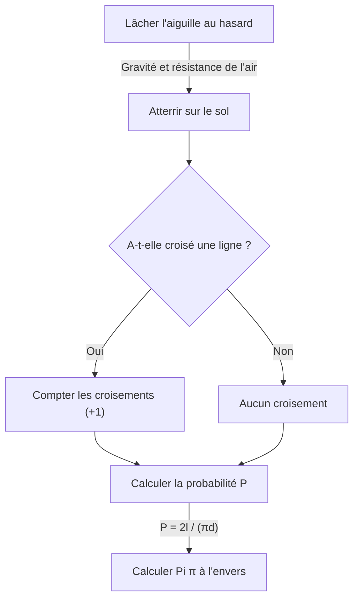

# Qu'est-ce que l'aiguille de Buffon ?

Dans le monde des mathématiques, il existe de nombreux théorèmes magnifiques où des faits étonnants qui vont à l'encontre de l'intuition ou des événements apparemment sans rapport se connectent de manière magnifique. L'un des problèmes les plus célèbres et fascinants parmi eux est le **problème de l'aiguille de Buffon**.

Ce problème a été proposé en 1733 par Georges-Louis Leclerc, Comte de Buffon, un naturaliste et mathématicien français du 18ème siècle, et a été résolu pour la première fois en 1777.

Étonnamment, ce problème affirme qu'à travers l'acte extrêmement physique et aléatoire de "lâcher une aiguille au hasard sur le sol", on peut déterminer l'une des constantes les plus importantes des mathématiques, **Pi $\pi$**. Ceci est connu comme l'un des premiers problèmes de probabilité géométrique et fut une découverte révolutionnaire que l'on peut considérer comme pionnière de la méthode de Monte-Carlo ultérieure.

Dans cet article, nous allons expliquer en détail et de manière simple, depuis la définition du problème de **l'aiguille de Buffon**, sa preuve mathématique, jusqu'à l'estimation de Pi par simulation en utilisant des ordinateurs modernes.

## Paramètre de base du problème

Le paramétrage du problème de l'aiguille de Buffon est très simple.

1. Sur un sol plat, de nombreuses lignes droites parallèles sont tracées à des intervalles égaux $d$.
2. Une seule aiguille de longueur $l$ est préparée.
3. Cette aiguille est lâchée au hasard (aléatoirement) sur le sol.

À ce moment, **"Quelle est la probabilité que l'aiguille lâchée croise l'une des lignes parallèles tracées sur le sol ?"** est le problème proposé par Buffon.

Le diagramme suivant montre le flux conceptuel de cette expérience.



Ici, pour simplifier le problème, nous considérons le cas d'une **aiguille courte**, où la longueur de l'aiguille $l$ est inférieure ou égale à l'intervalle des lignes parallèles $d$ ($l \le d$). Sous cette condition, l'aiguille ne croisera jamais deux lignes droites ou plus en même temps.

## Modélisation mathématique et dérivation de la probabilité

Pour résoudre ce problème mathématiquement, il est nécessaire de quantifier (paramétrer) l'état de l'aiguille. Lorsque l'aiguille tombe sur le sol, nous supposons que sa position et son orientation sont complètement aléatoires.

Pour déterminer la position de l'aiguille, nous définissons les deux variables suivantes.

1. $x$ : La distance verticale du centre de l'aiguille à la ligne parallèle la plus proche.
2. $\theta$ : L'angle aigu (ou angle droit) formé par l'aiguille et les lignes parallèles.

### Plage possible des variables

Tout d'abord, considérons quelles valeurs chaque variable peut prendre.

- **Concernant la distance $x$ :** Le centre de l'aiguille tombe quelque part entre deux lignes parallèles adjacentes. Puisque nous considérons la distance à la ligne la plus proche, la valeur minimale de $x$ est $0$ (lorsque le centre de l'aiguille est sur la ligne), et la valeur maximale est $\frac{d}{2}$ (lorsque le centre de l'aiguille est exactement à mi-chemin entre deux lignes). C'est-à-dire, $0 \le x \le \frac{d}{2}$. Puisque l'aiguille est lâchée au hasard, $x$ suit une **distribution uniforme** dans cette plage. La fonction de densité de probabilité est $\frac{2}{d}$.
- **Concernant l'angle $\theta$ :** L'angle formé par l'aiguille et la ligne parallèle prend une valeur allant de $0$ lorsque l'aiguille est parallèle à la ligne droite, à $\frac{\pi}{2}$ (90 degrés) lorsqu'elle est perpendiculaire. Par symétrie, il n'est pas nécessaire de considérer des angles plus grands que cela. Par conséquent, $0 \le \theta \le \frac{\pi}{2}$. Puisque l'orientation de l'aiguille est également aléatoire, $\theta$ suit aussi une **distribution uniforme** dans cette plage. La fonction de densité de probabilité est $\frac{2}{\pi}$.

Puisque les variables $x$ et $\theta$ sont indépendantes l'une de l'autre, la fonction de densité de probabilité conjointe $f(x, \theta)$ qu'elles prennent une paire spécifique $(x, \theta)$ est exprimée comme le produit de leurs fonctions de densité de probabilité respectives.

$$
f(x, \theta) = \frac{2}{d} \times \frac{2}{\pi} = \frac{4}{d\pi}
$$

### Conditions de croisement

Ensuite, considérons les conditions pour que l'aiguille croise une ligne droite.
L'aiguille croise une ligne droite lorsque la longueur verticale du centre de l'aiguille à son extrémité est supérieure ou égale à la distance $x$ à la ligne la plus proche.

Puisque la longueur de l'aiguille est $l$, la longueur du centre à l'extrémité est $\frac{l}{2}$.
Lorsque l'angle est $\theta$, la distance que cette moitié de l'aiguille occupe dans la direction verticale (longueur projetée) est $\frac{l}{2} \sin \theta$.

Par conséquent, la condition pour que l'aiguille croise une ligne droite est exprimée par l'inégalité suivante.

$$
x \le \frac{l}{2} \sin \theta
$$

### Calcul de la probabilité

La probabilité $P$ que l'aiguille croise une ligne est obtenue en intégrant la fonction de densité de probabilité conjointe $f(x, \theta)$ sur la région satisfaisant la condition de croisement.

$$
P = \iint_{\text{Zone d'intersection}} f(x, \theta) \, dx \, d\theta
$$

La plage spécifique d'intégration est l'endroit où $\theta$ varie de $0$ à $\frac{\pi}{2}$, et $x$ varie de $0$ à la valeur limite de croisement $\frac{l}{2} \sin \theta$.

$$
P = \int_{0}^{\frac{\pi}{2}} \int_{0}^{\frac{l}{2} \sin \theta} \frac{4}{d\pi} \, dx \, d\theta
$$

Tout d'abord, nous calculons l'intégrale interne par rapport à $x$.

$$
\int_{0}^{\frac{l}{2} \sin \theta} \frac{4}{d\pi} \, dx = \frac{4}{d\pi} \left[ x \right]_{0}^{\frac{l}{2} \sin \theta} = \frac{4}{d\pi} \left( \frac{l}{2} \sin \theta - 0 \right) = \frac{2l}{d\pi} \sin \theta
$$

Ensuite, nous calculons l'intégrale externe par rapport à $\theta$.

$$
P = \int_{0}^{\frac{\pi}{2}} \frac{2l}{d\pi} \sin \theta \, d\theta = \frac{2l}{d\pi} \int_{0}^{\frac{\pi}{2}} \sin \theta \, d\theta
$$

Puisque l'intégrale de $\sin \theta$ est $-\cos \theta$,

$$
\int_{0}^{\frac{\pi}{2}} \sin \theta \, d\theta = \left[ -\cos \theta \right]_{0}^{\frac{\pi}{2}} = (-\cos \frac{\pi}{2}) - (-\cos 0) = -0 - (-1) = 1
$$

Par conséquent, la probabilité requise $P$ est la suivante.

$$
P = \frac{2l}{d\pi} \times 1 = \frac{2l}{\pi d}
$$

C'est la formule de base de **l'aiguille de Buffon**. La probabilité que l'aiguille croise une ligne est le double de la longueur de l'aiguille $l$, divisé par le produit de Pi $\pi$ et l'intervalle des lignes $d$.

## Estimation de Pi (Méthode de Monte-Carlo)

La formule dérivée $P = \frac{2l}{\pi d}$ inclut magnifiquement $\pi$. Résoudre ceci pour $\pi$ donne ce qui suit.

$$
\pi = \frac{2l}{P d}
$$

Cette équation signifie que si seule la probabilité $P$ est connue, Pi $\pi$ peut être calculé. Bien sûr, la vraie probabilité $P$ ne peut être connue sans un nombre infini d'essais, mais en lâchant l'aiguille de nombreuses fois dans une expérience réelle, une valeur approximative de $P$ peut être obtenue.

Soit $N$ le nombre total de fois où l'aiguille est lâchée, et $C$ le nombre de fois où l'aiguille a croisé une ligne.
Si le nombre d'essais $N$ est suffisamment grand, selon la loi des grands nombres, la probabilité empirique $\frac{C}{N}$ s'approche de la probabilité théorique $P$.

$$
P \approx \frac{C}{N}
$$

En substituant cela dans l'équation précédente, on obtient une formule pour trouver la valeur approximative de Pi $\pi$.

$$
\pi \approx \frac{2l \cdot N}{C \cdot d}
$$

Le calcul le plus simple est lorsque la longueur de l'aiguille $l$ et l'intervalle des lignes $d$ sont les mêmes ($l = d$). À ce moment, la formule devient encore plus simple.

$$
\pi \approx \frac{2N}{C}
$$

En d'autres termes, il suffit de diviser deux fois le "nombre de fois où l'aiguille a été lâchée" par le "nombre de fois où elle a croisé", et Pi est obtenu !

### Simulation avec Python

Lâcher une aiguille des milliers de fois à la main est une tâche très laborieuse (bien qu'historiquement, il y ait des mathématiciens qui ont réellement mené des expériences des milliers de fois). Aujourd'hui, nous pouvons facilement simuler cette expérience en utilisant un ordinateur.

Voici un exemple de code simple utilisant Python pour simuler l'expérience de l'aiguille de Buffon et estimer Pi.

```python
import random
import math

def buffons_needle_simulation(num_trials, l, d):
    """
    Une fonction pour simuler l'aiguille de Buffon et estimer Pi
    
    :param num_trials: Nombre de fois à lâcher l'aiguille
    :param l: Longueur de l'aiguille
    :param d: Intervalle des lignes parallèles
    :return: Pi estimé
    """
    crosses = 0
    
    for _ in range(num_trials):
        # Générer aléatoirement la distance x du centre de l'aiguille à la ligne la plus proche (0 à d/2)
        x = random.uniform(0, d / 2.0)
        
        # Générer aléatoirement l'angle theta de l'aiguille (0 à pi/2)
        theta = random.uniform(0, math.pi / 2.0)
        
        # Vérifier si la condition de croisement est satisfaite
        if x <= (l / 2.0) * math.sin(theta):
            crosses += 1
            
    # Gestion des exceptions pour éviter les erreurs si cela ne croise jamais
    if crosses == 0:
        return float('inf')
        
    # Calcul de l'estimation de Pi
    estimated_pi = (2.0 * l * num_trials) / (d * crosses)
    return estimated_pi

# Paramètres
N = 1000000  # Nombre d'essais (1 million de fois)
needle_length = 1.0
line_distance = 1.0

# Exécuter la simulation
estimated_pi = buffons_needle_simulation(N, needle_length, line_distance)

print(f"Nombre d'essais : {N:,} fois")
print(f"Pi estimé :       {estimated_pi}")
print(f"Pi réel :         {math.pi}")
print(f"Erreur :          {abs(math.pi - estimated_pi)}")
```

L'exécution de ce code lâche un nombre énorme d'aiguilles virtuelles en utilisant des nombres aléatoires, et il peut être confirmé qu'une valeur approximative de Pi de $3.1415...$ est obtenue avec une très grande précision. La méthode d'utilisation de nombres aléatoires pour trouver des solutions approximatives à des problèmes probabilistes de cette manière est appelée la **méthode de Monte-Carlo**.

## Résumé

[L'aiguille de Buffon](https://kenji.blog/p/buffons-needle/) semble à première vue être un simple jeu de hasard physique, mais il y a une solide théorie mathématique derrière cela. La façon dont des événements aléatoires (probabilité), des formes géométriques (lignes et segments de ligne) et l'ultime nombre irrationnel $\pi$ fusionnent dans une seule formule mathématique simple incarne la beauté des mathématiques.

De plus, ce problème a une importance historique en tant qu'origine de la méthode de Monte-Carlo, qui est indispensable pour la science et la technologie modernes. La simulation de systèmes complexes et le calcul d'intégrales difficiles à résoudre analytiquement, l'idée de Buffon soutient encore notre monde sous diverses formes aujourd'hui.

Pourquoi ne pas préparer du papier, un stylo et quelques cure-dents, et découvrir une partie de cette grande histoire mathématique chez vous ?
