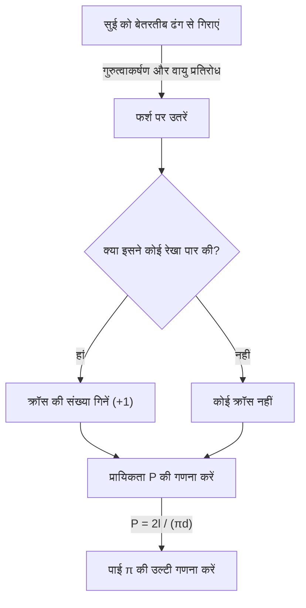

# बफॉन की सुई क्या है?

गणित की दुनिया में, कई खूबसूरत प्रमेय हैं जहां आश्चर्यजनक तथ्य जो अंतर्ज्ञान के खिलाफ जाते हैं या प्रतीत होने वाली असंबद्ध घटनाएं खूबसूरती से जुड़ती हैं। उनमें से सबसे प्रसिद्ध और आकर्षक समस्याओं में से एक **बफॉन की सुई की समस्या** है।

यह समस्या 1733 में 18वीं सदी के फ्रांसीसी प्रकृतिवादी और गणितज्ञ जॉर्जेस-लुई लेक्लर्क, कॉम्टे डी बफॉन (Georges-Louis Leclerc, Comte de Buffon) द्वारा प्रस्तावित की गई थी, और इसे पहली बार 1777 में हल किया गया था।

आश्चर्यजनक रूप से, यह समस्या बताती है कि "फर्श पर बेतरतीब ढंग से सुई गिराने" के अत्यंत भौतिक और यादृच्छिक कार्य के माध्यम से, कोई भी गणित में सबसे महत्वपूर्ण स्थिरांक में से एक, **पाई $\pi$** को निर्धारित कर सकता है। इसे ज्यामितीय प्रायिकता (Geometric probability) में सबसे प्रारंभिक समस्याओं में से एक के रूप में जाना जाता है और यह एक अभूतपूर्व खोज थी जिसे बाद की मोंटे कार्लो पद्धति (Monte Carlo method) का अग्रदूत कहा जा सकता है।

इस लेख में, हम **बफॉन की सुई** की समस्या की सेटिंग, इसके गणितीय प्रमाण से लेकर आधुनिक कंप्यूटरों का उपयोग करके सिमुलेशन द्वारा पाई के अनुमान तक, विस्तार से और आसानी से समझने वाले तरीके से समझाएंगे।

## समस्या की मूल सेटिंग

बफॉन की सुई की समस्या की सेटिंग बहुत सरल है।

1. एक सपाट फर्श पर, समान अंतराल $d$ पर कई समानांतर सीधी रेखाएं खींची जाती हैं।
2. लंबाई $l$ की एक सुई तैयार की जाती है।
3. इस सुई को फर्श पर बेतरतीब ढंग से (यादृच्छिक रूप से) गिराया जाता है।

इस समय, **"इस बात की क्या प्रायिकता है कि गिराई गई सुई फर्श पर खींची गई समानांतर रेखाओं में से किसी एक को पार करेगी?"** बफॉन द्वारा प्रस्तावित समस्या है।

निम्नलिखित आरेख इस प्रयोग के वैचारिक प्रवाह को दर्शाता है।



यहां, समस्या को आसान बनाने के लिए, हम एक **छोटी सुई** के मामले पर विचार करते हैं, जहां सुई की लंबाई $l$ समानांतर रेखाओं के अंतराल $d$ ($l \le d$) से कम या उसके बराबर है। इस शर्त के तहत, सुई कभी भी एक ही समय में दो या दो से अधिक सीधी रेखाओं को पार नहीं करेगी।

## गणितीय मॉडलिंग और प्रायिकता की व्युत्पत्ति

इस समस्या को गणितीय रूप से हल करने के लिए, सुई की स्थिति को निर्धारित (पैरामीटरित) करना आवश्यक है। जब सुई फर्श पर गिरती है, तो हम मानते हैं कि उसकी स्थिति और अभिविन्यास पूरी तरह से यादृच्छिक हैं।

सुई की स्थिति निर्धारित करने के लिए, हम निम्नलिखित दो चर परिभाषित करते हैं।

1. $x$ : सुई के केंद्र से निकटतम समानांतर रेखा तक की ऊर्ध्वाधर दूरी।
2. $\theta$ : सुई और समानांतर रेखाओं द्वारा गठित न्यून कोण (या समकोण)।

### चरों की संभावित सीमा

सबसे पहले, आइए विचार करें कि प्रत्येक चर कौन से मान ले सकता है।

- **दूरी $x$ के संबंध में:** सुई का केंद्र दो आसन्न समानांतर रेखाओं के बीच कहीं गिरता है। चूंकि हम निकटतम रेखा की दूरी पर विचार करते हैं, $x$ का न्यूनतम मान $0$ है (जब सुई का केंद्र रेखा पर होता है), और अधिकतम मान $\frac{d}{2}$ होता है (जब सुई का केंद्र दो रेखाओं के ठीक बीच में होता है)। अर्थात्, $0 \le x \le \frac{d}{2}$। चूंकि सुई बेतरतीब ढंग से गिराई जाती है, $x$ इस सीमा में एक **समान वितरण** (uniform distribution) का अनुसरण करता है। प्रायिकता घनत्व फलन $\frac{2}{d}$ है।
- **कोण $\theta$ के संबंध में:** सुई और समानांतर रेखा द्वारा गठित कोण $0$ से लेकर, जब सुई सीधी रेखा के समानांतर होती है, $\frac{\pi}{2}$ (90 डिग्री) तक, जब यह लंबवत होती है, का मान लेता है। समरूपता से, इससे बड़े कोणों पर विचार करने की आवश्यकता नहीं है। इसलिए, $0 \le \theta \le \frac{\pi}{2}$। चूंकि सुई का अभिविन्यास भी यादृच्छिक है, $\theta$ भी इस सीमा में एक **समान वितरण** का अनुसरण करता है। प्रायिकता घनत्व फलन $\frac{2}{\pi}$ है।

चूंकि चर $x$ और $\theta$ एक दूसरे से स्वतंत्र हैं, संयुक्त प्रायिकता घनत्व फलन $f(x, \theta)$ कि वे एक विशिष्ट युग्म $(x, \theta)$ लेते हैं, उनके संबंधित प्रायिकता घनत्व फलनों के गुणनफल के रूप में व्यक्त किया जाता है।

$$
f(x, \theta) = \frac{2}{d} \times \frac{2}{\pi} = \frac{4}{d\pi}
$$

### पार करने की शर्तें

इसके बाद, सुई के सीधी रेखा को पार करने की शर्तों पर विचार करें।
सुई एक सीधी रेखा को तब पार करती है जब सुई के केंद्र से उसके सिरे तक की ऊर्ध्वाधर लंबाई निकटतम रेखा की दूरी $x$ से अधिक या उसके बराबर होती है।

चूंकि सुई की लंबाई $l$ है, इसलिए केंद्र से सिरे तक की लंबाई $\frac{l}{2}$ है।
जब कोण $\theta$ होता है, तो सुई का यह आधा हिस्सा ऊर्ध्वाधर दिशा (अनुमानित लंबाई) में जो दूरी घेरता है वह $\frac{l}{2} \sin \theta$ होती है।

इसलिए, सुई के सीधी रेखा को पार करने की स्थिति को निम्नलिखित असमानता द्वारा व्यक्त किया जाता है।

$$
x \le \frac{l}{2} \sin \theta
$$

### प्रायिकता की गणना

सुई के किसी रेखा को पार करने की प्रायिकता $P$, पार करने की स्थिति को पूरा करने वाले क्षेत्र पर संयुक्त प्रायिकता घनत्व फलन $f(x, \theta)$ को एकीकृत करके प्राप्त की जाती है।

$$
P = \iint_{\text{प्रतिच्छेदन क्षेत्र}} f(x, \theta) \, dx \, d\theta
$$

एकीकरण की विशिष्ट सीमा वह है जहां $\theta$, $0$ से $\frac{\pi}{2}$ तक बदलता है, और $x$, $0$ से पार करने के सीमा मान $\frac{l}{2} \sin \theta$ तक बदलता है।

$$
P = \int_{0}^{\frac{\pi}{2}} \int_{0}^{\frac{l}{2} \sin \theta} \frac{4}{d\pi} \, dx \, d\theta
$$

सबसे पहले, हम $x$ के संबंध में आंतरिक अभिन्न की गणना करते हैं।

$$
\int_{0}^{\frac{l}{2} \sin \theta} \frac{4}{d\pi} \, dx = \frac{4}{d\pi} \left[ x \right]_{0}^{\frac{l}{2} \sin \theta} = \frac{4}{d\pi} \left( \frac{l}{2} \sin \theta - 0 \right) = \frac{2l}{d\pi} \sin \theta
$$

इसके बाद, हम $\theta$ के संबंध में बाहरी अभिन्न की गणना करते हैं।

$$
P = \int_{0}^{\frac{\pi}{2}} \frac{2l}{d\pi} \sin \theta \, d\theta = \frac{2l}{d\pi} \int_{0}^{\frac{\pi}{2}} \sin \theta \, d\theta
$$

चूंकि $\sin \theta$ का अभिन्न $-\cos \theta$ है,

$$
\int_{0}^{\frac{\pi}{2}} \sin \theta \, d\theta = \left[ -\cos \theta \right]_{0}^{\frac{\pi}{2}} = (-\cos \frac{\pi}{2}) - (-\cos 0) = -0 - (-1) = 1
$$

इसलिए, आवश्यक प्रायिकता $P$ इस प्रकार है।

$$
P = \frac{2l}{d\pi} \times 1 = \frac{2l}{\pi d}
$$

यह **बफॉन की सुई** का मूल सूत्र है। सुई के किसी रेखा को पार करने की प्रायिकता, सुई की लंबाई $l$ के दोगुने को, पाई $\pi$ और रेखाओं के अंतराल $d$ के गुणनफल से विभाजित करने पर प्राप्त होती है।

## पाई का अनुमान (मोंटे कार्लो विधि)

व्युत्पन्न सूत्र $P = \frac{2l}{\pi d}$ में खूबसूरती से $\pi$ शामिल है। इसे $\pi$ के लिए हल करने पर निम्नलिखित प्राप्त होता है।

$$
\pi = \frac{2l}{P d}
$$

इस समीकरण का अर्थ है कि यदि केवल प्रायिकता $P$ ज्ञात हो, तो पाई $\pi$ की गणना की जा सकती है। बेशक, अनंत संख्या में परीक्षणों के बिना वास्तविक प्रायिकता $P$ ज्ञात नहीं की जा सकती है, लेकिन एक वास्तविक प्रयोग में सुई को कई बार गिराकर, $P$ का अनुमानित मान प्राप्त किया जा सकता है।

मान लीजिए $N$ सुई गिराए जाने की कुल संख्या है, और $C$ सुई द्वारा किसी रेखा को पार करने की संख्या है।
यदि परीक्षणों की संख्या $N$ काफी बड़ी है, तो बड़ी संख्याओं के नियम के अनुसार, अनुभवजन्य प्रायिकता $\frac{C}{N}$ सैद्धांतिक प्रायिकता $P$ के करीब पहुंच जाती है।

$$
P \approx \frac{C}{N}
$$

इसे पिछले समीकरण में प्रतिस्थापित करने पर पाई $\pi$ का अनुमानित मान ज्ञात करने का सूत्र प्राप्त होता है।

$$
\pi \approx \frac{2l \cdot N}{C \cdot d}
$$

सबसे आसान गणना तब होती है जब सुई की लंबाई $l$ और रेखा का अंतराल $d$ समान ($l = d$) हो। इस समय, सूत्र और भी सरल हो जाता है।

$$
\pi \approx \frac{2N}{C}
$$

दूसरे शब्दों में, बस "सुई गिराए जाने की संख्या" के दोगुने को "इसके द्वारा पार की गई संख्या" से विभाजित करें, और पाई प्राप्त हो जाता है!

### पायथन के साथ सिमुलेशन

हाथ से हजारों बार सुई गिराना बहुत ही श्रमसाध्य कार्य है (हालांकि ऐतिहासिक रूप से, ऐसे गणितज्ञ हैं जिन्होंने वास्तव में हजारों बार प्रयोग किए हैं)। आज, हम कंप्यूटर का उपयोग करके इस प्रयोग का आसानी से अनुकरण कर सकते हैं।

नीचे पायथन का उपयोग करके बफॉन के सुई प्रयोग का अनुकरण करने और पाई का अनुमान लगाने के लिए एक सरल कोड उदाहरण दिया गया है।

```python
import random
import math

def buffons_needle_simulation(num_trials, l, d):
    """
    बफॉन की सुई का अनुकरण करने और पाई का अनुमान लगाने के लिए एक फ़ंक्शन
    
    :param num_trials: सुई गिराने की संख्या
    :param l: सुई की लंबाई
    :param d: समानांतर रेखाओं का अंतराल
    :return: अनुमानित पाई
    """
    crosses = 0
    
    for _ in range(num_trials):
        # सुई के केंद्र से निकटतम रेखा तक दूरी x यादृच्छिक रूप से उत्पन्न करें (0 से d/2 तक)
        x = random.uniform(0, d / 2.0)
        
        # सुई का कोण theta यादृच्छिक रूप से उत्पन्न करें (0 से pi/2 तक)
        theta = random.uniform(0, math.pi / 2.0)
        
        # जांचें कि क्या पार करने की स्थिति संतुष्ट है
        if x <= (l / 2.0) * math.sin(theta):
            crosses += 1
            
    # अपवाद प्रबंधन ताकि यदि यह कभी पार नहीं करता है तो त्रुटियों से बचा जा सके
    if crosses == 0:
        return float('inf')
        
    # पाई की अनुमान गणना
    estimated_pi = (2.0 * l * num_trials) / (d * crosses)
    return estimated_pi

# पैरामीटर सेटिंग्स
N = 1000000  # परीक्षणों की संख्या (1 मिलियन बार)
needle_length = 1.0
line_distance = 1.0

# सिमुलेशन निष्पादित करें
estimated_pi = buffons_needle_simulation(N, needle_length, line_distance)

print(f"परीक्षणों की संख्या: {N:,} बार")
print(f"अनुमानित पाई:       {estimated_pi}")
print(f"वास्तविक पाई:        {math.pi}")
print(f"त्रुटि:              {abs(math.pi - estimated_pi)}")
```

इस कोड को चलाने से यादृच्छिक संख्याओं का उपयोग करके बड़ी संख्या में आभासी सुइयां गिरती हैं, और इसकी पुष्टि की जा सकती है कि $3.1415...$ के पाई का अनुमानित मान बहुत उच्च सटीकता के साथ प्राप्त होता है। इस तरह से संभाव्य समस्याओं के अनुमानित समाधान खोजने के लिए यादृच्छिक संख्याओं का उपयोग करने की विधि को **मोंटे कार्लो विधि** कहा जाता है।

## सारांश

बफॉन की सुई पहली नज़र में संयोग का एक मात्र भौतिक खेल लगती है, लेकिन इसके पीछे एक ठोस गणितीय सिद्धांत है। जिस तरह से यादृच्छिक घटनाएं (प्रायिकता), ज्यामितीय आकार (रेखाएं और रेखा खंड), और अंतिम अपरिमेय संख्या $\pi$ एक एकल सरल गणितीय सूत्र में विलीन हो जाती हैं, वह गणित की सुंदरता का प्रतीक है।

साथ ही, आधुनिक विज्ञान और प्रौद्योगिकी के लिए अपरिहार्य मोंटे कार्लो पद्धति की उत्पत्ति के रूप में इस समस्या का ऐतिहासिक महत्व है। जटिल प्रणालियों का अनुकरण करना और ऐसे अभिन्न अंगों की गणना करना जिन्हें विश्लेषणात्मक रूप से हल करना मुश्किल है, बफॉन का विचार आज भी विभिन्न रूपों में हमारी दुनिया का समर्थन करता है।

क्यों न कुछ कागज, एक कलम और कुछ टूथपिक तैयार करें, और घर पर इस महान गणितीय इतिहास के एक हिस्से का अनुभव करें?
