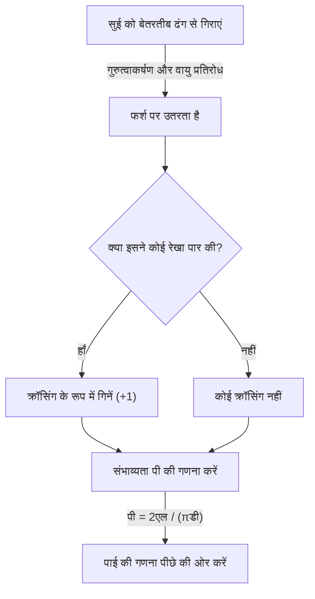

# बफ़न की सुई क्या है?

गणित की दुनिया में कई आश्चर्यजनक तथ्य शामिल हैं जो अंतर्ज्ञान को चुनौती देते हैं, और सुंदर प्रमेय हैं जो शानदार ढंग से असंबंधित घटनाओं को जोड़ते हैं। इनमें से सबसे प्रसिद्ध और आकर्षक समस्याओं में से एक है **"बफ़न की सुई"** (बफ़न की सुई समस्या)।

यह समस्या 1733 में सामने आई थी और पहली बार 1777 में जॉर्जेस-लुई लेक्लर, कॉम्टे डी बफ़न, जो 18वीं सदी के फ्रांसीसी प्रकृतिवादी और गणितज्ञ थे, द्वारा हल की गई थी।

उल्लेखनीय रूप से, यह समस्या दर्शाती है कि गणित में सबसे महत्वपूर्ण स्थिरांकों में से एक - **pi $\pi$** - को "एक सुई को फर्श पर बेतरतीब ढंग से गिराने" के अत्यधिक भौतिक और यादृच्छिक कार्य के माध्यम से निर्धारित किया जा सकता है। इसे ज्यामितीय संभाव्यता में सबसे शुरुआती समस्याओं में से एक के रूप में जाना जाता है, और यह एक अभूतपूर्व खोज थी जिसे मोंटे कार्लो पद्धति का अग्रदूत माना जा सकता है।

इस लेख में, हम **बफ़न की सुई** का एक विस्तृत और सुलभ विवरण प्रदान करते हैं, जिसमें समस्या सेटअप, इसके गणितीय प्रमाण और आधुनिक कंप्यूटर का उपयोग करके सिमुलेशन के माध्यम से पाई का अनुमान शामिल है।

## बुनियादी समस्या सेटअप

बफ़न की सुई समस्या का सेटअप उल्लेखनीय रूप से सरल है।

1. समतल फर्श पर, $d$ के समान अंतराल पर कई समानांतर रेखाएँ खींची जाती हैं।
2. लंबाई $l$ की एक सुई तैयार की जाती है।
3. सुई को बेतरतीब ढंग से फर्श पर गिरा दिया जाता है।

बफ़न ने जो प्रश्न पूछा वह था: **"क्या संभावना है कि गिरी हुई सुई फर्श पर खींची गई समानांतर रेखाओं में से एक को पार कर जाएगी?"**

निम्नलिखित चित्र इस प्रयोग के वैचारिक प्रवाह को दर्शाता है।



यहां, समस्या को सरल बनाने के लिए, हम **छोटी सुई** मामले पर विचार करते हैं जहां सुई की लंबाई $l$ लाइन स्पेसिंग $d$ ($l \le d$) से कम या उसके बराबर है। इस स्थिति में, सुई कभी भी एक समय में एक से अधिक रेखा को पार नहीं कर सकती।

## गणितीय मॉडलिंग और संभाव्यता की व्युत्पत्ति

इस समस्या को गणितीय रूप से हल करने के लिए, हमें सुई की स्थिति को मापने (पैरामीटराइज़) करने की आवश्यकता है। हम मानते हैं कि जब सुई फर्श पर गिरती है तो उसकी स्थिति और दिशा पूरी तरह से यादृच्छिक होती है।

सुई की स्थिति निर्धारित करने के लिए, हम निम्नलिखित दो चर परिभाषित करते हैं।

1. $x$: सुई के केंद्र से निकटतम समानांतर रेखा तक लंबवत दूरी।
2. $\theta$ : सुई और समानांतर रेखाओं के बीच का न्यून कोण (या समकोण)।

### चर की सीमा

सबसे पहले, आइए विचार करें कि प्रत्येक चर क्या मान ले सकता है।

- **दूरी $x$:** सुई का केंद्र दो आसन्न समानांतर रेखाओं के बीच कहीं पड़ता है। चूँकि हम निकटतम रेखा की दूरी पर विचार करते हैं, $x$ का न्यूनतम मान $0$ है (जब सुई का केंद्र एक रेखा पर होता है) और अधिकतम मान $\frac{d}{2}$ होता है (जब सुई का केंद्र दो रेखाओं के ठीक बीच में होता है)। यानी $0 \le x \le \frac{d}{2}$. चूँकि सुई को बेतरतीब ढंग से गिराया जाता है, $x$ इस सीमा पर **समान वितरण** का अनुसरण करता है। संभाव्यता घनत्व फ़ंक्शन $\frac{2}{d}$ है।
- **कोण $\theta$:** जब सुई रेखाओं के समानांतर होती है तो सुई और समानांतर रेखाओं के बीच का कोण $0$ से लेकर लंबवत होने पर $\frac{\pi}{2}$ (90 डिग्री) तक होता है। समरूपता के अनुसार, हमें इससे आगे के कोणों पर विचार करने की आवश्यकता नहीं है। इसलिए, $0 \le \theta \le \frac{\pi}{2}$. चूँकि सुई का अभिविन्यास भी यादृच्छिक है, $\theta$ इस सीमा पर **समान वितरण** का अनुसरण करता है। संभाव्यता घनत्व फ़ंक्शन $\frac{2}{\pi}$ है।

चूँकि चर $x$ और $\theta$ एक दूसरे से स्वतंत्र हैं, एक विशिष्ट जोड़ी $(x, \theta)$ के लिए संयुक्त संभाव्यता घनत्व फ़ंक्शन $f(x, \theta)$ को उनके व्यक्तिगत संभाव्यता घनत्व कार्यों के उत्पाद के रूप में व्यक्त किया जाता है।

$$
f(x, \theta) = \frac{2}{d} \times \frac{2}{\pi} = \frac{4}{d\pi}
$$

### पार करने की स्थिति

इसके बाद, आइए सुई द्वारा एक रेखा को पार करने की स्थिति पर विचार करें।
सुई एक रेखा को तब पार करती है जब सुई के केंद्र से उसकी नोक तक की ऊर्ध्वाधर सीमा निकटतम रेखा से दूरी $x$ से अधिक या उसके बराबर होती है।

चूँकि सुई की लंबाई $l$ है, केंद्र से टिप तक की दूरी $\frac{l}{2}$ है।
जब कोण $\theta$ है, तो सुई के इस आधे हिस्से (अनुमानित लंबाई) द्वारा घेरी गई ऊर्ध्वाधर दूरी $\frac{l}{2} \sin \theta$ है।

इसलिए, सुई के एक रेखा को पार करने की स्थिति निम्नलिखित असमानता द्वारा व्यक्त की जाती है।

$$
x \le \frac{l}{2} \sin \theta
$$

### संभाव्यता की गणना

संभावना $P$ कि सुई एक रेखा को पार करती है, क्रॉसिंग स्थिति को संतुष्ट करने वाले क्षेत्र पर संयुक्त संभावना घनत्व फ़ंक्शन $f(x, \theta)$ को एकीकृत करके प्राप्त की जाती है।

$$
P = \iint_{\text{crossing region}} f(x, \theta) \, dx \, d\theta
$$

विशिष्ट एकीकरण सीमाएँ हैं: $\theta$ $0$ से $\frac{\pi}{2}$ तक भिन्न होता है, और $x$ $0$ से क्रॉसिंग थ्रेशोल्ड $\frac{l}{2} \sin \theta$ तक भिन्न होता है।

$$
P = \int_{0}^{\frac{\pi}{2}} \int_{0}^{\frac{l}{2} \sin \theta} \frac{4}{d\pi} \, dx \, d\theta
$$

सबसे पहले, हम $x$ के संबंध में आंतरिक अभिन्न अंग की गणना करते हैं।

$$
\int_{0}^{\frac{l}{2} \sin \theta} \frac{4}{d\pi} \, dx = \frac{4}{d\pi} \left[ x \right]_{0}^{\frac{l}{2} \sin \theta} = \frac{4}{d\pi} \left( \frac{l}{2} \sin \theta - 0 \right) = \frac{2l}{d\pi} \sin \theta
$$

इसके बाद, हम $\theta$ के संबंध में बाहरी अभिन्न अंग की गणना करते हैं।

$$
P = \int_{0}^{\frac{\pi}{2}} \frac{2l}{d\pi} \sin \theta \, d\theta = \frac{2l}{d\pi} \int_{0}^{\frac{\pi}{2}} \sin \theta \, d\theta
$$

चूँकि $\sin \theta$ का अभिन्न अंग $-\cos \theta$ है,

$$
\int_{0}^{\frac{\pi}{2}} \sin \theta \, d\theta = \left[ -\cos \theta \right]_{0}^{\frac{\pi}{2}} = (-\cos \frac{\pi}{2}) - (-\cos 0) = -0 - (-1) = 1
$$

इसलिए, वांछित प्रायिकता $P$ इस प्रकार है।

$$
P = \frac{2l}{d\pi} \times 1 = \frac{2l}{\pi d}
$$

यह **बफ़न की सुई** का मूल सूत्र है। सुई के एक रेखा को पार करने की प्रायिकता सुई की लंबाई $l$ के दोगुने के बराबर होती है जिसे pi $\pi$ के गुणनफल और रेखा अंतर $d$ से विभाजित किया जाता है।

## पाई का अनुमान लगाना (मोंटे कार्लो विधि)

व्युत्पन्न सूत्र $P = \frac{2l}{\pi d}$ में खूबसूरती से $\pi$ शामिल है। $\pi$ को हल करने पर, हमें मिलता है:

$$
\pi = \frac{2l}{P d}
$$

इस समीकरण का अर्थ है कि यदि हम प्रायिकता $P$ जानते हैं, तो हम pi $\pi$ की गणना कर सकते हैं। निःसंदेह, वास्तविक संभाव्यता $P$ के लिए अनंत संख्या में परीक्षणों की आवश्यकता होती है, लेकिन एक वास्तविक प्रयोग में सुई को कई बार गिराकर, हम $P$ का अनुमान प्राप्त कर सकते हैं।

मान लीजिए $N$ सुई गिरने की कुल संख्या है, और $C$ सुई द्वारा एक रेखा को पार करने की संख्या है।
जब परीक्षणों की संख्या $N$ पर्याप्त रूप से बड़ी होती है, तो बड़ी संख्या के नियम के अनुसार, अनुभवजन्य संभाव्यता $\frac{C}{N}$ सैद्धांतिक संभाव्यता $P$ के करीब पहुंच जाती है।

$$
P \approx \frac{C}{N}
$$

इसे पिछले समीकरण में प्रतिस्थापित करने से हमें pi $\pi$ का अनुमान लगाने का एक सूत्र मिलता है।

$$
\pi \approx \frac{2l \cdot N}{C \cdot d}
$$

सबसे सरल गणना तब होती है जब सुई की लंबाई $l$ और पंक्ति रिक्ति $d$ बराबर ($l = d$) होती है। इस मामले में, सूत्र और सरल हो जाता है।

$$
\pi \approx \frac{2N}{C}
$$

दूसरे शब्दों में, आप सुई की बूंदों की संख्या को क्रॉसिंग की संख्या से दोगुना विभाजित करके पाई पा सकते हैं!

### पायथन सिमुलेशन

एक सुई को हाथ से हजारों बार गिराना एक अत्यंत कठिन कार्य है (हालांकि ऐतिहासिक रूप से, ऐसे गणितज्ञ हुए हैं जिन्होंने वास्तव में ऐसे हजारों प्रयोग किए हैं)। आधुनिक समय में, हम कंप्यूटर का उपयोग करके इस प्रयोग को आसानी से अनुकरण कर सकते हैं।

नीचे एक सरल पायथन कोड उदाहरण है जो बफ़न के सुई प्रयोग का अनुकरण करता है और पाई का अनुमान लगाता है।

```python
import random
import math

def buffons_needle_simulation(num_trials, l, d):
    """
    Function to simulate Buffon's needle and estimate pi

    :param num_trials: Number of needle drops
    :param l: Length of the needle
    :param d: Spacing between parallel lines
    :return: Estimated value of pi
    """
    crosses = 0
    
    for _ in range(num_trials):
        # Randomly generate distance x from the needle's center to the nearest line (0 to d/2)
        x = random.uniform(0, d / 2.0)
        
        # Randomly generate needle angle theta (0 to pi/2)
        theta = random.uniform(0, math.pi / 2.0)
        
        # Check if the crossing condition is satisfied
        if x <= (l / 2.0) * math.sin(theta):
            crosses += 1
            
    # Exception handling to avoid errors when no crossings occur
    if crosses == 0:
        return float('inf')
        
    # Estimate pi
    estimated_pi = (2.0 * l * num_trials) / (d * crosses)
    return estimated_pi

# Parameter settings
N = 1000000  # Number of trials (1 million)
needle_length = 1.0
line_distance = 1.0

# Run the simulation
estimated_pi = buffons_needle_simulation(N, needle_length, line_distance)

print(f"Number of trials: {N:,}")
print(f"Estimated pi:     {estimated_pi}")
print(f"Actual pi:        {math.pi}")
print(f"Error:            {abs(math.pi - estimated_pi)}")
```

जब आप इस कोड को चलाते हैं, तो यादृच्छिक संख्याओं का उपयोग करके बड़ी संख्या में आभासी सुईयां गिरा दी जाती हैं, और आप सत्यापित कर सकते हैं कि $3.1415...$ - pi का मान - का एक बहुत सटीक अनुमान प्राप्त होता है। संभाव्य समस्याओं का अनुमानित समाधान खोजने के लिए यादृच्छिक संख्याओं का उपयोग करने की इस तकनीक को **मोंटे कार्लो विधि** कहा जाता है।

## निष्कर्ष

पहली नज़र में, बफ़न की सुई महज़ भौतिक संयोग का खेल लग सकती है, लेकिन इसके पीछे एक ठोस गणितीय सिद्धांत छिपा है। जिस तरह से यादृच्छिक घटनाएँ (संभावना), ज्यामितीय आकृतियाँ (रेखाएँ और रेखा खंड), और अंतिम अपरिमेय संख्या $\pi$ एक सरल सूत्र में एक साथ विलीन हो जाती हैं, वह वास्तव में गणित की सुंदरता का प्रतीक है।

इसके अलावा, यह समस्या मोंटे कार्लो पद्धति की उत्पत्ति के रूप में ऐतिहासिक महत्व रखती है, जो आधुनिक विज्ञान और प्रौद्योगिकी के लिए अपरिहार्य है। जटिल प्रणालियों के अनुकरण से लेकर अभिन्नों की गणना करने तक जिन्हें विश्लेषणात्मक रूप से हल करना मुश्किल है, बफ़न का विचार आज भी विभिन्न रूपों में हमारी दुनिया का समर्थन करना जारी रखता है।

क्यों न आप कुछ कागज़, एक कलम और कुछ टूथपिक्स लें, और घर पर इस महान गणितीय इतिहास का एक टुकड़ा अनुभव करें?
