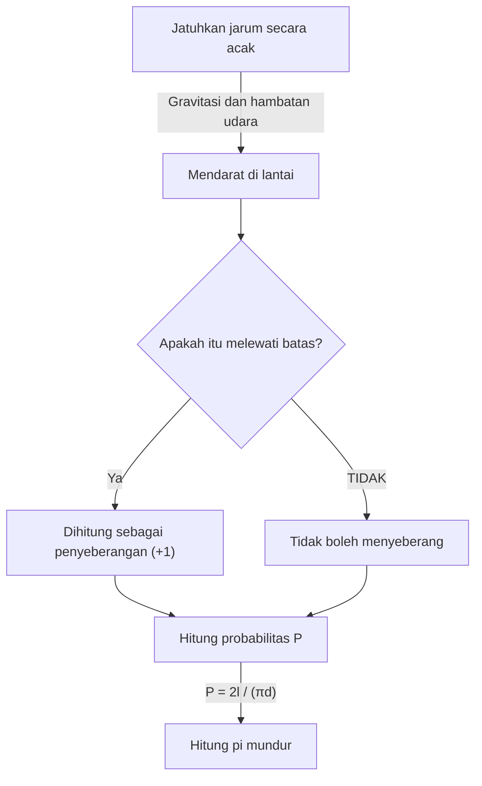

# Apa Itu Jarum Buffon?

Dunia matematika mengandung banyak fakta mengejutkan yang menentang intuisi, dan teorema indah yang secara cemerlang menghubungkan fenomena yang tampaknya tidak berhubungan. Di antara masalah yang paling terkenal dan menarik adalah **"Jarum Buffon"** (masalah jarum Buffon).

Masalah ini diajukan pada tahun 1733 dan pertama kali diselesaikan pada tahun 1777 oleh Georges-Louis Leclerc, Comte de Buffon, seorang naturalis dan matematikawan Perancis abad ke-18.

Hebatnya, soal ini menunjukkan bahwa salah satu konstanta terpenting dalam matematika — **pi $\pi$** — dapat ditentukan melalui tindakan yang sangat fisik dan acak, yaitu "menjatuhkan jarum secara acak ke lantai". Hal ini dikenal sebagai salah satu masalah paling awal dalam probabilitas geometri, dan merupakan penemuan inovatif yang dapat dianggap sebagai pendahulu metode Monte Carlo.

Pada artikel ini, kami memberikan penjelasan rinci dan mudah diakses tentang **Jarum Buffon**, yang mencakup pengaturan masalah, pembuktian matematisnya, dan estimasi pi melalui simulasi menggunakan komputer modern.

## Pengaturan Masalah Dasar

Penyelesaian masalah jarum suntik Buffon sangatlah sederhana.

1. Di lantai datar, banyak garis sejajar ditarik dengan interval yang sama $d$.
2. Sebuah jarum tunggal dengan panjang $l$ disiapkan.
3. Jarum dijatuhkan secara acak ke lantai.

Pertanyaan yang diajukan Buffon adalah: **"Berapa peluang jarum yang terjatuh melewati salah satu garis sejajar yang tergambar di lantai?"**

Diagram berikut menunjukkan alur konseptual percobaan ini.



Di sini, untuk menyederhanakan masalah, kami mempertimbangkan kasus **jarum pendek** di mana panjang jarum $l$ kurang dari atau sama dengan jarak garis $d$ ($l \le d$). Dalam kondisi ini, jarum tidak akan pernah bisa melewati lebih dari satu garis dalam satu waktu.

## Pemodelan Matematika dan Penurunan Probabilitas

Untuk menyelesaikan masalah ini secara matematis, kita perlu mengukur (memparameterkan) keadaan jarum. Kami berasumsi bahwa posisi dan orientasi jarum saat mendarat di lantai sepenuhnya acak.

Untuk menentukan posisi jarum, kita mendefinisikan dua variabel berikut.

1. $x$ : Jarak tegak lurus dari pusat jarum ke garis sejajar terdekat.
2. $\theta$ : Sudut lancip (atau sudut siku-siku) antara jarum dan garis sejajar.

### Rentang Variabel

Pertama, mari kita pertimbangkan nilai apa yang dapat diambil oleh setiap variabel.

- **Jarak $x$:** Bagian tengah jarum berada di antara dua garis sejajar yang berdekatan. Karena kita memperhitungkan jarak ke garis terdekat, maka nilai minimum $x$ adalah $0$ (saat titik tengah jarum berada pada satu garis) dan nilai maksimumnya adalah $\frac{d}{2}$ (saat titik tengah jarum tepat berada di tengah-tengah dua garis). Yaitu, $0 \le x \le \frac{d}{2}$. Karena jarum dijatuhkan secara acak, $x$ mengikuti **distribusi seragam** pada rentang ini. Fungsi kepadatan probabilitas adalah $\frac{2}{d}$.
- **Sudut $\theta$:** Sudut antara jarum dan garis sejajar berkisar dari $0$ saat jarum sejajar dengan garis, hingga $\frac{\pi}{2}$ (90 derajat) saat tegak lurus. Berdasarkan simetri, kita tidak perlu mempertimbangkan sudut di luar ini. Oleh karena itu, $0 \le \theta \le \frac{\pi}{2}$. Karena orientasi jarum juga acak, $\theta$ mengikuti **distribusi seragam** pada rentang ini. Fungsi kepadatan probabilitas adalah $\frac{2}{\pi}$.

Karena variabel $x$ dan $\theta$ tidak bergantung satu sama lain, fungsi kepadatan probabilitas gabungan $f(x, \theta)$ untuk pasangan tertentu $(x, \theta)$ dinyatakan sebagai produk dari fungsi kepadatan probabilitas individualnya.

$$
f(x, \theta) = \frac{2}{d} \times \frac{2}{\pi} = \frac{4}{d\pi}
$$

### Kondisi Persimpangan

Selanjutnya mari kita perhatikan kondisi jarum melewati suatu garis.
Jarum melintasi suatu garis bila jarak vertikal dari pusat jarum ke ujungnya lebih besar atau sama dengan jarak $x$ ke garis terdekat.

Karena panjang jarum adalah $l$, maka jarak dari pusat ke ujung adalah $\frac{l}{2}$.
Jika sudutnya adalah $\theta$, jarak vertikal yang ditempati oleh separuh jarum ini (panjang yang diproyeksikan) adalah $\frac{l}{2} \sin \theta$.

Oleh karena itu, syarat jarum melewati suatu garis dinyatakan dengan pertidaksamaan berikut.

$$
x \le \frac{l}{2} \sin \theta
$$

### Menghitung Probabilitas

Probabilitas $P$ bahwa jarum melintasi garis diperoleh dengan mengintegrasikan fungsi kepadatan probabilitas gabungan $f(x, \theta)$ pada wilayah yang memenuhi kondisi perpotongan.

$$
P = \iint_{\text{crossing region}} f(x, \theta) \, dx \, d\theta
$$

Batas integrasi spesifiknya adalah: $\theta$ bervariasi dari $0$ hingga $\frac{\pi}{2}$, dan $x$ bervariasi dari $0$ hingga ambang batas $\frac{l}{2} \sin \theta$.

$$
P = \int_{0}^{\frac{\pi}{2}} \int_{0}^{\frac{l}{2} \sin \theta} \frac{4}{d\pi} \, dx \, d\theta
$$

Pertama, kita menghitung integral dalam terhadap $x$.

$$
\int_{0}^{\frac{l}{2} \sin \theta} \frac{4}{d\pi} \, dx = \frac{4}{d\pi} \left[ x \right]_{0}^{\frac{l}{2} \sin \theta} = \frac{4}{d\pi} \left( \frac{l}{2} \sin \theta - 0 \right) = \frac{2l}{d\pi} \sin \theta
$$

Selanjutnya, kita menghitung integral luar terhadap $\theta$.

$$
P = \int_{0}^{\frac{\pi}{2}} \frac{2l}{d\pi} \sin \theta \, d\theta = \frac{2l}{d\pi} \int_{0}^{\frac{\pi}{2}} \sin \theta \, d\theta
$$

Karena integral $\sin \theta$ adalah $-\cos \theta$,

$$
\int_{0}^{\frac{\pi}{2}} \sin \theta \, d\theta = \left[ -\cos \theta \right]_{0}^{\frac{\pi}{2}} = (-\cos \frac{\pi}{2}) - (-\cos 0) = -0 - (-1) = 1
$$

Oleh karena itu, probabilitas $P$ yang diinginkan adalah sebagai berikut.

$$
P = \frac{2l}{d\pi} \times 1 = \frac{2l}{\pi d}
$$

Ini adalah rumus dasar **Jarum Buffon**. Peluang jarum melintasi garis sama dengan dua kali panjang jarum $l$ dibagi hasil kali pi $\pi$ dan jarak garis $d$.

## Memperkirakan Pi (Metode Monte Carlo)

Rumus turunan $P = \frac{2l}{\pi d}$ dengan indahnya mengandung $\pi$. Memecahkan $\pi$, kita mendapatkan:

$$
\pi = \frac{2l}{P d}
$$

Persamaan ini berarti jika kita mengetahui probabilitas $P$, kita dapat menghitung pi $\pi$. Tentu saja, probabilitas sebenarnya $P$ memerlukan jumlah percobaan yang tak terhingga, namun dengan menjatuhkan jarum berkali-kali dalam eksperimen sebenarnya, kita dapat memperoleh perkiraan $P$.

Misalkan $N$ adalah jumlah total jarum yang jatuh, dan $C$ adalah berapa kali jarum melintasi garis.
Jika jumlah percobaan $N$ cukup besar, berdasarkan hukum bilangan besar, probabilitas empiris $\frac{C}{N}$ mendekati probabilitas teoritis $P$.

$$
P \approx \frac{C}{N}
$$

Mengganti persamaan ini ke persamaan sebelumnya memberi kita rumus untuk memperkirakan pi $\pi$.

$$
\pi \approx \frac{2l \cdot N}{C \cdot d}
$$

Perhitungan paling sederhana terjadi ketika panjang jarum $l$ dan jarak garis $d$ sama ($l = d$). Dalam hal ini, rumusnya lebih disederhanakan.

$$
\pi \approx \frac{2N}{C}
$$

Dengan kata lain, Anda dapat mencari pi hanya dengan membagi dua kali jumlah jarum yang jatuh dengan jumlah persilangan!

### Simulasi Python

Menjatuhkan jarum ribuan kali dengan tangan adalah tugas yang sangat membosankan (walaupun secara historis, ada ahli matematika yang benar-benar melakukan ribuan eksperimen semacam itu). Di zaman modern ini, kita dapat dengan mudah melakukan simulasi percobaan ini menggunakan komputer.

Di bawah ini adalah contoh kode Python sederhana yang menyimulasikan eksperimen jarum Buffon dan memperkirakan pi.

```python
import random
import math

def buffons_needle_simulation(num_trials, l, d):
    """
    Function to simulate Buffon's needle and estimate pi

    :param num_trials: Number of needle drops
    :param l: Length of the needle
    :param d: Spacing between parallel lines
    :return: Estimated value of pi
    """
    crosses = 0
    
    for _ in range(num_trials):
        # Randomly generate distance x from the needle's center to the nearest line (0 to d/2)
        x = random.uniform(0, d / 2.0)
        
        # Randomly generate needle angle theta (0 to pi/2)
        theta = random.uniform(0, math.pi / 2.0)
        
        # Check if the crossing condition is satisfied
        if x <= (l / 2.0) * math.sin(theta):
            crosses += 1
            
    # Exception handling to avoid errors when no crossings occur
    if crosses == 0:
        return float('inf')
        
    # Estimate pi
    estimated_pi = (2.0 * l * num_trials) / (d * crosses)
    return estimated_pi

# Parameter settings
N = 1000000  # Number of trials (1 million)
needle_length = 1.0
line_distance = 1.0

# Run the simulation
estimated_pi = buffons_needle_simulation(N, needle_length, line_distance)

print(f"Number of trials: {N:,}")
print(f"Estimated pi:     {estimated_pi}")
print(f"Actual pi:        {math.pi}")
print(f"Error:            {abs(math.pi - estimated_pi)}")
```

Saat Anda menjalankan kode ini, sejumlah besar jarum virtual dijatuhkan menggunakan angka acak, dan Anda dapat memverifikasi bahwa perkiraan $3.1415...$ — nilai pi — yang sangat akurat diperoleh. Teknik menggunakan bilangan acak untuk menemukan solusi perkiraan masalah probabilistik disebut **metode Monte Carlo**.

## Kesimpulan

Pada pandangan pertama, jarum Buffon mungkin tampak seperti permainan peluang fisik belaka, namun di baliknya terdapat teori matematika yang kuat. Cara kejadian acak (probabilitas), bentuk geometris (garis dan ruas garis), dan bilangan irasional akhir $\pi$ digabungkan menjadi satu rumus sederhana benar-benar mewujudkan keindahan matematika.

Lebih jauh lagi, masalah ini memiliki makna sejarah sebagai asal mula metode Monte Carlo, yang sangat diperlukan dalam ilmu pengetahuan dan teknologi modern. Dari simulasi sistem yang kompleks hingga penghitungan integral yang sulit diselesaikan secara analitis, ide Buffon terus mendukung dunia kita dalam berbagai bentuk hingga saat ini.

Mengapa tidak mengambil kertas, pena, dan beberapa tusuk gigi, dan merasakan sejarah matematika yang luar biasa ini di rumah?
