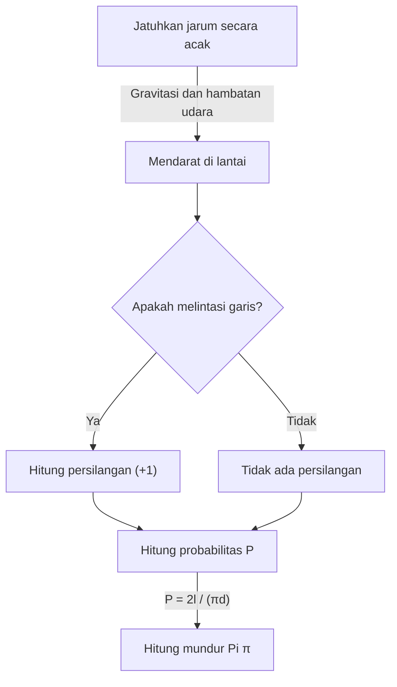

# Apa itu [Jarum Buffon](https://kenji.blog/id/p/buffons-needle/)?

Di dunia matematika, ada banyak teorema indah di mana fakta mengejutkan yang berlawanan dengan intuisi atau peristiwa yang tampaknya tidak berhubungan terhubung dengan indah. Salah satu masalah yang paling terkenal dan menarik di antaranya adalah **masalah jarum Buffon**.

Masalah ini diusulkan pada tahun 1733 oleh Georges-Louis Leclerc, Comte de Buffon, seorang naturalis dan matematikawan Prancis abad ke-18, dan pertama kali dipecahkan pada tahun 1777.

Yang mengejutkan, masalah ini menyatakan bahwa melalui tindakan yang sangat fisik dan acak yaitu "menjatuhkan jarum secara acak di lantai", seseorang dapat menentukan salah satu konstanta terpenting dalam matematika, **Pi $\pi$**. Ini dikenal sebagai salah satu masalah paling awal dalam probabilitas geometris dan merupakan penemuan perintis yang dapat dikatakan sebagai pelopor metode Monte Carlo di kemudian hari.

Dalam artikel ini, kami akan menjelaskan secara rinci dan dengan cara yang mudah dipahami, mulai dari pengaturan masalah **[Jarum Buffon](https://kenji.blog/id/p/buffons-needle/)**, pembuktian matematisnya, hingga perkiraan Pi melalui simulasi menggunakan komputer modern.

## Pengaturan Dasar Masalah

Pengaturan masalah jarum Buffon sangat sederhana.

1. Di lantai yang datar, banyak garis lurus paralel digambar dengan jarak yang sama $d$.
2. Sebuah jarum tunggal dengan panjang $l$ disiapkan.
3. Jarum ini dijatuhkan secara acak di lantai.

Pada saat ini, **"Berapa probabilitas jarum yang dijatuhkan akan melintasi salah satu garis paralel yang digambar di lantai?"** adalah masalah yang diusulkan oleh Buffon.

Diagram berikut menunjukkan alur konseptual dari eksperimen ini.



Di sini, untuk menyederhanakan masalah, kami mempertimbangkan kasus **jarum pendek**, di mana panjang jarum $l$ kurang dari atau sama dengan jarak garis paralel $d$ ($l \le d$). Di bawah kondisi ini, jarum tidak akan pernah melintasi dua garis lurus atau lebih pada saat yang bersamaan.

## Pemodelan Matematis dan Derivasi Probabilitas

Untuk memecahkan masalah ini secara matematis, keadaan jarum perlu diukur (diparameterisasi). Ketika jarum jatuh ke lantai, kami berasumsi posisi dan orientasinya benar-benar acak.

Untuk menentukan posisi jarum, kami mendefinisikan dua variabel berikut.

1. $x$ : Jarak vertikal dari pusat jarum ke garis paralel terdekat.
2. $\theta$ : Sudut lancip (atau sudut siku-siku) yang dibentuk oleh jarum dan garis paralel.

### Rentang Variabel yang Memungkinkan

Pertama, mari pertimbangkan nilai apa yang dapat diambil setiap variabel.

- **Mengenai jarak $x$:** Pusat jarum jatuh di suatu tempat antara dua garis paralel yang berdekatan. Karena kita mempertimbangkan jarak ke garis terdekat, nilai minimum $x$ adalah $0$ (ketika pusat jarum berada di garis), dan nilai maksimumnya adalah $\frac{d}{2}$ (ketika pusat jarum tepat berada di tengah antara dua garis). Artinya, $0 \le x \le \frac{d}{2}$. Karena jarum dijatuhkan secara acak, $x$ mengikuti **distribusi seragam** dalam rentang ini. Fungsi kepadatan probabilitasnya adalah $\frac{2}{d}$.
- **Mengenai sudut $\theta$:** Sudut yang dibentuk oleh jarum dan garis paralel mengambil nilai dari $0$ ketika jarum sejajar dengan garis lurus, hingga $\frac{\pi}{2}$ (90 derajat) ketika tegak lurus. Dari simetri, tidak perlu mempertimbangkan sudut yang lebih besar dari ini. Oleh karena itu, $0 \le \theta \le \frac{\pi}{2}$. Karena orientasi jarum juga acak, $\theta$ juga mengikuti **distribusi seragam** dalam rentang ini. Fungsi kepadatan probabilitasnya adalah $\frac{2}{\pi}$.

Karena variabel $x$ dan $\theta$ independen satu sama lain, fungsi kepadatan probabilitas gabungan $f(x, \theta)$ bahwa mereka mengambil pasangan tertentu $(x, \theta)$ dinyatakan sebagai produk dari fungsi kepadatan probabilitas masing-masing.

$$
f(x, \theta) = \frac{2}{d} \times \frac{2}{\pi} = \frac{4}{d\pi}
$$

### Kondisi Persilangan

Selanjutnya, pertimbangkan kondisi agar jarum melintasi garis lurus.
Jarum melintasi garis lurus ketika panjang vertikal dari pusat jarum ke ujungnya lebih besar dari atau sama dengan jarak $x$ ke garis terdekat.

Karena panjang jarum adalah $l$, panjang dari pusat ke ujung adalah $\frac{l}{2}$.
Ketika sudutnya adalah $\theta$, jarak yang ditempati setengah jarum ini dalam arah vertikal (panjang yang diproyeksikan) adalah $\frac{l}{2} \sin \theta$.

Oleh karena itu, kondisi agar jarum melintasi garis lurus dinyatakan oleh pertidaksamaan berikut.

$$
x \le \frac{l}{2} \sin \theta
$$

### Perhitungan Probabilitas

Probabilitas $P$ bahwa jarum melintasi garis diperoleh dengan mengintegrasikan fungsi kepadatan probabilitas gabungan $f(x, \theta)$ atas wilayah yang memenuhi kondisi persilangan.

$$
P = \iint_{\text{Area perpotongan}} f(x, \theta) \, dx \, d\theta
$$

Rentang integrasi spesifik adalah di mana $\theta$ berubah dari $0$ hingga $\frac{\pi}{2}$, dan $x$ berubah dari $0$ hingga nilai batas persilangan $\frac{l}{2} \sin \theta$.

$$
P = \int_{0}^{\frac{\pi}{2}} \int_{0}^{\frac{l}{2} \sin \theta} \frac{4}{d\pi} \, dx \, d\theta
$$

Pertama, kita menghitung integral dalam terhadap $x$.

$$
\int_{0}^{\frac{l}{2} \sin \theta} \frac{4}{d\pi} \, dx = \frac{4}{d\pi} \left[ x \right]_{0}^{\frac{l}{2} \sin \theta} = \frac{4}{d\pi} \left( \frac{l}{2} \sin \theta - 0 \right) = \frac{2l}{d\pi} \sin \theta
$$

Selanjutnya, kita menghitung integral luar terhadap $\theta$.

$$
P = \int_{0}^{\frac{\pi}{2}} \frac{2l}{d\pi} \sin \theta \, d\theta = \frac{2l}{d\pi} \int_{0}^{\frac{\pi}{2}} \sin \theta \, d\theta
$$

Karena integral dari $\sin \theta$ adalah $-\cos \theta$,

$$
\int_{0}^{\frac{\pi}{2}} \sin \theta \, d\theta = \left[ -\cos \theta \right]_{0}^{\frac{\pi}{2}} = (-\cos \frac{\pi}{2}) - (-\cos 0) = -0 - (-1) = 1
$$

Oleh karena itu, probabilitas yang dibutuhkan $P$ adalah sebagai berikut.

$$
P = \frac{2l}{d\pi} \times 1 = \frac{2l}{\pi d}
$$

Ini adalah rumus dasar **[Jarum Buffon](https://kenji.blog/id/p/buffons-needle/)**. Probabilitas bahwa jarum melintasi garis adalah dua kali panjang jarum $l$, dibagi dengan produk Pi $\pi$ dan jarak antar garis $d$.

## Memperkirakan Pi (Metode Monte Carlo)

Rumus yang diturunkan $P = \frac{2l}{\pi d}$ dengan indah mencakup $\pi$. Memecahkan ini untuk $\pi$ memberikan yang berikut.

$$
\pi = \frac{2l}{P d}
$$

Persamaan ini berarti bahwa jika hanya probabilitas $P$ yang diketahui, Pi $\pi$ dapat dihitung. Tentu saja, probabilitas sejati $P$ tidak dapat diketahui tanpa percobaan dalam jumlah tak terbatas, tetapi dengan menjatuhkan jarum berkali-kali dalam eksperimen yang sebenarnya, nilai perkiraan $P$ dapat diperoleh.

Misalkan $N$ menjadi jumlah total jarum yang dijatuhkan, dan $C$ menjadi jumlah jarum yang melintasi garis.
Jika jumlah percobaan $N$ cukup besar, menurut hukum bilangan besar, probabilitas empiris $\frac{C}{N}$ mendekati probabilitas teoritis $P$.

$$
P \approx \frac{C}{N}
$$

Mengganti ini ke dalam persamaan sebelumnya memberikan rumus untuk menemukan nilai perkiraan Pi $\pi$.

$$
\pi \approx \frac{2l \cdot N}{C \cdot d}
$$

Perhitungan termudah adalah ketika panjang jarum $l$ dan jarak garis $d$ sama ($l = d$). Pada saat ini, rumus menjadi lebih sederhana.

$$
\pi \approx \frac{2N}{C}
$$

Dengan kata lain, cukup bagi dua kali "jumlah jarum yang dijatuhkan" dengan "jumlah jarum yang melintas", dan Pi diperoleh!

### Simulasi dengan Python

Menjatuhkan jarum ribuan kali dengan tangan adalah tugas yang sangat melelahkan (walaupun secara historis, ada matematikawan yang benar-benar melakukan eksperimen ribuan kali). Saat ini, kita dapat dengan mudah mensimulasikan eksperimen ini menggunakan komputer.

Di bawah ini adalah contoh kode sederhana menggunakan Python untuk mensimulasikan eksperimen jarum Buffon dan memperkirakan Pi.

```python
import random
import math

def buffons_needle_simulation(num_trials, l, d):
    """
    Sebuah fungsi untuk mensimulasikan jarum Buffon dan memperkirakan Pi
    
    :param num_trials: Jumlah jarum yang dijatuhkan
    :param l: Panjang jarum
    :param d: Jarak garis paralel
    :return: Perkiraan Pi
    """
    crosses = 0
    
    for _ in range(num_trials):
        # Hasilkan secara acak jarak x dari pusat jarum ke garis terdekat (0 hingga d/2)
        x = random.uniform(0, d / 2.0)
        
        # Hasilkan secara acak sudut theta dari jarum (0 hingga pi/2)
        theta = random.uniform(0, math.pi / 2.0)
        
        # Periksa apakah kondisi persilangan terpenuhi
        if x <= (l / 2.0) * math.sin(theta):
            crosses += 1
            
    # Penanganan pengecualian untuk menghindari kesalahan jika tidak pernah melintas
    if crosses == 0:
        return float('inf')
        
    # Perhitungan perkiraan Pi
    estimated_pi = (2.0 * l * num_trials) / (d * crosses)
    return estimated_pi

# Pengaturan parameter
N = 1000000  # Jumlah percobaan (1 juta kali)
needle_length = 1.0
line_distance = 1.0

# Jalankan simulasi
estimated_pi = buffons_needle_simulation(N, needle_length, line_distance)

print(f"Jumlah percobaan: {N:,} kali")
print(f"Perkiraan Pi:     {estimated_pi}")
print(f"Pi sebenarnya:    {math.pi}")
print(f"Kesalahan:        {abs(math.pi - estimated_pi)}")
```

Menjalankan kode ini menjatuhkan sejumlah besar jarum virtual menggunakan angka acak, dan dapat dikonfirmasi bahwa nilai perkiraan Pi sebesar $3.1415...$ diperoleh dengan akurasi yang sangat tinggi. Metode menggunakan angka acak untuk menemukan solusi perkiraan untuk masalah probabilistik dengan cara ini disebut **metode Monte Carlo**.

## Ringkasan

[Jarum Buffon](https://kenji.blog/id/p/buffons-needle/) sekilas tampak hanya permainan peluang fisik, tetapi ada teori matematika yang kuat di baliknya. Cara peristiwa acak (probabilitas), bentuk geometris (garis dan segmen garis), dan bilangan irasional pamungkas $\pi$ bergabung menjadi satu rumus matematika sederhana mewujudkan keindahan matematika.

Juga, masalah ini memiliki kepentingan sejarah sebagai asal dari metode Monte Carlo, yang sangat diperlukan untuk ilmu pengetahuan dan teknologi modern. Mensimulasikan sistem yang kompleks dan menghitung integral yang sulit dipecahkan secara analitis, gagasan Buffon masih mendukung dunia kita dalam berbagai bentuk saat ini.

Mengapa tidak menyiapkan kertas, pena, dan beberapa tusuk gigi, dan rasakan sebagian dari sejarah matematika yang hebat ini di rumah?
