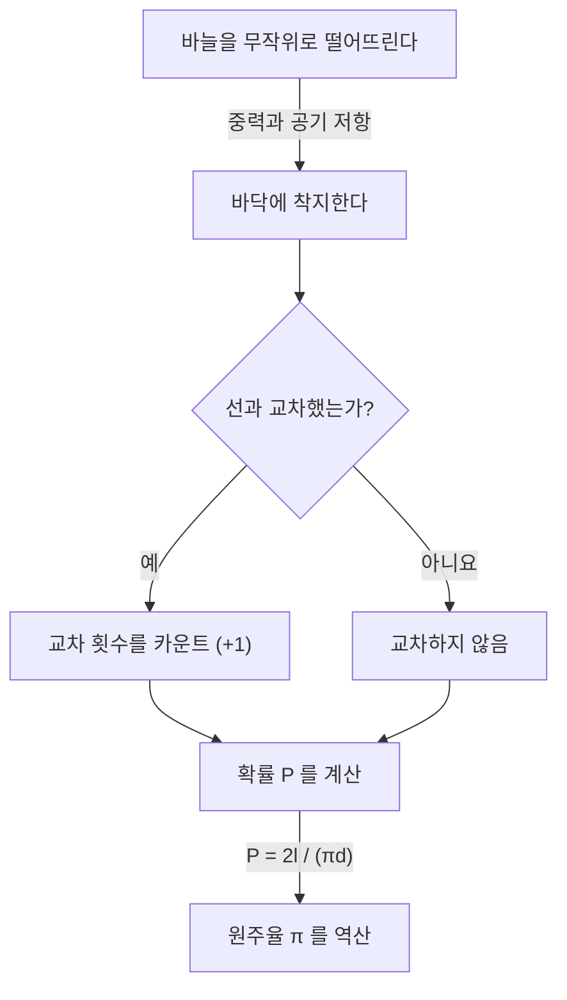

# 뷔퐁의 바늘이란?

수학의 세계에는 직관에 반하는 놀라운 사실이나, 일견 무관해 보이는 현상들이 훌륭하게 결합하는 아름다운 정리들이 많이 존재합니다. 그중에서도 특히 유명하고 매력적인 문제 중 하나가 **'뷔퐁의 바늘'** (Buffon's needle problem)입니다.

이 문제는 18세기 프랑스의 박물학자이자 수학자이기도 했던 조르주루이 르클레르 드 뷔퐁 백작(Georges-Louis Leclerc, Comte de Buffon)에 의해 1733년에 제기되었고, 1777년에 처음으로 해결되었습니다.

놀랍게도, 이 문제는 '바닥에 무작위로 바늘을 떨어뜨린다'는 지극히 물리적이고 무작위적인 행위를 통해, 수학에서 가장 중요한 상수 중 하나인 **원주율 $\pi$** 를 구할 수 있다는 것입니다. 이는 기하학적 확률론(Geometric probability)에 있어서 가장 초기의 문제 중 하나로 알려져 있으며, 후의 몬테카를로 방법(Monte Carlo method)의 선구자라고도 할 수 있는 획기적인 발견이었습니다.

본 기사에서는 이 **뷔퐁의 바늘** 의 문제 설정부터 그 수학적 증명, 그리고 현대의 컴퓨터를 이용한 시뮬레이션에 의한 원주율 추정까지 상세하고 알기 쉽게 해설해 나갈 것입니다.

## 문제의 기본적인 설정

뷔퐁의 바늘 문제 설정은 매우 단순합니다.

1. 평평한 바닥 위에, 같은 간격 $d$ 로 평행한 직선들이 많이 그어져 있습니다.
2. 길이 $l$ 의 바늘 하나를 준비합니다.
3. 이 바늘을 바닥을 향해 무작위로(랜덤하게) 떨어뜨립니다.

이때, **"떨어진 바늘이 바닥에 그어진 평행선 중 하나와 교차할 확률은 얼마인가?"** 라는 것이 뷔퐁이 제기한 문제입니다.

다음 다이어그램은 이 실험의 개념적인 흐름을 보여줍니다.



여기에서는 문제를 간단하게 하기 위해, 바늘의 길이 $l$ 이 평행선의 간격 $d$ 보다 짧거나 같은($l \le d$) **짧은 바늘** 의 경우를 생각합니다. 이 조건 하에서는 바늘이 동시에 2개 이상의 직선과 교차하는 일은 없습니다.

## 수학적인 모델링과 확률의 도출

이 문제를 수학적으로 풀기 위해서는 바늘의 상태를 수치화(매개변수화)할 필요가 있습니다. 바늘이 바닥에 떨어졌을 때, 그 위치와 방향은 완전히 무작위라고 가정합니다.

바늘의 위치를 결정하기 위해 다음 두 가지 변수를 정의합니다.

1. $x$ : 바늘의 중심에서 가장 가까운 평행선까지의 수직 거리.
2. $\theta$ : 바늘과 평행선이 이루는 예각(또는 직각).

### 변수가 가질 수 있는 범위

먼저, 각각의 변수가 어떤 값을 가질 수 있는지 생각해 봅시다.

- **거리 $x$ 에 대해:** 바늘의 중심은 인접한 두 평행선 사이의 어딘가에 떨어집니다. 가장 가까운 선까지의 거리를 생각하기 때문에, $x$ 의 최솟값은 $0$ (바늘의 중심이 선 위에 있는 경우), 최댓값은 $\frac{d}{2}$ (바늘의 중심이 두 선의 정확히 중간에 있는 경우)가 됩니다. 즉, $0 \le x \le \frac{d}{2}$ 입니다. 바늘을 무작위로 떨어뜨리기 때문에, $x$ 는 이 범위에서 **균등 분포** 를 따릅니다. 확률 밀도 함수는 $\frac{2}{d}$ 가 됩니다.
- **각도 $\theta$ 에 대해:** 바늘과 평행선이 이루는 각도는 바늘이 직선과 평행한 경우의 $0$ 부터, 수직인 경우의 $\frac{\pi}{2}$ (90도)까지의 값을 가집니다. 대칭성에 의해 이보다 큰 각도를 생각할 필요는 없습니다. 따라서 $0 \le \theta \le \frac{\pi}{2}$ 입니다. 바늘의 방향 또한 무작위이므로, $\theta$ 도 이 범위에서 **균등 분포** 를 따릅니다. 확률 밀도 함수는 $\frac{2}{\pi}$ 가 됩니다.

변수 $x$ 와 $\theta$ 는 서로 독립이므로, 이들이 특정 쌍 $(x, \theta)$ 를 가질 결합 확률 밀도 함수 $f(x, \theta)$ 는 각각의 확률 밀도 함수의 곱으로 표현됩니다.

$$
f(x, \theta) = \frac{2}{d} \times \frac{2}{\pi} = \frac{4}{d\pi}
$$

### 교차할 조건

다음으로, 바늘이 직선과 교차하기 위한 조건을 생각합니다.
바늘이 직선과 교차하는 것은 바늘의 중심에서 끝까지의 수직 방향 길이가, 가장 가까운 선까지의 거리 $x$ 이상인 경우입니다.

바늘의 길이는 $l$ 이므로, 중심에서 끝까지의 길이는 $\frac{l}{2}$ 입니다.
각도가 $\theta$ 일 때, 이 절반의 바늘이 수직 방향으로 차지하는 거리(투영된 길이)는 $\frac{l}{2} \sin \theta$ 가 됩니다.

따라서 바늘이 직선과 교차할 조건은 다음 부등식으로 표현됩니다.

$$
x \le \frac{l}{2} \sin \theta
$$

### 확률의 계산

바늘이 선과 교차할 확률 $P$ 는, 교차 조건을 만족하는 영역에 대해 결합 확률 밀도 함수 $f(x, \theta)$ 를 적분함으로써 구할 수 있습니다.

$$
P = \iint_{\text{교차 영역}} f(x, \theta) \, dx \, d\theta
$$

구체적인 적분 범위는, $\theta$ 가 $0$ 에서 $\frac{\pi}{2}$ 까지 변하고, $x$ 가 $0$ 에서 교차의 한곗값 $\frac{l}{2} \sin \theta$ 까지 변하는 범위가 됩니다.

$$
P = \int_{0}^{\frac{\pi}{2}} \int_{0}^{\frac{l}{2} \sin \theta} \frac{4}{d\pi} \, dx \, d\theta
$$

먼저, 안쪽의 $x$ 에 대한 적분을 계산합니다.

$$
\int_{0}^{\frac{l}{2} \sin \theta} \frac{4}{d\pi} \, dx = \frac{4}{d\pi} \left[ x \right]_{0}^{\frac{l}{2} \sin \theta} = \frac{4}{d\pi} \left( \frac{l}{2} \sin \theta - 0 \right) = \frac{2l}{d\pi} \sin \theta
$$

다음으로, 바깥쪽의 $\theta$ 에 대한 적분을 계산합니다.

$$
P = \int_{0}^{\frac{\pi}{2}} \frac{2l}{d\pi} \sin \theta \, d\theta = \frac{2l}{d\pi} \int_{0}^{\frac{\pi}{2}} \sin \theta \, d\theta
$$

$\sin \theta$ 의 적분은 $-\cos \theta$ 이므로,

$$
\int_{0}^{\frac{\pi}{2}} \sin \theta \, d\theta = \left[ -\cos \theta \right]_{0}^{\frac{\pi}{2}} = (-\cos \frac{\pi}{2}) - (-\cos 0) = -0 - (-1) = 1
$$

따라서, 구하고자 하는 확률 $P$ 는 다음과 같이 됩니다.

$$
P = \frac{2l}{d\pi} \times 1 = \frac{2l}{\pi d}
$$

이것이 **뷔퐁의 바늘** 의 기본적인 공식입니다. 바늘이 선과 교차할 확률은, 바늘의 길이 $l$ 의 2배를 원주율 $\pi$ 와 선의 간격 $d$ 의 곱으로 나눈 값이 됩니다.

## 원주율 π의 추정 (몬테카를로 방법)

도출된 공식 $P = \frac{2l}{\pi d}$ 에는 훌륭하게도 $\pi$ 가 포함되어 있습니다. 이것을 $\pi$ 에 대해 다시 풀면 다음과 같습니다.

$$
\pi = \frac{2l}{P d}
$$

이 식은, 확률 $P$ 만 알면 원주율 $\pi$ 를 계산할 수 있다는 것을 의미합니다. 물론 진정한 확률 $P$ 는 무한 번의 시행을 하지 않으면 알 수 없지만, 실제 실험에서 바늘을 여러 번 떨어뜨림으로써 $P$ 의 근삿값을 얻을 수 있습니다.

바늘을 떨어뜨린 총 횟수를 $N$ , 그중 바늘이 선과 교차한 횟수를 $C$ 라고 합니다.
시행 횟수 $N$ 이 충분히 클 경우, 대수의 법칙에 의해 경험적 확률 $\frac{C}{N}$ 은 이론적인 확률 $P$ 에 가까워집니다.

$$
P \approx \frac{C}{N}
$$

이것을 앞의 식에 대입하면 원주율 $\pi$ 의 근삿값을 구하는 공식을 얻을 수 있습니다.

$$
\pi \approx \frac{2l \cdot N}{C \cdot d}
$$

가장 계산이 간단해지는 것은 바늘의 길이 $l$ 과 선의 간격 $d$ 를 같게 한 경우($l = d$)입니다. 이때 식은 더욱 단순해집니다.

$$
\pi \approx \frac{2N}{C}
$$

즉, '바늘을 떨어뜨린 횟수'의 2배를 '교차한 횟수'로 나누기만 하면 원주율이 구해지는 것입니다!

### Python을 이용한 시뮬레이션

실제로 손으로 바늘을 수천 번이나 떨어뜨리는 것은 매우 뼈빠지는 작업입니다 (역사상으로는 실제로 수천 번의 실험을 수행한 수학자도 존재하지만). 현대에는 컴퓨터를 사용하여 이 실험을 쉽게 시뮬레이션할 수 있습니다.

아래에 Python을 이용하여 뷔퐁의 바늘 실험을 시뮬레이션하고 원주율을 추정하는 간단한 코드 예를 보여줍니다.

```python
import random
import math

def buffons_needle_simulation(num_trials, l, d):
    """
    뷔퐁의 바늘 시뮬레이션을 수행하고, 원주율을 추정하는 함수

    :param num_trials: 바늘을 떨어뜨리는 횟수
    :param l: 바늘의 길이
    :param d: 평행선의 간격
    :return: 추정된 원주율
    """
    crosses = 0
    
    for _ in range(num_trials):
        # 바늘의 중심에서 가장 가까운 선까지의 거리 x를 무작위로 생성 (0 에서 d/2)
        x = random.uniform(0, d / 2.0)
        
        # 바늘의 각도 theta를 무작위로 생성 (0 에서 pi/2)
        theta = random.uniform(0, math.pi / 2.0)
        
        # 교차 조건을 만족하는지 체크
        if x <= (l / 2.0) * math.sin(theta):
            crosses += 1
            
    # 한 번도 교차하지 않는 경우는 오류를 피하기 위해 예외 처리
    if crosses == 0:
        return float('inf')
        
    # 원주율의 추정 계산
    estimated_pi = (2.0 * l * num_trials) / (d * crosses)
    return estimated_pi

# 파라미터 설정
N = 1000000  # 시행 횟수 (100만 번)
needle_length = 1.0
line_distance = 1.0

# 시뮬레이션 실행
estimated_pi = buffons_needle_simulation(N, needle_length, line_distance)

print(f"시행 횟수: {N:,} 번")
print(f"추정된 원주율: {estimated_pi}")
print(f"실제 원주율:     {math.pi}")
print(f"오차:             {abs(math.pi - estimated_pi)}")
```

이 코드를 실행하면 난수를 사용하여 대량의 가상 바늘이 떨어지며, 매우 높은 정밀도로 $3.1415...$ 라는 원주율의 근삿값을 얻을 수 있음을 확인할 수 있습니다. 이처럼 난수를 이용하여 확률적인 문제의 근사 해를 구하는 기법을 **몬테카를로 방법** 이라고 부릅니다.

## 요약

뷔퐁의 바늘은 언뜻 보면 단순한 물리적인 우연의 장난처럼 보이지만, 그 배후에는 확고한 수학적 이론이 존재합니다. 무작위 사건(확률)과 기하학적 형태(직선과 선분), 그리고 궁극의 무리수인 $\pi$ 가 하나의 단순한 수식 속에서 융합되는 모습은 수학의 아름다움을 구현하고 있다고 할 수 있을 것입니다.

또한, 이 문제는 현대 과학 기술에 불가결한 몬테카를로 방법의 원점으로서도 역사적인 중요성을 가지고 있습니다. 복잡한 계의 시뮬레이션이나, 해석적으로 풀기 어려운 적분의 계산 등, 오늘날에도 뷔퐁의 아이디어는 다양한 형태로 우리의 세계를 지탱하고 있는 것입니다.

종이와 펜, 그리고 몇 개의 이쑤시개를 준비해서 집에서도 이 위대한 수학의 역사 일부를 체험해 보는 것은 어떨까요?
