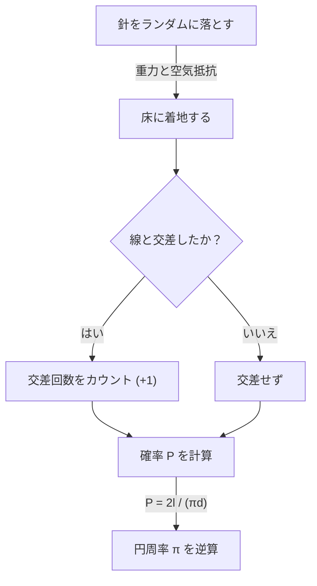

# [ビュフォンの針](https://kenji.blog/p/buffons-needle/)とは？

数学の世界には、直感に反するような驚くべき事実や、一見無関係に思える事象が見事に結びつく美しい定理が数多く存在します。その中でも特に有名で、かつ魅力的な問題の一つが **「[ビュフォンの針](https://kenji.blog/p/buffons-needle/)」** （Buffon's needle problem）です。

この問題は、18世紀のフランスの博物学者であり数学者でもあったジョルジュ＝ルイ・ルクレール、ビュフォン伯爵（Georges-Louis Leclerc, Comte de Buffon）によって1733年に提起され、1777年に初めて解決されました。

驚くべきことに、この問題は「床に無作為に針を落とす」という極めて物理的でランダムな行為を通じて、数学の最も重要な定数の一つである **円周率 $\pi$** を求めることができるというものです。これは幾何学的確率論（Geometric probability）における最も初期の問題の一つとして知られており、後のモンテカルロ法（Monte Carlo method）の先駆けとも言える画期的な発見でした。

本記事では、この **[ビュフォンの針](https://kenji.blog/p/buffons-needle/)** の問題設定から、その数学的な証明、そして現代のコンピュータを用いたシミュレーションによる円周率の推定まで、詳細かつ分かりやすく解説していきます。

## 問題の基本的な設定

[ビュフォンの針](https://kenji.blog/p/buffons-needle/)の問題設定は非常にシンプルです。

1. 平らな床の上に、等間隔 $d$ で平行な直線が多数引かれています。
2. 長さ $l$ の一本の針を用意します。
3. この針を床に向かってランダムに（無作為に）落とします。

このとき、**「落ちた針が、床に引かれた平行線のいずれかと交差する確率はいくつか？」** というのが、ビュフォンが提起した問題です。

以下のダイアグラムは、この実験の概念的な流れを示しています。



ここでは、問題を簡単にするために、針の長さ $l$ は平行線の間隔 $d$ よりも短いか等しい（$l \le d$）という **短い針** のケースを考えます。この条件の下では、針が同時に2本以上の直線と交差することはありません。

## 数学的なモデル化と確率の導出

この問題を数学的に解くためには、針の状態を数値化（パラメータ化）する必要があります。針が床に落ちたとき、その位置と向きは完全にランダムであると仮定します。

針の位置を決定するために、以下の2つの変数を定義します。

1. $x$ : 針の中心から、最も近い平行線までの垂直距離。
2. $\theta$ : 針と平行線がなす鋭角（または直角）。

### 変数の取り得る範囲

まず、それぞれの変数がどのような値を取り得るかを考えます。

- **距離 $x$ について:** 針の中心は、隣り合う2本の平行線の間のどこかに落ちます。最も近い線までの距離を考えるため、$x$ の最小値は $0$ （針の中心が線上の場合）、最大値は $\frac{d}{2}$ （針の中心が2本の線のちょうど中間にある場合）となります。つまり、 $0 \le x \le \frac{d}{2}$ です。針をランダムに落とすため、$x$ はこの範囲で **一様分布** に従います。確率密度関数は $\frac{2}{d}$ となります。
- **角度 $\theta$ について:** 針と平行線がなす角度は、針が直線と平行な場合の $0$ から、垂直な場合の $\frac{\pi}{2}$ （90度）までの値を取ります。対称性から、これ以上の角度を考える必要はありません。したがって、$0 \le \theta \le \frac{\pi}{2}$ です。針の向きもランダムであるため、$\theta$ もこの範囲で **一様分布** に従います。確率密度関数は $\frac{2}{\pi}$ となります。

変数 $x$ と $\theta$ は互いに独立であるため、これらが特定の組 $(x, \theta)$ を取る結合確率密度関数 $f(x, \theta)$ は、それぞれの確率密度関数の積で表されます。

$$
f(x, \theta) = \frac{2}{d} \times \frac{2}{\pi} = \frac{4}{d\pi}
$$

### 交差する条件

次に、針が直線と交差するための条件を考えます。
針が直線と交差するのは、針の中心から端までの垂直方向の長さが、最も近い線までの距離 $x$ 以上である場合です。

針の長さは $l$ なので、中心から端までの長さは $\frac{l}{2}$ です。
角度が $\theta$ のとき、この半分の針が垂直方向に占める距離（射影された長さ）は $\frac{l}{2} \sin \theta$ となります。

したがって、針が直線と交差する条件は以下の不等式で表されます。

$$
x \le \frac{l}{2} \sin \theta
$$

### 確率の計算

針が線と交差する確率 $P$ は、交差条件を満たす領域について、結合確率密度関数 $f(x, \theta)$ を積分することで求められます。

$$
P = \iint_{\text{交差領域}} f(x, \theta) \, dx \, d\theta
$$

具体的な積分の範囲は、$\theta$ が $0$ から $\frac{\pi}{2}$ まで変化し、$x$ が $0$ から交差の限界値 $\frac{l}{2} \sin \theta$ まで変化する範囲となります。

$$
P = \int_{0}^{\frac{\pi}{2}} \int_{0}^{\frac{l}{2} \sin \theta} \frac{4}{d\pi} \, dx \, d\theta
$$

まず、内側の $x$ についての積分を計算します。

$$
\int_{0}^{\frac{l}{2} \sin \theta} \frac{4}{d\pi} \, dx = \frac{4}{d\pi} \left[ x \right]_{0}^{\frac{l}{2} \sin \theta} = \frac{4}{d\pi} \left( \frac{l}{2} \sin \theta - 0 \right) = \frac{2l}{d\pi} \sin \theta
$$

次に、外側の $\theta$ についての積分を計算します。

$$
P = \int_{0}^{\frac{\pi}{2}} \frac{2l}{d\pi} \sin \theta \, d\theta = \frac{2l}{d\pi} \int_{0}^{\frac{\pi}{2}} \sin \theta \, d\theta
$$

$\sin \theta$ の積分は $-\cos \theta$ ですので、

$$
\int_{0}^{\frac{\pi}{2}} \sin \theta \, d\theta = \left[ -\cos \theta \right]_{0}^{\frac{\pi}{2}} = (-\cos \frac{\pi}{2}) - (-\cos 0) = -0 - (-1) = 1
$$

したがって、求める確率 $P$ は次のようになります。

$$
P = \frac{2l}{d\pi} \times 1 = \frac{2l}{\pi d}
$$

これが **[ビュフォンの針](https://kenji.blog/p/buffons-needle/)** の基本的な公式です。針が線と交差する確率は、針の長さ $l$ の2倍を、円周率 $\pi$ と線の間隔 $d$ の積で割った値になります。

## 円周率 π の推定（モンテカルロ法）

導出された公式 $P = \frac{2l}{\pi d}$ には、見事に $\pi$ が含まれています。これを $\pi$ について解き直すと、次のようになります。

$$
\pi = \frac{2l}{P d}
$$

この式は、確率 $P$ さえ分かれば、円周率 $\pi$ を計算できることを意味しています。もちろん、真の確率 $P$ は無限回の試行を行わないと分かりませんが、実際の実験で針を多数回落とすことで、$P$ の近似値を得ることができます。

針を落とした総回数を $N$ 、そのうち針が線と交差した回数を $C$ とします。
試行回数 $N$ が十分に大きい場合、[大数の法則](https://kenji.blog/p/law-of-large-numbers/)により、経験的確率 $\frac{C}{N}$ は理論的な確率 $P$ に近づきます。

$$
P \approx \frac{C}{N}
$$

これを先ほどの式に代入すると、円周率 $\pi$ の近似値を求める公式が得られます。

$$
\pi \approx \frac{2l \cdot N}{C \cdot d}
$$

最も計算が簡単になるのは、針の長さ $l$ と線の間隔 $d$ を同じにした場合（$l = d$）です。このとき、式はさらに単純になります。

$$
\pi \approx \frac{2N}{C}
$$

つまり、「針を落とした回数」の2倍を「交差した回数」で割るだけで、円周率が求められるのです！

### Pythonによるシミュレーション

実際に手で針を何千回も落とすのは非常に骨が折れる作業です（歴史上には、実際に数千回の実験を行った数学者も存在しますが）。現代では、コンピュータを使ってこの実験を簡単にシミュレーションすることができます。

以下に、Pythonを用いて[ビュフォンの針](https://kenji.blog/p/buffons-needle/)の実験をシミュレーションし、円周率を推定する簡単なコード例を示します。

```python
import random
import math

def buffons_needle_simulation(num_trials, l, d):
    """
    ビュフォンの針のシミュレーションを行い、円周率を推定する関数

    :param num_trials: 針を落とす回数
    :param l: 針の長さ
    :param d: 平行線の間隔
    :return: 推定された円周率
    """
    crosses = 0
    
    for _ in range(num_trials):
        # 針の中心から最も近い線までの距離 x をランダムに生成 (0 から d/2)
        x = random.uniform(0, d / 2.0)
        
        # 針の角度 theta をランダムに生成 (0 から pi/2)
        theta = random.uniform(0, math.pi / 2.0)
        
        # 交差条件を満たすかチェック
        if x <= (l / 2.0) * math.sin(theta):
            crosses += 1
            
    # 一度も交差しない場合はエラーを避けるために例外処理
    if crosses == 0:
        return float('inf')
        
    # 円周率の推定計算
    estimated_pi = (2.0 * l * num_trials) / (d * crosses)
    return estimated_pi

# パラメータの設定
N = 1000000  # 試行回数 (100万回)
needle_length = 1.0
line_distance = 1.0

# シミュレーションの実行
estimated_pi = buffons_needle_simulation(N, needle_length, line_distance)

print(f"試行回数: {N:,} 回")
print(f"推定された円周率: {estimated_pi}")
print(f"実際の円周率:     {math.pi}")
print(f"誤差:             {abs(math.pi - estimated_pi)}")
```

このコードを実行すると、乱数を用いて大量の仮想的な針が落とされ、非常に高い精度で $3.1415...$ という円周率の近似値が得られることが確認できます。このように、乱数を用いて確率的な問題の近似解を求める手法を **モンテカルロ法** と呼びます。

## まとめ

[ビュフォンの針](https://kenji.blog/p/buffons-needle/)は、一見すると単なる物理的な偶然の遊びのように思えますが、その背後には確固たる数学的理論が存在しています。ランダムな事象（確率）と、幾何学的な形状（直線と線分）、そして究極の無理数である $\pi$ が一つのシンプルな数式の中で融合する様は、数学の美しさを体現していると言えるでしょう。

また、この問題は現代の科学技術に不可欠なモンテカルロ法の原点としても歴史的な重要性を持っています。複雑な系のシミュレーションや、解析的に解くのが難しい積分の計算など、今日でもビュフォンのアイデアは様々な形で私たちの世界を支えているのです。

ぜひ、紙とペン、そして数本の爪楊枝を用意して、ご自宅でもこの偉大な数学の歴史の一部を体験してみてはいかがでしょうか。
