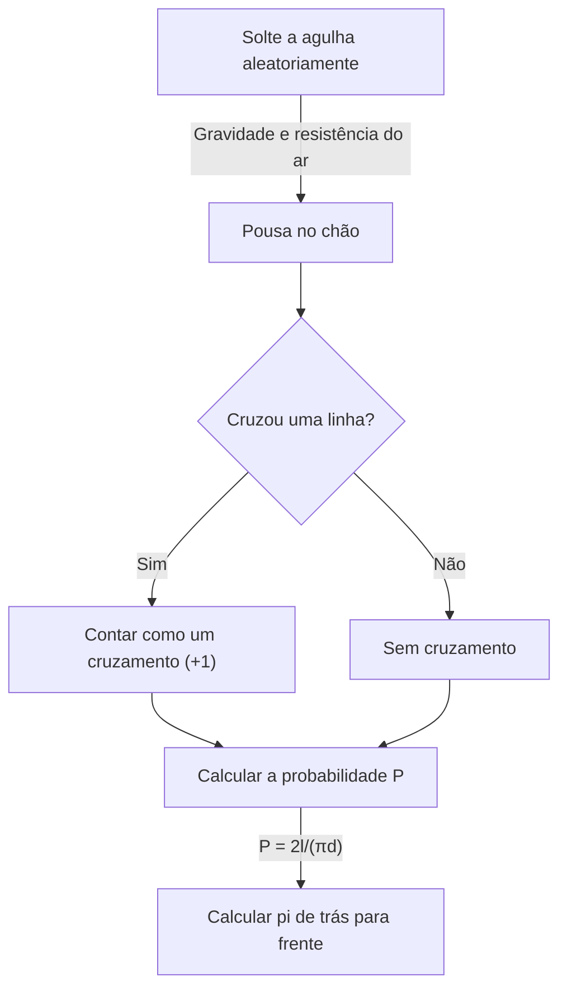

# O que é a agulha de Buffon?

O mundo da matemática contém muitos fatos surpreendentes que desafiam a intuição e belos teoremas que conectam brilhantemente fenômenos aparentemente não relacionados. Entre os mais famosos e fascinantes desses problemas está **"Agulha de Buffon"** (problema da agulha de Buffon).

Este problema foi colocado em 1733 e resolvido pela primeira vez em 1777 por Georges-Louis Leclerc, conde de Buffon, um naturalista e matemático francês do século XVIII.

Notavelmente, este problema demonstra que uma das constantes mais importantes da matemática — **pi $\pi$** — pode ser determinada através do ato altamente físico e aleatório de “deixar cair uma agulha aleatoriamente no chão”. É conhecido como um dos primeiros problemas de probabilidade geométrica e foi uma descoberta inovadora que pode ser considerada um precursor do método de Monte Carlo.

Neste artigo, fornecemos uma explicação detalhada e acessível da **Agulha de Buffon**, cobrindo a configuração do problema, sua prova matemática e a estimativa de pi por meio de simulação usando computadores modernos.

## Configuração básica do problema

A configuração do problema da agulha de Buffon é notavelmente simples.

1. Num piso plano, numerosas linhas paralelas são desenhadas em intervalos iguais de $d$.
2. Uma única agulha de comprimento $l$ é preparada.
3. A agulha cai aleatoriamente no chão.

A questão colocada por Buffon foi: **"Qual é a probabilidade de a agulha caída cruzar uma das linhas paralelas desenhadas no chão?"**

O diagrama a seguir mostra o fluxo conceitual deste experimento.



Aqui, para simplificar o problema, consideramos o caso da **agulha curta** onde o comprimento da agulha $l$ é menor ou igual ao espaçamento entre linhas $d$ ($l \le d$). Nessa condição, a agulha nunca poderá cruzar mais de uma linha por vez.

## Modelagem Matemática e Derivação da Probabilidade

Para resolver este problema matematicamente, precisamos quantificar (parametrizar) o estado da agulha. Assumimos que a posição e a orientação da agulha quando ela pousa no chão são completamente aleatórias.

Para determinar a posição da agulha, definimos as duas variáveis ​​a seguir.

1. $x$: A distância perpendicular do centro da agulha até a linha paralela mais próxima.
2. $\theta$: O ângulo agudo (ou ângulo reto) entre a agulha e as linhas paralelas.

### Faixa de Variáveis

Primeiro, vamos considerar quais valores cada variável pode assumir.

- **Distância $x$:** O centro da agulha fica em algum lugar entre duas linhas paralelas adjacentes. Como consideramos a distância até a linha mais próxima, o valor mínimo de $x$ é $0$ (quando o centro da agulha está em uma linha) e o valor máximo é $\frac{d}{2}$ (quando o centro da agulha está exatamente no meio entre duas linhas). Ou seja, $0 \le x \le \frac{d}{2}$. Como a agulha cai aleatoriamente, $x$ segue uma **distribuição uniforme** nesse intervalo. A função de densidade de probabilidade é $\frac{2}{d}$.
- **Ângulo $\theta$:** O ângulo entre a agulha e as linhas paralelas varia de $0$ quando a agulha está paralela às linhas, a $\frac{\pi}{2}$ (90 graus) quando perpendicular. Por simetria, não precisamos considerar ângulos além disso. Portanto, $0 \le \theta \le \frac{\pi}{2}$. Como a orientação da agulha também é aleatória, $\theta$ segue uma **distribuição uniforme** nesse intervalo. A função de densidade de probabilidade é $\frac{2}{\pi}$.

Como as variáveis ​​$x$ e $\theta$ são independentes uma da outra, a função de densidade de probabilidade conjunta $f(x, \theta)$ para um par específico $(x, \theta)$ é expressa como o produto de suas funções de densidade de probabilidade individuais.

$$
f(x, \theta) = \frac{2}{d} \times \frac{2}{\pi} = \frac{4}{d\pi}
$$

### Condição de cruzamento

A seguir, consideremos a condição para a agulha cruzar uma linha.
A agulha cruza uma linha quando a extensão vertical do centro da agulha até a ponta é maior ou igual à distância $x$ até a linha mais próxima.

Como o comprimento da agulha é $l$, a distância do centro à ponta é $\frac{l}{2}$.
Quando o ângulo é $\theta$, a distância vertical ocupada por esta metade da agulha (o comprimento projetado) é $\frac{l}{2} \sin \theta$.

Portanto, a condição para a agulha cruzar uma linha é expressa pela seguinte desigualdade.

$$
x \le \frac{l}{2} \sin \theta
$$

### Calculando a probabilidade

A probabilidade $P$ de que a agulha cruze uma linha é obtida integrando a função de densidade de probabilidade conjunta $f(x, \theta)$ sobre a região que satisfaz a condição de cruzamento.

$$
P = \iint_{\text{crossing region}} f(x, \theta) \, dx \, d\theta
$$

Os limites de integração específicos são: $\theta$ varia de $0$ a $\frac{\pi}{2}$ e $x$ varia de $0$ ao limite de cruzamento $\frac{l}{2} \sin \theta$.

$$
P = \int_{0}^{\frac{\pi}{2}} \int_{0}^{\frac{l}{2} \sin \theta} \frac{4}{d\pi} \, dx \, d\theta
$$

Primeiro, calculamos a integral interna em relação a $x$.

$$
\int_{0}^{\frac{l}{2} \sin \theta} \frac{4}{d\pi} \, dx = \frac{4}{d\pi} \left[ x \right]_{0}^{\frac{l}{2} \sin \theta} = \frac{4}{d\pi} \left( \frac{l}{2} \sin \theta - 0 \right) = \frac{2l}{d\pi} \sin \theta
$$

A seguir, calculamos a integral externa em relação a $\theta$.

$$
P = \int_{0}^{\frac{\pi}{2}} \frac{2l}{d\pi} \sin \theta \, d\theta = \frac{2l}{d\pi} \int_{0}^{\frac{\pi}{2}} \sin \theta \, d\theta
$$

Como a integral de $\sin \theta$ é $-\cos \theta$,

$$
\int_{0}^{\frac{\pi}{2}} \sin \theta \, d\theta = \left[ -\cos \theta \right]_{0}^{\frac{\pi}{2}} = (-\cos \frac{\pi}{2}) - (-\cos 0) = -0 - (-1) = 1
$$

Portanto, a probabilidade desejada $P$ é a seguinte.

$$
P = \frac{2l}{d\pi} \times 1 = \frac{2l}{\pi d}
$$

Esta é a fórmula fundamental da **Agulha de Buffon**. A probabilidade de a agulha cruzar uma linha é igual a duas vezes o comprimento da agulha $l$ dividido pelo produto de pi $\pi$ e o espaçamento entre linhas $d$.

## Estimando Pi (Método Monte Carlo)

A fórmula derivada $P = \frac{2l}{\pi d}$ contém lindamente $\pi$. Resolvendo para $\pi$, obtemos:

$$
\pi = \frac{2l}{P d}
$$

Esta equação significa que se conhecermos a probabilidade $P$, podemos calcular pi $\pi$. É claro que a verdadeira probabilidade $P$ requer um número infinito de tentativas, mas deixando cair a agulha muitas vezes em um experimento real, podemos obter uma aproximação de $P$.

Seja $N$ o número total de quedas da agulha e $C$ o número de vezes que a agulha cruza uma linha.
Quando o número de tentativas $N$ é suficientemente grande, pela lei dos grandes números, a probabilidade empírica $\frac{C}{N}$ se aproxima da probabilidade teórica $P$.

$$
P \approx \frac{C}{N}
$$

Substituir isso na equação anterior nos dá uma fórmula para aproximar pi $\pi$.

$$
\pi \approx \frac{2l \cdot N}{C \cdot d}
$$

O cálculo mais simples ocorre quando o comprimento da agulha $l$ e o espaçamento entre linhas $d$ são iguais ($l = d$). Neste caso, a fórmula simplifica ainda mais.

$$
\pi \approx \frac{2N}{C}
$$

Em outras palavras, você pode encontrar pi simplesmente dividindo duas vezes o número de quedas da agulha pelo número de cruzamentos!

### Simulação Python

Deixar cair uma agulha milhares de vezes à mão é uma tarefa extremamente tediosa (embora, historicamente, tenha havido matemáticos que realmente realizaram milhares de experimentos desse tipo). Nos tempos modernos, podemos facilmente simular esta experiência usando um computador.

Abaixo está um exemplo simples de código Python que simula o experimento da agulha de Buffon e estima pi.

```python
import random
import math

def buffons_needle_simulation(num_trials, l, d):
    """
    Function to simulate Buffon's needle and estimate pi

    :param num_trials: Number of needle drops
    :param l: Length of the needle
    :param d: Spacing between parallel lines
    :return: Estimated value of pi
    """
    crosses = 0
    
    for _ in range(num_trials):
        # Randomly generate distance x from the needle's center to the nearest line (0 to d/2)
        x = random.uniform(0, d / 2.0)
        
        # Randomly generate needle angle theta (0 to pi/2)
        theta = random.uniform(0, math.pi / 2.0)
        
        # Check if the crossing condition is satisfied
        if x <= (l / 2.0) * math.sin(theta):
            crosses += 1
            
    # Exception handling to avoid errors when no crossings occur
    if crosses == 0:
        return float('inf')
        
    # Estimate pi
    estimated_pi = (2.0 * l * num_trials) / (d * crosses)
    return estimated_pi

# Parameter settings
N = 1000000  # Number of trials (1 million)
needle_length = 1.0
line_distance = 1.0

# Run the simulation
estimated_pi = buffons_needle_simulation(N, needle_length, line_distance)

print(f"Number of trials: {N:,}")
print(f"Estimated pi:     {estimated_pi}")
print(f"Actual pi:        {math.pi}")
print(f"Error:            {abs(math.pi - estimated_pi)}")
```

Quando você executa esse código, um grande número de agulhas virtuais é descartado usando números aleatórios, e você pode verificar que uma aproximação muito precisa de $3.1415...$ — o valor de pi — é obtida. Essa técnica de usar números aleatórios para encontrar soluções aproximadas para problemas probabilísticos é chamada de **método Monte Carlo**.

## Conclusão

À primeira vista, a agulha de Buffon pode parecer um mero jogo de azar físico, mas por trás dela está uma sólida teoria matemática. A forma como os eventos aleatórios (probabilidade), as formas geométricas (retas e segmentos de reta) e o número irracional final $\pi$ se fundem em uma fórmula simples realmente incorpora a beleza da matemática.

Além disso, este problema tem um significado histórico como a origem do método de Monte Carlo, que é indispensável para a ciência e a tecnologia modernas. Desde simulações de sistemas complexos até cálculos de integrais difíceis de resolver analiticamente, a ideia de Buffon continua a apoiar o nosso mundo de várias formas até hoje.

Por que não pegar um papel, uma caneta e alguns palitos de dente e vivenciar um pedaço dessa grande história da matemática em casa?
