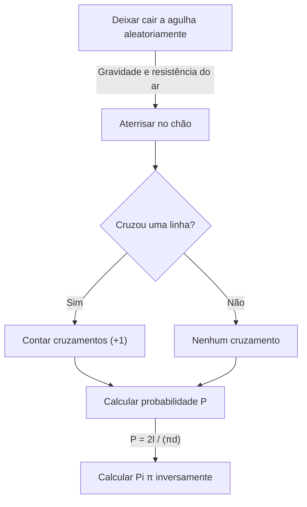

# O que é a Agulha de Buffon?

No mundo da matemática, existem muitos belos teoremas onde fatos surpreendentes que contrariam a intuição ou eventos aparentemente não relacionados se conectam de forma bela. Um dos problemas mais famosos e fascinantes entre eles é o **problema da agulha de Buffon**.

Este problema foi proposto em 1733 por Georges-Louis Leclerc, Conde de Buffon, um naturalista e matemático francês do século XVIII, e foi resolvido pela primeira vez em 1777.

Surpreendentemente, este problema afirma que através do ato extremamente físico e aleatório de "deixar cair uma agulha aleatoriamente no chão", pode-se determinar uma das constantes mais importantes da matemática, **Pi $\pi$**. Este é conhecido como um dos primeiros problemas de probabilidade geométrica e foi uma descoberta inovadora que pode ser considerada pioneira do método de Monte Carlo posterior.

Neste artigo, explicaremos em detalhes e de forma fácil de entender, desde a formulação do problema da **Agulha de Buffon**, sua prova matemática, até a estimativa de Pi por simulação usando computadores modernos.

## Configuração Básica do Problema

A configuração do problema da agulha de Buffon é muito simples.

1. Em um piso plano, muitas linhas retas paralelas são desenhadas em intervalos iguais $d$.
2. Uma única agulha de comprimento $l$ é preparada.
3. Esta agulha é solta aleatoriamente (ao acaso) no chão.

Neste momento, **"Qual é a probabilidade de que a agulha caída cruze uma das linhas paralelas desenhadas no chão?"** é o problema proposto por Buffon.

O diagrama a seguir mostra o fluxo conceitual deste experimento.



Aqui, para simplificar o problema, consideramos o caso de uma **agulha curta**, onde o comprimento da agulha $l$ é menor ou igual ao intervalo das linhas paralelas $d$ ($l \le d$). Sob esta condição, a agulha nunca cruzará duas ou mais linhas retas ao mesmo tempo.

## Modelagem Matemática e Derivação da Probabilidade

Para resolver este problema matematicamente, é necessário quantificar (parametrizar) o estado da agulha. Quando a agulha cai no chão, assumimos que sua posição e orientação são completamente aleatórias.

Para determinar a posição da agulha, definimos as seguintes duas variáveis.

1. $x$ : A distância vertical do centro da aguja até a linha paralela mais próxima.
2. $\theta$ : O ângulo agudo (ou ângulo reto) formado pela agulha e as linhas paralelas.

### Intervalo Possível de Variáveis

Primeiro, vamos considerar quais valores cada variável pode assumir.

- **Em relação à distância $x$:** O centro da agulha cai em algum lugar entre duas linhas paralelas adjacentes. Como consideramos a distância até a linha mais próxima, o valor mínimo de $x$ é $0$ (quando o centro da agulha está na linha), e o valor máximo é $\frac{d}{2}$ (quando o centro da agulha está exatamente no meio entre duas linhas). Ou seja, $0 \le x \le \frac{d}{2}$. Como a agulha é solta aleatoriamente, $x$ segue uma **distribuição uniforme** neste intervalo. A função densidade de probabilidade é $\frac{2}{d}$.
- **Em relação ao ângulo $\theta$:** O ângulo formado pela agulha e a linha paralela assume um valor de $0$ quando a agulha é paralela à linha reta, a $\frac{\pi}{2}$ (90 graus) quando é perpendicular. Por simetria, não há necessidade de considerar ângulos maiores que este. Portanto, $0 \le \theta \le \frac{\pi}{2}$. Como a orientação da agulha também é aleatória, $\theta$ também segue uma **distribuição uniforme** neste intervalo. A função densidade de probabilidade é $\frac{2}{\pi}$.

Como as variáveis $x$ e $\theta$ são independentes uma da outra, a função densidade de probabilidade conjunta $f(x, \theta)$ que elas assumem um par específico $(x, \theta)$ é expressa como o produto de suas respectivas funções densidade de probabilidade.

$$
f(x, \theta) = \frac{2}{d} \times \frac{2}{\pi} = \frac{4}{d\pi}
$$

### Condições de Cruzamento

Em seguida, considere as condições para que a agulha cruze uma linha reta.
A agulha cruza uma linha reta quando o comprimento vertical do centro da agulha até a extremidade é maior ou igual à distância $x$ até a linha mais próxima.

Como o comprimento da agulha é $l$, o comprimento do centro até a extremidade é $\frac{l}{2}$.
Quando o ângulo é $\theta$, a distância que essa metade da agulha ocupa na direção vertical (comprimento projetado) é $\frac{l}{2} \sin \theta$.

Portanto, a condição para que a agulha cruze uma linha reta é expressa pela seguinte desigualdade.

$$
x \le \frac{l}{2} \sin \theta
$$

### Cálculo da Probabilidade

A probabilidade $P$ de que a agulha cruze uma linha é obtida integrando a função densidade de probabilidade conjunta $f(x, \theta)$ sobre a região que satisfaz a condição de cruzamento.

$$
P = \iint_{\text{Área de interseção}} f(x, \theta) \, dx \, d\theta
$$

O intervalo específico de integração é onde $\theta$ muda de $0$ para $\frac{\pi}{2}$, e $x$ muda de $0$ para o valor limite de cruzamento $\frac{l}{2} \sin \theta$.

$$
P = \int_{0}^{\frac{\pi}{2}} \int_{0}^{\frac{l}{2} \sin \theta} \frac{4}{d\pi} \, dx \, d\theta
$$

Primeiro, calculamos a integral interna em relação a $x$.

$$
\int_{0}^{\frac{l}{2} \sin \theta} \frac{4}{d\pi} \, dx = \frac{4}{d\pi} \left[ x \right]_{0}^{\frac{l}{2} \sin \theta} = \frac{4}{d\pi} \left( \frac{l}{2} \sin \theta - 0 \right) = \frac{2l}{d\pi} \sin \theta
$$

Em seguida, calculamos a integral externa em relação a $\theta$.

$$
P = \int_{0}^{\frac{\pi}{2}} \frac{2l}{d\pi} \sin \theta \, d\theta = \frac{2l}{d\pi} \int_{0}^{\frac{\pi}{2}} \sin \theta \, d\theta
$$

Como a integral de $\sin \theta$ é $-\cos \theta$,

$$
\int_{0}^{\frac{\pi}{2}} \sin \theta \, d\theta = \left[ -\cos \theta \right]_{0}^{\frac{\pi}{2}} = (-\cos \frac{\pi}{2}) - (-\cos 0) = -0 - (-1) = 1
$$

Portanto, a probabilidade $P$ necessária é a seguinte.

$$
P = \frac{2l}{d\pi} \times 1 = \frac{2l}{\pi d}
$$

Esta é a fórmula básica da **Agulha de Buffon**. A probabilidade de que a agulha cruze uma linha é o dobro do comprimento da agulha $l$, dividido pelo produto de Pi $\pi$ e o intervalo das linhas $d$.

## Estimando Pi (Método de Monte Carlo)

A fórmula derivada $P = \frac{2l}{\pi d}$ inclui lindamente o $\pi$. Resolvendo isso para $\pi$ dá o seguinte.

$$
\pi = \frac{2l}{P d}
$$

Esta equação significa que se apenas a probabilidade $P$ for conhecida, Pi $\pi$ pode ser calculado. Claro, a verdadeira probabilidade $P$ não pode ser conhecida sem um número infinito de tentativas, mas ao deixar cair a agulha muitas vezes em um experimento real, um valor aproximado de $P$ pode ser obtido.

Seja $N$ o número total de vezes que a agulha é deixada cair, e $C$ o número de vezes que a agulha cruzou uma linha.
Se o número de tentativas $N$ for grande o suficiente, pela lei dos grandes números, a probabilidade empírica $\frac{C}{N}$ se aproxima da probabilidade teórica $P$.

$$
P \approx \frac{C}{N}
$$

Substituindo isso na equação anterior, obtém-se uma fórmula para encontrar o valor aproximado de Pi $\pi$.

$$
\pi \approx \frac{2l \cdot N}{C \cdot d}
$$

O cálculo mais fácil é quando o comprimento da agulha $l$ e o intervalo da linha $d$ são os mesmos ($l = d$). Neste momento, a fórmula torna-se ainda mais simples.

$$
\pi \approx \frac{2N}{C}
$$

Em outras palavras, simplesmente divida o dobro do "número de vezes que a agulha foi deixada cair" pelo "número de vezes que cruzou", e Pi é obtido!

### Simulação com Python

Deixar cair uma agulha milhares de vezes à mão é uma tarefa muito trabalhosa (embora historicamente, existam matemáticos que realmente conduziram experimentos milhares de vezes). Hoje, podemos facilmente simular este experimento usando um computador.

Abaixo está um exemplo de código simples usando Python para simular o experimento da agulha de Buffon e estimar Pi.

```python
import random
import math

def buffons_needle_simulation(num_trials, l, d):
    """
    Uma função para simular a agulha de Buffon e estimar Pi
    
    :param num_trials: Número de vezes que se deixa cair a agulha
    :param l: Comprimento da agulha
    :param d: Intervalo de linhas paralelas
    :return: Pi estimado
    """
    crosses = 0
    
    for _ in range(num_trials):
        # Gere aleatoriamente a distância x do centro da agulha até a linha mais próxima (0 a d/2)
        x = random.uniform(0, d / 2.0)
        
        # Gere aleatoriamente o ângulo theta da agulha (0 a pi/2)
        theta = random.uniform(0, math.pi / 2.0)
        
        # Verifique se a condição de cruzamento foi atendida
        if x <= (l / 2.0) * math.sin(theta):
            crosses += 1
            
    # Tratamento de exceção para evitar erros caso nunca cruze
    if crosses == 0:
        return float('inf')
        
    # Cálculo de estimativa do Pi
    estimated_pi = (2.0 * l * num_trials) / (d * crosses)
    return estimated_pi

# Configurações de parâmetros
N = 1000000  # Número de tentativas (1 milhão de vezes)
needle_length = 1.0
line_distance = 1.0

# Execute a simulação
estimated_pi = buffons_needle_simulation(N, needle_length, line_distance)

print(f"Número de tentativas: {N:,} vezes")
print(f"Pi estimado:          {estimated_pi}")
print(f"Pi real:              {math.pi}")
print(f"Erro:                 {abs(math.pi - estimated_pi)}")
```

Executar este código deixa cair um grande número de agulhas virtuais usando números aleatórios, e pode-se confirmar que um valor aproximado de Pi de $3.1415...$ é obtido com uma precisão muito alta. O método de usar números aleatórios para encontrar soluções aproximadas para problemas probabilísticos desta forma é chamado de **método de Monte Carlo**.

## Resumo

A agulha de Buffon parece à primeira vista ser um mero jogo de azar físico, mas há uma sólida teoria matemática por trás disso. A forma como eventos aleatórios (probabilidade), formas geométricas (linhas e segmentos de reta) e o derradeiro número irracional $\pi$ se fundem em uma única fórmula matemática simples incorpora a beleza da matemática.

Além disso, este problema tem importância histórica como a origem do método de Monte Carlo, que é indispensável para a ciência e tecnologia modernas. Simulando sistemas complexos e calculando integrais difíceis de resolver analiticamente, a ideia de Buffon ainda suporta nosso mundo de várias formas hoje.

Por que não preparar papel, uma caneta e alguns palitos de dente e experimentar uma parte dessa grande história matemática em casa?
