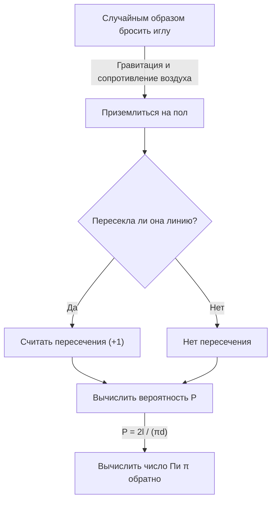

# Что такое [Игла Бюффона](https://kenji.blog/ru/p/buffons-needle/)?

В мире математики существует множество красивых теорем, в которых удивительным образом связываются факты, противоречащие интуиции, или казалось бы не связанные между собой события. Одной из самых известных и увлекательных задач среди них является **задача Бюффона о бросании иглы**.

Эта задача была предложена в 1733 году Жорж-Луи Леклерком, графом де Бюффоном, французским естествоиспытателем и математиком 18-го века, и впервые была решена в 1777 году.

Удивительно, но эта задача утверждает, что с помощью чисто физического и случайного действия — «случайного бросания иглы на пол» — можно определить одну из самых важных констант в математике, **число Пи $\pi$**. Это известно как одна из самых ранних задач геометрической вероятности и было новаторским открытием, которое можно назвать предшественником более позднего метода Монте-Карло.

В этой статье мы подробно и понятно объясним, начиная с постановки задачи **Иглы Бюффона**, её математического доказательства и заканчивая оценкой Пи путем симуляции с использованием современных компьютеров.

## Базовая постановка задачи

Постановка задачи об игле Бюффона очень проста.

1. На ровном полу начерчено множество параллельных прямых линий на равном расстоянии $d$.
2. Подготавливается одна игла длиной $l$.
3. Эту иглу случайным образом (наугад) бросают на пол.

В этот момент, **«Какова вероятность того, что брошенная игла пересечет одну из параллельных линий, начерченных на полу?»** — вот задача, предложенная Бюффоном.

Следующая диаграмма показывает концептуальный ход этого эксперимента.



Здесь, чтобы упростить задачу, мы рассматриваем случай **короткой иглы**, когда длина иглы $l$ меньше или равна расстоянию между параллельными линиями $d$ ($l \le d$). При этом условии игла никогда не пересечет две или более прямые линии одновременно.

## Математическое моделирование и вывод вероятности

Чтобы решить эту задачу математически, необходимо количественно оценить (параметризовать) состояние иглы. Мы предполагаем, что когда игла падает на пол, ее положение и ориентация совершенно случайны.

Для определения положения иглы мы вводим следующие две переменные.

1. $x$ : Расстояние по вертикали от центра иглы до ближайшей параллельной линии.
2. $\theta$ : Острый угол (или прямой угол), образованный иглой и параллельными линиями.

### Возможный диапазон переменных

Сначала давайте подумаем, какие значения может принимать каждая переменная.

- **Что касается расстояния $x$:** Центр иглы падает где-то между двумя соседними параллельными линиями. Поскольку мы рассматриваем расстояние до ближайшей линии, минимальное значение $x$ равно $0$ (когда центр иглы находится на линии), а максимальное значение равно $\frac{d}{2}$ (когда центр иглы находится точно посередине между двумя линиями). То есть, $0 \le x \le \frac{d}{2}$. Поскольку игла бросается случайным образом, $x$ следует **равномерному распределению** в этом диапазоне. Функция плотности вероятности равна $\frac{2}{d}$.
- **Что касается угла $\theta$:** Угол, образованный иглой и параллельной линией, принимает значение от $0$, когда игла параллельна прямой линии, до $\frac{\pi}{2}$ (90 градусов), когда она перпендикулярна. Из соображений симметрии нет необходимости рассматривать углы больше этого. Поэтому, $0 \le \theta \le \frac{\pi}{2}$. Поскольку ориентация иглы также случайна, $\theta$ также следует **равномерному распределению** в этом диапазоне. Функция плотности вероятности равна $\frac{2}{\pi}$.

Поскольку переменные $x$ и $\theta$ независимы друг от друга, совместная функция плотности вероятности $f(x, \theta)$ того, что они примут конкретную пару $(x, \theta)$, выражается как произведение их соответствующих функций плотности вероятности.

$$
f(x, \theta) = \frac{2}{d} \times \frac{2}{\pi} = \frac{4}{d\pi}
$$

### Условия пересечения

Далее рассмотрим условия, при которых игла пересекает прямую линию.
Игла пересекает прямую линию, когда длина по вертикали от центра иглы до её конца больше или равна расстоянию $x$ до ближайшей линии.

Поскольку длина иглы равна $l$, длина от центра до конца равна $\frac{l}{2}$.
Когда угол равен $\theta$, расстояние, которое эта половина иглы занимает в вертикальном направлении (проекция длины), равно $\frac{l}{2} \sin \theta$.

Поэтому условие того, что игла пересечет прямую линию, выражается следующим неравенством.

$$
x \le \frac{l}{2} \sin \theta
$$

### Вычисление вероятности

Вероятность $P$ того, что игла пересечет линию, получается путем интегрирования совместной функции плотности вероятности $f(x, \theta)$ по области, удовлетворяющей условию пересечения.

$$
P = \iint_{\text{Область пересечения}} f(x, \theta) \, dx \, d\theta
$$

Конкретный диапазон интегрирования - это где $\theta$ изменяется от $0$ до $\frac{\pi}{2}$, а $x$ изменяется от $0$ до предельного значения пересечения $\frac{l}{2} \sin \theta$.

$$
P = \int_{0}^{\frac{\pi}{2}} \int_{0}^{\frac{l}{2} \sin \theta} \frac{4}{d\pi} \, dx \, d\theta
$$

Сначала мы вычисляем внутренний интеграл по $x$.

$$
\int_{0}^{\frac{l}{2} \sin \theta} \frac{4}{d\pi} \, dx = \frac{4}{d\pi} \left[ x \right]_{0}^{\frac{l}{2} \sin \theta} = \frac{4}{d\pi} \left( \frac{l}{2} \sin \theta - 0 \right) = \frac{2l}{d\pi} \sin \theta
$$

Далее мы вычисляем внешний интеграл по $\theta$.

$$
P = \int_{0}^{\frac{\pi}{2}} \frac{2l}{d\pi} \sin \theta \, d\theta = \frac{2l}{d\pi} \int_{0}^{\frac{\pi}{2}} \sin \theta \, d\theta
$$

Поскольку интегралом от $\sin \theta$ является $-\cos \theta$,

$$
\int_{0}^{\frac{\pi}{2}} \sin \theta \, d\theta = \left[ -\cos \theta \right]_{0}^{\frac{\pi}{2}} = (-\cos \frac{\pi}{2}) - (-\cos 0) = -0 - (-1) = 1
$$

Поэтому искомая вероятность $P$ выглядит следующим образом.

$$
P = \frac{2l}{d\pi} \times 1 = \frac{2l}{\pi d}
$$

Это основная формула **Иглы Бюффона**. Вероятность того, что игла пересечет линию, в два раза превышает длину иглы $l$, деленную на произведение числа Пи $\pi$ и расстояния между линиями $d$.

## Оценка числа Пи (Метод Монте-Карло)

Выведенная формула $P = \frac{2l}{\pi d}$ красиво включает в себя $\pi$. Решая это уравнение относительно $\pi$, получаем следующее.

$$
\pi = \frac{2l}{P d}
$$

Это уравнение означает, что если известна только вероятность $P$, то можно вычислить Пи $\pi$. Конечно, истинную вероятность $P$ нельзя узнать без бесконечного количества испытаний, но бросая иглу много раз в реальном эксперименте, можно получить приблизительное значение $P$.

Пусть $N$ — общее количество раз, когда игла была брошена, а $C$ — количество раз, когда игла пересекла линию.
Если количество испытаний $N$ достаточно велико, по закону больших чисел эмпирическая вероятность $\frac{C}{N}$ приближается к теоретической вероятности $P$.

$$
P \approx \frac{C}{N}
$$

Подставляя это в предыдущее уравнение, получаем формулу для нахождения приблизительного значения числа Пи $\pi$.

$$
\pi \approx \frac{2l \cdot N}{C \cdot d}
$$

Самый простой расчет получается, когда длина иглы $l$ и расстояние между линиями $d$ одинаковы ($l = d$). В этом случае формула становится еще проще.

$$
\pi \approx \frac{2N}{C}
$$

Другими словами, просто разделите удвоенное «количество раз, когда игла была брошена» на «количество раз, когда она пересеклась», и получится Пи!

### Симуляция с использованием Python

Бросать иглу тысячи раз вручную - очень трудоемкая задача (хотя исторически есть математики, которые действительно проводили эксперименты тысячи раз). Сегодня мы можем легко смоделировать этот эксперимент с помощью компьютера.

Ниже приведен простой пример кода с использованием Python для симуляции эксперимента с иглой Бюффона и оценки числа Пи.

```python
import random
import math

def buffons_needle_simulation(num_trials, l, d):
    """
    Функция для симуляции иглы Бюффона и оценки Пи
    
    :param num_trials: Количество бросков иглы
    :param l: Длина иглы
    :param d: Расстояние между параллельными линиями
    :return: Оценочное значение Пи
    """
    crosses = 0
    
    for _ in range(num_trials):
        # Случайным образом генерируем расстояние x от центра иглы до ближайшей линии (от 0 до d/2)
        x = random.uniform(0, d / 2.0)
        
        # Случайным образом генерируем угол theta иглы (от 0 до pi/2)
        theta = random.uniform(0, math.pi / 2.0)
        
        # Проверяем, выполняется ли условие пересечения
        if x <= (l / 2.0) * math.sin(theta):
            crosses += 1
            
    # Обработка исключений, чтобы избежать ошибок, если она никогда не пересекается
    if crosses == 0:
        return float('inf')
        
    # Вычисление оценки Пи
    estimated_pi = (2.0 * l * num_trials) / (d * crosses)
    return estimated_pi

# Настройки параметров
N = 1000000  # Количество испытаний (1 миллион раз)
needle_length = 1.0
line_distance = 1.0

# Выполнение симуляции
estimated_pi = buffons_needle_simulation(N, needle_length, line_distance)

print(f"Количество испытаний: {N:,} раз")
print(f"Оценочное Пи:         {estimated_pi}")
print(f"Фактическое Пи:       {math.pi}")
print(f"Ошибка:               {abs(math.pi - estimated_pi)}")
```

Выполнение этого кода бросает огромное количество виртуальных игл с использованием случайных чисел, и можно убедиться, что приблизительное значение Пи $3.1415...$ получается с очень высокой точностью. Метод использования случайных чисел для поиска приближенных решений вероятностных задач таким образом называется **методом Монте-Карло**.

## Резюме

[Игла Бюффона](https://kenji.blog/ru/p/buffons-needle/) на первый взгляд кажется простой физической игрой в случайность, но за ней стоит солидная математическая теория. То, как случайные события (вероятность), геометрические фигуры (линии и отрезки) и абсолютное иррациональное число $\pi$ сливаются в одну простую математическую формулу, воплощает в себе красоту математики.

Кроме того, эта проблема имеет историческое значение как источник метода Монте-Карло, который незаменим для современной науки и техники. Моделирование сложных систем и вычисление интегралов, которые трудно решить аналитически, идея Бюффона и сегодня поддерживает наш мир в различных формах.

Почему бы не приготовить бумагу, ручку и несколько зубочисток и не испытать часть этой великой математической истории дома?
