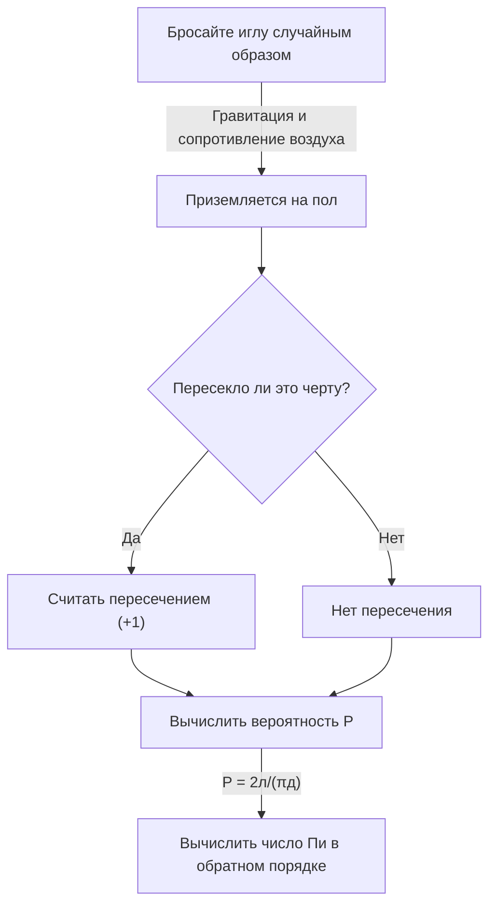

# Что такое игла Бюффона?

Мир математики содержит множество удивительных фактов, бросающих вызов интуиции, и прекрасных теорем, блестяще связывающих, казалось бы, несвязанные между собой явления. Среди наиболее известных и увлекательных из этих задач — **"Игла Бюффона"** (задача об игле Бюффона).

Эта задача была поставлена ​​в 1733 году и впервые решена в 1777 году Жоржем-Луи Леклерком, графом де Бюффоном, французским натуралистом и математиком XVIII века.

Примечательно, что эта задача демонстрирует, что одна из наиболее важных констант в математике — **pi $\pi$** — может быть определена посредством весьма физического и случайного действия «случайного падения иглы на пол». Она известна как одна из самых ранних задач геометрической вероятности и стала революционным открытием, которое можно считать предшественником метода Монте-Карло.

В этой статье мы даем подробное и доступное объяснение **Иглы Буффона**, охватывающее постановку задачи, ее математическое доказательство и оценку числа Пи посредством моделирования с использованием современных компьютеров.

## Базовая установка проблемы

Постановка задачи Бюффона об игле удивительно проста.

1. На ровном полу через равные интервалы $d$ нарисованы многочисленные параллельные линии.
2. Подготавливают одну иглу длиной $l$.
3. Игла случайно падает на пол.

Вопрос, который задал Бюффон, звучал так: **"Какова вероятность того, что упавшая игла пересечет одну из параллельных линий, нарисованных на полу?"**

На следующей диаграмме показан концептуальный ход этого эксперимента.



Здесь, чтобы упростить задачу, мы рассматриваем случай **короткой иглы**, когда длина иглы $l$ меньше или равна межстрочному интервалу $d$ ($l \le d$). При этом условии игла никогда не может пересекать более одной линии за раз.

## Математическое моделирование и вывод вероятности.

Чтобы решить эту задачу математически, нам необходимо количественно оценить (параметризировать) состояние иглы. Мы предполагаем, что положение и ориентация иглы при падении на пол совершенно случайны.

Чтобы определить положение иглы, мы определяем следующие две переменные.

1. $x$: Расстояние по перпендикуляру от центра иглы до ближайшей параллельной линии.
2. $\theta$: острый угол (или прямой угол) между иглой и параллельными линиями.

### Диапазон переменных

Для начала давайте рассмотрим, какие значения может принимать каждая переменная.

- **Расстояние $x$:** Центр иглы находится где-то между двумя соседними параллельными линиями. Поскольку мы рассматриваем расстояние до ближайшей линии, минимальное значение $x$ равно $0$ (когда центр иглы находится на линии), а максимальное значение — $\frac{d}{2}$ (когда центр иглы находится ровно посередине между двумя линиями). То есть $0 \le x \le \frac{d}{2}$. Поскольку игла падает случайным образом, $x$ следует **равномерному распределению** в этом диапазоне. Функция плотности вероятности — $\frac{2}{d}$.
- **Угол $\theta$:** Угол между иглой и параллельными линиями варьируется от $0$, когда игла параллельна линиям, до $\frac{\pi}{2}$ (90 градусов), когда перпендикулярно. В силу симметрии нам не нужно рассматривать углы, выходящие за рамки этого. Следовательно, $0 \le \theta \le \frac{\pi}{2}$. Поскольку ориентация иглы также случайна, $\theta$ следует **равномерному распределению** в этом диапазоне. Функция плотности вероятности — $\frac{2}{\pi}$.

Поскольку переменные $x$ и $\theta$ независимы друг от друга, совместная функция плотности вероятности $f(x, \theta)$ для конкретной пары $(x, \theta)$ выражается как произведение их отдельных функций плотности вероятности.

$$
f(x, \theta) = \frac{2}{d} \times \frac{2}{\pi} = \frac{4}{d\pi}
$$

### Условие пересечения

Далее рассмотрим условие пересечения иглой линии.
Игла пересекает линию, когда вертикальная протяженность от центра иглы до ее кончика больше или равна расстоянию $x$ до ближайшей линии.

Поскольку длина иглы равна $l$, расстояние от центра до кончика равно $\frac{l}{2}$.
Когда угол равен $\theta$, вертикальное расстояние, занимаемое этой половиной иглы (проецируемая длина), равно $\frac{l}{2} \sin \theta$.

Следовательно, условие пересечения иглой линии выражается следующим неравенством.

$$
x \le \frac{l}{2} \sin \theta
$$

### Вычисление вероятности

Вероятность $P$ того, что игла пересечет линию, получается путем интегрирования совместной функции плотности вероятности $f(x, \theta)$ по области, удовлетворяющей условию пересечения.

$$
P = \iint_{\text{crossing region}} f(x, \theta) \, dx \, d\theta
$$

Конкретные границы интеграции: $\theta$ варьируется от $0$ до $\frac{\pi}{2}$, а $x$ варьируется от $0$ до порога пересечения $\frac{l}{2} \sin \theta$.

$$
P = \int_{0}^{\frac{\pi}{2}} \int_{0}^{\frac{l}{2} \sin \theta} \frac{4}{d\pi} \, dx \, d\theta
$$

Сначала мы вычисляем внутренний интеграл по $x$.

$$
\int_{0}^{\frac{l}{2} \sin \theta} \frac{4}{d\pi} \, dx = \frac{4}{d\pi} \left[ x \right]_{0}^{\frac{l}{2} \sin \theta} = \frac{4}{d\pi} \left( \frac{l}{2} \sin \theta - 0 \right) = \frac{2l}{d\pi} \sin \theta
$$

Далее мы вычисляем внешний интеграл по $\theta$.

$$
P = \int_{0}^{\frac{\pi}{2}} \frac{2l}{d\pi} \sin \theta \, d\theta = \frac{2l}{d\pi} \int_{0}^{\frac{\pi}{2}} \sin \theta \, d\theta
$$

Поскольку интеграл от $\sin \theta$ равен $-\cos \theta$,

$$
\int_{0}^{\frac{\pi}{2}} \sin \theta \, d\theta = \left[ -\cos \theta \right]_{0}^{\frac{\pi}{2}} = (-\cos \frac{\pi}{2}) - (-\cos 0) = -0 - (-1) = 1
$$

Следовательно, желаемая вероятность $P$ такова.

$$
P = \frac{2l}{d\pi} \times 1 = \frac{2l}{\pi d}
$$

Это основная формула **Иглы Бюффона**. Вероятность того, что игла пересечет линию, равна удвоенной длине иглы $l$, разделенной на произведение числа пи $\pi$ и межстрочного расстояния $d$.

## Оценка числа Пи (метод Монте-Карло)

Производная формула $P = \frac{2l}{\pi d}$ прекрасно содержит $\pi$. Решая $\pi$, получаем:

$$
\pi = \frac{2l}{P d}
$$

Это уравнение означает, что если мы знаем вероятность $P$, мы можем вычислить число Пи $\pi$. Конечно, истинная вероятность $P$ требует бесконечного количества испытаний, но, опуская иглу много раз в реальном эксперименте, мы можем получить приближение $P$.

Пусть $N$ — общее количество падений иглы, а $C$ — количество раз, когда игла пересекает линию.
Когда количество испытаний $N$ достаточно велико, по закону больших чисел эмпирическая вероятность $\frac{C}{N}$ приближается к теоретической вероятности $P$.

$$
P \approx \frac{C}{N}
$$

Подстановка этого значения в предыдущее уравнение дает нам формулу для аппроксимации числа pi $\pi$.

$$
\pi \approx \frac{2l \cdot N}{C \cdot d}
$$

Самый простой расчет происходит, когда длина иглы $l$ и межстрочный интервал $d$ равны ($l = d$). В этом случае формула еще больше упрощается.

$$
\pi \approx \frac{2N}{C}
$$

Другими словами, вы можете найти число Пи, просто разделив удвоенное количество иголок на количество пересечений!

### Симулятор Python

Уронить иголку тысячи раз вручную — чрезвычайно утомительная задача (хотя исторически были математики, которые действительно проводили тысячи таких экспериментов). В наше время мы можем легко смоделировать этот эксперимент с помощью компьютера.

Ниже приведен простой пример кода Python, который имитирует эксперимент Бюффона с иглой и оценивает число Пи.

```python
import random
import math

def buffons_needle_simulation(num_trials, l, d):
    """
    Function to simulate Buffon's needle and estimate pi

    :param num_trials: Number of needle drops
    :param l: Length of the needle
    :param d: Spacing between parallel lines
    :return: Estimated value of pi
    """
    crosses = 0
    
    for _ in range(num_trials):
        # Randomly generate distance x from the needle's center to the nearest line (0 to d/2)
        x = random.uniform(0, d / 2.0)
        
        # Randomly generate needle angle theta (0 to pi/2)
        theta = random.uniform(0, math.pi / 2.0)
        
        # Check if the crossing condition is satisfied
        if x <= (l / 2.0) * math.sin(theta):
            crosses += 1
            
    # Exception handling to avoid errors when no crossings occur
    if crosses == 0:
        return float('inf')
        
    # Estimate pi
    estimated_pi = (2.0 * l * num_trials) / (d * crosses)
    return estimated_pi

# Parameter settings
N = 1000000  # Number of trials (1 million)
needle_length = 1.0
line_distance = 1.0

# Run the simulation
estimated_pi = buffons_needle_simulation(N, needle_length, line_distance)

print(f"Number of trials: {N:,}")
print(f"Estimated pi:     {estimated_pi}")
print(f"Actual pi:        {math.pi}")
print(f"Error:            {abs(math.pi - estimated_pi)}")
```

Когда вы запускаете этот код, большое количество виртуальных игл отбрасывается с использованием случайных чисел, и вы можете убедиться, что получается очень точное приближение $3.1415...$ — значения числа пи. Этот метод использования случайных чисел для поиска приближенных решений вероятностных задач называется **методом Монте-Карло**.

## Заключение

На первый взгляд игла Бюффона может показаться простой игрой физического случая, но за ней стоит солидная математическая теория. То, как случайные события (вероятность), геометрические фигуры (линии и отрезки линий) и предельное иррациональное число $\pi$ сливаются в одной простой формуле, поистине воплощает красоту математики.

Более того, эта проблема имеет историческое значение как источник метода Монте-Карло, который необходим для современной науки и техники. От моделирования сложных систем до вычисления интегралов, которые трудно решить аналитически, идея Бюффона продолжает поддерживать наш мир в различных формах и по сей день.

Почему бы не взять бумагу, ручку и несколько зубочисток и не испытать дома часть этой великой математической истории?
