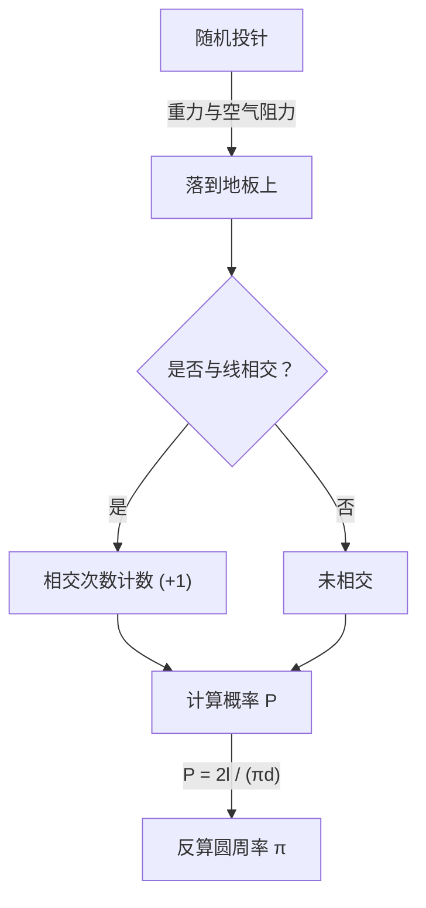

# 什么是蒲丰投针？

在数学的世界里，存在着许多反直觉的惊人事实，以及看似无关的事件完美结合的美丽定理。其中最著名且最具魅力的问题之一就是 **“蒲丰投针”** （Buffon's needle problem）。

这个问题由18世纪法国博物学家兼数学家乔治-路易·勒克莱尔，布丰伯爵（Georges-Louis Leclerc, Comte de Buffon）于1733年提出，并在1777年首次得到解决。

令人惊讶的是，这个问题表明，通过“在地上随机投针”这种极其物理且随机的行为，就可以求得数学中最重要的常数之一： **圆周率 $\pi$** 。这被认为是几何概率论（Geometric probability）中最早期的问题之一，也是后来的蒙特卡洛方法（Monte Carlo method）先驱的划时代发现。

本文将从 **蒲丰投针** 的问题设定、其数学证明，到使用现代计算机进行模拟来估计圆周率，进行详细且易懂的讲解。

## 问题的基本设定

蒲丰投针的问题设定非常简单。

1. 在平坦的地板上，画有许多等间距 $d$ 的平行直线。
2. 准备一根长度为 $l$ 的针。
3. 将这根针随机地（无规则地）投向地板。

此时，**“投下的针与地板上画的任何一条平行线相交的概率是多少？”** 就是蒲丰提出的问题。

以下图表展示了这个实验的概念流程。



在这里，为了简化问题，我们考虑针的长度 $l$ 小于或等于平行线间距 $d$ （$l \le d$）的 **短针** 情况。在这种条件下，针不会同时与两条或以上的直线相交。

## 数学建模与概率的推导

为了用数学方法解决这个问题，需要对针的状态进行数值化（参数化）。假设针落到地板上时，其位置和方向是完全随机的。

为了确定针的位置，我们定义以下两个变量：

1. $x$ : 从针的中心到最近的平行线的垂直距离。
2. $\theta$ : 针与平行线所成的锐角（或直角）。

### 变量的取值范围

首先，我们考虑每个变量可能的取值。

- **关于距离 $x$:** 针的中心会落在相邻两条平行线之间的某个位置。因为我们考虑的是到最近的线的距离，所以 $x$ 的最小值为 $0$ （针的中心在线上），最大值为 $\frac{d}{2}$ （针的中心恰好在两条线的正中间）。也就是说， $0 \le x \le \frac{d}{2}$ 。由于针是随机投下的，$x$ 在这个范围内服从 **均匀分布** 。概率密度函数为 $\frac{2}{d}$ 。
- **关于角度 $\theta$:** 针与平行线所成的角度从针与直线平行时的 $0$ ，到垂直时的 $\frac{\pi}{2}$ （90度）之间取值。由对称性可知，不需要考虑更大的角度。因此， $0 \le \theta \le \frac{\pi}{2}$ 。由于针的方向也是随机的，$\theta$ 在这个范围内也服从 **均匀分布** 。概率密度函数为 $\frac{2}{\pi}$ 。

由于变量 $x$ 和 $\theta$ 相互独立，它们取特定组合 $(x, \theta)$ 的联合概率密度函数 $f(x, \theta)$ 可以表示为各自概率密度函数的乘积。

$$
f(x, \theta) = \frac{2}{d} \times \frac{2}{\pi} = \frac{4}{d\pi}
$$

### 相交的条件

接下来，考虑针与直线相交的条件。
当针中心到端点的垂直长度大于或等于到最近的线的距离 $x$ 时，针就会与直线相交。

因为针的长度为 $l$ ，所以中心到端点的长度为 $\frac{l}{2}$ 。
当角度为 $\theta$ 时，这半根针在垂直方向上占据的距离（投影长度）为 $\frac{l}{2} \sin \theta$ 。

因此，针与直线相交的条件可以用以下不等式表示：

$$
x \le \frac{l}{2} \sin \theta
$$

### 概率的计算

针与线相交的概率 $P$ ，可以通过对满足相交条件的区域，对联合概率密度函数 $f(x, \theta)$ 进行积分来求得。

$$
P = \iint_{\text{相交区域}} f(x, \theta) \, dx \, d\theta
$$

具体的积分范围是，$\theta$ 从 $0$ 变化到 $\frac{\pi}{2}$ ，而 $x$ 从 $0$ 变化到相交的极限值 $\frac{l}{2} \sin \theta$ 的范围。

$$
P = \int_{0}^{\frac{\pi}{2}} \int_{0}^{\frac{l}{2} \sin \theta} \frac{4}{d\pi} \, dx \, d\theta
$$

首先，计算内侧关于 $x$ 的积分：

$$
\int_{0}^{\frac{l}{2} \sin \theta} \frac{4}{d\pi} \, dx = \frac{4}{d\pi} \left[ x \right]_{0}^{\frac{l}{2} \sin \theta} = \frac{4}{d\pi} \left( \frac{l}{2} \sin \theta - 0 \right) = \frac{2l}{d\pi} \sin \theta
$$

然后，计算外侧关于 $\theta$ 的积分：

$$
P = \int_{0}^{\frac{\pi}{2}} \frac{2l}{d\pi} \sin \theta \, d\theta = \frac{2l}{d\pi} \int_{0}^{\frac{\pi}{2}} \sin \theta \, d\theta
$$

由于 $\sin \theta$ 的积分是 $-\cos \theta$ ，所以：

$$
\int_{0}^{\frac{\pi}{2}} \sin \theta \, d\theta = \left[ -\cos \theta \right]_{0}^{\frac{\pi}{2}} = (-\cos \frac{\pi}{2}) - (-\cos 0) = -0 - (-1) = 1
$$

因此，所求的概率 $P$ 如下所示：

$$
P = \frac{2l}{d\pi} \times 1 = \frac{2l}{\pi d}
$$

这就是 **蒲丰投针** 的基本公式。针与线相交的概率，等于针长 $l$ 的两倍，除以圆周率 $\pi$ 和线间距 $d$ 的乘积。

## 圆周率 π 的估计（蒙特卡洛方法）

推导出的公式 $P = \frac{2l}{\pi d}$ 中巧妙地包含了 $\pi$ 。如果将其改写为求 $\pi$ 的形式，则如下所示：

$$
\pi = \frac{2l}{P d}
$$

这个公式意味着，只要知道了概率 $P$ ，就能计算出圆周率 $\pi$ 。当然，真正的概率 $P$ 必须通过无限次试验才能知道，但在实际实验中通过多次投针，可以得到 $P$ 的近似值。

假设投针的总次数为 $N$ ，其中针与线相交的次数为 $C$ 。
当试验次数 $N$ 足够大时，根据大数定律，经验概率 $\frac{C}{N}$ 将趋近于理论概率 $P$ 。

$$
P \approx \frac{C}{N}
$$

将其代入前面的公式，就可以得到求圆周率 $\pi$ 近似值的公式：

$$
\pi \approx \frac{2l \cdot N}{C \cdot d}
$$

计算最简单的情况是，针的长度 $l$ 与线的间距 $d$ 相等时（$l = d$）。此时，公式会变得更加简单：

$$
\pi \approx \frac{2N}{C}
$$

也就是说，只需用“投针的次数”的两倍除以“相交的次数”，就能求出圆周率！

### 使用 Python 进行模拟

实际手动投针数千次是一项极其繁重的工作（虽然在历史上确实有进行过数千次实验的数学家）。而在现代，我们可以使用计算机轻松地模拟这个实验。

以下展示了一个使用 Python 模拟蒲丰投针实验并估计圆周率的简单代码示例：

```python
import random
import math

def buffons_needle_simulation(num_trials, l, d):
    """
    进行蒲丰投针模拟，并估计圆周率的函数

    :param num_trials: 投针的次数
    :param l: 针的长度
    :param d: 平行线的间距
    :return: 估计出的圆周率
    """
    crosses = 0
    
    for _ in range(num_trials):
        # 随机生成从针中心到最近线的距离 x (0 到 d/2)
        x = random.uniform(0, d / 2.0)
        
        # 随机生成针的角度 theta (0 到 pi/2)
        theta = random.uniform(0, math.pi / 2.0)
        
        # 检查是否满足相交条件
        if x <= (l / 2.0) * math.sin(theta):
            crosses += 1
            
    # 为了避免一次都没有相交时报错，进行异常处理
    if crosses == 0:
        return float('inf')
        
    # 估计圆周率的计算
    estimated_pi = (2.0 * l * num_trials) / (d * crosses)
    return estimated_pi

# 参数设置
N = 1000000  # 试验次数 (100万次)
needle_length = 1.0
line_distance = 1.0

# 运行模拟
estimated_pi = buffons_needle_simulation(N, needle_length, line_distance)

print(f"试验次数: {N:,} 次")
print(f"估计出的圆周率: {estimated_pi}")
print(f"实际的圆周率:     {math.pi}")
print(f"误差:             {abs(math.pi - estimated_pi)}")
```

运行这段代码后，会利用随机数投下大量虚拟的针，并且可以确认能以非常高的精度得到 $3.1415...$ 这个圆周率的近似值。像这样，利用随机数来求概率问题的近似解的方法，被称为 **蒙特卡洛方法** 。

## 总结

蒲丰投针乍一看似乎只是一个单纯的物理上的偶然游戏，但其背后却存在着坚实的数学理论。随机事件（概率）与几何形状（直线与线段），以及终极无理数 $\pi$ 能够融合在一个简单的数学公式中，可以说这正是数学之美的体现。

此外，这个问题作为现代科学技术不可或缺的蒙特卡洛方法的起点，也具有历史性的重要意义。无论是复杂系统的模拟，还是解析难以求解的积分计算，直到今天，蒲丰的思想仍在以各种形式支撑着我们的世界。

不妨准备纸、笔和几根牙签，在自己家里也体验一下这段伟大的数学历史吧。
