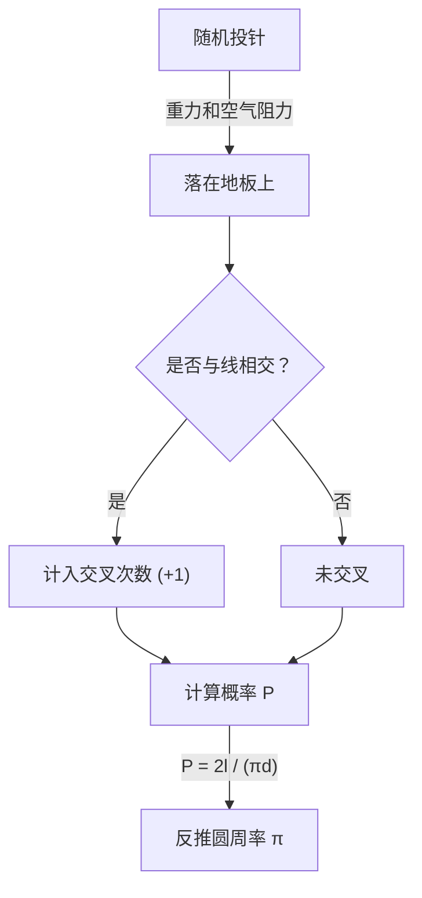

# 什么是布丰投针？

数学世界中存在着许多违反直觉的惊人事实，以及将看似毫不相关的现象巧妙联系在一起的美丽定理。其中最为著名且迷人的问题之一就是 **"布丰投针"**（Buffon's needle problem）。

这个问题由18世纪法国博物学家兼数学家乔治-路易·勒克莱尔·布丰伯爵（Georges-Louis Leclerc, Comte de Buffon）于1733年提出，并于1777年首次被解决。

令人惊叹的是，这个问题表明，通过"将针随机投到地板上"这一极其物理化且随机的行为，就可以求出数学中最重要的常数之一—— **圆周率 $\pi$**。它被认为是几何概率论（Geometric probability）中最早的问题之一，也是蒙特卡洛方法（Monte Carlo method）的先驱性发现。

本文将从 **布丰投针** 的问题设定出发，详细且通俗地解说其数学证明，以及使用现代计算机进行模拟来估算圆周率的方法。

## 问题的基本设定

布丰投针的问题设定非常简单。

1. 在平坦的地板上，以等间距 $d$ 画有大量平行直线。
2. 准备一根长度为 $l$ 的针。
3. 将这根针随机地投向地板。

布丰提出的问题是：**"所投的针与地板上画的任一平行线相交的概率是多少？"**

下面的图表展示了这个实验的概念流程。



在这里，为了简化问题，我们考虑针的长度 $l$ 小于或等于平行线间距 $d$（$l \le d$）的 **短针** 情况。在此条件下，针不可能同时与两条以上的直线相交。

## 数学建模与概率推导

要从数学上解决这个问题，需要对针的状态进行数值化（参数化）。我们假设针落到地板上时，其位置和方向是完全随机的。

为了确定针的位置，我们定义以下两个变量。

1. $x$：针的中心到最近的平行线的垂直距离。
2. $\theta$：针与平行线所成的锐角（或直角）。

### 变量的取值范围

首先，让我们思考每个变量可以取哪些值。

- **距离 $x$：** 针的中心落在相邻两条平行线之间的某个位置。由于考虑的是到最近线的距离，$x$ 的最小值为 $0$（针的中心在线上时），最大值为 $\frac{d}{2}$（针的中心恰好在两条线的中间位置时）。即 $0 \le x \le \frac{d}{2}$。由于针是随机投下的，$x$ 在此范围内服从 **均匀分布**。概率密度函数为 $\frac{2}{d}$。
- **角度 $\theta$：** 针与平行线所成的角度，从针与直线平行时的 $0$ 到垂直时的 $\frac{\pi}{2}$（90度）。由于对称性，无需考虑更大的角度。因此，$0 \le \theta \le \frac{\pi}{2}$。针的朝向也是随机的，所以 $\theta$ 在此范围内也服从 **均匀分布**。概率密度函数为 $\frac{2}{\pi}$。

由于变量 $x$ 和 $\theta$ 相互独立，取特定组合 $(x, \theta)$ 的联合概率密度函数 $f(x, \theta)$ 可以表示为各自概率密度函数的乘积。

$$
f(x, \theta) = \frac{2}{d} \times \frac{2}{\pi} = \frac{4}{d\pi}
$$

### 相交条件

接下来，考虑针与直线相交的条件。
当针的中心到端点的垂直方向长度大于或等于到最近线的距离 $x$ 时，针与直线相交。

由于针的长度为 $l$，从中心到端点的长度为 $\frac{l}{2}$。
当角度为 $\theta$ 时，这半根针在垂直方向上占据的距离（投影长度）为 $\frac{l}{2} \sin \theta$。

因此，针与直线相交的条件可用以下不等式表示。

$$
x \le \frac{l}{2} \sin \theta
$$

### 概率的计算

针与线相交的概率 $P$ 通过在满足相交条件的区域上对联合概率密度函数 $f(x, \theta)$ 进行积分来求得。

$$
P = \iint_{\text{相交区域}} f(x, \theta) \, dx \, d\theta
$$

具体的积分范围是：$\theta$ 从 $0$ 变化到 $\frac{\pi}{2}$，$x$ 从 $0$ 变化到交叉临界值 $\frac{l}{2} \sin \theta$。

$$
P = \int_{0}^{\frac{\pi}{2}} \int_{0}^{\frac{l}{2} \sin \theta} \frac{4}{d\pi} \, dx \, d\theta
$$

首先，计算关于 $x$ 的内层积分。

$$
\int_{0}^{\frac{l}{2} \sin \theta} \frac{4}{d\pi} \, dx = \frac{4}{d\pi} \left[ x \right]_{0}^{\frac{l}{2} \sin \theta} = \frac{4}{d\pi} \left( \frac{l}{2} \sin \theta - 0 \right) = \frac{2l}{d\pi} \sin \theta
$$

然后，计算关于 $\theta$ 的外层积分。

$$
P = \int_{0}^{\frac{\pi}{2}} \frac{2l}{d\pi} \sin \theta \, d\theta = \frac{2l}{d\pi} \int_{0}^{\frac{\pi}{2}} \sin \theta \, d\theta
$$

由于 $\sin \theta$ 的积分为 $-\cos \theta$，

$$
\int_{0}^{\frac{\pi}{2}} \sin \theta \, d\theta = \left[ -\cos \theta \right]_{0}^{\frac{\pi}{2}} = (-\cos \frac{\pi}{2}) - (-\cos 0) = -0 - (-1) = 1
$$

因此，所求概率 $P$ 为：

$$
P = \frac{2l}{d\pi} \times 1 = \frac{2l}{\pi d}
$$

这就是 **布丰投针** 的基本公式。针与线相交的概率等于针长 $l$ 的2倍除以圆周率 $\pi$ 与线间距 $d$ 的乘积。

## 圆周率 π 的估算（蒙特卡洛方法）

推导出的公式 $P = \frac{2l}{\pi d}$ 中巧妙地包含了 $\pi$。将其关于 $\pi$ 求解，可得：

$$
\pi = \frac{2l}{P d}
$$

这个等式意味着，只要知道概率 $P$，就可以计算圆周率 $\pi$。当然，真实概率 $P$ 需要进行无限次试验才能得到，但通过在实际实验中多次投针，可以获得 $P$ 的近似值。

设投针总次数为 $N$，其中针与线相交的次数为 $C$。
当试验次数 $N$ 足够大时，根据大数定律，经验概率 $\frac{C}{N}$ 会趋近于理论概率 $P$。

$$
P \approx \frac{C}{N}
$$

将其代入之前的公式，即可得到圆周率 $\pi$ 的近似公式。

$$
\pi \approx \frac{2l \cdot N}{C \cdot d}
$$

当针的长度 $l$ 与线的间距 $d$ 相等（$l = d$）时，计算最为简单。此时公式进一步简化为：

$$
\pi \approx \frac{2N}{C}
$$

也就是说，只需将投针次数的2倍除以交叉次数，就能求出圆周率！

### Python 模拟

用手投针数千次是一项非常艰苦的工作（历史上确实有数学家进行过数千次这样的实验）。在现代，我们可以轻松地用计算机来模拟这个实验。

以下是使用 Python 模拟布丰投针实验并估算圆周率的简单代码示例。

```python
import random
import math

def buffons_needle_simulation(num_trials, l, d):
    """
    模拟布丰投针并估算圆周率的函数

    :param num_trials: 投针次数
    :param l: 针的长度
    :param d: 平行线间距
    :return: 估算的圆周率
    """
    crosses = 0
    
    for _ in range(num_trials):
        # 随机生成针中心到最近线的距离 x（0 到 d/2）
        x = random.uniform(0, d / 2.0)
        
        # 随机生成针的角度 theta（0 到 pi/2）
        theta = random.uniform(0, math.pi / 2.0)
        
        # 检查是否满足相交条件
        if x <= (l / 2.0) * math.sin(theta):
            crosses += 1
            
    # 无交叉时的异常处理，避免错误
    if crosses == 0:
        return float('inf')
        
    # 估算圆周率
    estimated_pi = (2.0 * l * num_trials) / (d * crosses)
    return estimated_pi

# 参数设定
N = 1000000  # 试验次数（100万次）
needle_length = 1.0
line_distance = 1.0

# 运行模拟
estimated_pi = buffons_needle_simulation(N, needle_length, line_distance)

print(f"试验次数：{N:,} 次")
print(f"估算的圆周率：{estimated_pi}")
print(f"实际的圆周率：{math.pi}")
print(f"误差：        {abs(math.pi - estimated_pi)}")
```

运行这段代码后，大量虚拟的针将通过随机数被投下，可以验证能够获得非常高精度的 $3.1415...$ 即圆周率的近似值。这种使用随机数求解概率问题近似解的方法被称为 **蒙特卡洛方法**。

## 总结

布丰投针乍看之下似乎只是一种物理上的偶然游戏，但其背后存在着坚实的数学理论。随机事件（概率）、几何形状（直线和线段）以及终极无理数 $\pi$ 在一个简单公式中的融合，可以说是数学之美的完美体现。

此外，这个问题作为对现代科学技术不可或缺的蒙特卡洛方法的源头，也具有重要的历史意义。从复杂系统的模拟到难以解析求解的积分计算，布丰的思想至今仍以各种形式支撑着我们的世界。

不妨准备好纸笔和几根牙签，在家中亲身体验这段伟大数学历史的一部分吧。
