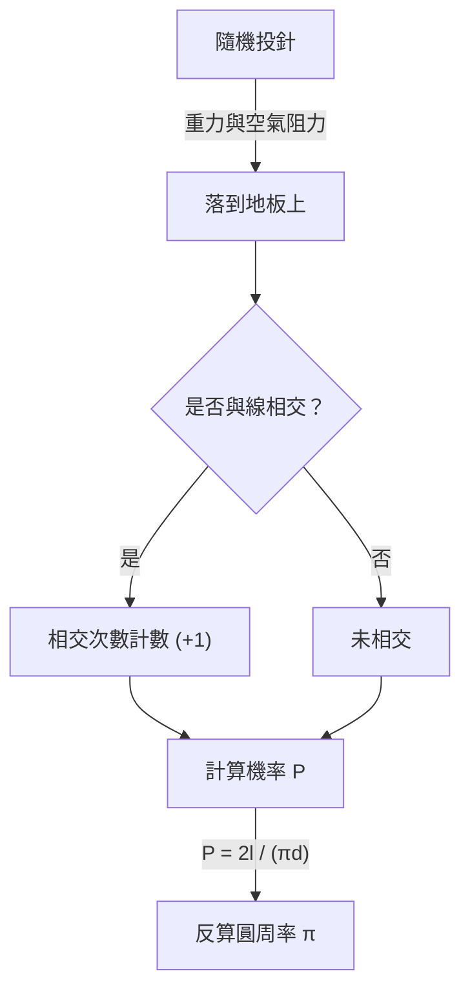

# 什麼是蒲豐投針？

在數學的世界裡，存在著許多反直覺的驚人事實，以及看似無關的事件完美結合的美麗定理。其中最著名且最具魅力的問題之一就是 **「蒲豐投針」** （Buffon's needle problem）。

這個問題由18世紀法國博物學家兼數學家喬治-路易·勒克萊爾，布豐伯爵（Georges-Louis Leclerc, Comte de Buffon）於1733年提出，並在1777年首次得到解決。

令人驚訝的是，這個問題表明，透過「在地上隨機投針」這種極其物理且隨機的行為，就可以求得數學中最重要的常數之一： **圓周率 $\pi$** 。這被認為是幾何機率論（Geometric probability）中最早期的問題之一，也是後來的蒙地卡羅方法（Monte Carlo method）先驅的劃時代發現。

本文將從 **蒲豐投針** 的問題設定、其數學證明，到使用現代電腦進行模擬來估計圓周率，進行詳細且易懂的講解。

## 問題的基本設定

蒲豐投針的問題設定非常簡單。

1. 在平坦的地板上，畫有許多等間距 $d$ 的平行直線。
2. 準備一根長度為 $l$ 的針。
3. 將這根針隨機地（無規則地）投向地板。

此時，**「投下的針與地板上畫的任何一條平行線相交的機率是多少？」** 就是蒲豐提出的問題。

以下圖表展示了這個實驗的概念流程。



在這裡，為了簡化問題，我們考慮針的長度 $l$ 小於或等於平行線間距 $d$ （$l \le d$）的 **短針** 情況。在這種條件下，針不會同時與兩條或以上的直線相交。

## 數學建模與機率的推導

為了用數學方法解決這個問題，需要對針的狀態進行數值化（參數化）。假設針落到地板上時，其位置和方向是完全隨機的。

為了確定針的位置，我們定義以下兩個變數：

1. $x$ : 從針的中心到最近的平行線的垂直距離。
2. $\theta$ : 針與平行線所成的銳角（或直角）。

### 變數的取值範圍

首先，我們考慮每個變數可能的取值。

- **關於距離 $x$:** 針的中心會落在相鄰兩條平行線之間的某個位置。因為我們考慮的是到最近的線的距離，所以 $x$ 的最小值為 $0$ （針的中心在線上），最大值為 $\frac{d}{2}$ （針的中心恰好在兩條線的正中間）。也就是說， $0 \le x \le \frac{d}{2}$ 。由於針是隨機投下的，$x$ 在這個範圍內服從 **均勻分配** 。機率密度函數為 $\frac{2}{d}$ 。
- **關於角度 $\theta$:** 針與平行線所成的角度從針與直線平行時的 $0$ ，到垂直時的 $\frac{\pi}{2}$ （90度）之間取值。由對稱性可知，不需要考慮更大的角度。因此， $0 \le \theta \le \frac{\pi}{2}$ 。由於針的方向也是隨機的，$\theta$ 在這個範圍內也服從 **均勻分配** 。機率密度函數為 $\frac{2}{\pi}$ 。

由於變數 $x$ 和 $\theta$ 相互獨立，它們取特定組合 $(x, \theta)$ 的聯合機率密度函數 $f(x, \theta)$ 可以表示為各自機率密度函數的乘積。

$$
f(x, \theta) = \frac{2}{d} \times \frac{2}{\pi} = \frac{4}{d\pi}
$$

### 相交的條件

接下來，考慮針與直線相交的條件。
當針中心到端點的垂直長度大於或等於到最近的線的距離 $x$ 時，針就會與直線相交。

因為針的長度為 $l$ ，所以中心到端點的長度為 $\frac{l}{2}$ 。
當角度為 $\theta$ 時，這半根針在垂直方向上佔據的距離（投影長度）為 $\frac{l}{2} \sin \theta$ 。

因此，針與直線相交的條件可以用以下不等式表示：

$$
x \le \frac{l}{2} \sin \theta
$$

### 機率的計算

針與線相交的機率 $P$ ，可以透過對滿足相交條件的區域，對聯合機率密度函數 $f(x, \theta)$ 進行積分來求得。

$$
P = \iint_{\text{相交區域}} f(x, \theta) \, dx \, d\theta
$$

具體的積分範圍是，$\theta$ 從 $0$ 變化到 $\frac{\pi}{2}$ ，而 $x$ 從 $0$ 變化到相交的極限值 $\frac{l}{2} \sin \theta$ 的範圍。

$$
P = \int_{0}^{\frac{\pi}{2}} \int_{0}^{\frac{l}{2} \sin \theta} \frac{4}{d\pi} \, dx \, d\theta
$$

首先，計算內側關於 $x$ 的積分：

$$
\int_{0}^{\frac{l}{2} \sin \theta} \frac{4}{d\pi} \, dx = \frac{4}{d\pi} \left[ x \right]_{0}^{\frac{l}{2} \sin \theta} = \frac{4}{d\pi} \left( \frac{l}{2} \sin \theta - 0 \right) = \frac{2l}{d\pi} \sin \theta
$$

然後，計算外側關於 $\theta$ 的積分：

$$
P = \int_{0}^{\frac{\pi}{2}} \frac{2l}{d\pi} \sin \theta \, d\theta = \frac{2l}{d\pi} \int_{0}^{\frac{\pi}{2}} \sin \theta \, d\theta
$$

由於 $\sin \theta$ 的積分是 $-\cos \theta$ ，所以：

$$
\int_{0}^{\frac{\pi}{2}} \sin \theta \, d\theta = \left[ -\cos \theta \right]_{0}^{\frac{\pi}{2}} = (-\cos \frac{\pi}{2}) - (-\cos 0) = -0 - (-1) = 1
$$

因此，所求的機率 $P$ 如下所示：

$$
P = \frac{2l}{d\pi} \times 1 = \frac{2l}{\pi d}
$$

這就是 **蒲豐投針** 的基本公式。針與線相交的機率，等於針長 $l$ 的兩倍，除以圓周率 $\pi$ 和線間距 $d$ 的乘積。

## 圓周率 π 的估計（蒙地卡羅方法）

推導出的公式 $P = \frac{2l}{\pi d}$ 中巧妙地包含了 $\pi$ 。如果將其改寫為求 $\pi$ 的形式，則如下所示：

$$
\pi = \frac{2l}{P d}
$$

這個公式意味著，只要知道了機率 $P$ ，就能計算出圓周率 $\pi$ 。當然，真正的機率 $P$ 必須透過無限次試驗才能知道，但在實際實驗中透過多次投針，可以得到 $P$ 的近似值。

假設投針的總次數為 $N$ ，其中針與線相交的次數為 $C$ 。
當試驗次數 $N$ 足夠大時，根據大數法則，經驗機率 $\frac{C}{N}$ 將趨近於理論機率 $P$ 。

$$
P \approx \frac{C}{N}
$$

將其代入前面的公式，就可以得到求圓周率 $\pi$ 近似值的公式：

$$
\pi \approx \frac{2l \cdot N}{C \cdot d}
$$

計算最簡單的情況是，針的長度 $l$ 與線的間距 $d$ 相等時（$l = d$）。此時，公式會變得更加簡單：

$$
\pi \approx \frac{2N}{C}
$$

也就是說，只需用「投針的次數」的兩倍除以「相交的次數」，就能求出圓周率！

### 使用 Python 進行模擬

實際手動投針數千次是一項極其繁重的工作（雖然在歷史上確實有進行過數千次實驗的數學家）。而在現代，我們可以使用電腦輕鬆地模擬這個實驗。

以下展示了一個使用 Python 模擬蒲豐投針實驗並估計圓周率的簡單程式碼範例：

```python
import random
import math

def buffons_needle_simulation(num_trials, l, d):
    """
    進行蒲豐投針模擬，並估計圓周率的函數

    :param num_trials: 投針的次數
    :param l: 針的長度
    :param d: 平行線的間距
    :return: 估計出的圓周率
    """
    crosses = 0
    
    for _ in range(num_trials):
        # 隨機生成從針中心到最近線的距離 x (0 到 d/2)
        x = random.uniform(0, d / 2.0)
        
        # 隨機生成針的角度 theta (0 到 pi/2)
        theta = random.uniform(0, math.pi / 2.0)
        
        # 檢查是否滿足相交條件
        if x <= (l / 2.0) * math.sin(theta):
            crosses += 1
            
    # 為了避免一次都沒有相交時報錯，進行例外處理
    if crosses == 0:
        return float('inf')
        
    # 估計圓周率的計算
    estimated_pi = (2.0 * l * num_trials) / (d * crosses)
    return estimated_pi

# 參數設定
N = 1000000  # 試驗次數 (100萬次)
needle_length = 1.0
line_distance = 1.0

# 執行模擬
estimated_pi = buffons_needle_simulation(N, needle_length, line_distance)

print(f"試驗次數: {N:,} 次")
print(f"估計出的圓周率: {estimated_pi}")
print(f"實際的圓周率:     {math.pi}")
print(f"誤差:             {abs(math.pi - estimated_pi)}")
```

執行這段程式碼後，會利用亂數投下大量虛擬的針，並且可以確認能以非常高的精度得到 $3.1415...$ 這個圓周率的近似值。像這樣，利用亂數來求機率問題的近似解的方法，被稱為 **蒙地卡羅方法** 。

## 總結

蒲豐投針乍看之下似乎只是一個單純物理上的偶然遊戲，但其背後卻存在著堅實的數學理論。隨機事件（機率）與幾何形狀（直線與線段），以及終極無理數 $\pi$ 能夠融合在一個簡單的數學公式中，可以說這正是數學之美的體現。

此外，這個問題作為現代科學技術不可或缺的蒙地卡羅方法的起點，也具有歷史性的重要意義。無論是複雜系統的模擬，還是解析難以求解的積分計算，直到今天，蒲豐的思想仍在以各種形式支撐著我們的世界。

不妨準備紙、筆和幾根牙籤，在自己家裡也體驗一下這段偉大的數學歷史吧。
