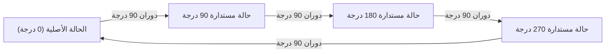
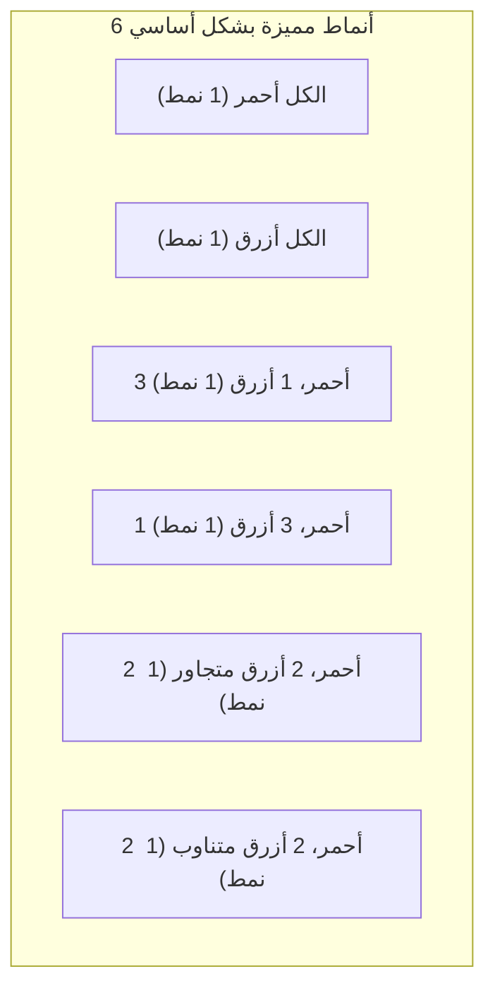

## 1. مقدمة: مشكلة العد والتناظر

في التوافقيات الرياضية، يعتبر "عد عدد الأشياء التي تستوفي شرطًا معينًا" موضوعًا أساسيًا ومهمًا للغاية. باستخدام صيغ التباديل والتوافيق التي تُدرس في المدارس، يمكن حل العديد من المشكلات. ومع ذلك، عند النظر في المشكلات الهندسية أو مشكلات العالم الحقيقي، فإننا نواجه أحيانًا مواقف معقدة لا يمكن معالجتها بمجرد تطبيق الصيغ.

مثال نموذجي على ذلك هو **"حصر الكائنات ذات التناظر"**. يشير التناظر إلى الخاصية التي لا يتغير بموجبها الشكل أو الطبيعة العامة حتى لو تم تنفيذ عملية معينة (مثل الدوران أو الانعكاس).

على سبيل المثال، لنفترض أننا نصنع قلادة عن طريق ربط أربع خرزات معًا في حلقة. ألوان الخرز المتاحة هي "الأحمر" و "الأزرق". في هذه الحالة، كم عدد التصميمات المختلفة للقلادة الموجودة في المجمل؟

في هذه المقالة، وانطلاقًا من هذا السؤال الذي يبدو بسيطًا، سنشرح بالتفصيل الأداة الرياضية القوية للعد مع مراعاة التناظر، وهي **"تمهيدية بيرنسايد"** (Burnside's Lemma)، من الأساسيات إلى تطبيقاتها. يعد هذا موضوعًا مثاليًا لمقدمة عملية في نظرية الزمر، لذا يُرجى البقاء معنا حتى النهاية.

## 2. مطبات العد البسيط

أولاً، دعونا نفكر في الأمر بأبسط طريقة. افترض أن كل خرزة من الخرزات الأربع يمكنها اختيار لونها بشكل مستقل. لكل خرزة خياران: أحمر أو أزرق. وبالتالي، فإن العدد الإجمالي لمجموعات الألوان هو كما يلي:

$$
2 \times 2 \times 2 \times 2 = 2^4 = 16 \text{ طرق}
$$

في الواقع، إذا كانت "سلسلة" تصطف فيها الخرزات في صف واحد، فإن هذه الإجابة المكونة من $16$ طريقة ستكون صحيحة. ومع ذلك، ما نأخذه في الاعتبار هو "قلادة". يُقصد بالقلادة أن تُلبس حول الرقبة ويمكن تحريكها بحرية في الفضاء.

النقطة المهمة هنا هي حقيقة أن **"الأشياء التي تصبح متطابقة عند تدويرها يجب اعتبارها نفس التصميم"**.

على سبيل المثال، تخيل قلادة ذات لون "أحمر-أزرق-أزرق-أزرق". إذا قمت بتدوير هذا بمقدار 90 درجة في اتجاه عقارب الساعة، فإنه يصبح "أزرق-أحمر-أزرق-أزرق". بالنظر إليها في نظام إحداثيات ثابت على طاولة، فهذه حالات مختلفة، ولكن كقلادة مادية، فهي نفس الشيء تمامًا.

إذا قلنا ببساطة أن هناك $16$ طريقة، فإننا نبالغ في العد من خلال تضمين "تلك التي تتداخل بسبب الدوران". كيف يمكننا إزالة هذه الازدواجية بدقة وحساب عدد التصميمات المختلفة بشكل أساسي فقط؟ هنا تكون الحاجة إلى إطار عمل لوصف التناظر رياضيًا.

## 3. أساسيات "الزمر" التي تصف التناظر

للتعامل مع مثل هذه الازدواجية بشكل صارم ومنهجي، تستخدم الرياضيات الحديثة مفهوم **"الزمرة"** (Group). الزمرة عبارة عن مجموعة من "العمليات" أو "التحويلات" على كائن يلبي البديهيات (الخصائص) الأربع التالية:

1. **الانغلاق**: نتيجة تنفيذ عمليتين متتاليتين متضمنتين في الزمرة هي أيضًا عملية متضمنة في الزمرة.
2. **التجميع**: عندما يتم تنفيذ ثلاث عمليات بالترتيب، تكون النتيجة النهائية هي نفسها بغض النظر عن كيفية تجميعها.
3. **العنصر المحايد**: يتم تضمين عملية "لا تفعل شيئًا"، ويؤدي دمجها مع أي عملية أخرى إلى ترك العملية الأصلية دون تغيير.
4. **العنصر المعكوس**: لأي عملية، توجد دائمًا عملية "تلغيها (تعكسها) تمامًا".

لتكن $G$ هي الزمرة التي تجمع "عمليات الدوران" لقلادة الخرز الأربع (والتي نعتبرها الرؤوس الأربعة لمربع) في هذا المثال. تتضمن هذه الزمرة $G$ العمليات الأربع التالية (العناصر):

- $R_0$: لا تفعل شيئًا (دوران 0 درجة؛ هذا هو العنصر المحايد)
- $R_{90}$: تدوير 90 درجة في اتجاه عقارب الساعة
- $R_{180}$: تدوير 180 درجة في اتجاه عقارب الساعة
- $R_{270}$: تدوير 270 درجة في اتجاه عقارب الساعة

على سبيل المثال، أداء $R_{180}$ بعد إجراء $R_{90}$ هو نفسه إجراء $R_{270}$. كما أن العنصر المعكوس لـ $R_{90}$ هو $R_{270}$ (وهما يشكلان معًا دورانًا بمقدار 360 درجة ويعودان إلى الأصل). بهذه الطريقة، تستوفي هذه العمليات جميع بديهيات الزمرة. تسمى هذه الزمرة بـ **"الزمرة الدوارة"** (Cyclic group)، ويُشار إليها أحيانًا باسم $C_4$.

## 4. فعل الزمرة والمدارات (Orbits)

التأثير الذي تحدثه زمرة $G$ على مجموعة معينة $X$ يسمى رياضيًا **"فعل الزمرة"** (Group action). في مثالنا، المجموعة $X$ هي "مجموعة كل الـ $16$ نمطًا متجاهلين الدورانات"، والزمرة $G$ هي "عمليات الدوران الـ 4".

تسمى مجموعة الأنماط التي يتم الحصول عليها من خلال تطبيق جميع عمليات الزمرة على نمط معين $x$ باسم **"مدار"** هذا الـ $x$.

على سبيل المثال، تطبيق عمليات $G$ على النمط "أحمر-أزرق-أزرق-أزرق" ينتج عنه الأنماط الأربعة التالية:
- تطبيق $R_0$: "أحمر-أزرق-أزرق-أزرق"
- تطبيق $R_{90}$: "أزرق-أحمر-أزرق-أزرق"
- تطبيق $R_{180}$: "أزرق-أزرق-أحمر-أزرق"
- تطبيق $R_{270}$: "أزرق-أزرق-أزرق-أحمر"

تنتمي هذه الأنماط الأربعة إلى "المدار" نفسه. "عدد التصميمات المختلفة بشكل أساسي" التي نريد معرفتها ليست بالضبط سوى **"إلى كم عدد المدارات المختلفة تنقسم المجموعة $X$ بأكملها"**. يُشار إلى هذا بالصيغة $|X/G|$.

## 5. تمهيدية بيرنسايد

هنا أخيرًا، تظهر نجمة هذه المرة، **تمهيدية بيرنسايد**. وتسمى أحيانًا أيضًا تمهيدية كوشي-فروبينيوس. هذه مبرهنة مذهلة تسمح لنا بسهولة بحساب "عدد المدارات (عدد الأنماط المختلفة بشكل أساسي)" عندما تؤثر زمرة $G$ على مجموعة منتهية $X$.

صيغة المبرهنة هي كما يلي:

$$
|X/G| = \frac{1}{|G|} \sum_{g \in G} |X^g|
$$

دعونا نلقي نظرة على معنى كل رمز يظهر في الصيغة بالتفصيل:

- $|X/G|$: عدد الأنماط المختلفة بشكل أساسي التي سيتم العثور عليها (إجمالي عدد المدارات).
- $|G|$: العدد الإجمالي للعمليات المتضمنة في الزمرة $G$. في مشكلة القلادة هذه، هناك 4 دورانات، لذلك $|G| = 4$.
- $g$: كل عملية مضمنة في الزمرة $G$.
- $X^g$: مجموعة الأنماط التي "لا تتغير (ثابتة)" حتى عند تنفيذ العملية $g$.
- $|X^g|$: عدد الأنماط المثبتة بواسطة العملية $g$. يسمى هذا **"عدد النقاط الثابتة"**.

ما تعنيه هذه الصيغة بديهي للغاية. تؤكد تمهيدية بيرنسايد أنه يمكننا الحصول على العدد المطلوب من المدارات من خلال **"حساب 'عدد الأنماط غير المتغيرة (عدد النقاط الثابتة)' لكل عملية، وإضافتها جميعًا معًا، والقسمة على العدد الإجمالي للعمليات (أي أخذ المتوسط)"**.

تتمثل أكبر قوة في هذه المبرهنة في أنها يمكن أن تقسم الحكم المعقد للتكرارات إلى حسابات مستقلة وبسيطة تتمثل في "عد ما لا يتغير في ظل كل عملية".

## 6. التطبيق والحساب لمشكلة القلادة

الآن، دعونا نستخدم بالفعل تمهيدية بيرنسايد لحساب عدد تصميمات قلادة مكونة من 4 خرزات (لونين أحمر وأزرق).
عدد العناصر في المجموعة الأصلية للأنماط $X$ هو $16$. سنستكشف عدد النقاط الثابتة $|X^g|$ لكل عملية $g \in G$ للمجموعة $G$ واحدة تلو الأخرى.

### 6.1. النقاط الثابتة لعدم فعل أي شيء ($R_0$)
هذه العملية تعني "لا تحرك شيئًا". ولذلك، فإن كل الـ $16$ نمطًا تظل كما هي تمامًا من خلال هذه العملية.
$$ |X^{R_0}| = 16 $$

### 6.2. النقاط الثابتة لدوران بمقدار 90 درجة ($R_{90}$)
ما الذي يجب القيام به لجعله نفس النمط تمامًا كما كان قبل الدوران من خلال تدويره 90 درجة؟
تنتقل الخرزة الأولى إلى الموضع الثاني، والثانية إلى الموضع الثالث، والثالثة إلى الموضع الرابع، والرابعة إلى الموضع الأول. لكي تكون هذه الألوان من نفس اللون، **"يجب أن تكون جميع الخرزات من نفس اللون"**.
الوحيدة التي تستوفي الشرط هي $2$ طرق: "الكل أحمر" أو "الكل أزرق".
$$ |X^{R_{90}}| = 2 $$

### 6.3. النقاط الثابتة لدوران 180 درجة ($R_{180}$)
لكي تكون مماثلة للأصل بالدوران 180 درجة، يجب أن تكون الخرزات التي تواجه بعضها البعض (على القطر) من نفس اللون.
للمربع قطران. لكل زوج من الأقطار، يمكننا اختيار "أحمر" أو "أزرق" بحرية.
وبالتالي، هناك $2 \times 2 = 4$ طرق.
$$ |X^{R_{180}}| = 4 $$

### 6.4. النقاط الثابتة لتدوير 270 درجة ($R_{270}$)
يعد الدوران بمقدار 270 درجة (دوران بمقدار 90 درجة عكس اتجاه عقارب الساعة) ماديًا هو نفس الوضع لدوران 90 درجة. لن تتطابق الأنماط قبل وبعد الدوران إلا إذا كانت كل الخرزات من نفس اللون.
لذلك ليس هناك سوى $2$ طرق: "الكل أحمر" أو "الكل أزرق".
$$ |X^{R_{270}}| = 2 $$

### 6.5. حساب النتيجة النهائية
الآن، لدينا جميع أعداد النقاط الثابتة لجميع العمليات. نقوم باستبدال هذه في صيغة تمهيدية بيرنسايد.

$$
|X/G| = \frac{|X^{R_0}| + |X^{R_{90}}| + |X^{R_{180}}| + |X^{R_{270}}|}{|G|}
$$
$$
|X/G| = \frac{16 + 2 + 4 + 2}{4} = \frac{24}{4} = 6
$$

نتيجة للحساب، فقد ثبت أن هناك **$6$ طرق** لتصميمات القلادة المختلفة بشكل أساسي عندما تُعتبر الدورانات متطابقة.

يوضح الشكل أدناه هذه الأنماط الستة المستقلة.

## 7. زمرة زوجية السطوح: عند النظر في الانعكاسات

يمكن أيضًا "قلب القلادة الحقيقية من الداخل إلى الخارج" أثناء الاستلقاء على المكتب. إذا أضفنا شرط "التصميمات التي تصبح متماثلة عند قلبها تُعتبر متطابقة أيضًا"، فماذا يحدث للنتيجة؟

في هذه الحالة، ستتضمن الزمرة المستهدفة $G$ ليس فقط "الدورانات" ولكن أيضًا عمليات "الانعكاس (القلب)". الزمرة التي تتضمن جميع دورانات وانعكاسات مضلع منتظم تسمى رياضيًا **"الزمرة زوجية السطوح"** (Dihedral group)، ويشار إليها بالرمز $D_n$. بما أن هذا مربع، فهو $D_4$.

تشتمل الزمرة زوجية السطوح $D_4$ على عمليات الانعكاس الـ 4 التالية بالإضافة إلى الدورانات الأربعة السابقة. بالتالي، العدد الإجمالي للعناصر هو $|G| = 8$.

- $F_v$: الانعكاس عبر المحور الرأسي
- $F_h$: الانعكاس عبر المحور الأفقي
- $F_{d1}$: الانعكاس عبر القطر الرئيسي
- $F_{d2}$: الانعكاس عبر القطر الثانوي

بالنسبة لهذه العمليات الجديدة أيضًا، نقوم بحساب عدد النقاط الثابتة $|X^g|$ بنفس الطريقة.

### 7.1. الانعكاس عبر المحورين الرأسي والأفقي ($F_v, F_h$)
ليكون متطابقًا عند قلبه عبر المحور الرأسي، يجب أن يكون متماثلًا من اليسار إلى اليمين. إذا اخترنا ألوان الخرزتين على اليسار بحرية ($2 \times 2 = 4$ طرق)، فسيتم تحديد ألوان الخرزتين على اليمين تلقائيًا. وبالمثل، يتناظر المحور الأفقي من الأعلى إلى الأسفل، لذلك توجد $4$ طرق.
$$ |X^{F_v}| = 4, \quad |X^{F_h}| = 4 $$

### 7.2. الانعكاس عبر الأقطار ($F_{d1}, F_{d2}$)
عند القلب عبر القطر الرئيسي، لا تتحرك الخرزتان الموجودتان على القطر، لذا يمكن اختيار لونهما بحرية ($2 \times 2 = 4$ طرق). تتبادل الخرزتان المتبقيتان مكانهما مع بعضهما البعض، لذا يجب أن تكونا من نفس اللون ($2$ طريقة). وهكذا، فهي $4 \times 2 = 8$ طرق. والقطر الثانوي هو نفسه.
$$ |X^{F_{d1}}| = 8, \quad |X^{F_{d2}}| = 8 $$

### 7.3. حساب النتائج في الزمرة زوجية السطوح
استبدل جميع أعداد النقاط الثابتة التي تم الحصول عليها في الصيغة.

$$
|X/G| = \frac{16 (\text{دورانات}) + 2 (\text{دورانات}) + 4 (\text{دورانات}) + 2 (\text{دورانات}) + 4 (\text{انعكاسات}) + 4 (\text{انعكاسات}) + 8 (\text{انعكاسات}) + 8 (\text{انعكاسات})}{8}
$$
$$
|X/G| = \frac{48}{8} = 6
$$

من قبيل الصدفة، في هذه الحالة المحددة (4 خرزات، لونين)، وجد أن الأنواع المتميزة أساسًا تظل **$6$ طرق** حتى عند أخذ الانعكاس في الاعتبار. وذلك لأن جميع الأنماط الستة التي وجدناها سابقًا كانت تتضمن بالفعل أنماطها المنعكسة الخاصة (إذا تم تضمين الدوران). ومع ذلك، إذا زاد عدد الخرزات أو الألوان، ستختلف النتائج بشكل كبير بين زمرة الدورانات فقط $C_n$ والزمرة زوجية السطوح $D_n$.

## 8. مخطط إثبات تمهيدية بيرنسايد

لماذا يؤدي أخذ "متوسط عدد النقاط الثابتة" إلى "عدد المدارات"؟ يكمن وراء ذلك مبرهنة مهمة جدًا في نظرية الزمر تسمى **"مبرهنة المدار-المُثبِّت"** (Orbit-Stabilizer Theorem).

دعونا نشرح باختصار مخطط الإثبات.
أولًا، ضع في اعتبارك حساب إجمالي عدد أزواج $(x, g)$ من العناصر في المجموعة $X$ والزمرة $G$ بحيث أن "$x$ ثابت بواسطة العملية $g$ ($g \cdot x = x$)". نحن نحسب هذا بطريقتين.

1. **طريقة العد لكل عملية $g$**:
   لكل عملية $g$، اجمع عدد $x$ الثابتة، $|X^g|$. أي $\sum_{g \in G} |X^g|$.

2. **طريقة العد لكل عنصر $x$**:
   لكل عنصر $x$، تسمى مجموعة العمليات $g$ التي تثبت $x$ بـ **"المُثبِّت"**، وتكتب كـ $G_x$. ثم العدد الإجمالي هو $\sum_{x \in X} |G_x|$.

وفقًا لمبرهنة المدار-المثبت، إذا كان $|O_x|$ هو حجم المدار الذي ينتمي إليه العنصر $x$، فإن المعادلة $|G| = |O_x| \times |G_x|$ تكون صحيحة.
وبتحويل هذا نحصل على $|G_x| = \frac{|G|}{|O_x|}$.

وبالتالي،
$$
\sum_{g \in G} |X^g| = \sum_{x \in X} |G_x| = \sum_{x \in X} \frac{|G|}{|O_x|} = |G| \sum_{x \in X} \frac{1}{|O_x|}
$$

هنا، إذا جمعنا العناصر التي تنتمي إلى نفس المدار وقمنا بجمعها، فإن $\sum_{x \in O_i} \frac{1}{|O_i|} = 1$. هذا يعني أن الجمع على كل $x$ يعادل حساب عدد المدارات $|X/G|$.

$$
|G| \sum_{x \in X} \frac{1}{|O_x|} = |G| \times |X/G|
$$

بقسمة كلا الجانبين على $|G|$، نحصل على صيغة تمهيدية بيرنسايد. إنه تطور منطقي جميل للغاية ومعقد.

## 9. التطور إلى مبرهنة بوليا للعد

تمهيدية بيرنسايد قوية، ولكن العثور على عدد النقاط الثابتة واحدة تلو الأخرى يدويًا يصبح صعبًا كلما زاد حجم المشكلة. على سبيل المثال، في مشكلة مثل "كم عدد الطرق المتاحة لطلاء كل وجه من أوجه مجسم منتظم ذي اثني عشر وجهًا بثلاثة ألوان؟"، هناك 60 نوعًا من عمليات الدوران، مما يجعل الحساب هائلاً.

التعميم الأكبر لهذا وتمكين الحساب الميكانيكي باستخدام متعددات الحدود الجبرية (مؤشر الدورة) هو **"مبرهنة بوليا للعد"** (Pólya Enumeration Theorem).

تمثل تمهيدية بيرنسايد خطوة مهمة نحو فهم مبرهنة بوليا، مما يرسي الأساس لعد نظرية الزمر.

## 10. الخلفية التاريخية لتمهيدية بيرنسايد

في الواقع، لم يكتشف ويليام بيرنسايد هذه المبرهنة أولاً. تم تقديمها في كتاب بيرنسايد "نظرية الزمر ذات الرتبة المنتهية" المنشور في عام 1897 وأصبحت شائعة على نطاق واسع، ولهذا السبب تحمل اسمه.

ومع ذلك، من الناحية التاريخية، كان أوغستين لوي كوشي قد نشر بالفعل حالة خاصة من هذه المبرهنة (فيما يتعلق بالزمر المتناظرة) في عام 1845، وفي وقت لاحق في عام 1887 قدم فرديناند جورج فروبينيوس دليلاً للزمر المنتهية بشكل عام.

لذلك، فإن أولئك الذين يحاولون أن يكونوا صارمين بشأن تاريخ الرياضيات يطلقون أحيانًا بمرح على هذه المبرهنة **"تمهيدية كوشي-فروبينيوس"** أو **"التمهيدية التي ليست لبيرنسايد"**. بغض النظر عن أصل اسمها، فإن حجم الدور الذي لعبته هذه التمهيدية في تاريخ نظرية الزمر والتوافقيات لا يقاس.

## 11. مثال 2: تلوين أوجه المكعب

لإدراك قوة تمهيدية بيرنسايد بشكل أكبر، دعونا نعطي مثالاً مشهورًا آخر. إنها المشكلة: "كم عدد الطرق المتاحة لطلاء أوجه المكعب الـ 6 بلونين، أحمر وأزرق؟" هنا أيضًا، نتعامل مع تلك التي تصبح كما هي عند تدويرها على أنها متطابقة.

تتكون زمرة الدوران للمكعب من الـ 24 عملية التالية:
1. **لا تفعل شيئًا**: عملية 1
2. **الدوران حول المحاور التي تربط مراكز الأوجه المتقابلة**: 6 لدوران 90 درجة (3 محاور × 2)، و 3 لدوران 180 درجة (3 محاور × 1) (المجموع 9)
3. **الدوران حول المحاور التي تربط الرؤوس المتقابلة**: 2 لكل من الأقطار الأربعة لدوران 120 درجة و 240 درجة (المجموع 8)
4. **الدوران حول المحاور التي تربط نقاط المنتصف للحواف المتقابلة**: 1 لكل من المحاور الستة لدوران 180 درجة (المجموع 6)

يوجد إجمالي $1 + 9 + 8 + 6 = 24$ عنصرًا ($|G| = 24$).

من خلال حساب عدد النقاط الثابتة (التلوين حيث لا تتغير الألوان) لكل عملية دوران وأخذ المتوسط، يمكن العثور على إجمالي عدد طرق تلوين المكعب. حتى بالنسبة لمشكلة يصعب حسابها بديهيًا بشكل كبير، فإن استخدام تمهيدية بيرنسايد يقللها إلى مشكلات "محلية" تتعلق بالتناظر على طول كل محور دوران. ونتيجة لذلك، فمن المعروف أن عدد طرق تلوين هذا المكعب هو **$10$ طرق**.

## 12. الخاتمة

كيف كانت رحلتك؟ في هذا المقال، وباستخدام عدد تصميمات القلائد كمثال، قمنا بشرح تمهيدية بيرنسايد بالتفصيل.

*   لا يمكن للتباديل والتوافيق البسيطة التعامل مع الازدواجية الناتجة عن التناظر بشكل جيد.
*   يمكن وصف التناظر رياضيًا باستخدام **"الزمرة"**.
*   باستخدام **تمهيدية بيرنسايد**، يمكن حساب عدد الأنماط المختلفة بشكل أساسي من خلال الإجراء الميكانيكي المتمثل في "حساب متوسط عدد النقاط الثابتة في كل عملية".
*   تستند هذه المبرهنة إلى خاصية عميقة في نظرية الزمر تسمى مبرهنة المدار-المثبت.

تمهيدية بيرنسايد هي مبرهنة عملية جدًا تُطبق في مجموعة واسعة من المجالات، مثل إحصاء المتصاوغات الجزيئية في الكيمياء، وتحديد تماثل الرسم البياني في نظرية المخططات، وحتى الميكانيكا الإحصائية في الفيزياء.

من خلال الأساسيات التي تم تقديمها هذه المرة، نأمل أن تكون قد ألقيت نظرة سريعة على كيف يمكن لمجال الرياضيات الذي يسمى "نظرية الزمر"، والذي يميل إلى أن يبدو مجرداً، أن يحل مشاكل العالم الحقيقي الملموسة بشكل رائع.
