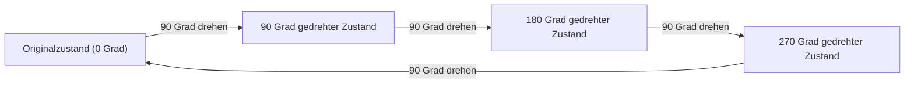
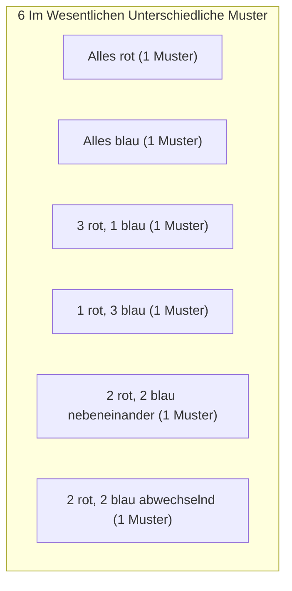

## 1. Einführung: Das Problem des Zählens und der Symmetrie

In der mathematischen Kombinatorik ist "das Zählen der Anzahl der Dinge, die eine bestimmte Bedingung erfüllen" ein sehr grundlegendes und wichtiges Thema. Mit den in der Schule gelehrten Formeln für Permutation und Kombination können viele Probleme gelöst werden. Wenn wir jedoch reale oder geometrische Probleme betrachten, stehen wir manchmal vor komplexen Situationen, die nicht durch bloße Anwendung von Formeln angegangen werden können.

Ein typisches Beispiel dafür ist die **"Aufzählung von Objekten mit Symmetrie"**. Symmetrie bezieht sich auf die Eigenschaft, dass sich die Gesamtform oder -beschaffenheit nicht ändert, selbst wenn eine bestimmte Operation (wie eine Rotation oder Reflexion) durchgeführt wird.

Angenommen, wir machen eine Halskette, indem wir vier Perlen zu einer Schleife auffädeln. Die verfügbaren Perlenfarben sind "rot" und "blau". Wie viele verschiedene Halskettendesigns gibt es in diesem Fall insgesamt?

In diesem Artikel werden wir ausgehend von dieser scheinbar einfachen Frage das leistungsstarke mathematische Werkzeug für das Zählen unter Berücksichtigung der Symmetrie, das **"[Lemma von Burnside](https://kenji.blog/de/p/burnsides-lemma/)"**, von den Grundlagen bis zu seinen Anwendungen im Detail erklären. Dies ist ein perfektes Thema für eine praktische Einführung in die Gruppentheorie, also bleiben Sie bitte bis zum Ende bei uns.

## 2. Die Tücken des einfachen Zählens

Lassen Sie uns zunächst auf einfachste Weise darüber nachdenken. Nehmen wir an, dass jede der vier Perlen ihre Farbe unabhängig wählen kann. Für jede Perle gibt es 2 Möglichkeiten: rot oder blau. Daher ist die Gesamtzahl der Farbkombinationen wie folgt:

$$
2 \times 2 \times 2 \times 2 = 2^4 = 16 \text{ Möglichkeiten}
$$

In der Tat, wenn es sich um eine "Schnur" handeln würde, bei der die Perlen in einer Reihe aufgereiht sind, wäre diese Antwort von $16$ Möglichkeiten richtig. Was wir jedoch betrachten, ist eine "Halskette". Eine Halskette soll um den Hals getragen werden und kann im Raum frei bewegt werden.

Der wichtige Punkt hierbei ist die Tatsache, dass **"Dinge, die bei Rotation identisch werden, als dasselbe Design betrachtet werden sollten"**.

Stellen Sie sich zum Beispiel eine Halskette mit der Färbung "Rot-Blau-Blau-Blau" vor. Wenn Sie diese um 90 Grad im Uhrzeigersinn drehen, wird sie zu "Blau-Rot-Blau-Blau". In einem auf einem Tisch fixierten Koordinatensystem betrachtet, sind dies unterschiedliche Zustände, aber als physische Halskette sind sie genau dasselbe.

Wenn wir einfach sagen, dass es $16$ Möglichkeiten gibt, überzählen wir, indem wir "diejenigen, die sich durch Rotation überlappen" einschließen. Wie können wir diese Duplizierung genau entfernen und nur die Anzahl der im Wesentlichen unterschiedlichen Designs zählen? Hier wird ein Rahmen benötigt, um Symmetrie mathematisch zu beschreiben.

## 3. Grundlagen der "Gruppen", die Symmetrie beschreiben

Um solche Duplizierungen streng und systematisch zu behandeln, verwendet die moderne Mathematik das Konzept einer **"Gruppe"**. Eine Gruppe ist eine Sammlung von "Operationen" oder "Transformationen" auf einem Objekt, die die folgenden vier Axiome (Eigenschaften) erfüllt:

1. **Abgeschlossenheit**: Das Ergebnis der aufeinanderfolgenden Ausführung von zwei in der Gruppe enthaltenen Operationen ist ebenfalls eine in der Gruppe enthaltene Operation.
2. **Assoziativität**: Wenn drei Operationen der Reihe nach ausgeführt werden, ist das Endergebnis dasselbe, unabhängig davon, wie sie gruppiert sind.
3. **Neutrales Element**: Eine Operation des "Nichts-Tuns" ist enthalten, und die Kombination mit jeder anderen Operation lässt die ursprüngliche Operation unverändert.
4. **Inverses Element**: Für jede Operation gibt es immer eine Operation, die sie "vollständig aufhebt (rückgängig macht)".

Sei $G$ die Gruppe, die in diesem Beispiel die "Rotationsoperationen" für die Halskette aus vier Perlen (die wir als die vier Ecken eines Quadrats betrachten) sammelt. Diese Gruppe $G$ umfasst die folgenden 4 Operationen (Elemente):

- $R_0$: Nichts tun (0-Grad-Rotation; dies ist das neutrale Element)
- $R_{90}$: 90 Grad im Uhrzeigersinn drehen
- $R_{180}$: 180 Grad im Uhrzeigersinn drehen
- $R_{270}$: 270 Grad im Uhrzeigersinn drehen

Zum Beispiel ist die Ausführung von $R_{180}$ nach der Ausführung von $R_{90}$ dasselbe wie die Ausführung von $R_{270}$. Außerdem ist das inverse Element von $R_{90}$ $R_{270}$ (zusammen ergeben sie eine 360-Grad-Rotation und kehren zum Original zurück). Auf diese Weise erfüllen diese Operationen alle Axiome einer Gruppe. Eine solche Gruppe wird als **"Zyklische Gruppe"** bezeichnet und manchmal als $C_4$ notiert.

## 4. Gruppenwirkung und Bahnen (Orbits)

Die Wirkung, die eine Gruppe $G$ auf eine bestimmte Menge $X$ hat, wird mathematisch als **"Gruppenwirkung"** bezeichnet. In unserem Beispiel ist die Menge $X$ "die Menge aller $16$ Muster unter Ignorierung von Rotationen", und die Gruppe $G$ sind "die 4 Rotationsoperationen".

Die Sammlung von Mustern, die durch Anwendung aller Operationen der Gruppe auf ein bestimmtes Muster $x$ erhalten wird, wird als **"Bahn"** (Orbit) von diesem $x$ bezeichnet.

Beispielsweise liefert die Anwendung der Operationen von $G$ auf das Muster "Rot-Blau-Blau-Blau" die folgenden 4 Muster:
- $R_0$ anwenden: "Rot-Blau-Blau-Blau"
- $R_{90}$ anwenden: "Blau-Rot-Blau-Blau"
- $R_{180}$ anwenden: "Blau-Blau-Rot-Blau"
- $R_{270}$ anwenden: "Blau-Blau-Blau-Rot"

Diese 4 Muster gehören zur selben "Bahn". Die "Anzahl der im Wesentlichen unterschiedlichen Designs", die wir wissen wollen, ist genau nichts anderes als **"in wie viele verschiedene Bahnen die gesamte Menge $X$ unterteilt ist"**. Dies wird durch die Formel $|X/G|$ bezeichnet.

## 5. [Lemma von Burnside](https://kenji.blog/de/p/burnsides-lemma/)

Hier tritt schließlich der Star dieses Mals, das **[Lemma von Burnside](https://kenji.blog/de/p/burnsides-lemma/)**, auf. Es wird manchmal auch Cauchy-Frobenius-Lemma genannt. Dies ist ein erstaunlicher Lehrsatz, der es uns ermöglicht, die "Anzahl der Bahnen (Anzahl der im Wesentlichen unterschiedlichen Muster)" leicht zu berechnen, wenn eine Gruppe $G$ auf eine endliche Menge $X$ wirkt.

Die Formel für den Lehrsatz lautet wie folgt:

$$
|X/G| = \frac{1}{|G|} \sum_{g \in G} |X^g|
$$

Lassen Sie uns die Bedeutung jedes in der Formel vorkommenden Symbols im Detail betrachten:

- $|X/G|$: Die Anzahl der zu findenden im Wesentlichen unterschiedlichen Muster (Gesamtzahl der Bahnen).
- $|G|$: Die Gesamtzahl der in der Gruppe $G$ enthaltenen Operationen. Bei diesem Halskettenproblem gibt es 4 Rotationen, also ist $|G| = 4$.
- $g$: Jede in der Gruppe $G$ enthaltene Operation.
- $X^g$: Die Menge von Mustern, die sich "nicht ändern (fixiert sind)", selbst wenn die Operation $g$ durchgeführt wird.
- $|X^g|$: Die Anzahl der durch die Operation $g$ fixierten Muster. Dies wird als **"Anzahl der Fixpunkte"** bezeichnet.

Was diese Formel bedeutet, ist sehr intuitiv. Das [Lemma von Burnside](https://kenji.blog/de/p/burnsides-lemma/) besagt, dass wir die gewünschte Anzahl von Bahnen erhalten können, indem wir **"die 'Anzahl der unveränderlichen Muster (Anzahl der Fixpunkte)' für jede Operation zählen, alle addieren und durch die Gesamtzahl der Operationen dividieren (d.h. den Durchschnitt bilden)"**.

Die größte Stärke dieses Lehrsatzes ist, dass er die komplexe Beurteilung von Duplikaten in unabhängige, einfache Berechnungen von "Zählen, was sich unter jeder Operation nicht ändert" zerlegen kann.

## 6. Anwendung und Berechnung für das Halskettenproblem

Lassen Sie uns nun tatsächlich das [Lemma von Burnside](https://kenji.blog/de/p/burnsides-lemma/) verwenden, um die Anzahl der Designs für eine Halskette mit 4 Perlen (2 Farben, rot und blau) zu berechnen.
Die Anzahl der Elemente in der ursprünglichen Menge der Muster $X$ ist $16$. Wir werden die Anzahl der Fixpunkte $|X^g|$ für jede Operation $g \in G$ der Gruppe $G$ nacheinander untersuchen.

### 6.1. Fixpunkte für Nichts-Tun ($R_0$)
Diese Operation bedeutet "nichts bewegen". Daher bleiben alle $16$ Muster durch diese Operation völlig unverändert.
$$ |X^{R_0}| = 16 $$

### 6.2. Fixpunkte für 90-Grad-Rotation ($R_{90}$)
Was muss getan werden, damit es genau dasselbe Muster wie vor der Rotation wird, wenn es um 90 Grad gedreht wird?
Die 1. Perle rückt an die 2. Position, die 2. an die 3., die 3. an die 4. und die 4. an die 1. Damit diese dieselbe Farbe haben, **"müssen alle Perlen dieselbe Farbe haben"**.
Die einzigen, die die Bedingung erfüllen, sind $2$ Möglichkeiten: "alle rot" oder "alle blau".
$$ |X^{R_{90}}| = 2 $$

### 6.3. Fixpunkte für 180-Grad-Rotation ($R_{180}$)
Damit es durch 180-Grad-Rotation mit dem Original übereinstimmt, müssen die einander gegenüberliegenden (auf der Diagonale) Perlen dieselbe Farbe haben.
Ein Quadrat hat 2 Diagonalen. Für jedes Paar von Diagonalen können wir frei "rot" oder "blau" wählen.
Daher gibt es $2 \times 2 = 4$ Möglichkeiten.
$$ |X^{R_{180}}| = 4 $$

### 6.4. Fixpunkte für 270-Grad-Rotation ($R_{270}$)
Eine 270-Grad-Rotation (90-Grad-Rotation gegen den Uhrzeigersinn) ist physikalisch dieselbe Situation wie eine 90-Grad-Rotation. Die Muster vor und nach der Rotation stimmen nur überein, wenn alle Perlen dieselbe Farbe haben.
Daher gibt es nur $2$ Möglichkeiten: "alle rot" oder "alle blau".
$$ |X^{R_{270}}| = 2 $$

### 6.5. Berechnung des Endergebnisses
Nun haben wir alle Anzahlen von Fixpunkten für alle Operationen. Wir setzen diese in die Formel des Lemmas von Burnside ein.

$$
|X/G| = \frac{|X^{R_0}| + |X^{R_{90}}| + |X^{R_{180}}| + |X^{R_{270}}|}{|G|}
$$
$$
|X/G| = \frac{16 + 2 + 4 + 2}{4} = \frac{24}{4} = 6
$$

Als Ergebnis der Berechnung wurde bewiesen, dass es **$6$ Möglichkeiten** für im Wesentlichen unterschiedliche Halskettendesigns gibt, wenn Rotationen als identisch betrachtet werden.

Die folgende Abbildung zeigt diese $6$ unabhängigen Muster.

## 7. Diedergruppe: Wenn Reflexionen berücksichtigt werden

Eine echte Halskette kann auch "auf links (umgedreht)" werden, während sie auf einem Schreibtisch liegt. Wenn wir die Bedingung hinzufügen, "Designs, die beim Umdrehen gleich werden, werden ebenfalls als identisch betrachtet", was passiert mit dem Ergebnis?

In diesem Fall umfasst die Zielgruppe $G$ nicht nur "Rotationen", sondern auch "Reflexions-" (Umdreh-) Operationen. Eine Gruppe, die alle Rotationen und Reflexionen eines regelmäßigen Polygons umfasst, wird mathematisch als **"Diedergruppe"** bezeichnet, notiert als $D_n$. Da es sich um ein Quadrat handelt, ist es $D_4$.

Die Diedergruppe $D_4$ umfasst zusätzlich zu den 4 Rotationen von vorhin die folgenden 4 Reflexionsoperationen. Daher ist die Gesamtzahl der Elemente $|G| = 8$.

- $F_v$: Reflexion an der vertikalen Achse
- $F_h$: Reflexion an der horizontalen Achse
- $F_{d1}$: Reflexion an der Hauptdiagonale
- $F_{d2}$: Reflexion an der Antidiagonale

Auch für diese neuen Operationen zählen wir die Anzahl der Fixpunkte $|X^g|$ auf die gleiche Weise.

### 7.1. Reflexion an der vertikalen und horizontalen Achse ($F_v, F_h$)
Um beim Umdrehen an der vertikalen Achse identisch zu sein, muss es links-rechts-symmetrisch sein. Wenn wir die Farben der beiden Perlen auf der linken Seite frei wählen ($2 \times 2 = 4$ Möglichkeiten), werden die Farben der Perlen auf der rechten Seite automatisch bestimmt. Die horizontale Achse ist ähnlich oben-unten-symmetrisch, also gibt es $4$ Möglichkeiten.
$$ |X^{F_v}| = 4, \quad |X^{F_h}| = 4 $$

### 7.2. Reflexion an Diagonalen ($F_{d1}, F_{d2}$)
Beim Umdrehen an der Hauptdiagonale bewegen sich die beiden Perlen auf der Diagonale nicht, sodass ihre Farben frei gewählt werden können ($2 \times 2 = 4$ Möglichkeiten). Die verbleibenden zwei Perlen tauschen ihre Plätze miteinander, also müssen sie dieselbe Farbe haben ($2$ Möglichkeiten). Das sind also $4 \times 2 = 8$ Möglichkeiten. Die Antidiagonale ist dasselbe.
$$ |X^{F_{d1}}| = 8, \quad |X^{F_{d2}}| = 8 $$

### 7.3. Berechnung der Ergebnisse in der Diedergruppe
Setzen Sie alle erhaltenen Anzahlen von Fixpunkten in die Formel ein.

$$
|X/G| = \frac{16 (\text{Rotationen}) + 2 (\text{Rotationen}) + 4 (\text{Rotationen}) + 2 (\text{Rotationen}) + 4 (\text{Reflexionen}) + 4 (\text{Reflexionen}) + 8 (\text{Reflexionen}) + 8 (\text{Reflexionen})}{8}
$$
$$
|X/G| = \frac{48}{8} = 6
$$

Zufällig wurde in diesem speziellen Fall (4 Perlen, 2 Farben) festgestellt, dass die im Wesentlichen verschiedenen Typen **$6$ Möglichkeiten** bleiben, selbst wenn Reflexion berücksichtigt wird. Dies liegt daran, dass alle $6$ Muster, die wir zuvor gefunden haben, bereits ihre eigenen reflektierten Muster enthielten (wenn die Rotation einbezogen wird). Wenn jedoch die Anzahl der Perlen oder Farben steigt, unterscheiden sich die Ergebnisse stark zwischen der reinen Rotationsgruppe $C_n$ und der Diedergruppe $D_n$.

## 8. Skizze des Beweises für das [Lemma von Burnside](https://kenji.blog/de/p/burnsides-lemma/)

Warum ergibt die "durchschnittliche Anzahl von Fixpunkten" die "Anzahl der Bahnen"? Dahinter verbirgt sich ein sehr wichtiger Lehrsatz der Gruppentheorie, der **"Bahnensatz"** (Orbit-Stabilisator-Satz) genannt wird.

Lassen Sie uns kurz die Skizze des Beweises erklären.
Betrachten wir zunächst das Zählen der Gesamtzahl der Paare $(x, g)$ von Elementen in der Menge $X$ und der Gruppe $G$, sodass "$x$ durch die Operation $g$ fixiert ist ($g \cdot x = x$)". Wir zählen dies auf zwei Arten.

1. **Zählmethode pro Operation $g$**:
   Summieren Sie für jede Operation $g$ die Anzahl der fixierten $x$, $|X^g|$. Das ist $\sum_{g \in G} |X^g|$.

2. **Zählmethode pro Element $x$**:
   Für jedes Element $x$ wird die Sammlung der Operationen $g$, die $x$ fixieren, als **"Stabilisator"** bezeichnet, geschrieben als $G_x$. Die Gesamtzahl ist dann $\sum_{x \in X} |G_x|$.

Nach dem Bahnensatz gilt: Wenn $|O_x|$ die Größe der Bahn ist, zu der das Element $x$ gehört, gilt $|G| = |O_x| \times |G_x|$.
Durch Umstellen erhalten wir $|G_x| = \frac{|G|}{|O_x|}$.

Daher,
$$
\sum_{g \in G} |X^g| = \sum_{x \in X} |G_x| = \sum_{x \in X} \frac{|G|}{|O_x|} = |G| \sum_{x \in X} \frac{1}{|O_x|}
$$

Wenn wir hier Elemente, die zur selben Bahn gehören, sammeln und aufsummieren, ergibt sich $\sum_{x \in O_i} \frac{1}{|O_i|} = 1$. Das bedeutet, dass die Summation über alle $x$ gleichbedeutend mit dem Zählen der Anzahl der Bahnen $|X/G|$ ist.

$$
|G| \sum_{x \in X} \frac{1}{|O_x|} = |G| \times |X/G|
$$

Indem man beide Seiten durch $|G|$ dividiert, erhält man die Formel für das [Lemma von Burnside](https://kenji.blog/de/p/burnsides-lemma/). Es ist eine sehr schöne und raffinierte logische Entwicklung.

## 9. Entwicklung zum Abzählsatz von Pólya

Das [Lemma von Burnside](https://kenji.blog/de/p/burnsides-lemma/) ist leistungsstark, aber das manuelle Finden der Anzahl von Fixpunkten nacheinander wird schwierig, wenn der Umfang des Problems zunimmt. Bei einem Problem wie "Wie viele Möglichkeiten gibt es, jede Seite eines regelmäßigen Dodekaeders mit 3 Farben zu bemalen?" gibt es beispielsweise 60 Arten von Rotationsoperationen, was die Berechnung enorm macht.

Die weitere Verallgemeinerung davon und die Ermöglichung mechanischer Berechnungen unter Verwendung algebraischer Polynome (Zyklenzeiger) ist der **"Abzählsatz von Pólya"**.

Das [Lemma von Burnside](https://kenji.blog/de/p/burnsides-lemma/) ist ein wichtiger Schritt zum Verständnis des Satzes von Pólya und legt den Grundstein für gruppentheoretische Abzählungen.

## 10. Historischer Hintergrund des Lemmas von Burnside

Tatsächlich wurde dieser Lehrsatz nicht zuerst von William Burnside entdeckt. Er wurde in Burnsides 1897 veröffentlichtem Buch "Theory of Groups of Finite Order" eingeführt und wurde weithin populär, weshalb er seinen Namen trägt.

Historisch gesehen hatte [Augustin-Louis Cauchy](https://kenji.blog/de/p/cauchy/) jedoch bereits 1845 einen Spezialfall dieses Lehrsatzes (bezüglich symmetrischer Gruppen) veröffentlicht, und später 1887 lieferte Ferdinand Georg Frobenius einen Beweis für endliche Gruppen im Allgemeinen.

Deshalb nennen diejenigen, die versuchen, bei der Mathematikgeschichte streng zu sein, diesen Lehrsatz manchmal spielerisch das **"Cauchy-Frobenius-Lemma"** oder **"Das Lemma, das nicht von Burnside ist"**. Unabhängig vom Ursprung seines Namens ist die Bedeutung der Rolle, die dieses Lemma in der Geschichte der Gruppentheorie und Kombinatorik gespielt hat, unermesslich.

## 11. Beispiel 2: Färben der Seiten eines Würfels

Um die Leistungsfähigkeit des Lemmas von Burnside weiter zu veranschaulichen, lassen Sie uns ein weiteres berühmtes Beispiel geben. Es ist das Problem: "Wie viele Möglichkeiten gibt es, die 6 Seiten eines Würfels mit 2 Farben, rot und blau, zu bemalen?" Auch hier behandeln wir diejenigen als identisch, die beim Rotieren gleich werden.

Die Rotationsgruppe eines Würfels besteht aus den folgenden 24 Operationen:
1. **Nichts tun**: 1 Operation
2. **Rotationen um Achsen, die die Mittelpunkte gegenüberliegender Flächen verbinden**: 6 für 90-Grad-Rotationen (3 Achsen × 2), 3 für 180-Grad-Rotationen (3 Achsen × 1) (Gesamt 9)
3. **Rotationen um Achsen, die gegenüberliegende Ecken verbinden**: 2 für jede der 4 Diagonalen für 120-Grad- und 240-Grad-Rotationen (Gesamt 8)
4. **Rotationen um Achsen, die die Mittelpunkte gegenüberliegender Kanten verbinden**: 1 für jede der 6 Achsen für 180-Grad-Rotationen (Gesamt 6)

Es gibt insgesamt $1 + 9 + 8 + 6 = 24$ Elemente ($|G| = 24$).

Durch Berechnen der Anzahl der Fixpunkte (Färbungen, bei denen sich die Farben nicht ändern) für jede Rotationsoperation und Bilden des Durchschnitts kann die Gesamtzahl der Möglichkeiten zum Färben des Würfels gefunden werden. Selbst für ein Problem, das intuitiv extrem schwer zu zählen ist, reduziert die Verwendung des Lemmas von Burnside es auf "lokale" Probleme der Symmetrie entlang jeder Rotationsachse. Folglich ist bekannt, dass die Anzahl der Möglichkeiten, diesen Würfel zu färben, **$10$ Möglichkeiten** beträgt.

## 12. Fazit

Wie war es? In diesem Artikel haben wir am Beispiel der Anzahl der Halskettendesigns das [Lemma von Burnside](https://kenji.blog/de/p/burnsides-lemma/) im Detail erklärt.

*   Einfache Permutation und Kombination können Duplikationen aufgrund von Symmetrie nicht gut bewältigen.
*   Symmetrie kann mathematisch mithilfe einer **"Gruppe"** beschrieben werden.
*   Unter Verwendung des **Lemmas von Burnside** kann die Anzahl der im Wesentlichen unterschiedlichen Muster durch das mechanische Verfahren der "Mittelung der Anzahl von Fixpunkten in jeder Operation" berechnet werden.
*   Dieser Lehrsatz basiert auf einer tiefen Eigenschaft der Gruppentheorie, die als Bahnensatz (Orbit-Stabilisator-Satz) bezeichnet wird.

Das [Lemma von Burnside](https://kenji.blog/de/p/burnsides-lemma/) ist ein sehr praktischer Lehrsatz, der in einer Vielzahl von Bereichen angewendet wird, wie z.B. bei der Zählung von molekularen Isomeren in der Chemie, der Bestimmung der Graphenisomorphie in der Graphentheorie und sogar in der statistischen Mechanik der Physik.

Wir hoffen, dass Sie durch die diesmal vorgestellten Grundlagen einen Einblick gewinnen konnten, wie das oft abstrakt erscheinende Feld der Mathematik namens "Gruppentheorie" konkrete reale Probleme brillant lösen kann.
