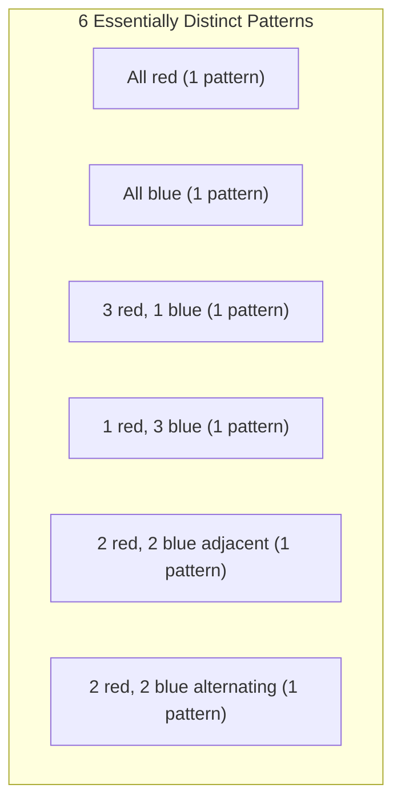

## 1. Introduction: The Problem of Counting and Symmetry

In mathematical combinatorics, "counting the number of things that satisfy a certain condition" is a very basic and important theme. Using the formulas for permutation and combination taught in school, many problems can be solved. However, when considering real-world or geometric problems, we sometimes face complex situations that cannot be tackled by mere application of formulas.

A typical example of this is the **"enumeration of objects with symmetry"**. Symmetry refers to the property that the overall shape or nature does not change even if a certain operation (such as rotation or reflection) is performed.

For example, suppose we make a necklace by stringing four beads together into a loop. The colors of the beads available are "red" and "blue". In this case, how many different necklace designs are there in total?

In this article, starting from this seemingly simple question, we will explain in detail the powerful mathematical tool for counting with symmetry considered, **"Burnside's Lemma"**, from the basics to its applications. This is a perfect topic for a practical introduction to Group Theory, so please stay with us until the end.

## 2. The Pitfalls of Simple Counting

First, let's think about it in the simplest way. Assume that each of the four beads can independently choose its color. For each bead, there are 2 choices: red or blue. Therefore, the total number of color combinations is as follows:

$$
2 \times 2 \times 2 \times 2 = 2^4 = 16 \text{ ways}
$$

Indeed, if it were a "string" where the beads are lined up in a row, this answer of $16$ ways would be correct. However, what we are considering is a "necklace". A necklace is meant to be worn around the neck and can be freely moved in space.

The important point here is the fact that **"things that become identical when rotated should be considered the same design"**.

For example, imagine a necklace with the coloring "Red-Blue-Blue-Blue". If you rotate this 90 degrees clockwise, it becomes "Blue-Red-Blue-Blue". Viewed in a coordinate system fixed on a table, these are different states, but as a physical necklace, they are exactly the same thing.

If we simply say there are $16$ ways, we are overcounting the "ones that overlap by rotation". How can we accurately remove this duplication and count only the number of essentially different designs? This is where a framework to mathematically describe symmetry is needed.

## 3. Basics of "Groups" Describing Symmetry

To handle such duplications strictly and systematically, modern mathematics uses the concept of a **"Group"**. A group is a collection of "operations" or "transformations" on an object that satisfies the following four axioms (properties):

1. **Closure**: The result of consecutively performing two operations included in the group is also an operation included in the group.
2. **Associativity**: When three operations are performed in order, the final result is the same regardless of how they are grouped.
3. **Identity element**: An operation of "doing nothing" is included, and combining it with any other operation leaves the original operation unchanged.
4. **Inverse element**: For any operation, there always exists an operation that "completely cancels out (reverts)" it.

Let $G$ be the group collecting the "rotation operations" for the necklace of four beads (which we consider as the four vertices of a square) in this example. This group $G$ includes the following 4 operations (elements):

- $R_0$: Do nothing (0-degree rotation; this is the identity element)
- $R_{90}$: Rotate 90 degrees clockwise
- $R_{180}$: Rotate 180 degrees clockwise
- $R_{270}$: Rotate 270 degrees clockwise

For example, performing $R_{180}$ after performing $R_{90}$ is the same as performing $R_{270}$. Also, the inverse element of $R_{90}$ is $R_{270}$ (together they make a 360-degree rotation and return to the original). In this way, these operations satisfy all the axioms of a group. Such a group is called a **"Cyclic group"**, sometimes denoted as $C_4$.

## 4. Group Action and Orbits

The effect a group $G$ has on a certain set $X$ is mathematically called a **"Group action"**. In our example, the set $X$ is "the set of all $16$ patterns ignoring rotations", and the group $G$ is "the 4 rotation operations".

The collection of patterns obtained by applying all operations of the group to a certain pattern $x$ is called the **"Orbit"** of that $x$.

For instance, applying the operations of $G$ to the pattern "Red-Blue-Blue-Blue" yields the following 4 patterns:
- Apply $R_0$: "Red-Blue-Blue-Blue"
- Apply $R_{90}$: "Blue-Red-Blue-Blue"
- Apply $R_{180}$: "Blue-Blue-Red-Blue"
- Apply $R_{270}$: "Blue-Blue-Blue-Red"

These 4 patterns belong to the same "Orbit". The "number of essentially different designs" we want to know is exactly nothing but **"how many different orbits the entire set $X$ is partitioned into"**. This is denoted by the formula $|X/G|$.

## 5. Burnside's Lemma

Here finally, the star of this time, **Burnside's Lemma**, makes its appearance. It is also sometimes called the Cauchy-Frobenius lemma. This is an astonishing theorem that allows us to easily calculate the "number of orbits (number of essentially different patterns)" when a group $G$ acts on a finite set $X$.

The formula for the theorem is as follows:

$$
|X/G| = \frac{1}{|G|} \sum_{g \in G} |X^g|
$$

Let's look at the meaning of each symbol appearing in the formula in detail:

- $|X/G|$: The number of essentially different patterns to be found (total number of orbits).
- $|G|$: The total number of operations included in the group $G$. In this necklace problem, there are 4 rotations, so $|G| = 4$.
- $g$: Each operation included in the group $G$.
- $X^g$: The set of patterns that "do not change (are fixed)" even when operation $g$ is performed.
- $|X^g|$: The number of patterns fixed by operation $g$. This is called the **"number of fixed points"**.

What this formula means is very intuitive. Burnside's Lemma asserts that we can obtain the desired number of orbits by **"counting the 'number of unchanging patterns (number of fixed points)' for each operation, adding them all up, and dividing by the total number of operations (i.e., taking the average)"**.

The greatest strength of this theorem is that it can break down the complex judgment of duplicates into independent, simple calculations of "counting what does not change under each operation".

## 6. Application and Calculation for the Necklace Problem

Now, let's actually use Burnside's Lemma to calculate the number of designs for a necklace with 4 beads (2 colors, red and blue).
The number of elements in the original set of patterns $X$ is $16$. We will investigate the number of fixed points $|X^g|$ for each operation $g \in G$ of the group $G$ one by one.

### 6.1. Fixed points for doing nothing ($R_0$)
This operation is "moving nothing". Therefore, all $16$ patterns are completely unchanged by this operation.
$$ |X^{R_0}| = 16 $$

### 6.2. Fixed points for 90-degree rotation ($R_{90}$)
What needs to be done to make it exactly the same pattern as before rotation by rotating it 90 degrees?
The 1st bead moves to the 2nd position, the 2nd to the 3rd, the 3rd to the 4th, and the 4th to the 1st. For these to be the same color, **"all beads must be the same color"**.
The only ones that satisfy the condition are $2$ ways: "all red" or "all blue".
$$ |X^{R_{90}}| = 2 $$

### 6.3. Fixed points for 180-degree rotation ($R_{180}$)
For it to be the same as the original by rotating 180 degrees, the beads facing each other (on the diagonal) must be the same color.
A square has 2 diagonals. For each pair of diagonals, we can freely choose "red" or "blue".
Therefore, there are $2 \times 2 = 4$ ways.
$$ |X^{R_{180}}| = 4 $$

### 6.4. Fixed points for 270-degree rotation ($R_{270}$)
A 270-degree rotation (90-degree counterclockwise rotation) is physically the same situation as a 90-degree rotation. The patterns before and after rotation will not match unless all beads are the same color.
Therefore, there are only $2$ ways: "all red" or "all blue".
$$ |X^{R_{270}}| = 2 $$

### 6.5. Calculation of the final result
Now, we have all the numbers of fixed points for all operations. We substitute these into the formula of Burnside's Lemma.

$$
|X/G| = \frac{|X^{R_0}| + |X^{R_{90}}| + |X^{R_{180}}| + |X^{R_{270}}|}{|G|}
$$
$$
|X/G| = \frac{16 + 2 + 4 + 2}{4} = \frac{24}{4} = 6
$$

As a result of the calculation, it has been proved that there are **$6$ ways** for essentially different necklace designs when rotations are considered identical.

The figure below shows those $6$ independent patterns.

## 7. Dihedral Group: When Considering Reflections

A real necklace can also be turned "inside out (flipped)" while lying on a desk. If we add the condition "designs that become the same when flipped are also considered identical", what happens to the result?

In this case, the target group $G$ will include not only "rotations" but also "reflection (flipping)" operations. A group that includes all rotations and reflections of a regular polygon is mathematically called a **"Dihedral group"**, denoted as $D_n$. Since this is a square, it's $D_4$.

The dihedral group $D_4$ includes the following 4 reflection operations in addition to the 4 rotations from earlier. Therefore, the total number of elements is $|G| = 8$.

- $F_v$: Reflection across the vertical axis
- $F_h$: Reflection across the horizontal axis
- $F_{d1}$: Reflection across the main diagonal
- $F_{d2}$: Reflection across the anti-diagonal

For these new operations as well, we count the number of fixed points $|X^g|$ in the same way.

### 7.1. Reflection across the vertical and horizontal axes ($F_v, F_h$)
To be identical when flipped across the vertical axis, it must be symmetric left-to-right. If we freely choose the colors of the two beads on the left ($2 \times 2 = 4$ ways), the colors of the beads on the right are automatically determined. The horizontal axis is similarly top-to-bottom symmetric, so there are $4$ ways.
$$ |X^{F_v}| = 4, \quad |X^{F_h}| = 4 $$

### 7.2. Reflection across diagonals ($F_{d1}, F_{d2}$)
When flipping across the main diagonal, the two beads on the diagonal do not move, so their colors can be freely chosen ($2 \times 2 = 4$ ways). The remaining two beads swap places with each other, so they need to be the same color ($2$ ways). Thus, it's $4 \times 2 = 8$ ways. The anti-diagonal is the same.
$$ |X^{F_{d1}}| = 8, \quad |X^{F_{d2}}| = 8 $$

### 7.3. Calculation of results in the dihedral group
Substitute all obtained numbers of fixed points into the formula.

$$
|X/G| = \frac{16 (\text{rotations}) + 2 (\text{rotations}) + 4 (\text{rotations}) + 2 (\text{rotations}) + 4 (\text{reflections}) + 4 (\text{reflections}) + 8 (\text{reflections}) + 8 (\text{reflections})}{8}
$$
$$
|X/G| = \frac{48}{8} = 6
$$

Coincidentally, in this specific case (4 beads, 2 colors), it was found that the essentially distinct types remain **$6$ ways** even when reflection is considered. This is because all $6$ patterns we found earlier already included their own reflected patterns (if rotation is included). However, if the number of beads or colors increases, the results will differ greatly between the group of rotations only $C_n$ and the dihedral group $D_n$.

## 8. Sketch of the Proof of Burnside's Lemma

Why does taking the "average of the number of fixed points" result in the "number of orbits"? Behind this lies a very important theorem in group theory called the **"Orbit-Stabilizer Theorem"**.

Let's briefly explain the sketch of the proof.
First, consider counting the total number of pairs $(x, g)$ of elements in the set $X$ and the group $G$ such that "$x$ is fixed by operation $g$ ($g \cdot x = x$)". We count this in two ways.

1. **Method of counting per operation $g$**:
   For each operation $g$, sum up the number of fixed $x$, $|X^g|$. That is, $\sum_{g \in G} |X^g|$.

2. **Method of counting per element $x$**:
   For each element $x$, the collection of operations $g$ that fix $x$ is called the **"Stabilizer"**, written as $G_x$. Then, the total number is $\sum_{x \in X} |G_x|$.

According to the orbit-stabilizer theorem, if $|O_x|$ is the size of the orbit to which element $x$ belongs, $|G| = |O_x| \times |G_x|$ holds.
Transforming this, we get $|G_x| = \frac{|G|}{|O_x|}$.

Therefore,
$$
\sum_{g \in G} |X^g| = \sum_{x \in X} |G_x| = \sum_{x \in X} \frac{|G|}{|O_x|} = |G| \sum_{x \in X} \frac{1}{|O_x|}
$$

Here, if we collect elements belonging to the same orbit and sum them up, $\sum_{x \in O_i} \frac{1}{|O_i|} = 1$. This means that summing over all $x$ is equivalent to counting the number of orbits $|X/G|$.

$$
|G| \sum_{x \in X} \frac{1}{|O_x|} = |G| \times |X/G|
$$

By dividing both sides by $|G|$, we get the formula for Burnside's Lemma. It is a very beautiful and sophisticated logical development.

## 9. Development into Pólya Enumeration Theorem

Burnside's Lemma is powerful, but manually finding the number of fixed points one by one becomes difficult as the scale of the problem increases. For example, for a problem like "How many ways are there to paint each face of a regular dodecahedron with 3 colors?", there are 60 types of rotation operations, making the calculation enormous.

Generalizing this further and enabling mechanical calculation using algebraic polynomials (Cycle Index) is the **"Pólya Enumeration Theorem"**.

Burnside's Lemma is an important step toward understanding Pólya's theorem, laying the foundation for group-theoretic enumeration.

## 10. Historical Background of Burnside's Lemma

Actually, this theorem was not first discovered by William Burnside. It was introduced in Burnside's book "Theory of Groups of Finite Order" published in 1897 and became widely popularized, so it bears his name.

However, historically, Augustin-Louis Cauchy had already published a special case of this theorem (regarding symmetric groups) in 1845, and later in 1887 Ferdinand Georg Frobenius gave a proof for general finite groups.

Therefore, those who try to be rigorous about mathematical history sometimes playfully call this theorem the **"Cauchy-Frobenius Lemma"** or **"The Lemma that is not Burnside's"**. Regardless of the origin of its name, the magnitude of the role this lemma has played in the history of group theory and combinatorics is immeasurable.

## 11. Example 2: Coloring the Faces of a Cube

To further realize the power of Burnside's Lemma, let's give another famous example. It is the problem: "How many ways are there to paint the 6 faces of a cube with 2 colors, red and blue?" Here too, we treat those that become the same when rotated as identical.

The rotation group of a cube consists of the following 24 operations:
1. **Do nothing**: 1 operation
2. **Rotations around axes connecting the centers of opposite faces**: 6 for 90-degree rotations (3 axes × 2), 3 for 180-degree rotations (3 axes × 1) (Total 9)
3. **Rotations around axes connecting opposite vertices**: 2 for each of the 4 diagonals for 120-degree and 240-degree rotations (Total 8)
4. **Rotations around axes connecting the midpoints of opposite edges**: 1 for each of the 6 axes for 180-degree rotations (Total 6)

There is a total of $1 + 9 + 8 + 6 = 24$ elements ($|G| = 24$).

By calculating the number of fixed points (colorings where the colors do not change) for each rotation operation and taking the average, the total number of ways to color the cube can be found. Even for a problem that is extremely difficult to count intuitively, using Burnside's Lemma reduces it to "local" problems of symmetry along each rotation axis. As a result, it is known that the number of ways to color this cube is **$10$ ways**.

## 12. Conclusion

How was it? In this article, using the number of necklace designs as an example, we explained Burnside's Lemma in detail.

*   Simple permutation and combination cannot handle duplication due to symmetry well.
*   Symmetry can be described mathematically using a **"Group"**.
*   Using **Burnside's Lemma**, the number of essentially different patterns can be calculated by the mechanical procedure of "averaging the number of fixed points in each operation".
*   This theorem is based on a deep property of group theory called the Orbit-Stabilizer Theorem.

Burnside's Lemma is a very practical theorem applied in a wide range of fields, such as enumerating molecular isomers in chemistry, determining graph isomorphism in graph theory, and even statistical mechanics in physics.

Through the basics introduced this time, we hope you could feel a glimpse of how the field of mathematics called "Group Theory", which tends to look abstract, can brilliantly solve concrete real-world problems.
