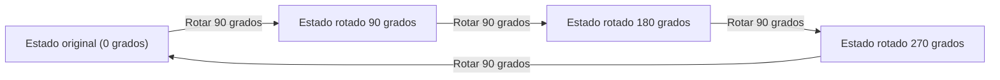
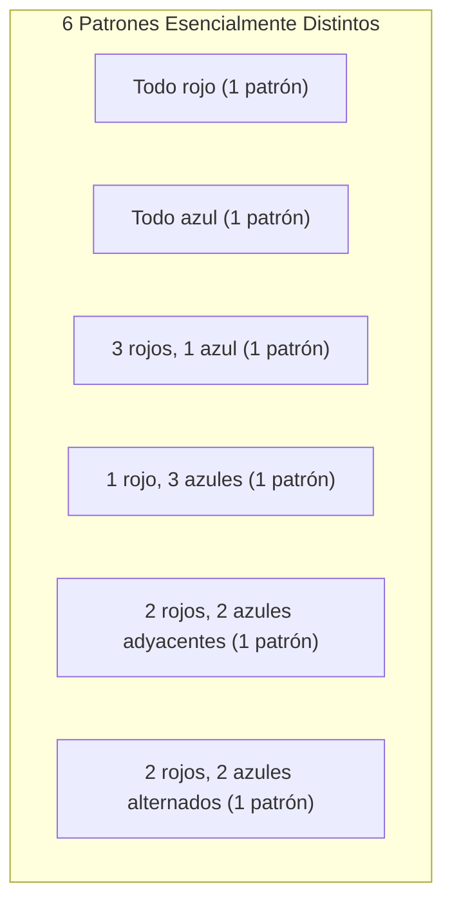

## 1. Introducción: El problema del conteo y la simetría

En la combinatoria matemática, "contar la cantidad de elementos que cumplen una determinada condición" es un tema muy básico e importante. Usando las fórmulas para permutaciones y combinaciones que se enseñan en la escuela, se pueden resolver muchos problemas. Sin embargo, al considerar problemas geométricos o del mundo real, a veces nos enfrentamos a situaciones complejas que no pueden resolverse con la mera aplicación de fórmulas.

Un ejemplo típico de esto es la **"enumeración de objetos con simetría"**. La simetría se refiere a la propiedad de que la forma o naturaleza general no cambia incluso si se realiza una cierta operación (como una rotación o reflexión).

Por ejemplo, suponga que hacemos un collar ensartando cuatro cuentas en un bucle. Los colores de las cuentas disponibles son "rojo" y "azul". En este caso, ¿cuántos diseños de collares diferentes hay en total?

En este artículo, a partir de esta pregunta aparentemente simple, explicaremos en detalle la poderosa herramienta matemática para contar considerando la simetría, el **"[Lema de Burnside](https://kenji.blog/es/p/burnsides-lemma/)"**, desde los conceptos básicos hasta sus aplicaciones. Este es un tema perfecto para una introducción práctica a la Teoría de Grupos, así que acompáñenos hasta el final.

## 2. Las trampas del conteo simple

Primero, pensémoslo de la manera más sencilla. Asuma que cada una de las cuatro cuentas puede elegir su color de manera independiente. Para cada cuenta, hay 2 opciones: rojo o azul. Por lo tanto, el número total de combinaciones de colores es el siguiente:

$$
2 \times 2 \times 2 \times 2 = 2^4 = 16 \text{ formas}
$$

De hecho, si fuera una "cuerda" donde las cuentas están alineadas en fila, esta respuesta de $16$ formas sería correcta. Sin embargo, lo que estamos considerando es un "collar". Un collar está destinado a usarse alrededor del cuello y se puede mover libremente en el espacio.

El punto importante aquí es el hecho de que **"las cosas que se vuelven idénticas al rotarlas deben considerarse el mismo diseño"**.

Por ejemplo, imagine un collar con los colores "Rojo-Azul-Azul-Azul". Si gira esto 90 grados en el sentido de las agujas del reloj, se convierte en "Azul-Rojo-Azul-Azul". Vistos en un sistema de coordenadas fijo en una mesa, estos son estados diferentes, pero como collar físico, son exactamente lo mismo.

Si simplemente decimos que hay $16$ formas, estamos sobrestimando el conteo al incluir "los que se superponen por rotación". ¿Cómo podemos eliminar con precisión esta duplicación y contar solo el número de diseños esencialmente diferentes? Aquí es donde se necesita un marco para describir matemáticamente la simetría.

## 3. Conceptos básicos de "Grupos" que describen la simetría

Para manejar tales duplicaciones de manera estricta y sistemática, la matemática moderna utiliza el concepto de **"Grupo"**. Un grupo es una colección de "operaciones" o "transformaciones" sobre un objeto que satisface los siguientes cuatro axiomas (propiedades):

1. **Clausura**: El resultado de realizar consecutivamente dos operaciones incluidas en el grupo es también una operación incluida en el grupo.
2. **Asociatividad**: Cuando se realizan tres operaciones en orden, el resultado final es el mismo independientemente de cómo se agrupen.
3. **Elemento neutro**: Se incluye una operación de "no hacer nada", y combinarla con cualquier otra operación deja la operación original sin cambios.
4. **Elemento inverso**: Para cualquier operación, siempre existe una operación que la "cancela completamente (la revierte)".

Sea $G$ el grupo que recopila las "operaciones de rotación" para el collar de cuatro cuentas (que consideramos como los cuatro vértices de un cuadrado) en este ejemplo. Este grupo $G$ incluye las siguientes 4 operaciones (elementos):

- $R_0$: No hacer nada (rotación de 0 grados; este es el elemento neutro)
- $R_{90}$: Rotar 90 grados en el sentido de las agujas del reloj
- $R_{180}$: Rotar 180 grados en el sentido de las agujas del reloj
- $R_{270}$: Rotar 270 grados en el sentido de las agujas del reloj

Por ejemplo, realizar $R_{180}$ después de realizar $R_{90}$ es lo mismo que realizar $R_{270}$. Además, el elemento inverso de $R_{90}$ es $R_{270}$ (juntos forman una rotación de 360 grados y vuelven al original). De esta forma, estas operaciones satisfacen todos los axiomas de un grupo. Tal grupo se denomina **"Grupo cíclico"**, y a veces se denota como $C_4$.

## 4. Acción de grupo y órbitas

El efecto que un grupo $G$ tiene sobre un cierto conjunto $X$ se llama matemáticamente **"Acción de grupo"**. En nuestro ejemplo, el conjunto $X$ es "el conjunto de todos los $16$ patrones ignorando las rotaciones", y el grupo $G$ son "las 4 operaciones de rotación".

La colección de patrones obtenidos al aplicar todas las operaciones del grupo a un cierto patrón $x$ se llama la **"Órbita"** de ese $x$.

Por ejemplo, al aplicar las operaciones de $G$ al patrón "Rojo-Azul-Azul-Azul" se obtienen los siguientes 4 patrones:
- Aplicar $R_0$: "Rojo-Azul-Azul-Azul"
- Aplicar $R_{90}$: "Azul-Rojo-Azul-Azul"
- Aplicar $R_{180}$: "Azul-Azul-Rojo-Azul"
- Aplicar $R_{270}$: "Azul-Azul-Azul-Rojo"

Estos 4 patrones pertenecen a la misma "Órbita". El "número de diseños esencialmente diferentes" que queremos conocer es exactamente **"en cuántas órbitas diferentes se divide todo el conjunto $X$"**. Esto se denota con la fórmula $|X/G|$.

## 5. [Lema de Burnside](https://kenji.blog/es/p/burnsides-lemma/)

Aquí finalmente, hace su aparición el protagonista de hoy, el **[Lema de Burnside](https://kenji.blog/es/p/burnsides-lemma/)**. A veces también se le llama el lema de Cauchy-Frobenius. Este es un teorema asombroso que nos permite calcular fácilmente el "número de órbitas (número de patrones esencialmente diferentes)" cuando un grupo $G$ actúa sobre un conjunto finito $X$.

La fórmula del teorema es la siguiente:

$$
|X/G| = \frac{1}{|G|} \sum_{g \in G} |X^g|
$$

Veamos en detalle el significado de cada símbolo que aparece en la fórmula:

- $|X/G|$: El número de patrones esencialmente diferentes a encontrar (número total de órbitas).
- $|G|$: El número total de operaciones incluidas en el grupo $G$. En este problema del collar, hay 4 rotaciones, así que $|G| = 4$.
- $g$: Cada operación incluida en el grupo $G$.
- $X^g$: El conjunto de patrones que "no cambian (están fijos)" incluso cuando se realiza la operación $g$.
- $|X^g|$: El número de patrones fijados por la operación $g$. Esto se llama el **"número de puntos fijos"**.

Lo que significa esta fórmula es muy intuitivo. El [Lema de Burnside](https://kenji.blog/es/p/burnsides-lemma/) afirma que podemos obtener el número deseado de órbitas al **"contar el 'número de patrones inmutables (número de puntos fijos)' para cada operación, sumarlos todos y dividir por el número total de operaciones (es decir, tomar el promedio)"**.

La mayor fortaleza de este teorema es que puede desglosar el complejo juicio de duplicados en cálculos independientes y simples de "contar qué no cambia bajo cada operación".

## 6. Aplicación y cálculo para el problema del collar

Ahora, usemos de hecho el [Lema de Burnside](https://kenji.blog/es/p/burnsides-lemma/) para calcular el número de diseños para un collar con 4 cuentas (2 colores, rojo y azul).
El número de elementos en el conjunto original de patrones $X$ es $16$. Investigaremos el número de puntos fijos $|X^g|$ para cada operación $g \in G$ del grupo $G$ una por una.

### 6.1. Puntos fijos al no hacer nada ($R_0$)
Esta operación es "no mover nada". Por lo tanto, los $16$ patrones quedan completamente inalterados por esta operación.
$$ |X^{R_0}| = 16 $$

### 6.2. Puntos fijos para rotación de 90 grados ($R_{90}$)
¿Qué hay que hacer para que sea exactamente el mismo patrón que antes de la rotación al girarlo 90 grados?
La 1.ª cuenta pasa a la 2.ª posición, la 2.ª a la 3.ª, la 3.ª a la 4.ª y la 4.ª a la 1.ª. Para que sean del mismo color, **"todas las cuentas deben ser del mismo color"**.
Los únicos que cumplen la condición son $2$ formas: "todo rojo" o "todo azul".
$$ |X^{R_{90}}| = 2 $$

### 6.3. Puntos fijos para rotación de 180 grados ($R_{180}$)
Para que sea igual al original rotando 180 grados, las cuentas enfrentadas (en la diagonal) deben ser del mismo color.
Un cuadrado tiene 2 diagonales. Para cada par de diagonales, podemos elegir libremente "rojo" o "azul".
Por lo tanto, hay $2 \times 2 = 4$ formas.
$$ |X^{R_{180}}| = 4 $$

### 6.4. Puntos fijos para rotación de 270 grados ($R_{270}$)
Una rotación de 270 grados (rotación de 90 grados en sentido antihorario) es físicamente la misma situación que una rotación de 90 grados. Los patrones antes y después de la rotación no coincidirán a menos que todas las cuentas sean del mismo color.
Por lo tanto, solo hay $2$ formas: "todo rojo" o "todo azul".
$$ |X^{R_{270}}| = 2 $$

### 6.5. Cálculo del resultado final
Ahora tenemos todos los números de puntos fijos para todas las operaciones. Sustituimos estos en la fórmula del [Lema de Burnside](https://kenji.blog/es/p/burnsides-lemma/).

$$
|X/G| = \frac{|X^{R_0}| + |X^{R_{90}}| + |X^{R_{180}}| + |X^{R_{270}}|}{|G|}
$$
$$
|X/G| = \frac{16 + 2 + 4 + 2}{4} = \frac{24}{4} = 6
$$

Como resultado del cálculo, se ha demostrado que hay **$6$ formas** para diseños de collares esencialmente diferentes cuando las rotaciones se consideran idénticas.

La figura a continuación muestra esos $6$ patrones independientes.

## 7. Grupo diédrico: Cuando se consideran las reflexiones

Un collar real también se puede "dar la vuelta (voltear)" mientras descansa sobre un escritorio. Si agregamos la condición "los diseños que se vuelven iguales al voltearlos también se consideran idénticos", ¿qué sucede con el resultado?

En este caso, el grupo objetivo $G$ incluirá no solo "rotaciones" sino también operaciones de "reflexión (volteo)". Un grupo que incluye todas las rotaciones y reflexiones de un polígono regular se llama matemáticamente **"Grupo diédrico"**, denotado como $D_n$. Dado que este es un cuadrado, es $D_4$.

El grupo diédrico $D_4$ incluye las siguientes 4 operaciones de reflexión además de las 4 rotaciones de antes. Por lo tanto, el número total de elementos es $|G| = 8$.

- $F_v$: Reflexión a través del eje vertical
- $F_h$: Reflexión a través del eje horizontal
- $F_{d1}$: Reflexión a través de la diagonal principal
- $F_{d2}$: Reflexión a través de la antidiagonal

Para estas nuevas operaciones también, contamos el número de puntos fijos $|X^g|$ de la misma manera.

### 7.1. Reflexión a través de los ejes vertical y horizontal ($F_v, F_h$)
Para ser idéntico al voltearlo a través del eje vertical, debe ser simétrico de izquierda a derecha. Si elegimos libremente los colores de las dos cuentas de la izquierda ($2 \times 2 = 4$ formas), los colores de las cuentas de la derecha se determinan automáticamente. El eje horizontal es similarmente simétrico de arriba a abajo, por lo que hay $4$ formas.
$$ |X^{F_v}| = 4, \quad |X^{F_h}| = 4 $$

### 7.2. Reflexión a través de las diagonales ($F_{d1}, F_{d2}$)
Al voltear a través de la diagonal principal, las dos cuentas en la diagonal no se mueven, por lo que sus colores se pueden elegir libremente ($2 \times 2 = 4$ formas). Las dos cuentas restantes intercambian lugares entre sí, por lo que deben ser del mismo color ($2$ formas). Así, son $4 \times 2 = 8$ formas. La antidiagonal es igual.
$$ |X^{F_{d1}}| = 8, \quad |X^{F_{d2}}| = 8 $$

### 7.3. Cálculo de resultados en el grupo diédrico
Sustituya todos los números de puntos fijos obtenidos en la fórmula.

$$
|X/G| = \frac{16 (\text{rotaciones}) + 2 (\text{rotaciones}) + 4 (\text{rotaciones}) + 2 (\text{rotaciones}) + 4 (\text{reflexiones}) + 4 (\text{reflexiones}) + 8 (\text{reflexiones}) + 8 (\text{reflexiones})}{8}
$$
$$
|X/G| = \frac{48}{8} = 6
$$

Casualmente, en este caso específico (4 cuentas, 2 colores), se encontró que los tipos esencialmente distintos siguen siendo **$6$ formas** incluso cuando se considera la reflexión. Esto se debe a que todos los $6$ patrones que encontramos antes ya incluían sus propios patrones reflejados (si se incluye la rotación). Sin embargo, si el número de cuentas o colores aumenta, los resultados diferirán enormemente entre el grupo de solo rotaciones $C_n$ y el grupo diédrico $D_n$.

## 8. Esbozo de la prueba del [Lema de Burnside](https://kenji.blog/es/p/burnsides-lemma/)

¿Por qué tomar el "promedio del número de puntos fijos" da como resultado el "número de órbitas"? Detrás de esto hay un teorema muy importante en la teoría de grupos llamado el **"Teorema de órbita-estabilizador"**.

Expliquemos brevemente el esquema de la prueba.
Primero, considere contar el número total de pares $(x, g)$ de elementos en el conjunto $X$ y el grupo $G$ tales que "$x$ es fijado por la operación $g$ ($g \cdot x = x$)". Contamos esto de dos maneras.

1. **Método de conteo por operación $g$**:
   Para cada operación $g$, sume el número de $x$ fijados, $|X^g|$. Es decir, $\sum_{g \in G} |X^g|$.

2. **Método de conteo por elemento $x$**:
   Para cada elemento $x$, la colección de operaciones $g$ que fijan $x$ se llama **"Estabilizador"**, escrito como $G_x$. Entonces, el número total es $\sum_{x \in X} |G_x|$.

Según el teorema de órbita-estabilizador, si $|O_x|$ es el tamaño de la órbita a la que pertenece el elemento $x$, se cumple $|G| = |O_x| \times |G_x|$.
Transformando esto, obtenemos $|G_x| = \frac{|G|}{|O_x|}$.

Por lo tanto,
$$
\sum_{g \in G} |X^g| = \sum_{x \in X} |G_x| = \sum_{x \in X} \frac{|G|}{|O_x|} = |G| \sum_{x \in X} \frac{1}{|O_x|}
$$

Aquí, si juntamos elementos que pertenecen a la misma órbita y los sumamos, $\sum_{x \in O_i} \frac{1}{|O_i|} = 1$. Esto significa que sumar sobre todos los $x$ es equivalente a contar el número de órbitas $|X/G|$.

$$
|G| \sum_{x \in X} \frac{1}{|O_x|} = |G| \times |X/G|
$$

Dividiendo ambos lados por $|G|$, obtenemos la fórmula para el [Lema de Burnside](https://kenji.blog/es/p/burnsides-lemma/). Es un desarrollo lógico muy hermoso y sofisticado.

## 9. Desarrollo hacia el Teorema de Enumeración de Pólya

El [Lema de Burnside](https://kenji.blog/es/p/burnsides-lemma/) es poderoso, pero encontrar manualmente el número de puntos fijos uno por uno se vuelve difícil a medida que aumenta la escala del problema. Por ejemplo, para un problema como "¿Cuántas formas hay de pintar cada cara de un dodecaedro regular con 3 colores?", hay 60 tipos de operaciones de rotación, haciendo el cálculo enorme.

Generalizar esto aún más y permitir el cálculo mecánico utilizando polinomios algebraicos (Índice de Ciclos) es el **"Teorema de Enumeración de Pólya"**.

El [Lema de Burnside](https://kenji.blog/es/p/burnsides-lemma/) es un paso importante hacia la comprensión del teorema de Pólya, sentando las bases para la enumeración de la teoría de grupos.

## 10. Antecedentes históricos del [Lema de Burnside](https://kenji.blog/es/p/burnsides-lemma/)

En realidad, este teorema no fue descubierto por primera vez por William Burnside. Fue introducido en el libro de Burnside "Teoría de Grupos de Orden Finito" publicado en 1897 y se popularizó ampliamente, por lo que lleva su nombre.

Sin embargo, históricamente, [Augustin-Louis Cauchy](https://kenji.blog/es/p/cauchy/) ya había publicado un caso especial de este teorema (sobre grupos simétricos) en 1845, y más tarde en 1887 Ferdinand Georg Frobenius dio una prueba para grupos finitos generales.

Por lo tanto, aquellos que intentan ser rigurosos acerca de la historia matemática a veces llaman a este teorema, en tono de broma, el **"Lema de Cauchy-Frobenius"** o **"El Lema que no es de Burnside"**. Independientemente del origen de su nombre, la magnitud del papel que ha jugado este lema en la historia de la teoría de grupos y la combinatoria es inmensurable.

## 11. Ejemplo 2: Colorear las caras de un cubo

Para darnos cuenta aún más del poder del [Lema de Burnside](https://kenji.blog/es/p/burnsides-lemma/), demos otro ejemplo famoso. Es el problema: "¿Cuántas formas hay de pintar las 6 caras de un cubo con 2 colores, rojo y azul?" Aquí también, tratamos aquellos que se vuelven iguales al rotar como idénticos.

El grupo de rotación de un cubo consta de las siguientes 24 operaciones:
1. **No hacer nada**: 1 operación
2. **Rotaciones alrededor de ejes que conectan los centros de caras opuestas**: 6 para rotaciones de 90 grados (3 ejes × 2), 3 para rotaciones de 180 grados (3 ejes × 1) (Total 9)
3. **Rotaciones alrededor de ejes que conectan vértices opuestos**: 2 para cada una de las 4 diagonales para rotaciones de 120 grados y 240 grados (Total 8)
4. **Rotaciones alrededor de ejes que conectan los puntos medios de aristas opuestas**: 1 para cada uno de los 6 ejes para rotaciones de 180 grados (Total 6)

Hay un total de $1 + 9 + 8 + 6 = 24$ elementos ($|G| = 24$).

Calculando el número de puntos fijos (coloraciones donde los colores no cambian) para cada operación de rotación y tomando el promedio, se puede encontrar el número total de formas de colorear el cubo. Incluso para un problema que es extremadamente difícil de contar de manera intuitiva, el uso del [Lema de Burnside](https://kenji.blog/es/p/burnsides-lemma/) lo reduce a problemas "locales" de simetría a lo largo de cada eje de rotación. Como resultado, se sabe que el número de formas de colorear este cubo es **$10$ formas**.

## 12. Conclusión

¿Qué le pareció? En este artículo, usando el número de diseños de collares como ejemplo, explicamos en detalle el [Lema de Burnside](https://kenji.blog/es/p/burnsides-lemma/).

*   Las permutaciones y combinaciones simples no pueden manejar bien la duplicación debido a la simetría.
*   La simetría se puede describir matemáticamente usando un **"Grupo"**.
*   Usando el **[Lema de Burnside](https://kenji.blog/es/p/burnsides-lemma/)**, el número de patrones esencialmente diferentes se puede calcular mediante el procedimiento mecánico de "promediar el número de puntos fijos en cada operación".
*   Este teorema se basa en una propiedad profunda de la teoría de grupos llamada el Teorema de órbita-estabilizador.

El [Lema de Burnside](https://kenji.blog/es/p/burnsides-lemma/) es un teorema muy práctico aplicado en una amplia gama de campos, como la enumeración de isómeros moleculares en química, la determinación del isomorfismo de grafos en la teoría de grafos e incluso la mecánica estadística en física.

A través de los conceptos básicos introducidos esta vez, esperamos que haya podido vislumbrar cómo el campo de las matemáticas llamado "Teoría de Grupos", que tiende a parecer abstracto, puede resolver brillantemente problemas concretos del mundo real.
