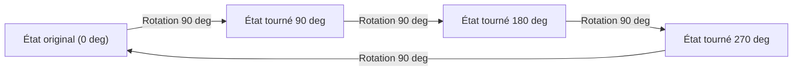
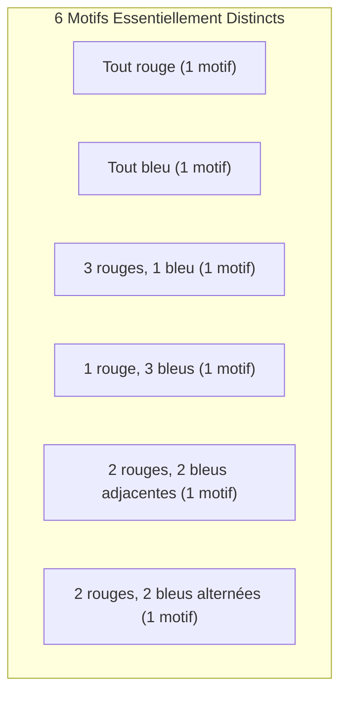

## 1. Introduction : Le problème du comptage et de la symétrie

Dans la combinatoire mathématique, « compter le nombre de choses qui satisfont une certaine condition » est un thème très basique et important. En utilisant les formules de permutation et de combinaison apprises à l'école, de nombreux problèmes peuvent être résolus. Cependant, lors de l'examen de problèmes du monde réel ou géométriques, nous sommes parfois confrontés à des situations complexes qui ne peuvent être abordées par une simple application de formules.

Un exemple typique de ceci est **"l'énumération d'objets avec symétrie"**. La symétrie fait référence à la propriété selon laquelle la forme ou la nature globale ne change pas même si une certaine opération (comme une rotation ou une réflexion) est effectuée.

Par exemple, supposons que nous fassions un collier en enfilant quatre perles ensemble dans une boucle. Les couleurs des perles disponibles sont "rouge" et "bleu". Dans ce cas, combien y a-t-il de modèles de colliers différents au total ?

Dans cet article, à partir de cette question apparemment simple, nous expliquerons en détail le puissant outil mathématique de comptage tenant compte de la symétrie, le **"[Lemme de Burnside](https://kenji.blog/fr/p/burnsides-lemma/)"**, depuis les bases jusqu'à ses applications. C'est un sujet parfait pour une introduction pratique à la théorie des groupes, alors restez avec nous jusqu'à la fin.

## 2. Les pièges du comptage simple

Tout d'abord, pensons-y de la manière la plus simple. Supposons que chacune des quatre perles puisse choisir sa couleur de manière indépendante. Pour chaque perle, il y a 2 choix : rouge ou bleu. Par conséquent, le nombre total de combinaisons de couleurs est le suivant :

$$
2 \times 2 \times 2 \times 2 = 2^4 = 16 \text{ façons}
$$

En effet, s'il s'agissait d'une "ficelle" où les perles sont alignées sur une rangée, cette réponse de $16$ façons serait correcte. Cependant, ce que nous considérons est un "collier". Un collier est censé être porté autour du cou et peut être déplacé librement dans l'espace.

Le point important ici est le fait que **"les choses qui deviennent identiques une fois tournées doivent être considérées comme le même modèle"**.

Par exemple, imaginez un collier avec la coloration "Rouge-Bleu-Bleu-Bleu". Si vous le tournez de 90 degrés dans le sens des aiguilles d'une montre, il devient "Bleu-Rouge-Bleu-Bleu". Vus dans un système de coordonnées fixé sur une table, ce sont des états différents, mais en tant que collier physique, ils sont exactement la même chose.

Si nous disons simplement qu'il y a $16$ façons, nous comptons trop de choses en incluant "ceux qui se chevauchent par rotation". Comment pouvons-nous supprimer avec précision cette duplication et ne compter que le nombre de conceptions essentiellement différentes ? C'est là qu'un cadre pour décrire mathématiquement la symétrie est nécessaire.

## 3. Bases des "Groupes" décrivant la symétrie

Pour gérer ces duplications de manière stricte et systématique, les mathématiques modernes utilisent le concept de **"Groupe"**. Un groupe est une collection "d'opérations" ou de "transformations" sur un objet qui satisfait aux quatre axiomes (propriétés) suivants :

1. **Fermeture** : Le résultat de l'exécution consécutive de deux opérations incluses dans le groupe est également une opération incluse dans le groupe.
2. **Associativité** : Lorsque trois opérations sont effectuées dans l'ordre, le résultat final est le même quelle que soit la façon dont elles sont groupées.
3. **Élément neutre** : Une opération consistant à "ne rien faire" est incluse, et sa combinaison avec toute autre opération laisse l'opération d'origine inchangée.
4. **Élément inverse** : Pour toute opération, il existe toujours une opération qui "l'annule complètement (l'inverse)".

Soit $G$ le groupe rassemblant les "opérations de rotation" pour le collier de quatre perles (que nous considérons comme les quatre sommets d'un carré) dans cet exemple. Ce groupe $G$ comprend les 4 opérations (éléments) suivantes :

- $R_0$ : Ne rien faire (rotation de 0 degré ; c'est l'élément neutre)
- $R_{90}$ : Rotation de 90 degrés dans le sens des aiguilles d'une montre
- $R_{180}$ : Rotation de 180 degrés dans le sens des aiguilles d'une montre
- $R_{270}$ : Rotation de 270 degrés dans le sens des aiguilles d'une montre

Par exemple, effectuer $R_{180}$ après avoir effectué $R_{90}$ est identique à effectuer $R_{270}$. De plus, l'élément inverse de $R_{90}$ est $R_{270}$ (ensemble, ils effectuent une rotation de 360 degrés et reviennent à l'original). De cette façon, ces opérations satisfont à tous les axiomes d'un groupe. Un tel groupe est appelé un **"Groupe cyclique"**, parfois noté $C_4$.

## 4. Action de groupe et orbites

L'effet qu'un groupe $G$ a sur un certain ensemble $X$ est mathématiquement appelé une **"Action de groupe"**. Dans notre exemple, l'ensemble $X$ est "l'ensemble des $16$ motifs en ignorant les rotations", et le groupe $G$ correspond aux "4 opérations de rotation".

L'ensemble de motifs obtenus en appliquant toutes les opérations du groupe à un certain motif $x$ est appelé **"l'Orbite"** de ce $x$.

Par exemple, l'application des opérations de $G$ au motif "Rouge-Bleu-Bleu-Bleu" donne les 4 motifs suivants :
- Appliquer $R_0$ : "Rouge-Bleu-Bleu-Bleu"
- Appliquer $R_{90}$ : "Bleu-Rouge-Bleu-Bleu"
- Appliquer $R_{180}$ : "Bleu-Bleu-Rouge-Bleu"
- Appliquer $R_{270}$ : "Bleu-Bleu-Bleu-Rouge"

Ces 4 motifs appartiennent à la même "Orbite". Le "nombre de conceptions essentiellement différentes" que nous voulons connaître n'est rien d'autre que **"le nombre d'orbites différentes dans lesquelles l'ensemble entier $X$ est partitionné"**. Ceci est dénoté par la formule $|X/G|$.

## 5. [Lemme de Burnside](https://kenji.blog/fr/p/burnsides-lemma/)

Ici enfin, la vedette de cette fois, le **[Lemme de Burnside](https://kenji.blog/fr/p/burnsides-lemma/)**, fait son apparition. On l'appelle aussi parfois le lemme de [Cauchy](https://kenji.blog/fr/p/cauchy/)-Frobenius. Il s'agit d'un théorème étonnant qui nous permet de calculer facilement le "nombre d'orbites (nombre de motifs essentiellement différents)" lorsqu'un groupe $G$ agit sur un ensemble fini $X$.

La formule du théorème est la suivante :

$$
|X/G| = \frac{1}{|G|} \sum_{g \in G} |X^g|
$$

Examinons en détail la signification de chaque symbole apparaissant dans la formule :

- $|X/G|$ : Le nombre de motifs essentiellement différents à trouver (nombre total d'orbites).
- $|G|$ : Le nombre total d'opérations incluses dans le groupe $G$. Dans ce problème de collier, il y a 4 rotations, donc $|G| = 4$.
- $g$ : Chaque opération incluse dans le groupe $G$.
- $X^g$ : L'ensemble de motifs qui "ne changent pas (sont fixés)" même lorsque l'opération $g$ est effectuée.
- $|X^g|$ : Le nombre de motifs fixés par l'opération $g$. C'est ce qu'on appelle le **"nombre de points fixes"**.

Ce que signifie cette formule est très intuitif. Le [Lemme de Burnside](https://kenji.blog/fr/p/burnsides-lemma/) affirme que l'on peut obtenir le nombre d'orbites souhaité en **"comptant le 'nombre de motifs immuables (nombre de points fixes)' pour chaque opération, en les additionnant tous, et en divisant par le nombre total d'opérations (c'est-à-dire en prenant la moyenne)"**.

La plus grande force de ce théorème est qu'il peut décomposer le jugement complexe des doublons en calculs indépendants et simples de "comptage de ce qui ne change pas sous chaque opération".

## 6. Application et calcul pour le problème du collier

Maintenant, utilisons réellement le lemme de Burnside pour calculer le nombre de modèles pour un collier avec 4 perles (2 couleurs, rouge et bleu).
Le nombre d'éléments dans l'ensemble original de motifs $X$ est de $16$. Nous allons examiner le nombre de points fixes $|X^g|$ pour chaque opération $g \in G$ du groupe $G$ un par un.

### 6.1. Points fixes pour ne rien faire ($R_0$)
Cette opération est de "ne rien déplacer". Par conséquent, les $16$ motifs sont totalement inchangés par cette opération.
$$ |X^{R_0}| = 16 $$

### 6.2. Points fixes pour une rotation de 90 degrés ($R_{90}$)
Que faut-il faire pour que le motif soit exactement le même qu'avant la rotation en le tournant de 90 degrés ?
La 1ère perle passe à la 2ème position, la 2ème à la 3ème, la 3ème à la 4ème, et la 4ème à la 1ère. Pour que celles-ci soient de la même couleur, **"toutes les perles doivent être de la même couleur"**.
Les seuls qui satisfont à la condition sont $2$ façons : "tout rouge" ou "tout bleu".
$$ |X^{R_{90}}| = 2 $$

### 6.3. Points fixes pour une rotation de 180 degrés ($R_{180}$)
Pour que ce soit le même que l'original en tournant de 180 degrés, les perles se faisant face (sur la diagonale) doivent être de la même couleur.
Un carré a 2 diagonales. Pour chaque paire de diagonales, nous pouvons choisir librement "rouge" ou "bleu".
Par conséquent, il y a $2 \times 2 = 4$ façons.
$$ |X^{R_{180}}| = 4 $$

### 6.4. Points fixes pour une rotation de 270 degrés ($R_{270}$)
Une rotation de 270 degrés (rotation de 90 degrés dans le sens inverse des aiguilles d'une montre) est physiquement la même situation qu'une rotation de 90 degrés. Les motifs avant et après la rotation ne correspondront pas à moins que toutes les perles ne soient de la même couleur.
Par conséquent, il n'y a que $2$ façons : "tout rouge" ou "tout bleu".
$$ |X^{R_{270}}| = 2 $$

### 6.5. Calcul du résultat final
Maintenant, nous avons tous les nombres de points fixes pour toutes les opérations. Nous les substituons dans la formule du [Lemme de Burnside](https://kenji.blog/fr/p/burnsides-lemma/).

$$
|X/G| = \frac{|X^{R_0}| + |X^{R_{90}}| + |X^{R_{180}}| + |X^{R_{270}}|}{|G|}
$$
$$
|X/G| = \frac{16 + 2 + 4 + 2}{4} = \frac{24}{4} = 6
$$

Suite au calcul, il a été prouvé qu'il existe **$6$ façons** pour des modèles de colliers essentiellement différents lorsque les rotations sont considérées comme identiques.

La figure ci-dessous montre ces $6$ motifs indépendants.

## 7. Groupe diédral : lors de l'examen des réflexions

Un vrai collier peut également être retourné "à l'envers" alors qu'il repose sur un bureau. Si nous ajoutons la condition "les conceptions qui deviennent identiques lorsqu'elles sont retournées sont également considérées comme identiques", qu'advient-il du résultat ?

Dans ce cas, le groupe cible $G$ comprendra non seulement des "rotations" mais aussi des opérations de "réflexion (retournement)". Un groupe qui inclut toutes les rotations et réflexions d'un polygone régulier est mathématiquement appelé un **"Groupe diédral"**, noté $D_n$. Puisqu'il s'agit d'un carré, c'est $D_4$.

Le groupe diédral $D_4$ comprend les 4 opérations de réflexion suivantes en plus des 4 rotations précédentes. Par conséquent, le nombre total d'éléments est $|G| = 8$.

- $F_v$ : Réflexion à travers l'axe vertical
- $F_h$ : Réflexion à travers l'axe horizontal
- $F_{d1}$ : Réflexion à travers la diagonale principale
- $F_{d2}$ : Réflexion à travers l'antidiagonale

Pour ces nouvelles opérations également, nous comptons le nombre de points fixes $|X^g|$ de la même manière.

### 7.1. Réflexion à travers les axes vertical et horizontal ($F_v, F_h$)
Pour être identique lorsqu'il est retourné à travers l'axe vertical, il doit être symétrique de gauche à droite. Si nous choisissons librement les couleurs des deux perles de gauche ($2 \times 2 = 4$ façons), les couleurs des perles de droite sont automatiquement déterminées. L'axe horizontal est de la même manière symétrique de haut en bas, il y a donc $4$ façons.
$$ |X^{F_v}| = 4, \quad |X^{F_h}| = 4 $$

### 7.2. Réflexion sur les diagonales ($F_{d1}, F_{d2}$)
Lors du retournement sur la diagonale principale, les deux perles sur la diagonale ne bougent pas, de sorte que leurs couleurs peuvent être librement choisies ($2 \times 2 = 4$ façons). Les deux perles restantes s'échangent, elles doivent donc être de la même couleur ($2$ façons). Ainsi, ce sont $4 \times 2 = 8$ façons. L'antidiagonale est la même.
$$ |X^{F_{d1}}| = 8, \quad |X^{F_{d2}}| = 8 $$

### 7.3. Calcul des résultats dans le groupe diédral
Substituez tous les nombres de points fixes obtenus dans la formule.

$$
|X/G| = \frac{16 (\text{rotations}) + 2 (\text{rotations}) + 4 (\text{rotations}) + 2 (\text{rotations}) + 4 (\text{réflexions}) + 4 (\text{réflexions}) + 8 (\text{réflexions}) + 8 (\text{réflexions})}{8}
$$
$$
|X/G| = \frac{48}{8} = 6
$$

Par coïncidence, dans ce cas spécifique (4 perles, 2 couleurs), il a été constaté que les types essentiellement distincts restent **$6$ façons** même lorsque la réflexion est prise en compte. En effet, tous les $6$ motifs que nous avons trouvés précédemment incluaient déjà leurs propres motifs réfléchis (si la rotation est incluse). Cependant, si le nombre de perles ou de couleurs augmente, les résultats différeront grandement entre le groupe de rotations uniquement $C_n$ et le groupe diédral $D_n$.

## 8. Esquisse de la preuve du [Lemme de Burnside](https://kenji.blog/fr/p/burnsides-lemma/)

Pourquoi la "moyenne du nombre de points fixes" donne-t-elle le "nombre d'orbites" ? Derrière cela se cache un théorème très important en théorie des groupes appelé le **"Théorème orbite-stabilisateur"**.

Expliquons brièvement l'esquisse de la preuve.
Considérons d'abord le comptage du nombre total de paires $(x, g)$ d'éléments dans l'ensemble $X$ et le groupe $G$ de telle sorte que "$x$ est fixé par l'opération $g$ ($g \cdot x = x$)". Nous comptons cela de deux manières.

1. **Méthode de comptage par opération $g$** :
   Pour chaque opération $g$, additionnez le nombre de $x$ fixés, $|X^g|$. C'est-à-dire, $\sum_{g \in G} |X^g|$.

2. **Méthode de comptage par élément $x$** :
   Pour chaque élément $x$, la collection d'opérations $g$ qui fixent $x$ est appelée le **"Stabilisateur"**, écrit comme $G_x$. Ensuite, le nombre total est $\sum_{x \in X} |G_x|$.

Selon le théorème orbite-stabilisateur, si $|O_x|$ est la taille de l'orbite à laquelle appartient l'élément $x$, $|G| = |O_x| \times |G_x|$ est vrai.
En transformant cela, nous obtenons $|G_x| = \frac{|G|}{|O_x|}$.

Par conséquent,
$$
\sum_{g \in G} |X^g| = \sum_{x \in X} |G_x| = \sum_{x \in X} \frac{|G|}{|O_x|} = |G| \sum_{x \in X} \frac{1}{|O_x|}
$$

Ici, si nous collectons les éléments appartenant à la même orbite et les additionnons, $\sum_{x \in O_i} \frac{1}{|O_i|} = 1$. Cela signifie que la somme sur tous les $x$ équivaut à compter le nombre d'orbites $|X/G|$.

$$
|G| \sum_{x \in X} \frac{1}{|O_x|} = |G| \times |X/G|
$$

En divisant les deux côtés par $|G|$, on obtient la formule du [Lemme de Burnside](https://kenji.blog/fr/p/burnsides-lemma/). C'est un développement logique très beau et sophistiqué.

## 9. Développement vers le Théorème de dénombrement de Pólya

Le [Lemme de Burnside](https://kenji.blog/fr/p/burnsides-lemma/) est puissant, mais trouver manuellement le nombre de points fixes un par un devient difficile à mesure que l'échelle du problème augmente. Par exemple, pour un problème tel que "Combien y a-t-il de façons de peindre chaque face d'un dodécaèdre régulier avec 3 couleurs ?", il y a 60 types d'opérations de rotation, ce qui rend le calcul énorme.

La généralisation de cela et la possibilité d'un calcul mécanique à l'aide de polynômes algébriques (Indicateur de cycles) constituent le **"Théorème de dénombrement de Pólya"**.

Le [Lemme de Burnside](https://kenji.blog/fr/p/burnsides-lemma/) est une étape importante vers la compréhension du théorème de Pólya, posant les bases du dénombrement en théorie des groupes.

## 10. Contexte historique du [Lemme de Burnside](https://kenji.blog/fr/p/burnsides-lemma/)

En fait, ce théorème n'a pas été découvert en premier par William Burnside. Il a été introduit dans le livre de Burnside "Theory of Groups of Finite Order" publié en 1897 et est devenu largement popularisé, c'est pourquoi il porte son nom.

Cependant, historiquement, [Augustin-Louis Cauchy](https://kenji.blog/fr/p/cauchy/) avait déjà publié un cas particulier de ce théorème (concernant les groupes symétriques) en 1845, et plus tard en 1887 Ferdinand Georg Frobenius a donné une preuve pour les groupes finis en général.

Par conséquent, ceux qui essaient d'être rigoureux quant à l'histoire des mathématiques appellent parfois ce théorème avec espièglerie le **"Lemme de [Cauchy](https://kenji.blog/fr/p/cauchy/)-Frobenius"** ou **"Le Lemme qui n'est pas de Burnside"**. Indépendamment de l'origine de son nom, l'ampleur du rôle que ce lemme a joué dans l'histoire de la théorie des groupes et de la combinatoire est incommensurable.

## 11. Exemple 2 : Coloration des faces d'un cube

Pour mieux comprendre la puissance du [Lemme de Burnside](https://kenji.blog/fr/p/burnsides-lemma/), donnons un autre exemple célèbre. C'est le problème : "Combien y a-t-il de façons de peindre les 6 faces d'un cube avec 2 couleurs, rouge et bleu ?" Ici aussi, on traite comme identiques ceux qui deviennent les mêmes lorsqu'ils sont tournés.

Le groupe de rotation d'un cube comprend les 24 opérations suivantes :
1. **Ne rien faire** : 1 opération
2. **Rotations autour d'axes reliant les centres de faces opposées** : 6 pour des rotations de 90 degrés (3 axes × 2), 3 pour des rotations de 180 degrés (3 axes × 1) (Total 9)
3. **Rotations autour d'axes reliant des sommets opposés** : 2 pour chacune des 4 diagonales pour des rotations de 120 degrés et 240 degrés (Total 8)
4. **Rotations autour d'axes reliant les milieux d'arêtes opposées** : 1 pour chacun des 6 axes pour des rotations de 180 degrés (Total 6)

Il y a un total de $1 + 9 + 8 + 6 = 24$ éléments ($|G| = 24$).

En calculant le nombre de points fixes (colorations où les couleurs ne changent pas) pour chaque opération de rotation et en prenant la moyenne, on peut trouver le nombre total de façons de colorer le cube. Même pour un problème extrêmement difficile à compter de manière intuitive, l'utilisation du [Lemme de Burnside](https://kenji.blog/fr/p/burnsides-lemma/) le réduit à des problèmes "locaux" de symétrie le long de chaque axe de rotation. En conséquence, on sait que le nombre de façons de colorer ce cube est de **$10$ façons**.

## 12. Conclusion

Qu'en avez-vous pensé ? Dans cet article, en utilisant le nombre de modèles de colliers comme exemple, nous avons expliqué le [Lemme de Burnside](https://kenji.blog/fr/p/burnsides-lemma/) en détail.

*   Les permutations et combinaisons simples ne peuvent pas bien gérer la duplication due à la symétrie.
*   La symétrie peut être décrite mathématiquement à l'aide d'un **"Groupe"**.
*   En utilisant le **[Lemme de Burnside](https://kenji.blog/fr/p/burnsides-lemma/)**, le nombre de modèles essentiellement différents peut être calculé par la procédure mécanique "d'établir la moyenne du nombre de points fixes dans chaque opération".
*   Ce théorème est basé sur une propriété profonde de la théorie des groupes appelée le Théorème orbite-stabilisateur.

Le [Lemme de Burnside](https://kenji.blog/fr/p/burnsides-lemma/) est un théorème très pratique appliqué dans un large éventail de domaines, tels que le dénombrement des isomères moléculaires en chimie, la détermination de l'isomorphisme de graphe dans la théorie des graphes, et même la mécanique statistique en physique.

À travers les concepts de base introduits cette fois-ci, nous espérons que vous avez pu apercevoir comment le domaine des mathématiques appelé "Théorie des Groupes", qui a tendance à paraître abstrait, peut résoudre brillamment des problèmes concrets du monde réel.
