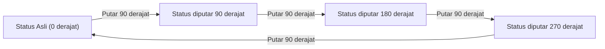
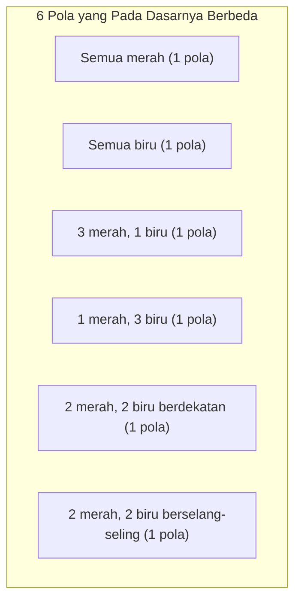

## 1. Pendahuluan: Masalah Menghitung dan Simetri

Dalam kombinatorika matematika, "menghitung jumlah benda yang memenuhi kondisi tertentu" adalah tema yang sangat dasar dan penting. Menggunakan rumus permutasi dan kombinasi yang diajarkan di sekolah, banyak masalah dapat diselesaikan. Namun, ketika mempertimbangkan masalah dunia nyata atau geometris, kita kadang-kadang menghadapi situasi kompleks yang tidak dapat ditangani hanya dengan penerapan rumus semata.

Contoh khas dari ini adalah **"pencacahan objek dengan simetri"**. Simetri mengacu pada properti di mana bentuk atau sifat keseluruhan tidak berubah bahkan jika operasi tertentu (seperti rotasi atau refleksi) dilakukan.

Misalnya, misalkan kita membuat kalung dengan merangkai empat manik-manik menjadi sebuah simpul. Warna manik-manik yang tersedia adalah "merah" dan "biru". Dalam hal ini, berapa banyak desain kalung yang berbeda secara total?

Dalam artikel ini, berawal dari pertanyaan yang tampaknya sederhana ini, kita akan menjelaskan secara rinci alat matematika yang kuat untuk menghitung dengan mempertimbangkan simetri, yaitu **"[Lema Burnside](https://kenji.blog/id/p/burnsides-lemma/)"**, mulai dari dasar-dasar hingga aplikasinya. Ini adalah topik yang sempurna untuk pengantar praktis ke Teori Grup, jadi mohon tetap bersama kami sampai akhir.

## 2. Jebakan Perhitungan Sederhana

Pertama, mari kita pikirkan dengan cara yang paling sederhana. Asumsikan bahwa masing-masing dari empat manik-manik dapat secara independen memilih warnanya. Untuk setiap manik-manik, ada 2 pilihan: merah atau biru. Oleh karena itu, jumlah total kombinasi warna adalah sebagai berikut:

$$
2 \times 2 \times 2 \times 2 = 2^4 = 16 \text{ cara}
$$

Memang, jika itu adalah "tali" di mana manik-manik berbaris dalam satu baris, jawaban $16$ cara ini akan benar. Namun, yang kita pertimbangkan adalah "kalung". Kalung dimaksudkan untuk dipakai di leher dan dapat digerakkan secara bebas di ruang angkasa.

Poin penting di sini adalah fakta bahwa **"benda yang menjadi identik ketika diputar harus dianggap sebagai desain yang sama"**.

Misalnya, bayangkan sebuah kalung dengan pewarnaan "Merah-Biru-Biru-Biru". Jika Anda memutarnya 90 derajat searah jarum jam, itu menjadi "Biru-Merah-Biru-Biru". Dilihat dari sistem koordinat yang tetap di atas meja, ini adalah keadaan yang berbeda, tetapi sebagai kalung fisik, keduanya adalah hal yang persis sama.

Jika kita hanya mengatakan ada $16$ cara, kita menghitung secara berlebihan dengan memasukkan "yang tumpang tindih karena rotasi". Bagaimana kita dapat secara akurat menghilangkan duplikasi ini dan menghitung hanya jumlah desain yang pada dasarnya berbeda? Di sinilah kerangka kerja untuk mendeskripsikan simetri secara matematis diperlukan.

## 3. Dasar-dasar "Grup" yang Mendeskripsikan Simetri

Untuk menangani duplikasi semacam itu secara ketat dan sistematis, matematika modern menggunakan konsep **"Grup"**. Grup adalah kumpulan "operasi" atau "transformasi" pada suatu objek yang memenuhi empat aksioma (sifat) berikut:

1. **Ketertutupan**: Hasil dari melakukan secara berturut-turut dua operasi yang termasuk dalam grup juga merupakan operasi yang termasuk dalam grup.
2. **Asosiatif**: Ketika tiga operasi dilakukan secara berurutan, hasil akhirnya sama terlepas dari bagaimana mereka dikelompokkan.
3. **Elemen identitas**: Operasi "tidak melakukan apa-apa" disertakan, dan menggabungkannya dengan operasi apa pun membiarkan operasi aslinya tidak berubah.
4. **Elemen invers**: Untuk operasi apa pun, selalu ada operasi yang "sepenuhnya membatalkannya (mengembalikannya)".

Misalkan $G$ adalah grup yang mengumpulkan "operasi rotasi" untuk kalung dari empat manik-manik (yang kita anggap sebagai empat titik sudut persegi) dalam contoh ini. Grup $G$ ini mencakup 4 operasi (elemen) berikut:

- $R_0$: Tidak melakukan apa-apa (rotasi 0 derajat; ini adalah elemen identitas)
- $R_{90}$: Putar 90 derajat searah jarum jam
- $R_{180}$: Putar 180 derajat searah jarum jam
- $R_{270}$: Putar 270 derajat searah jarum jam

Sebagai contoh, melakukan $R_{180}$ setelah melakukan $R_{90}$ sama dengan melakukan $R_{270}$. Juga, elemen invers dari $R_{90}$ adalah $R_{270}$ (bersama-sama mereka membuat rotasi 360 derajat dan kembali ke aslinya). Dengan cara ini, operasi-operasi ini memenuhi semua aksioma dari sebuah grup. Grup semacam itu disebut **"Grup siklik"**, terkadang dilambangkan sebagai $C_4$.

## 4. Aksi Grup dan Orbit

Efek yang dimiliki grup $G$ pada himpunan $X$ tertentu secara matematis disebut **"Aksi grup"**. Dalam contoh kita, himpunan $X$ adalah "himpunan dari semua $16$ pola mengabaikan rotasi", dan grup $G$ adalah "4 operasi rotasi".

Kumpulan pola yang diperoleh dengan menerapkan semua operasi grup ke pola $x$ tertentu disebut **"Orbit"** dari $x$ itu.

Misalnya, penerapan operasi $G$ ke pola "Merah-Biru-Biru-Biru" menghasilkan 4 pola berikut:
- Terapkan $R_0$: "Merah-Biru-Biru-Biru"
- Terapkan $R_{90}$: "Biru-Merah-Biru-Biru"
- Terapkan $R_{180}$: "Biru-Biru-Merah-Biru"
- Terapkan $R_{270}$: "Biru-Biru-Biru-Merah"

Ke-4 pola ini termasuk dalam "Orbit" yang sama. "Jumlah desain yang pada dasarnya berbeda" yang ingin kita ketahui tidak lain adalah **"menjadi berapa banyak orbit yang berbeda seluruh himpunan $X$ dibagi"**. Ini dilambangkan dengan rumus $|X/G|$.

## 5. [Lema Burnside](https://kenji.blog/id/p/burnsides-lemma/)

Di sini akhirnya, bintang kita kali ini, **[Lema Burnside](https://kenji.blog/id/p/burnsides-lemma/)**, muncul. Ini terkadang juga disebut lema [Cauchy](https://kenji.blog/id/p/cauchy/)-Frobenius. Ini adalah teorema mencengangkan yang memungkinkan kita menghitung dengan mudah "jumlah orbit (jumlah pola yang pada dasarnya berbeda)" ketika grup $G$ bekerja pada himpunan berhingga $X$.

Rumus untuk teorema adalah sebagai berikut:

$$
|X/G| = \frac{1}{|G|} \sum_{g \in G} |X^g|
$$

Mari kita lihat arti dari masing-masing simbol yang muncul dalam rumus secara terperinci:

- $|X/G|$: Jumlah pola yang pada dasarnya berbeda yang dapat ditemukan (jumlah total orbit).
- $|G|$: Jumlah total operasi yang termasuk dalam grup $G$. Dalam masalah kalung ini, ada 4 rotasi, jadi $|G| = 4$.
- $g$: Setiap operasi yang termasuk dalam grup $G$.
- $X^g$: Kumpulan pola yang "tidak berubah (tetap)" bahkan ketika operasi $g$ dilakukan.
- $|X^g|$: Jumlah pola yang ditetapkan oleh operasi $g$. Ini disebut **"jumlah titik tetap"**.

Apa arti rumus ini sangat intuitif. [Lema Burnside](https://kenji.blog/id/p/burnsides-lemma/) menegaskan bahwa kita dapat memperoleh jumlah orbit yang diinginkan dengan **"menghitung 'jumlah pola yang tidak berubah (jumlah titik tetap)' untuk setiap operasi, menjumlahkan semuanya, dan membaginya dengan jumlah total operasi (yaitu mengambil rata-ratanya)"**.

Kekuatan terbesar dari teorema ini adalah kemampuannya memecah penilaian kompleks tentang duplikat menjadi kalkulasi independen dan sederhana dari "menghitung apa yang tidak berubah di bawah setiap operasi".

## 6. Penerapan dan Perhitungan untuk Masalah Kalung

Sekarang, mari kita benar-benar menggunakan [Lema Burnside](https://kenji.blog/id/p/burnsides-lemma/) untuk menghitung jumlah desain untuk sebuah kalung dengan 4 manik-manik (2 warna, merah dan biru).
Jumlah elemen pada himpunan pola asli $X$ adalah $16$. Kita akan menyelidiki jumlah titik tetap $|X^g|$ untuk setiap operasi $g \in G$ dari grup $G$ satu demi satu.

### 6.1. Titik tetap untuk tidak melakukan apa-apa ($R_0$)
Operasi ini adalah "tidak memindahkan apa-apa". Oleh karena itu, ke-$16$ pola sama sekali tidak berubah oleh operasi ini.
$$ |X^{R_0}| = 16 $$

### 6.2. Titik tetap untuk rotasi 90 derajat ($R_{90}$)
Apa yang perlu dilakukan untuk membuatnya sama persis dengan sebelum rotasi dengan memutarnya 90 derajat?
Manik ke-1 bergerak ke posisi ke-2, manik ke-2 ke posisi ke-3, manik ke-3 ke posisi ke-4, dan manik ke-4 ke posisi ke-1. Agar ini menjadi warna yang sama, **"semua manik-manik harus berwarna sama"**.
Satu-satunya yang memenuhi kondisi adalah $2$ cara: "semua merah" atau "semua biru".
$$ |X^{R_{90}}| = 2 $$

### 6.3. Titik tetap untuk rotasi 180 derajat ($R_{180}$)
Agar sama dengan aslinya dengan memutar 180 derajat, manik-manik yang saling berhadapan (pada diagonal) harus berwarna sama.
Bujursangkar memiliki 2 diagonal. Untuk setiap pasangan diagonal, kita dapat secara bebas memilih "merah" atau "biru".
Oleh karena itu, ada $2 \times 2 = 4$ cara.
$$ |X^{R_{180}}| = 4 $$

### 6.4. Titik tetap untuk rotasi 270 derajat ($R_{270}$)
Rotasi 270 derajat (rotasi 90 derajat berlawanan arah jarum jam) secara fisik sama situasinya dengan rotasi 90 derajat. Pola sebelum dan sesudah rotasi tidak akan cocok kecuali semua manik-manik berwarna sama.
Oleh karena itu, hanya ada $2$ cara: "semua merah" atau "semua biru".
$$ |X^{R_{270}}| = 2 $$

### 6.5. Perhitungan hasil akhir
Sekarang, kita memiliki semua angka titik tetap untuk semua operasi. Kita mensubstitusikan angka-angka ini ke dalam rumus [Lema Burnside](https://kenji.blog/id/p/burnsides-lemma/).

$$
|X/G| = \frac{|X^{R_0}| + |X^{R_{90}}| + |X^{R_{180}}| + |X^{R_{270}}|}{|G|}
$$
$$
|X/G| = \frac{16 + 2 + 4 + 2}{4} = \frac{24}{4} = 6
$$

Berdasarkan hasil perhitungan tersebut, telah terbukti bahwa ada **$6$ cara** untuk desain kalung yang pada dasarnya berbeda jika rotasi dianggap identik.

Gambar di bawah menunjukkan ke-$6$ pola independen tersebut.

## 7. Grup Dihedral: Ketika Mempertimbangkan Refleksi

Kalung sungguhan juga dapat "dibalik" saat diletakkan di atas meja. Jika kita menambahkan kondisi "desain yang menjadi sama ketika dibalik juga dianggap identik", apa yang terjadi pada hasilnya?

Dalam hal ini, grup target $G$ akan mencakup tidak hanya "rotasi" tetapi juga operasi "refleksi (pembalikan)". Grup yang mencakup semua rotasi dan refleksi dari segi banyak beraturan secara matematis disebut **"Grup dihedral"**, dilambangkan sebagai $D_n$. Karena ini adalah persegi, itu adalah $D_4$.

Grup dihedral $D_4$ mencakup 4 operasi refleksi berikut selain 4 rotasi sebelumnya. Oleh karena itu, jumlah total elemen adalah $|G| = 8$.

- $F_v$: Refleksi di sumbu vertikal
- $F_h$: Refleksi di sumbu horizontal
- $F_{d1}$: Refleksi di diagonal utama
- $F_{d2}$: Refleksi di antidiagonal

Untuk operasi baru ini juga, kita menghitung jumlah titik tetap $|X^g|$ dengan cara yang sama.

### 7.1. Refleksi melintasi sumbu vertikal dan horizontal ($F_v, F_h$)
Agar menjadi identik saat dibalik melewati sumbu vertikal, kalung tersebut harus simetris kiri-ke-kanan. Jika kita bebas memilih warna kedua manik-manik di sebelah kiri ($2 \times 2 = 4$ cara), warna manik-manik di sebelah kanan otomatis ditentukan. Sumbu horizontal sama simetrisnya dari atas ke bawah, jadi ada $4$ cara.
$$ |X^{F_v}| = 4, \quad |X^{F_h}| = 4 $$

### 7.2. Refleksi di diagonal ($F_{d1}, F_{d2}$)
Saat membalik diagonal utama, dua manik-manik pada diagonal tidak bergerak, sehingga warnanya dapat dipilih dengan bebas ($2 \times 2 = 4$ cara). Dua manik yang tersisa bertukar tempat satu sama lain, sehingga harus memiliki warna yang sama ($2$ cara). Jadi, ini adalah $4 \times 2 = 8$ cara. Antidiagonal juga sama.
$$ |X^{F_{d1}}| = 8, \quad |X^{F_{d2}}| = 8 $$

### 7.3. Perhitungan hasil dalam grup dihedral
Substitusikan semua angka titik tetap yang diperoleh ke dalam rumus.

$$
|X/G| = \frac{16 (\text{rotasi}) + 2 (\text{rotasi}) + 4 (\text{rotasi}) + 2 (\text{rotasi}) + 4 (\text{refleksi}) + 4 (\text{refleksi}) + 8 (\text{refleksi}) + 8 (\text{refleksi})}{8}
$$
$$
|X/G| = \frac{48}{8} = 6
$$

Secara kebetulan, dalam kasus spesifik ini (4 manik-manik, 2 warna), ditemukan bahwa tipe-tipe yang pada dasarnya berbeda tetap **$6$ cara** bahkan ketika refleksi dipertimbangkan. Ini karena ke-$6$ pola yang kita temukan sebelumnya sudah menyertakan pola pantulannya sendiri (jika rotasi disertakan). Namun, jika jumlah manik-manik atau warna meningkat, hasilnya akan sangat berbeda antara kelompok rotasi saja $C_n$ dan grup dihedral $D_n$.

## 8. Sketsa Bukti [Lema Burnside](https://kenji.blog/id/p/burnsides-lemma/)

Mengapa mengambil "rata-rata jumlah titik tetap" menghasilkan "jumlah orbit"? Di balik ini terletak sebuah teorema yang sangat penting dalam teori grup yang disebut **"Teorema Orbit-Penstabil"** (Orbit-Stabilizer Theorem).

Mari kita jelaskan secara singkat sketsa pembuktian tersebut.
Pertama, pertimbangkan untuk menghitung jumlah total pasangan $(x, g)$ elemen dalam himpunan $X$ dan grup $G$ sedemikian rupa sehingga "$x$ ditetapkan oleh operasi $g$ ($g \cdot x = x$)". Kami menghitung ini dengan dua cara.

1. **Metode menghitung per operasi $g$**:
   Untuk setiap operasi $g$, jumlahkan angka perbaikan $x$, $|X^g|$. Yaitu, $\sum_{g \in G} |X^g|$.

2. **Metode menghitung per elemen $x$**:
   Untuk setiap elemen $x$, kumpulan operasi $g$ yang memperbaiki $x$ disebut **"Penstabil"**, ditulis sebagai $G_x$. Maka, jumlah totalnya adalah $\sum_{x \in X} |G_x|$.

Menurut teorema orbit-penstabil, jika $|O_x|$ adalah ukuran orbit milik elemen $x$, maka $|G| = |O_x| \times |G_x|$ berlaku.
Mengubah ini, kita mendapatkan $|G_x| = \frac{|G|}{|O_x|}$.

Oleh karena itu,
$$
\sum_{g \in G} |X^g| = \sum_{x \in X} |G_x| = \sum_{x \in X} \frac{|G|}{|O_x|} = |G| \sum_{x \in X} \frac{1}{|O_x|}
$$

Di sini, jika kita mengumpulkan elemen yang termasuk orbit yang sama dan menjumlahkannya, $\sum_{x \in O_i} \frac{1}{|O_i|} = 1$. Ini berarti menjumlahkan semua $x$ setara dengan menghitung jumlah orbit $|X/G|$.

$$
|G| \sum_{x \in X} \frac{1}{|O_x|} = |G| \times |X/G|
$$

Dengan membagi kedua ruas dengan $|G|$, kita mendapatkan rumus [Lema Burnside](https://kenji.blog/id/p/burnsides-lemma/). Ini adalah pengembangan logis yang sangat indah dan canggih.

## 9. Pengembangan menjadi Teorema Pencacahan Pólya

[Lema Burnside](https://kenji.blog/id/p/burnsides-lemma/) itu kuat, tetapi menemukan jumlah titik tetap satu per satu secara manual akan menjadi sulit jika skala permasalahan membesar. Misalnya, untuk masalah seperti "Ada berapa cara mengecat setiap sisi dodesahedron beraturan dengan 3 warna?", ada 60 tipe operasi rotasi, membuat perhitungannya menjadi sangat besar.

Menggeneralisasikan hal ini lebih jauh dan mengaktifkan penghitungan mekanis menggunakan polinomial aljabar (Indeks Siklus) adalah **"Teorema Pencacahan Pólya"**.

[Lema Burnside](https://kenji.blog/id/p/burnsides-lemma/) adalah langkah penting menuju pemahaman teorema Pólya, yang meletakkan dasar untuk pencacahan teoretis grup.

## 10. Latar Belakang Historis [Lema Burnside](https://kenji.blog/id/p/burnsides-lemma/)

Faktanya, teorema ini tidak pertama kali ditemukan oleh William Burnside. Itu diperkenalkan dalam buku Burnside "Teori Grup Orde Hingga" yang diterbitkan pada tahun 1897 dan menjadi populer secara luas, sehingga menyandang namanya.

Namun, secara historis, [Augustin-Louis Cauchy](https://kenji.blog/id/p/cauchy/) telah menerbitkan sebuah kasus khusus dari teorema ini (mengenai grup simetris) pada tahun 1845, dan kemudian pada tahun 1887 Ferdinand Georg Frobenius memberikan bukti untuk grup hingga secara umum.

Oleh karena itu, orang-orang yang mencoba keras tentang sejarah matematika kadang-kadang dengan bercanda menyebut teorema ini **"Lema [Cauchy](https://kenji.blog/id/p/cauchy/)-Frobenius"** atau **"Lema yang bukan milik Burnside"**. Terlepas dari asal usul namanya, besarnya peran yang dimainkan lema ini dalam sejarah teori grup dan kombinatorika tidak terukur.

## 11. Contoh 2: Mewarnai Sisi-sisi Kubus

Untuk menyadari lebih lanjut kehebatan [Lema Burnside](https://kenji.blog/id/p/burnsides-lemma/), mari kita berikan contoh terkenal lainnya. Masalahnya: "Ada berapa cara untuk mengecat 6 sisi kubus dengan 2 warna, merah dan biru?" Di sini juga, kita memperlakukan warna yang menjadi sama ketika diputar sebagai hal yang identik.

Grup rotasi kubus terdiri dari 24 operasi berikut:
1. **Tidak melakukan apa-apa**: 1 operasi
2. **Rotasi mengelilingi sumbu yang menghubungkan pusat-pusat wajah berlawanan**: 6 untuk rotasi 90 derajat (3 sumbu × 2), 3 untuk rotasi 180 derajat (3 sumbu × 1) (Total 9)
3. **Rotasi mengelilingi sumbu yang menghubungkan titik-titik sudut berlawanan**: 2 untuk masing-masing 4 diagonal untuk rotasi 120 derajat dan 240 derajat (Total 8)
4. **Rotasi mengelilingi sumbu yang menghubungkan titik tengah tepi berlawanan**: 1 untuk masing-masing dari 6 sumbu untuk rotasi 180 derajat (Total 6)

Ada total $1 + 9 + 8 + 6 = 24$ elemen ($|G| = 24$).

Dengan menghitung jumlah titik tetap (pewarnaan di mana warna tidak berubah) untuk setiap operasi rotasi dan mengambil rata-rata, jumlah total cara untuk mewarnai kubus dapat ditemukan. Bahkan untuk masalah yang sangat sulit dihitung secara intuitif, penggunaan [Lema Burnside](https://kenji.blog/id/p/burnsides-lemma/) menguranginya menjadi masalah "lokal" dari simetri di sepanjang masing-masing sumbu rotasi. Akibatnya, diketahui bahwa jumlah cara untuk mewarnai kubus ini adalah **$10$ cara**.

## 12. Kesimpulan

Bagaimana? Dalam artikel ini, dengan menggunakan jumlah desain kalung sebagai contoh, kami menjelaskan [Lema Burnside](https://kenji.blog/id/p/burnsides-lemma/) secara rinci.

*   Permutasi dan kombinasi sederhana tidak dapat menangani duplikasi akibat simetri dengan baik.
*   Simetri dapat dideskripsikan secara matematis menggunakan **"Grup"**.
*   Dengan menggunakan **[Lema Burnside](https://kenji.blog/id/p/burnsides-lemma/)**, jumlah pola yang secara substansial berbeda dapat dihitung dengan prosedur mekanis "merata-ratakan jumlah titik tetap di setiap operasi".
*   Teorema ini didasarkan pada properti mendalam dari teori grup yang disebut Teorema Orbit-Penstabil.

[Lema Burnside](https://kenji.blog/id/p/burnsides-lemma/) adalah teorema yang sangat praktis yang diterapkan dalam berbagai bidang, seperti menghitung isomer molekuler dalam bidang kimia, menentukan isomorfisme grafis dalam teori graf, dan bahkan mekanika statistik dalam ilmu fisika.

Melalui dasar-dasar yang diperkenalkan kali ini, kami harap Anda dapat melihat sekilas bagaimana bidang matematika yang disebut "Teori Grup", yang cenderung terlihat abstrak, dapat memecahkan masalah dunia nyata yang nyata dengan cemerlang.
