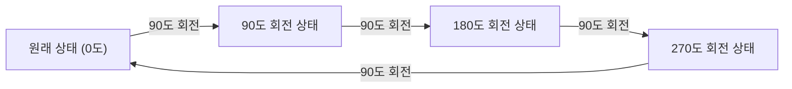
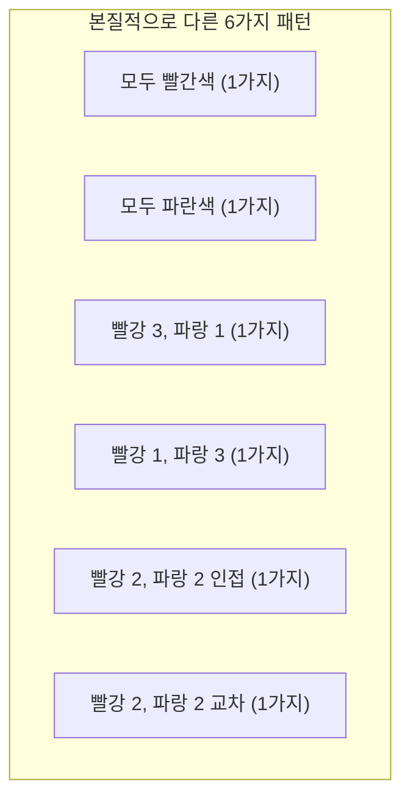

## 1. 서론: 세기(Counting)와 대칭성의 문제

수학의 조합론에서 "특정 조건을 만족하는 것의 개수를 세는 것"은 매우 기본적이고 중요한 주제입니다. 학교에서 배우는 순열과 조합의 공식을 사용하면 많은 문제를 해결할 수 있습니다. 그러나 현실 세계나 기하학적인 문제를 고려할 때, 우리는 단순한 공식의 적용만으로는 해결할 수 없는 복잡한 상황에 직면하곤 합니다.

이러한 문제의 대표적인 예가 **"대칭성을 가진 대상의 개수 세기"** 입니다. 대칭성이란 특정 조작(회전이나 반사 등)을 수행하더라도 전체적인 형태나 성질이 변하지 않는 속성을 말합니다.

예를 들어, 4개의 구슬을 실로 연결하여 목걸이를 만든다고 가정해 봅시다. 사용할 수 있는 구슬의 색상은 '빨간색'과 '파란색' 두 가지입니다. 이 경우 서로 다른 디자인의 목걸이는 총 몇 가지가 될까요?

이 글에서는 이처럼 언뜻 간단해 보이는 질문에서 출발하여, 대칭성을 고려한 개수 세기의 강력한 수학적 도구인 **"[번사이드 보조정리](https://kenji.blog/ko/p/burnsides-lemma/)"**([Burnside's Lemma](https://kenji.blog/ko/p/burnsides-lemma/))에 대해 기초부터 응용까지 자세히 설명하고자 합니다. 군론(Group Theory)에 대한 실질적인 입문으로도 완벽한 주제이니 끝까지 함께해 주시기 바랍니다.

## 2. 단순한 세기의 함정

먼저 가장 단순하게 생각해 봅시다. 4개의 구슬이 각각 독립적으로 색상을 선택할 수 있다고 가정합니다. 각 구슬에 대해 빨간색 또는 파란색의 2가지 선택지가 있습니다. 따라서 전체 색상 조합의 수는 다음과 같습니다.

$$
2 \times 2 \times 2 \times 2 = 2^4 = 16 \text{ 가지}
$$

사실, 구슬이 일렬로 늘어선 '끈'이라면 이 $16$가지라는 답이 정답일 것입니다. 하지만 우리가 고려하고 있는 것은 '목걸이'입니다. 목걸이는 목에 거는 것이며 공간에서 자유롭게 움직일 수 있습니다.

여기서 중요한 점은 **"회전시켜서 같아지는 것은 동일한 디자인"** 으로 간주해야 한다는 사실입니다.

예를 들어, "빨강-파랑-파랑-파랑" 색상의 목걸이를 상상해 보세요. 이것을 시계 방향으로 90도 회전시키면 "파랑-빨강-파랑-파랑"이 됩니다. 책상 위에 고정된 좌표계에서 보면 이들은 다른 상태이지만, 물리적인 목걸이로서는 완전히 동일한 것입니다.

단순히 $16$가지라고 하면, 이처럼 "회전으로 인해 겹치는 것"을 포함하여 중복해서 세게 됩니다. 어떻게 하면 이 중복을 정확하게 제거하고 본질적으로 다른 디자인의 수만 셀 수 있을까요? 여기서 대칭성을 수학적으로 기술하기 위한 틀이 필요해집니다.

## 3. 대칭성을 기술하는 "군(Group)"의 기초

이러한 중복을 엄밀하고 체계적으로 다루기 위해 현대 수학에서는 **"군"**(Group)이라는 개념을 사용합니다. 군이란 어떤 대상에 대한 "조작"이나 "변환"의 모임으로, 다음 4가지 공리(성질)를 만족하는 것을 말합니다.

1. **닫힘성(Closure)**: 군에 포함된 두 조작을 연속해서 수행한 결과도 역시 군에 포함된 조작이 됩니다.
2. **결합법칙(Associativity)**: 세 가지 조작을 순서대로 수행할 때, 묶는 방법에 관계없이 최종 결과는 동일합니다.
3. **항등원(Identity element)**: "아무것도 하지 않음"이라는 조작이 포함되어 있으며, 다른 어떤 조작과 결합해도 원래의 조작이 그대로 유지됩니다.
4. **역원(Inverse element)**: 임의의 조작에 대해 그 조작을 "완전히 취소하는 (원래대로 되돌리는)" 조작이 항상 존재합니다.

이번 예제에서 4개의 구슬로 이루어진 목걸이(정사각형의 4개 꼭짓점으로 간주)에 대한 '회전 조작'을 모아놓은 군을 $G$라고 합시다. 이 군 $G$에는 다음 4가지 조작(원소)이 포함됩니다.

- $R_0$: 아무것도 하지 않음 (0도 회전; 이것이 항등원입니다)
- $R_{90}$: 시계 방향으로 90도 회전
- $R_{180}$: 시계 방향으로 180도 회전
- $R_{270}$: 시계 방향으로 270도 회전

예를 들어, $R_{90}$을 수행한 후 $R_{180}$을 수행하는 것은 $R_{270}$을 수행하는 것과 같습니다. 또한 $R_{90}$의 역원은 $R_{270}$이 됩니다 (두 조작을 합치면 360도 회전이 되어 원래대로 돌아오기 때문). 이렇게 이들 조작은 군의 모든 공리를 만족합니다. 이러한 군을 **"순환군"**(Cyclic group)이라고 부르며, 때로는 $C_4$로 표기하기도 합니다.

## 4. 군의 작용과 궤도 (Orbits)

군 $G$가 어떤 집합 $X$에 미치는 영향을 수학 용어로 **"군의 작용"**(Group action)이라고 부릅니다. 이번 예제에서 집합 $X$는 "회전을 무시한 모든 $16$가지 무늬의 집합"이며, 군 $G$는 "4개의 회전 조작"입니다.

어떤 무늬 $x$에 대해, 군의 모든 조작을 적용하여 얻어지는 무늬들의 모임을 그 $x$의 **"궤도"**(Orbit)라고 부릅니다.

예를 들어, "빨강-파랑-파랑-파랑" 무늬에 $G$의 조작을 적용하면 다음 4가지 무늬를 얻게 됩니다.
- $R_0$ 적용: "빨강-파랑-파랑-파랑"
- $R_{90}$ 적용: "파랑-빨강-파랑-파랑"
- $R_{180}$ 적용: "파랑-파랑-빨강-파랑"
- $R_{270}$ 적용: "파랑-파랑-파랑-빨강"

이 4개의 무늬는 같은 "궤도"에 속합니다. 우리가 알고 싶은 "본질적으로 다른 디자인의 수"란 다름 아닌 **"전체 집합 $X$가 몇 개의 서로 다른 궤도로 분할되는가"** 하는 것과 정확히 같습니다. 이것은 수식으로 $|X/G|$와 같이 나타냅니다.

## 5. [번사이드 보조정리](https://kenji.blog/ko/p/burnsides-lemma/) ([Burnside's Lemma](https://kenji.blog/ko/p/burnsides-lemma/))

여기서 드디어 이번 주제의 주인공인 **[번사이드 보조정리](https://kenji.blog/ko/p/burnsides-lemma/)** 가 등장합니다. 코시-프로베니우스 보조정리([Cauchy](https://kenji.blog/ko/p/cauchy/)-Frobenius lemma)라고 불리기도 합니다. 이것은 어떤 군 $G$가 유한 집합 $X$에 작용할 때, 그 "궤도의 수(본질적으로 다른 패턴의 수)"를 쉽게 계산할 수 있게 해주는 경이로운 정리입니다.

정리의 수식은 다음과 같습니다.

$$
|X/G| = \frac{1}{|G|} \sum_{g \in G} |X^g|
$$

수식에 등장하는 각 기호의 의미를 자세히 살펴보겠습니다.

- $|X/G|$: 구하고자 하는 본질적으로 다른 무늬의 수 (궤도의 총수).
- $|G|$: 군 $G$에 포함된 조작의 총수. 이번 목걸이 문제에서는 4개의 회전이 있으므로 $|G| = 4$입니다.
- $g$: 군 $G$에 포함된 각각의 조작.
- $X^g$: 조작 $g$를 수행해도 "무늬가 변하지 않는(고정되는)" 무늬들의 집합.
- $|X^g|$: 조작 $g$에 의해 고정되는 무늬의 수. 이것을 **"고정점(Fixed point)의 수"** 라고 부릅니다.

이 수식이 의미하는 바는 매우 직관적입니다. [번사이드 보조정리](https://kenji.blog/ko/p/burnsides-lemma/)는 **"각 조작마다 '변하지 않는 무늬의 수(고정점의 수)'를 세어 모두 더한 다음, 전체 조작의 수로 나눔(즉, 평균을 구함)"** 으로써 원하는 궤도의 수를 얻을 수 있다고 주장하는 것입니다.

중복에 대한 복잡한 판단을 "각 조작에서 변하지 않는 것을 센다"는 독립적이고 간단한 계산으로 분해할 수 있다는 점이 이 정리의 가장 큰 강점입니다.

## 6. 목걸이 문제로의 적용과 계산

그러면 실제로 [번사이드 보조정리](https://kenji.blog/ko/p/burnsides-lemma/)를 사용하여 4개의 구슬(빨강, 파랑 2색)로 이루어진 목걸이의 디자인 수를 계산해 봅시다.
원래의 무늬 집합 $X$의 원소 수는 $16$입니다. 군 $G$의 각 조작 $g \in G$에 대해 고정점의 수 $|X^g|$를 하나씩 조사해 나갈 것입니다.

### 6.1. 아무것도 하지 않는 조작 ($R_0$)의 고정점
이 조작은 "아무것도 움직이지 않음"을 의미합니다. 따라서 $16$가지의 모든 무늬는 이 조작에 의해 전혀 변하지 않습니다.
$$ |X^{R_0}| = 16 $$

### 6.2. 90도 회전 ($R_{90}$)의 고정점
90도 회전시켰을 때 회전 전과 완전히 같은 무늬가 되려면 어떻게 해야 할까요?
1번째 구슬은 2번째 위치로, 2번째는 3번째로, 3번째는 4번째로, 4번째는 1번째로 이동합니다. 이것들이 모두 같은 색이 되려면 **"모든 구슬이 같은 색"** 이어야만 합니다.
조건을 만족하는 것은 "모두 빨강" 또는 "모두 파랑"의 $2$가지뿐입니다.
$$ |X^{R_{90}}| = 2 $$

### 6.3. 180도 회전 ($R_{180}$)의 고정점
180도 회전시켜서 원래와 같아지려면, 마주 보는(대각선 상의) 구슬들이 같은 색이어야 합니다.
정사각형에는 대각선이 2개 있습니다. 각각의 대각선 쌍에 대해 "빨강" 또는 "파랑"을 자유롭게 선택할 수 있습니다.
따라서 $2 \times 2 = 4$가지가 됩니다.
$$ |X^{R_{180}}| = 4 $$

### 6.4. 270도 회전 ($R_{270}$)의 고정점
270도 회전(반시계 방향 90도 회전)도 물리적으로 90도 회전과 같은 상황입니다. 모든 구슬이 같은 색이 아니면 회전 전후의 무늬가 일치하지 않습니다.
따라서 "모두 빨강" 또는 "모두 파랑"의 $2$가지뿐입니다.
$$ |X^{R_{270}}| = 2 $$

### 6.5. 최종 결과 계산
이제 모든 조작에 대한 고정점의 수가 준비되었습니다. 이것들을 [번사이드 보조정리](https://kenji.blog/ko/p/burnsides-lemma/)의 공식에 대입합니다.

$$
|X/G| = \frac{|X^{R_0}| + |X^{R_{90}}| + |X^{R_{180}}| + |X^{R_{270}}|}{|G|}
$$
$$
|X/G| = \frac{16 + 2 + 4 + 2}{4} = \frac{24}{4} = 6
$$

계산 결과, 회전을 동일하게 간주했을 때 본질적으로 다른 목걸이 디자인은 **$6$가지** 임이 증명되었습니다.

아래 그림은 그 독립적인 $6$가지 패턴을 보여줍니다.

## 7. 이면군: 뒤집기를 고려하는 경우

실제 목걸이는 책상 위에 놓은 상태에서 "뒤집기"를 할 수도 있습니다. "뒤집어서 같아지는 디자인도 동일하게 간주한다"는 조건을 추가하면 결과는 어떻게 될까요?

이 경우 대상이 되는 군 $G$에는 "회전"뿐만 아니라 "반사(뒤집기)" 조작도 추가됩니다. 정다각형의 모든 회전과 반사를 포함하는 군을 수학에서는 **"이면군"**(Dihedral group)이라고 부르며, $D_n$으로 표기합니다. 이번에는 정사각형이므로 $D_4$입니다.

이면군 $D_4$에는 앞서 말한 4개의 회전에 더해 다음 4개의 뒤집기 조작이 포함됩니다. 따라서 원소의 총수는 $|G| = 8$이 됩니다.

- $F_v$: 세로축을 기준으로 뒤집기
- $F_h$: 가로축을 기준으로 뒤집기
- $F_{d1}$: 주대각선을 기준으로 뒤집기
- $F_{d2}$: 부대각선을 기준으로 뒤집기

이러한 새로운 조작에 대해서도 마찬가지로 고정점의 수 $|X^g|$를 세어봅니다.

### 7.1. 세로축과 가로축 기준 뒤집기 ($F_v, F_h$)
세로축을 기준으로 뒤집었을 때 동일해지려면 좌우가 대칭이어야 합니다. 왼쪽의 구슬 2개의 색을 자유롭게 선택하면 ($2 \times 2 = 4$가지), 오른쪽 구슬의 색은 자동으로 결정됩니다. 가로축도 마찬가지로 상하 대칭이므로 $4$가지입니다.
$$ |X^{F_v}| = 4, \quad |X^{F_h}| = 4 $$

### 7.2. 대각선 기준 뒤집기 ($F_{d1}, F_{d2}$)
주대각선을 기준으로 뒤집을 때, 대각선 상의 구슬 2개는 이동하지 않으므로 색을 자유롭게 선택할 수 있습니다 ($2 \times 2 = 4$가지). 나머지 2개의 구슬은 서로 자리를 바꾸므로 같은 색이어야 합니다 ($2$가지). 따라서 $4 \times 2 = 8$가지가 됩니다. 부대각선도 마찬가지입니다.
$$ |X^{F_{d1}}| = 8, \quad |X^{F_{d2}}| = 8 $$

### 7.3. 이면군에서의 결과 계산
구해진 모든 고정점의 수를 공식에 대입합니다.

$$
|X/G| = \frac{16 (\text{회전}) + 2 (\text{회전}) + 4 (\text{회전}) + 2 (\text{회전}) + 4 (\text{반사}) + 4 (\text{반사}) + 8 (\text{반사}) + 8 (\text{반사})}{8}
$$
$$
|X/G| = \frac{48}{8} = 6
$$

우연하게도 이 특정 사례(4개의 구슬, 2가지 색)에서는 뒤집기를 고려해도 본질적인 종류는 여전히 **$6$가지** 인 것으로 나타났습니다. 이는 우리가 앞서 구한 $6$가지 패턴이 (회전을 포함하면) 이미 자기 자신의 뒤집힌 패턴을 모두 포함하고 있었기 때문입니다. 그러나 구슬의 수나 색의 수가 늘어나면, 회전만의 군 $C_n$과 이면군 $D_n$에서의 결과는 크게 달라집니다.

## 8. [번사이드 보조정리](https://kenji.blog/ko/p/burnsides-lemma/) 증명의 스케치

왜 "고정점 수의 평균"을 구하면 "궤도의 수"가 될까요? 그 배경에는 군론에서 매우 중요한 정리인 **"궤도-안정자 정리"**(Orbit-Stabilizer Theorem)가 있습니다.

간단히 증명의 스케치를 설명하겠습니다.
먼저 집합 $X$와 군 $G$의 원소 쌍 $(x, g)$에 대해, "조작 $g$에 의해 $x$가 고정되는($g \cdot x = x$)" 것들의 총수를 세는 것을 생각해 봅시다. 이를 두 가지 방법으로 셉니다.

1. **조작 $g$마다 세는 방법**:
   각 조작 $g$에 대해, 고정되는 $x$의 수 $|X^g|$를 더합니다. 즉, $\sum_{g \in G} |X^g|$입니다.

2. **원소 $x$마다 세는 방법**:
   각 원소 $x$에 대해, $x$를 고정하는 조작 $g$들의 모임을 **"안정자"**(Stabilizer)라고 부르며, $G_x$로 표기합니다. 이때 총수는 $\sum_{x \in X} |G_x|$가 됩니다.

궤도-안정자 정리에 따르면, 원소 $x$가 속한 궤도의 크기를 $|O_x|$라고 할 때, $|G| = |O_x| \times |G_x|$가 성립합니다.
이를 변형하면, $|G_x| = \frac{|G|}{|O_x|}$가 됩니다.

따라서,
$$
\sum_{g \in G} |X^g| = \sum_{x \in X} |G_x| = \sum_{x \in X} \frac{|G|}{|O_x|} = |G| \sum_{x \in X} \frac{1}{|O_x|}
$$

여기서 같은 궤도에 속하는 원소들을 모아서 더하면 $\sum_{x \in O_i} \frac{1}{|O_i|} = 1$이 됩니다. 즉, 모든 $x$에 대해 더하는 것은 궤도의 수 $|X/G|$를 세는 것과 같습니다.

$$
|G| \sum_{x \in X} \frac{1}{|O_x|} = |G| \times |X/G|
$$

양변을 $|G|$로 나눔으로써 [번사이드 보조정리](https://kenji.blog/ko/p/burnsides-lemma/)의 공식을 얻을 수 있습니다. 매우 아름답고 세련된 논리 전개입니다.

## 9. 폴리아의 열거 정리로의 발전

[번사이드 보조정리](https://kenji.blog/ko/p/burnsides-lemma/)는 강력하지만, 문제의 규모가 커지면 고정점의 수를 일일이 수작업으로 구하는 것이 어려워집니다. 예를 들어, "정십이면체의 각 면을 3가지 색으로 칠하는 방법은 몇 가지인가?"와 같은 문제에서는 회전 조작만 60종류나 되어 계산이 방대해집니다.

이를 더욱 일반화하여 대수적인 다항식(순환 지표, Cycle Index)을 사용해 기계적으로 계산할 수 있게 한 것이 바로 **"폴리아의 열거 정리"**(Pólya Enumeration Theorem)입니다.

[번사이드 보조정리](https://kenji.blog/ko/p/burnsides-lemma/)는 폴리아의 정리를 이해하기 위한 중요한 단계이며, 군론적 개수 세기의 기초를 닦아 줍니다.

## 10. [번사이드 보조정리](https://kenji.blog/ko/p/burnsides-lemma/)의 역사적 배경

사실 이 정리는 윌리엄 번사이드(William Burnside)가 처음 발견한 것은 아닙니다. 1897년에 출판된 번사이드의 저서 "유한군론"(Theory of Groups of Finite Order)에 소개되어 널리 대중화되었기 때문에 그의 이름이 붙여졌습니다.

하지만 역사적으로는 [오귀스탱 루이 코시](https://kenji.blog/ko/p/cauchy/)([Augustin-Louis Cauchy](https://kenji.blog/ko/p/cauchy/))가 1845년에 이미 이 정리의 특수한 경우(대칭군에 관한 것)를 발표했으며, 그 후 1887년에 페르디난트 게오르크 프로베니우스(Ferdinand Georg Frobenius)가 일반적인 유한군에 대한 증명을 제시했습니다.

그렇기 때문에 수학사를 엄밀하게 따지는 사람들은 이 정리를 장난삼아 **"코시-프로베니우스 보조정리"** 나 **"번사이드의 것이 아닌 보조정리"**(The Lemma that is not Burnside's)라고 부르기도 합니다. 이름의 유래가 어떻든, 이 보조정리가 군론과 조합론의 역사에서 한 역할의 크기는 헤아릴 수 없을 정도로 큽니다.

## 11. 구체적인 예제 2: 정육면체 면 색칠하기

[번사이드 보조정리](https://kenji.blog/ko/p/burnsides-lemma/)의 위력을 더욱 실감하기 위해, 또 다른 유명한 예를 들어보겠습니다. 바로 "정육면체의 6개 면을 빨간색과 파란색 2가지 색으로 칠하는 방법은 몇 가지인가?"라는 문제입니다. 여기서도 회전시켜서 같아지는 것은 동일하게 취급합니다.

정육면체의 회전군은 다음 24개의 조작으로 이루어져 있습니다:
1. **아무것도 하지 않음**: 1개
2. **마주 보는 면의 중심을 잇는 축을 중심한 회전**: 90도 회전이 (3축 × 2) = 6개, 180도 회전이 (3축 × 1) = 3개 (총 9개)
3. **마주 보는 꼭짓점을 잇는 축을 중심한 회전**: 4개의 대각선에 대해 120도 및 240도 회전이 각각 2개씩 (총 8개)
4. **마주 보는 모서리의 중점을 잇는 축을 중심한 회전**: 6개의 축 각각에 대해 180도 회전이 1개씩 (총 6개)

전체 원소의 수는 $1 + 9 + 8 + 6 = 24$개입니다 ($|G| = 24$).

각 회전 조작에 대해 고정점(색이 변하지 않는 칠하기 방법)의 수를 계산하고 평균을 냄으로써, 정육면체를 칠하는 전체 방법의 수를 구할 수 있습니다. 직관적으로 세기 매우 어려운 문제라도, [번사이드 보조정리](https://kenji.blog/ko/p/burnsides-lemma/)를 사용하면 각 회전축에 따른 대칭성이라는 "국소적인" 문제로 환원시켜줍니다. 그 결과, 이 정육면체의 칠하기 방법은 **$10$가지** 가 되는 것으로 알려져 있습니다.

## 12. 결론

어떠셨나요? 이 글에서는 목걸이 디자인 수를 예로 들어 [번사이드 보조정리](https://kenji.blog/ko/p/burnsides-lemma/)에 대해 자세히 설명해 드렸습니다.

*   단순한 순열과 조합으로는 대칭성에 의한 중복을 잘 다룰 수 없습니다.
*   대칭성은 **"군"**(Group)을 사용하여 수학적으로 기술할 수 있습니다.
*   **[번사이드 보조정리](https://kenji.blog/ko/p/burnsides-lemma/)** 를 사용하면 "각 조작에서의 고정점 수를 평균 낸다"는 기계적인 절차를 통해 본질적으로 다른 패턴의 수를 계산할 수 있습니다.
*   이 정리는 궤도-안정자 정리라는 군론의 깊은 성질에 기초하고 있습니다.

[번사이드 보조정리](https://kenji.blog/ko/p/burnsides-lemma/)는 화학에서의 분자 이성질체 세기, [그래프 이론](/ko/p/graph-theory-dijkstra-a-star/)에서의 그래프 동형성 판별, 나아가 물리학의 통계 역학 등 다양한 분야에서 응용되고 있는 매우 실용적인 정리입니다.

이번에 소개한 기초를 통해, 자칫 추상적으로 보일 수 있는 '군론'이라는 수학 분야가 현실의 구체적인 문제를 얼마나 명쾌하게 해결할 수 있는지 그 단면을 느끼셨기를 바랍니다.
