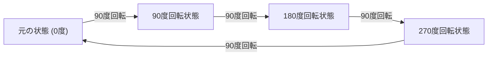
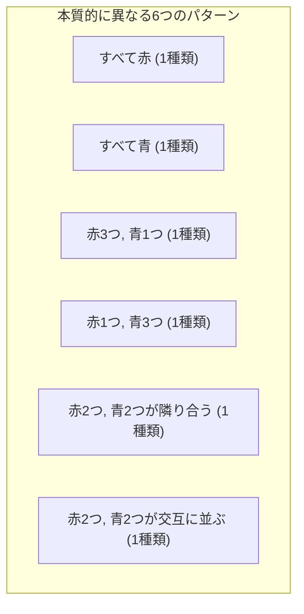

## 1. はじめに：数え上げと対称性の問題

数学の組み合わせ論において、「ある条件を満たすものの数を数える」ことは非常に基本的かつ重要なテーマです。学校で習う順列 (Permutation) や組み合わせ (Combination) の公式を使えば、多くの問題を解決することができます。しかし、現実世界や幾何学的な問題を考えるとき、単なる公式の適用だけでは太刀打ちできない複雑な状況に直面することがあります。

その代表的な例が、 **「対称性を持つ対象の数え上げ」** です。対称性とは、ある操作（回転や反転など）を行っても、全体としての形や性質が変化しない性質のことを指します。

例えば、4つのビーズを糸で繋いで輪にしたネックレスを作るとしましょう。用意するビーズの色は「赤」と「青」の2色です。このとき、異なるデザインのネックレスは全部で何通りあるでしょうか？

この記事では、このような一見シンプルに見える疑問から出発し、対称性を考慮した数え上げの強力な数学的道具である **「[バーンサイドの補題](https://kenji.blog/p/burnsides-lemma/)」** ([Burnside's Lemma](https://kenji.blog/p/burnsides-lemma/)) について、基礎から応用まで詳細に解説します。群論 (Group Theory) の具体的な入門としても最適なトピックですので、ぜひ最後までお付き合いください。

## 2. 単純な数え上げの落とし穴

まず、一番単純な方法で考えてみましょう。4つのビーズがそれぞれ独立して色を選べると仮定します。各ビーズについて、赤か青の2通りの選び方があります。したがって、すべての配色の組み合わせの総数は以下のようになります。

$$
2 \times 2 \times 2 \times 2 = 2^4 = 16 \text{ 通り}
$$

確かに、ビーズが一列に並んだ「ひも」であれば、この $16$ 通りという答えで正解です。しかし、私たちが考えているのは「ネックレス」です。ネックレスは首にかけるものであり、空間中で自由に動かすことができます。

ここでの重要なポイントは、 **「回転して同じになるものは、同一のデザイン」** とみなすべきであるという事実です。

例えば、「赤・青・青・青」という配色のネックレスを想像してください。これを時計回りに90度回転させると「青・赤・青・青」になります。テーブルの上に固定された座標系で見ればこれらは異なる状態ですが、物理的なネックレスとしては全く同一のものです。

単純に $16$ 通りとしてしまうと、このように「回転によって重なるもの」を重複して数えてしまっていることになります。この重複を正確に取り除き、本質的に異なるデザインの数だけを数えるにはどうすればよいでしょうか？ここで必要になるのが、対称性を数学的に記述するための枠組みです。

## 3. 対称性を記述する「群」の基礎

このような重複を厳密かつ系統的に扱うために、現代数学では **「群」** (Group) という概念を使います。群とは、ある対象に対する「操作」や「変換」の集まりであり、以下の4つの公理（性質）を満たすものを指します。

1. **演算の閉性 (Closure)** : 群に含まれる2つの操作を連続して行った結果も、またその群に含まれる操作になる。
2. **結合法則 (Associativity)** : 3つの操作を順番に行うとき、区切り方によらず最終的な結果が同じになる。
3. **単位元の存在 (Identity element)** : 「何もしない」という操作が含まれており、他のどの操作と組み合わせても、元の操作のままになる。
4. **逆元の存在 (Inverse element)** : 任意の操作に対して、その操作を「完全に打ち消す（元に戻す）」操作が必ず存在する。

今回の4つのビーズからなるネックレス（正方形の4つの頂点とみなします）に対する「回転の操作」を集めた群を $G$ としましょう。この群 $G$ には、以下の4つの操作（要素）が含まれます。

- $R_0$ : 何もしない（0度回転、これが単位元です）
- $R_{90}$ : 時計回りに90度回転
- $R_{180}$ : 時計回りに180度回転
- $R_{270}$ : 時計回りに270度回転

たとえば、$R_{90}$ を行った後に $R_{180}$ を行うことは、$R_{270}$ を行うことと同じです。また、$R_{90}$ の逆元は $R_{270}$ になります（合わせて360度回転となり、元に戻るため）。このように、これらの操作は群の公理をすべて満たしています。このような群を **「巡回群」** (Cyclic group) と呼び、$C_4$ と表記することもあります。

## 4. 群の作用と軌道 (Orbits)

群 $G$ が、ある集合 $X$ に与える影響のことを、数学の用語で **「群の作用」** (Group action) と呼びます。今回の例では、集合 $X$ は「回転を無視した $16$ 通りのすべての模様の集合」であり、群 $G$ は「4つの回転操作」です。

ある模様 $x$ に対して、群のすべての操作を行った結果得られる模様の集まりを、その $x$ の **「軌道」** (Orbit) と呼びます。

たとえば、「赤・青・青・青」という模様に $G$ の操作を適用すると、以下の4つの模様が得られます。
- $R_0$ 適用：「赤・青・青・青」
- $R_{90}$ 適用：「青・赤・青・青」
- $R_{180}$ 適用：「青・青・赤・青」
- $R_{270}$ 適用：「青・青・青・赤」

これら4つの模様は同じ「軌道」に属します。私たちが知りたい「本質的に異なるデザインの数」とは、まさに **「集合 $X$ 全体が、いくつの異なる軌道に分割されるか」** ということに他なりません。これを数式では $|X/G|$ と書き表します。

## 5. [バーンサイドの補題](https://kenji.blog/p/burnsides-lemma/) ([Burnside's Lemma](https://kenji.blog/p/burnsides-lemma/))

ここでいよいよ、今回の主役である **[バーンサイドの補題](https://kenji.blog/p/burnsides-lemma/)** が登場します。[コーシー](https://kenji.blog/p/cauchy/)・フロベニウスの補題 ([Cauchy](https://kenji.blog/p/cauchy/)-Frobenius lemma) と呼ばれることもあります。これは、ある群 $G$ が有限集合 $X$ に作用しているとき、その「軌道の数（本質的に異なるパターンの数）」を簡単に計算できるという驚異的な定理です。

定理の数式は以下の通りです。

$$
|X/G| = \frac{1}{|G|} \sum_{g \in G} |X^g|
$$

数式に登場する各記号の意味を詳しく見ていきましょう。

- $|X/G|$ : 求めるべき、本質的に異なる模様の数（軌道の総数）。
- $|G|$ : 群 $G$ に含まれる操作の総数。今回のネックレス問題では、4つの回転があるので $|G| = 4$ です。
- $g$ : 群 $G$ に含まれるそれぞれの操作。
- $X^g$ : 操作 $g$ を行っても「模様が変化しない（固定される）」ような模様の集合。
- $|X^g|$ : 操作 $g$ によって固定される模様の数。これを **「不動点 (Fixed point) の数」** と呼びます。

この数式が意味しているのは非常に直感的です。[バーンサイドの補題](https://kenji.blog/p/burnsides-lemma/)は、 **「各操作ごとに『変化しない模様の数（不動点の数）』を数え上げ、それらをすべて足し合わせて、操作の総数で割る（つまり平均をとる）」** ことで、求めたい軌道の数が得られると主張しているのです。

複雑な重複の判定を、「それぞれの操作で変化しないものを数える」という独立した簡単な計算に分割できる点が、この定理の最大の強みです。

## 6. ネックレス問題への適用と計算

それでは、実際に[バーンサイドの補題](https://kenji.blog/p/burnsides-lemma/)を使って、4つのビーズ（赤と青の2色）のネックレスのデザイン数を計算してみましょう。
元の模様の集合 $X$ の要素数は $16$ です。群 $G$ の各操作 $g \in G$ について、不動点の数 $|X^g|$ を一つずつ調べていきます。

### 6.1. 何もしない操作 ($R_0$) の不動点
この操作は「何も動かさない」というものです。したがって、$16$ 通りのすべての模様は、この操作によって全く変化しません。
$$ |X^{R_0}| = 16 $$

### 6.2. 90度回転 ($R_{90}$) の不動点
90度回転させて、回転前と全く同じ模様になるためにはどうすればよいでしょうか？
1番目のビーズは2番目の位置に、2番目は3番目に、3番目は4番目に、4番目は1番目に移動します。これらが同じ色であるためには、 **「すべてのビーズが同じ色」** でなければなりません。
条件を満たすのは「すべて赤」か「すべて青」の $2$ 通りのみです。
$$ |X^{R_{90}}| = 2 $$

### 6.3. 180度回転 ($R_{180}$) の不動点
180度回転させて元と同じになるためには、向かい合うビーズ（対角線上のビーズ）が同じ色である必要があります。
正方形には対角線が2本あります。それぞれの対角線のペアについて、「赤」か「青」を自由に選ぶことができます。
したがって、$2 \times 2 = 4$ 通りとなります。
$$ |X^{R_{180}}| = 4 $$

### 6.4. 270度回転 ($R_{270}$) の不動点
270度の回転（反時計回りの90度回転）も、90度回転の場合と物理的な状況は同じです。すべてのビーズが同じ色でなければ、回転前後で模様が一致しません。
したがって、「すべて赤」か「すべて青」の $2$ 通りのみです。
$$ |X^{R_{270}}| = 2 $$

### 6.5. 最終的な結果の計算
これで、すべての操作についての不動点の数が出揃いました。これらを[バーンサイドの補題](https://kenji.blog/p/burnsides-lemma/)の公式に代入します。

$$
|X/G| = \frac{|X^{R_0}| + |X^{R_{90}}| + |X^{R_{180}}| + |X^{R_{270}}|}{|G|}
$$
$$
|X/G| = \frac{16 + 2 + 4 + 2}{4} = \frac{24}{4} = 6
$$

計算の結果、回転を同一視した場合、本質的に異なるネックレスのデザインは **$6$ 通り** であることが証明されました。

以下の図は、その $6$ 通りの独立したパターンを示しています。

## 7. 二面体群：裏返しを考慮する場合

現実のネックレスは、机の上に置いた状態で「裏返し」にすることもできます。もし「裏返して同じになるデザインも同一視する」という条件を追加した場合、結果はどうなるでしょうか？

この場合、対象とする群 $G$ には「回転」だけでなく「裏返し（反射）」の操作も加わります。正多角形の回転と反射をすべて含む群を、数学では **「二面体群」** (Dihedral group) と呼び、$D_n$ と表記します。今回は正方形なので $D_4$ です。

二面体群 $D_4$ には、先ほどの4つの回転に加えて、以下の4つの裏返し操作が含まれます。したがって、要素の総数は $|G| = 8$ となります。

- $F_v$ : 縦軸での裏返し
- $F_h$ : 横軸での裏返し
- $F_{d1}$ : 主対角線での裏返し
- $F_{d2}$ : 副対角線での裏返し

これらの新しい操作についても、同様に不動点の数 $|X^g|$ を数え上げます。

### 7.1. 縦軸と横軸での裏返し ($F_v, F_h$)
縦軸で裏返して同じになるためには、左右が対称でなければなりません。左側の2つのビーズの色を自由に選べば（$2 \times 2 = 4$ 通り）、右側のビーズの色は自動的に決まります。横軸も同様に上下対称なので $4$ 通りです。
$$ |X^{F_v}| = 4, \quad |X^{F_h}| = 4 $$

### 7.2. 対角線での裏返し ($F_{d1}, F_{d2}$)
主対角線で裏返す場合、対角線上の2つのビーズは移動しないため自由に色を選べます（$2 \times 2 = 4$ 通り）。残りの2つのビーズは互いに入れ替わるため、同じ色である必要があります（$2$ 通り）。よって、$4 \times 2 = 8$ 通りとなります。副対角線も同様です。
$$ |X^{F_{d1}}| = 8, \quad |X^{F_{d2}}| = 8 $$

### 7.3. 二面体群での結果の計算
得られたすべての不動点の数を公式に代入します。

$$
|X/G| = \frac{16 (\text{回転}) + 2 (\text{回転}) + 4 (\text{回転}) + 2 (\text{回転}) + 4 (\text{反射}) + 4 (\text{反射}) + 8 (\text{反射}) + 8 (\text{反射})}{8}
$$
$$
|X/G| = \frac{48}{8} = 6
$$

偶然にも、この特定のケース（4ビーズ、2色）では、裏返しを考慮しても本質的な種類は **$6$ 通り** のままであることが分かりました。これは、先ほど求めた $6$ つのパターンが、すべて自分自身の裏返しパターンを（回転を含めれば）すでに含んでいたためです。しかし、ビーズの数や色の数が増えれば、回転のみの群 $C_n$ と二面体群 $D_n$ で結果は大きく異なります。

## 8. [バーンサイドの補題](https://kenji.blog/p/burnsides-lemma/)の証明のスケッチ

なぜ「不動点の数の平均」をとると「軌道の数」になるのでしょうか？ その背景には **「軌道・安定化群の定理」** (Orbit-Stabilizer Theorem) という、群論における非常に重要な定理があります。

簡単に証明のスケッチを説明します。
まず、集合 $X$ と群 $G$ の要素のペア $(x, g)$ で、「操作 $g$ によって $x$ が固定される（$g \cdot x = x$）」ようなものの総数を数えることを考えます。これを二通りの方法で数え上げます。

1. **操作 $g$ ごとに数える方法**:
   各操作 $g$ について、固定される $x$ の数 $|X^g|$ を足し合わせます。つまり、$\sum_{g \in G} |X^g|$ です。

2. **要素 $x$ ごとに数える方法**:
   各要素 $x$ について、$x$ を固定するような操作 $g$ の集まりを **「安定化群」** (Stabilizer) と呼び、$G_x$ と書きます。このとき、総数は $\sum_{x \in X} |G_x|$ となります。

軌道・安定化群の定理によれば、要素 $x$ が属する軌道の大きさを $|O_x|$ とすると、$|G| = |O_x| \times |G_x|$ が成り立ちます。
これを変形すると、$|G_x| = \frac{|G|}{|O_x|}$ になります。

したがって、
$$
\sum_{g \in G} |X^g| = \sum_{x \in X} |G_x| = \sum_{x \in X} \frac{|G|}{|O_x|} = |G| \sum_{x \in X} \frac{1}{|O_x|}
$$

ここで、同じ軌道に属する要素を集めて足し合わせると、$\sum_{x \in O_i} \frac{1}{|O_i|} = 1$ になります。つまり、すべての $x$ について足し合わせることは、軌道の数 $|X/G|$ を数えることに等しくなります。

$$
|G| \sum_{x \in X} \frac{1}{|O_x|} = |G| \times |X/G|
$$

両辺を $|G|$ で割ることで、[バーンサイドの補題](https://kenji.blog/p/burnsides-lemma/)の公式が得られます。非常に美しく、洗練された論理展開です。

## 9. ポリアの数え上げ定理への発展

[バーンサイドの補題](https://kenji.blog/p/burnsides-lemma/)は強力ですが、手計算で不動点の数を一つずつ求めるのは、問題の規模が大きくなると困難になります。例えば、「正十二面体の各面を3色で塗り分ける方法は何通りか？」といった問題では、回転操作が60種類もあり、計算が膨大になります。

これをさらに一般化し、代数的な多項式（サイクル指標, Cycle Index）を用いて機械的に計算できるようにしたものが **「ポリアの数え上げ定理」** (Pólya Enumeration Theorem) です。

[バーンサイドの補題](https://kenji.blog/p/burnsides-lemma/)は、ポリアの定理を理解するための重要なステップであり、群論的な数え上げの基礎を築くものです。

## 10. [バーンサイドの補題](https://kenji.blog/p/burnsides-lemma/)の歴史的背景

実は、この定理はウィリアム・バーンサイド (William Burnside) が最初に発見したわけではありません。1897年に出版されたバーンサイドの著書『有限群論』(Theory of Groups of Finite Order) の中で紹介され、広く普及したため彼の名が冠されています。

しかし、歴史的には[オーギュスタン＝ルイ・コーシー](https://kenji.blog/p/cauchy/) ([Augustin-Louis Cauchy](https://kenji.blog/p/cauchy/)) が1845年に既にこの定理の特別な場合（対称群に関するもの）を発表しており、その後1887年にフェルディナント・ゲオルク・フロベニウス (Ferdinand Georg Frobenius) が一般の有限群に対して証明を与えました。

そのため、数学史に厳密であろうとする人々は、この定理を **「[コーシー](https://kenji.blog/p/cauchy/)・フロベニウスの補題」** ([Cauchy](https://kenji.blog/p/cauchy/)-Frobenius Lemma) や **「バーンサイドに帰されない補題」** (The Lemma that is not Burnside's) とユーモアを交えて呼ぶこともあります。名前の由来はどうであれ、この補題が群論と組み合わせ数学の歴史において果たした役割の大きさは計り知れません。

## 11. 具体例2：立方体の面の塗り分け

[バーンサイドの補題](https://kenji.blog/p/burnsides-lemma/)の威力をさらに実感するために、もう一つ有名な例を挙げてみましょう。「立方体の6つの面を、赤と青の2色で塗り分ける方法は何通りあるか？」という問題です。ここでも、回転させて同じになるものは同一視します。

立方体の回転群は、以下の24個の操作からなります。
1. **何もしない** : 1個
2. **向かい合う面の中心を結ぶ軸の周りの回転** : 90度回転が3軸×2個＝6個、180度回転が3軸×1個＝3個（計9個）
3. **向かい合う頂点を結ぶ軸の周りの回転** : 120度回転と240度回転が、4本の対角線について各2個（計8個）
4. **向かい合う辺の中点を結ぶ軸の周りの回転** : 180度回転が6本の軸について各1個（計6個）

合計 $1 + 9 + 8 + 6 = 24$ 個の要素があります（$|G| = 24$）。

それぞれの回転操作について不動点（色が変化しない塗り方）の数を計算し、平均をとることで、立方体の塗り分けの総数が求められます。直感的には数えるのが非常に困難な問題でも、[バーンサイドの補題](https://kenji.blog/p/burnsides-lemma/)を使えば、各回転軸における対称性という「局所的」な問題に還元できるのです。結果として、この立方体の塗り分け方は **$10$ 通り** になることが知られています。

## 12. まとめ

いかがでしたでしょうか。この記事では、ネックレスのデザイン数を題材に、[バーンサイドの補題](https://kenji.blog/p/burnsides-lemma/)について詳しく解説しました。

*   単純な順列・組み合わせでは、対称性による重複をうまく扱えない。
*   対称性は **「群」** を用いて数学的に記述できる。
*   **[バーンサイドの補題](https://kenji.blog/p/burnsides-lemma/)** を使えば、「各操作での不動点の数を平均する」という機械的な手順で、本質的に異なるパターンの数を計算できる。
*   この定理は、軌道・安定化群の定理という群論の深い性質に基づいている。

[バーンサイドの補題](https://kenji.blog/p/burnsides-lemma/)は、化学における分子の異性体（アイソマー）の数え上げ、グラフ理論におけるグラフの同型判定、さらには物理学の統計力学など、幅広い分野で応用されている非常に実践的な定理です。

今回紹介した基礎を通じて、抽象的に見えがちな「群論」という数学の分野が、いかに現実の具体的な問題を鮮やかに解決するか、その一端を感じていただけたなら幸いです。
