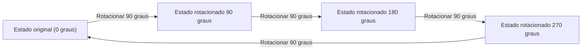
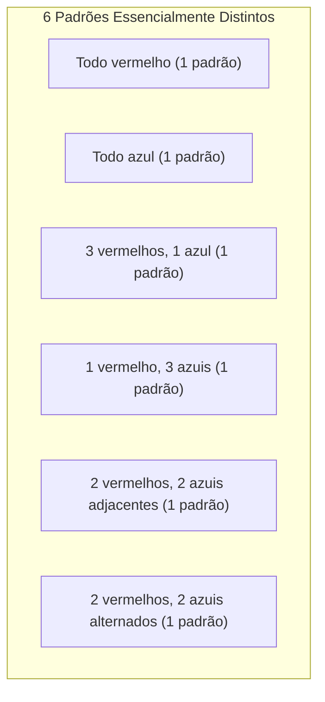

## 1. Introdução: O Problema da Contagem e Simetria

Na combinatória matemática, "contar o número de coisas que satisfazem uma certa condição" é um tema muito básico e importante. Usando as fórmulas para permutação e combinação ensinadas na escola, muitos problemas podem ser resolvidos. No entanto, ao considerar problemas do mundo real ou geométricos, às vezes enfrentamos situações complexas que não podem ser abordadas pela mera aplicação de fórmulas.

Um exemplo típico disso é a **"enumeração de objetos com simetria"**. Simetria refere-se à propriedade de que a forma ou natureza geral não muda mesmo se uma certa operação (como uma rotação ou reflexão) for realizada.

Por exemplo, suponha que façamos um colar juntando quatro miçangas em um loop. As cores das miçangas disponíveis são "vermelho" e "azul". Neste caso, quantos designs de colares diferentes existem no total?

Neste artigo, a partir desta questão aparentemente simples, explicaremos em detalhes a poderosa ferramenta matemática para contar com a simetria considerada, o **"[Lema de Burnside](https://kenji.blog/p/burnsides-lemma/)"**, desde o básico até suas aplicações. Este é um tópico perfeito para uma introdução prática à Teoria dos Grupos, então, por favor, fique conosco até o fim.

## 2. As Armadilhas da Contagem Simples

Primeiro, vamos pensar sobre isso da maneira mais simples. Suponha que cada uma das quatro miçangas possa escolher independentemente sua cor. Para cada miçanga, há 2 escolhas: vermelho ou azul. Portanto, o número total de combinações de cores é o seguinte:

$$
2 \times 2 \times 2 \times 2 = 2^4 = 16 \text{ maneiras}
$$

De fato, se fosse um "fio" onde as miçangas estão alinhadas em uma fileira, essa resposta de $16$ maneiras estaria correta. No entanto, o que estamos considerando é um "colar". Um colar deve ser usado em volta do pescoço e pode ser movido livremente no espaço.

O ponto importante aqui é o fato de que **"coisas que se tornam idênticas quando giradas devem ser consideradas o mesmo design"**.

Por exemplo, imagine um colar com a coloração "Vermelho-Azul-Azul-Azul". Se você girar isso 90 graus no sentido horário, ele se torna "Azul-Vermelho-Azul-Azul". Vistos em um sistema de coordenadas fixo em uma mesa, esses são estados diferentes, mas como um colar físico, eles são exatamente a mesma coisa.

Se simplesmente dissermos que existem $16$ maneiras, estamos supercontando ao incluir "aqueles que se sobrepõem por rotação". Como podemos remover essa duplicação com precisão e contar apenas o número de designs essencialmente diferentes? É aqui que um framework para descrever a simetria matematicamente é necessário.

## 3. Conceitos Básicos de "Grupos" Descrevendo a Simetria

Para lidar com tais duplicações de forma estrita e sistemática, a matemática moderna usa o conceito de um **"Grupo"**. Um grupo é uma coleção de "operações" ou "transformações" em um objeto que satisfaz os seguintes quatro axiomas (propriedades):

1. **Fechamento**: O resultado da realização consecutiva de duas operações incluídas no grupo também é uma operação incluída no grupo.
2. **Associatividade**: Quando três operações são realizadas em ordem, o resultado final é o mesmo, independentemente de como elas são agrupadas.
3. **Elemento neutro**: Uma operação de "não fazer nada" está incluída, e combiná-la com qualquer outra operação deixa a operação original inalterada.
4. **Elemento inverso**: Para qualquer operação, sempre existe uma operação que a "cancela completamente (reverte)".

Seja $G$ o grupo coletando as "operações de rotação" para o colar de quatro miçangas (que consideramos como os quatro vértices de um quadrado) neste exemplo. Este grupo $G$ inclui as seguintes 4 operações (elementos):

- $R_0$: Não fazer nada (rotação de 0 graus; este é o elemento neutro)
- $R_{90}$: Girar 90 graus no sentido horário
- $R_{180}$: Girar 180 graus no sentido horário
- $R_{270}$: Girar 270 graus no sentido horário

Por exemplo, realizar $R_{180}$ após realizar $R_{90}$ é o mesmo que realizar $R_{270}$. Além disso, o elemento inverso de $R_{90}$ é $R_{270}$ (juntos eles fazem uma rotação de 360 graus e retornam ao original). Desta forma, essas operações satisfazem todos os axiomas de um grupo. Tal grupo é chamado de **"Grupo cíclico"**, às vezes denotado como $C_4$.

## 4. Ação de Grupo e Órbitas

O efeito que um grupo $G$ tem sobre um determinado conjunto $X$ é matematicamente chamado de **"Ação de grupo"**. Em nosso exemplo, o conjunto $X$ é "o conjunto de todos os $16$ padrões ignorando as rotações", e o grupo $G$ são "as 4 operações de rotação".

A coleção de padrões obtidos pela aplicação de todas as operações do grupo a um determinado padrão $x$ é chamada de **"Órbita"** desse $x$.

Por exemplo, a aplicação das operações de $G$ ao padrão "Vermelho-Azul-Azul-Azul" produz os seguintes 4 padrões:
- Aplicar $R_0$: "Vermelho-Azul-Azul-Azul"
- Aplicar $R_{90}$: "Azul-Vermelho-Azul-Azul"
- Aplicar $R_{180}$: "Azul-Azul-Vermelho-Azul"
- Aplicar $R_{270}$: "Azul-Azul-Azul-Vermelho"

Esses 4 padrões pertencem à mesma "Órbita". O "número de designs essencialmente diferentes" que queremos saber é exatamente **"em quantas órbitas diferentes todo o conjunto $X$ está dividido"**. Isso é denotado pela fórmula $|X/G|$.

## 5. [Lema de Burnside](https://kenji.blog/p/burnsides-lemma/)

Aqui, finalmente, a estrela desta vez, o **[Lema de Burnside](https://kenji.blog/p/burnsides-lemma/)**, faz sua aparição. Às vezes, também é chamado de lema de Cauchy-Frobenius. Este é um teorema surpreendente que nos permite calcular facilmente o "número de órbitas (número de padrões essencialmente diferentes)" quando um grupo $G$ age sobre um conjunto finito $X$.

A fórmula para o teorema é a seguinte:

$$
|X/G| = \frac{1}{|G|} \sum_{g \in G} |X^g|
$$

Vamos olhar para o significado de cada símbolo que aparece na fórmula em detalhes:

- $|X/G|$: O número de padrões essencialmente diferentes a serem encontrados (número total de órbitas).
- $|G|$: O número total de operações incluídas no grupo $G$. Neste problema do colar, existem 4 rotações, então $|G| = 4$.
- $g$: Cada operação incluída no grupo $G$.
- $X^g$: O conjunto de padrões que "não mudam (são fixados)" mesmo quando a operação $g$ é realizada.
- $|X^g|$: O número de padrões fixados pela operação $g$. Isso é chamado de **"número de pontos fixos"**.

O que esta fórmula significa é muito intuitivo. O [Lema de Burnside](https://kenji.blog/p/burnsides-lemma/) afirma que podemos obter o número desejado de órbitas **"contando o 'número de padrões imutáveis (número de pontos fixos)' para cada operação, somando-os todos e dividindo pelo número total de operações (ou seja, tirando a média)"**.

A maior força deste teorema é que ele pode dividir o julgamento complexo de duplicatas em cálculos independentes e simples de "contar o que não muda em cada operação".

## 6. Aplicação e Cálculo para o Problema do Colar

Agora, vamos usar o [Lema de Burnside](https://kenji.blog/p/burnsides-lemma/) para calcular o número de designs para um colar com 4 miçangas (2 cores, vermelho e azul).
O número de elementos no conjunto original de padrões $X$ é $16$. Vamos investigar o número de pontos fixos $|X^g|$ para cada operação $g \in G$ do grupo $G$ um por um.

### 6.1. Pontos fixos por não fazer nada ($R_0$)
Esta operação é "não mover nada". Portanto, todos os $16$ padrões permanecem completamente inalterados por esta operação.
$$ |X^{R_0}| = 16 $$

### 6.2. Pontos fixos para rotação de 90 graus ($R_{90}$)
O que precisa ser feito para torná-lo exatamente o mesmo padrão de antes da rotação, girando-o 90 graus?
A 1ª miçanga se move para a 2ª posição, a 2ª para a 3ª, a 3ª para a 4ª e a 4ª para a 1ª. Para que tenham a mesma cor, **"todas as miçangas devem ter a mesma cor"**.
Os únicos que satisfazem a condição são $2$ maneiras: "tudo vermelho" ou "tudo azul".
$$ |X^{R_{90}}| = 2 $$

### 6.3. Pontos fixos para rotação de 180 graus ($R_{180}$)
Para ser o mesmo que o original girando 180 graus, as miçangas voltadas uma para a outra (na diagonal) devem ter a mesma cor.
Um quadrado tem 2 diagonais. Para cada par de diagonales, podemos escolher livremente "vermelho" ou "azul".
Portanto, existem $2 \times 2 = 4$ maneiras.
$$ |X^{R_{180}}| = 4 $$

### 6.4. Pontos fixos para rotação de 270 graus ($R_{270}$)
Uma rotação de 270 graus (rotação de 90 graus no sentido anti-horário) é fisicamente a mesma situação que uma rotação de 90 graus. Os padrões antes e depois da rotação não coincidirão a menos que todas as miçangas tenham a mesma cor.
Portanto, existem apenas $2$ maneiras: "tudo vermelho" ou "tudo azul".
$$ |X^{R_{270}}| = 2 $$

### 6.5. Cálculo do resultado final
Agora, temos todos os números de pontos fixos para todas as operações. Nós os substituímos na fórmula do [Lema de Burnside](https://kenji.blog/p/burnsides-lemma/).

$$
|X/G| = \frac{|X^{R_0}| + |X^{R_{90}}| + |X^{R_{180}}| + |X^{R_{270}}|}{|G|}
$$
$$
|X/G| = \frac{16 + 2 + 4 + 2}{4} = \frac{24}{4} = 6
$$

Como resultado do cálculo, foi provado que existem **$6$ maneiras** para designs de colares essencialmente diferentes quando as rotações são consideradas idênticas.

A figura abaixo mostra esses $6$ padrões independentes.

## 7. Grupo Diédrico: Quando Considerar Reflexões

Um colar real também pode ser "virado do avesso" enquanto estiver descansando sobre uma mesa. Se adicionarmos a condição "designs que se tornam iguais quando virados também são considerados idênticos", o que acontece com o resultado?

Nesse caso, o grupo alvo $G$ incluirá não apenas "rotações", mas também operações de "reflexão (virada)". Um grupo que inclui todas as rotações e reflexões de um polígono regular é matematicamente chamado de **"Grupo diédrico"**, denotado como $D_n$. Como isso é um quadrado, é $D_4$.

O grupo diédrico $D_4$ inclui as seguintes 4 operações de reflexão, além das 4 rotações anteriores. Portanto, o número total de elementos é $|G| = 8$.

- $F_v$: Reflexão no eixo vertical
- $F_h$: Reflexão no eixo horizontal
- $F_{d1}$: Reflexão na diagonal principal
- $F_{d2}$: Reflexão na antidiagonal

Para essas novas operações, também contamos o número de pontos fixos $|X^g|$ da mesma maneira.

### 7.1. Reflexão nos eixos vertical e horizontal ($F_v, F_h$)
Para ser idêntico ao ser virado no eixo vertical, ele deve ser simétrico da esquerda para a direita. Se escolhermos livremente as cores das duas miçangas à esquerda ($2 \times 2 = 4$ maneiras), as cores das miçangas à direita são determinadas automaticamente. O eixo horizontal é similarmente simétrico de cima para baixo, então há $4$ maneiras.
$$ |X^{F_v}| = 4, \quad |X^{F_h}| = 4 $$

### 7.2. Reflexão nas diagonais ($F_{d1}, F_{d2}$)
Ao virar na diagonal principal, as duas miçangas na diagonal não se movem, então suas cores podem ser escolhidas livremente ($2 \times 2 = 4$ maneiras). As outras duas miçangas trocam de lugar entre si, então precisam ser da mesma cor ($2$ maneiras). Assim, são $4 \times 2 = 8$ maneiras. A antidiagonal é a mesma coisa.
$$ |X^{F_{d1}}| = 8, \quad |X^{F_{d2}}| = 8 $$

### 7.3. Cálculo de resultados no grupo diédrico
Substitua todos os números de pontos fixos obtidos na fórmula.

$$
|X/G| = \frac{16 (\text{rotações}) + 2 (\text{rotações}) + 4 (\text{rotações}) + 2 (\text{rotações}) + 4 (\text{reflexões}) + 4 (\text{reflexões}) + 8 (\text{reflexões}) + 8 (\text{reflexões})}{8}
$$
$$
|X/G| = \frac{48}{8} = 6
$$

Coincidentemente, neste caso específico (4 miçangas, 2 cores), verificou-se que os tipos essencialmente distintos permanecem **$6$ maneiras** mesmo quando a reflexão é considerada. Isso ocorre porque todos os $6$ padrões que encontramos anteriormente já incluíam seus próprios padrões refletidos (se a rotação for incluída). No entanto, se o número de miçangas ou cores aumentar, os resultados diferirão muito entre o grupo de apenas rotações $C_n$ e o grupo diédrico $D_n$.

## 8. Esboço da Prova do [Lema de Burnside](https://kenji.blog/p/burnsides-lemma/)

Por que tirar a "média do número de pontos fixos" resulta no "número de órbitas"? Por trás disso está um teorema muito importante na teoria dos grupos chamado de **"Teorema de Órbita-Estabilizador"**.

Vamos explicar brevemente o esboço da prova.
Primeiro, considere contar o número total de pares $(x, g)$ de elementos no conjunto $X$ e no grupo $G$ tais que "$x$ é fixado pela operação $g$ ($g \cdot x = x$)". Contamos isso de duas maneiras.

1. **Método de contagem por operação $g$**:
   Para cada operação $g$, some o número de $x$ fixados, $|X^g|$. Ou seja, $\sum_{g \in G} |X^g|$.

2. **Método de contagem por elemento $x$**:
   Para cada elemento $x$, a coleção de operações $g$ que fixam $x$ é chamada de **"Estabilizador"**, escrita como $G_x$. Então, o número total é $\sum_{x \in X} |G_x|$.

De acordo com o teorema da órbita-estabilizador, se $|O_x|$ é o tamanho da órbita a qual o elemento $x$ pertence, $|G| = |O_x| \times |G_x|$ se aplica.
Transformando isso, obtemos $|G_x| = \frac{|G|}{|O_x|}$.

Portanto,
$$
\sum_{g \in G} |X^g| = \sum_{x \in X} |G_x| = \sum_{x \in X} \frac{|G|}{|O_x|} = |G| \sum_{x \in X} \frac{1}{|O_x|}
$$

Aqui, se coletarmos elementos pertencentes à mesma órbita e os somarmos, $\sum_{x \in O_i} \frac{1}{|O_i|} = 1$. Isso significa que a soma sobre todos os $x$ é equivalente a contar o número de órbitas $|X/G|$.

$$
|G| \sum_{x \in X} \frac{1}{|O_x|} = |G| \times |X/G|
$$

Dividindo ambos os lados por $|G|$, obtemos a fórmula para o [Lema de Burnside](https://kenji.blog/p/burnsides-lemma/). É um desenvolvimento lógico muito bonito e sofisticado.

## 9. Desenvolvimento para o Teorema de Enumeração de Pólya

O [Lema de Burnside](https://kenji.blog/p/burnsides-lemma/) é poderoso, mas encontrar manualmente o número de pontos fixos um a um torna-se difícil à medida que a escala do problema aumenta. Por exemplo, para um problema como "De quantas maneiras há para pintar cada face de um dodecaedro regular com 3 cores?", existem 60 tipos de operações de rotação, tornando o cálculo enorme.

Generalizar isso ainda mais e permitir o cálculo mecânico usando polinômios algébricos (Índice de Ciclo) é o **"Teorema de Enumeração de Pólya"**.

O [Lema de Burnside](https://kenji.blog/p/burnsides-lemma/) é um passo importante para a compreensão do teorema de Pólya, estabelecendo as bases para a enumeração da teoria dos grupos.

## 10. Antecedentes Históricos do [Lema de Burnside](https://kenji.blog/p/burnsides-lemma/)

Na verdade, este teorema não foi descoberto pela primeira vez por William Burnside. Ele foi introduzido no livro de Burnside "Teoria dos Grupos de Ordem Finita", publicado em 1897, e se tornou amplamente popularizado, e é por isso que leva o seu nome.

No entanto, historicamente, [Augustin-Louis Cauchy](https://kenji.blog/p/cauchy/) já havia publicado um caso especial desse teorema (em relação a grupos simétricos) em 1845, e mais tarde em 1887 Ferdinand Georg Frobenius deu uma prova para grupos finitos em geral.

Portanto, aqueles que tentam ser rigorosos sobre a história da matemática às vezes chamam de brincadeira esse teorema de **"Lema de Cauchy-Frobenius"** ou **"O Lema que não é de Burnside"**. Independentemente da origem de seu nome, a magnitude do papel que este lema tem desempenhado na história da teoria dos grupos e combinatória é imensurável.

## 11. Exemplo 2: Colorindo as Faces de um Cubo

Para perceber ainda mais o poder do [Lema de Burnside](https://kenji.blog/p/burnsides-lemma/), vamos dar outro exemplo famoso. É o problema: "De quantas maneiras há para pintar as 6 faces de um cubo com 2 cores, vermelho e azul?" Aqui também, tratamos aqueles que se tornam os mesmos quando rotacionados como idênticos.

O grupo de rotação de um cubo consiste nas seguintes 24 operações:
1. **Não fazer nada**: 1 operação
2. **Rotações em torno de eixos conectando os centros de faces opostas**: 6 para rotações de 90 graus (3 eixos × 2), 3 para rotações de 180 graus (3 eixos × 1) (Total de 9)
3. **Rotações em torno de eixos que conectam vértices opostos**: 2 para cada uma das 4 diagonais para rotações de 120 graus e 240 graus (Total de 8)
4. **Rotações em torno de eixos que conectam os pontos médios das arestas opostas**: 1 para cada um dos 6 eixos para rotações de 180 graus (Total de 6)

Há um total de $1 + 9 + 8 + 6 = 24$ elementos ($|G| = 24$).

Calculando o número de pontos fixos (colorações em que as cores não mudam) para cada operação de rotação e tirando a média, o número total de maneiras de colorir o cubo pode ser encontrado. Mesmo para um problema que é extremamente difícil de contar intuitivamente, o uso do [Lema de Burnside](https://kenji.blog/p/burnsides-lemma/) reduz isso a problemas "locais" de simetria ao longo de cada eixo de rotação. Como resultado, sabe-se que o número de maneiras de colorir este cubo é de **$10$ maneiras**.

## 12. Conclusão

O que você achou? Neste artigo, usando o número de designs de colares como exemplo, explicamos detalhadamente o [Lema de Burnside](https://kenji.blog/p/burnsides-lemma/).

*   Permutações e combinações simples não lidam bem com duplicações devido à simetria.
*   A simetria pode ser descrita matematicamente usando um **"Grupo"**.
*   Usando o **[Lema de Burnside](https://kenji.blog/p/burnsides-lemma/)**, o número de padrões essencialmente diferentes pode ser calculado pelo procedimento mecânico de "calcular a média do número de pontos fixos em cada operação".
*   Este teorema baseia-se numa propriedade profunda da teoria dos grupos chamada Teorema de Órbita-Estabilizador.

O [Lema de Burnside](https://kenji.blog/p/burnsides-lemma/) é um teorema muito prático aplicado a uma ampla gama de campos, como enumerar isômeros moleculares na química, determinar o isomorfismo de grafos na teoria de grafos e até mesmo a mecânica estatística na física.

Através dos conceitos básicos introduzidos desta vez, esperamos que você possa ter um vislumbre de como o campo da matemática chamado "Teoria dos Grupos", que tende a parecer abstrato, pode resolver de forma brilhante problemas concretos do mundo real.
