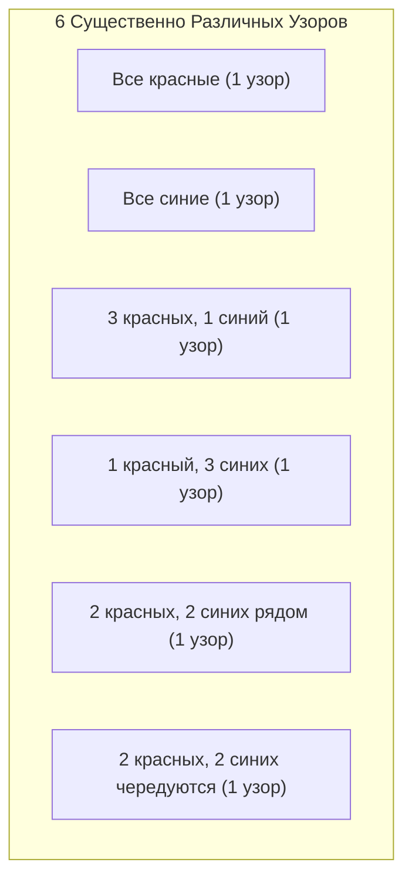

## 1. Введение: Проблема подсчета и симметрия

В математической комбинаторике «подсчет количества вещей, удовлетворяющих определенному условию» — очень базовая и важная тема. Используя формулы для перестановок и сочетаний, изучаемые в школе, можно решить множество задач. Однако, рассматривая реальные или геометрические проблемы, мы иногда сталкиваемся со сложными ситуациями, с которыми нельзя справиться простым применением формул.

Типичным примером этого является **«перечисление объектов с симметрией»**. Симметрия относится к свойству, когда общая форма или природа не изменяется даже при выполнении определенной операции (например, вращения или отражения).

Например, предположим, мы делаем ожерелье, нанизывая четыре бусины в петлю. Доступны цвета бусин — «красный» и «синий». В этом случае сколько всего различных дизайнов ожерелий существует?

В этой статье, начав с этого, казалось бы, простого вопроса, мы подробно объясним мощный математический инструмент для подсчета с учетом симметрии — **«Лемму Бёрнсайда»**, от основ до ее применений. Это идеальная тема для практического введения в теорию групп, поэтому, пожалуйста, оставайтесь с нами до конца.

## 2. Ловушки простого подсчета

Сначала давайте подумаем об этом самым простым способом. Предположим, что каждая из четырех бусин может независимо выбирать свой цвет. Для каждой бусины есть 2 варианта: красный или синий. Следовательно, общее количество цветовых комбинаций следующее:

$$
2 \times 2 \times 2 \times 2 = 2^4 = 16 \text{ способов}
$$

Действительно, если бы это была «веревка», где бусины выстроены в ряд, этот ответ из $16$ способов был бы правильным. Однако мы рассматриваем «ожерелье». Ожерелье предназначено для ношения на шее и может свободно перемещаться в пространстве.

Важным моментом здесь является тот факт, что **«вещи, которые становятся идентичными при вращении, должны рассматриваться как один и тот же дизайн»**.

Например, представьте себе ожерелье с расцветкой «Красный-Синий-Синий-Синий». Если вы повернете его на 90 градусов по часовой стрелке, оно станет «Синий-Красный-Синий-Синий». При рассмотрении в системе координат, закрепленной на столе, это разные состояния, но как физическое ожерелье — это абсолютно одно и то же.

Если мы просто скажем, что существует $16$ способов, мы завышаем количество, включая «те, которые перекрываются при вращении». Как мы можем точно удалить это дублирование и подсчитать только количество по существу разных дизайнов? Именно здесь нужна основа для математического описания симметрии.

## 3. Основы «групп», описывающих симметрию

Чтобы строго и систематически справляться с такими дублированиями, современная математика использует концепцию **«группы»**. Группа — это набор «операций» или «преобразований» над объектом, который удовлетворяет следующим четырем аксиомам (свойствам):

1. **Замкнутость**: Результат последовательного выполнения двух операций, включенных в группу, также является операцией, включенной в группу.
2. **Ассоциативность**: Когда три операции выполняются по порядку, конечный результат одинаков независимо от того, как они сгруппированы.
3. **Нейтральный элемент**: Включена операция «ничего не делать», и ее комбинация с любой другой операцией оставляет исходную операцию неизменной.
4. **Обратный элемент**: Для любой операции всегда существует операция, которая ее «полностью отменяет (обращает)».

Пусть $G$ — группа, собирающая «операции вращения» для ожерелья из четырех бусин (которые мы рассматриваем как четыре вершины квадрата) в этом примере. Эта группа $G$ включает следующие 4 операции (элементы):

- $R_0$: Ничего не делать (вращение на 0 градусов; это нейтральный элемент)
- $R_{90}$: Поворот на 90 градусов по часовой стрелке
- $R_{180}$: Поворот на 180 градусов по часовой стрелке
- $R_{270}$: Поворот на 270 градусов по часовой стрелке

Например, выполнение $R_{180}$ после выполнения $R_{90}$ — это то же самое, что выполнение $R_{270}$. Кроме того, обратным элементом для $R_{90}$ является $R_{270}$ (вместе они совершают поворот на 360 градусов и возвращаются к оригиналу). Таким образом, эти операции удовлетворяют всем аксиомам группы. Такая группа называется **«Циклической группой»**, иногда обозначаемой как $C_4$.

## 4. Действие группы и орбиты

Влияние, которое группа $G$ оказывает на определенное множество $X$, математически называется **«Действием группы»**. В нашем примере множество $X$ — это «множество всех $16$ узоров без учета вращений», а группа $G$ — это «4 операции вращения».

Набор узоров, полученных путем применения всех операций группы к определенному узору $x$, называется **«Орбитой»** этого $x$.

Например, применение операций $G$ к узору «Красный-Синий-Синий-Синий» дает следующие 4 узора:
- Применить $R_0$: «Красный-Синий-Синий-Синий»
- Применить $R_{90}$: «Синий-Красный-Синий-Синий»
- Применить $R_{180}$: «Синий-Синий-Красный-Синий»
- Применить $R_{270}$: «Синий-Синий-Синий-Красный»

Эти 4 узора принадлежат к одной и той же «Орбите». «Количество существенно различных дизайнов», которое мы хотим узнать, — это в точности не что иное, как то, **«на сколько различных орбит разбивается все множество $X$»**. Это обозначается формулой $|X/G|$.

## 5. Лемма Бёрнсайда

Здесь наконец появляется звезда этого раза — **Лемма Бёрнсайда**. Ее также иногда называют леммой Коши-Фробениуса. Это удивительная теорема, которая позволяет нам легко вычислить «количество орбит (количество существенно различных узоров)», когда группа $G$ действует на конечное множество $X$.

Формула теоремы выглядит следующим образом:

$$
|X/G| = \frac{1}{|G|} \sum_{g \in G} |X^g|
$$

Давайте подробно рассмотрим значение каждого символа, появляющегося в формуле:

- $|X/G|$: Количество по существу различных узоров, которые нужно найти (общее количество орбит).
- $|G|$: Общее количество операций, включенных в группу $G$. В этой задаче об ожерелье есть 4 вращения, поэтому $|G| = 4$.
- $g$: Каждая операция, включенная в группу $G$.
- $X^g$: Множество узоров, которые «не изменяются (остаются неподвижными)» даже при выполнении операции $g$.
- $|X^g|$: Количество узоров, оставляемых неподвижными операцией $g$. Это называется **«количеством неподвижных точек»**.

То, что означает эта формула, очень интуитивно понятно. Лемма Бёрнсайда утверждает, что мы можем получить желаемое количество орбит, **«подсчитав 'количество неизменяемых узоров (количество неподвижных точек)' для каждой операции, сложив их все и разделив на общее количество операций (то есть взяв среднее значение)»**.

Самая большая сила этой теоремы заключается в том, что она может разбить сложное определение дубликатов на независимые, простые вычисления «подсчета того, что не меняется при каждой операции».

## 6. Применение и расчет для задачи об ожерелье

Теперь давайте фактически используем лемму Бёрнсайда, чтобы вычислить количество дизайнов для ожерелья с 4 бусинами (2 цвета, красный и синий).
Количество элементов в исходном множестве узоров $X$ равно $16$. Мы по очереди исследуем количество неподвижных точек $|X^g|$ для каждой операции $g \in G$ группы $G$.

### 6.1. Неподвижные точки, когда ничего не делается ($R_0$)
Эта операция означает «ничего не перемещать». Поэтому все $16$ узоров остаются совершенно неизменными благодаря этой операции.
$$ |X^{R_0}| = 16 $$

### 6.2. Неподвижные точки для поворота на 90 градусов ($R_{90}$)
Что нужно сделать, чтобы при повороте на 90 градусов он стал точно таким же узором, как и до поворота?
1-я бусина перемещается на 2-ю позицию, 2-я — на 3-ю, 3-я — на 4-ю, а 4-я — на 1-ю. Чтобы они были одного цвета, **«все бусины должны быть одного цвета»**.
Этому условию удовлетворяют только $2$ способа: «все красные» или «все синие».
$$ |X^{R_{90}}| = 2 $$

### 6.3. Неподвижные точки для поворота на 180 градусов ($R_{180}$)
Чтобы он был таким же, как оригинал, при повороте на 180 градусов, бусины, обращенные друг к другу (на диагонали), должны быть одного цвета.
У квадрата 2 диагонали. Для каждой пары диагоналей мы можем свободно выбирать «красный» или «синий».
Следовательно, существует $2 \times 2 = 4$ способа.
$$ |X^{R_{180}}| = 4 $$

### 6.4. Неподвижные точки для поворота на 270 градусов ($R_{270}$)
Поворот на 270 градусов (поворот на 90 градусов против часовой стрелки) физически представляет собой ту же ситуацию, что и поворот на 90 градусов. Узоры до и после вращения не совпадут, если все бусины не будут одного цвета.
Следовательно, существует только $2$ способа: «все красные» или «все синие».
$$ |X^{R_{270}}| = 2 $$

### 6.5. Расчет окончательного результата
Теперь у нас есть все количества неподвижных точек для всех операций. Мы подставляем их в формулу леммы Бёрнсайда.

$$
|X/G| = \frac{|X^{R_0}| + |X^{R_{90}}| + |X^{R_{180}}| + |X^{R_{270}}|}{|G|}
$$
$$
|X/G| = \frac{16 + 2 + 4 + 2}{4} = \frac{24}{4} = 6
$$

В результате расчетов было доказано, что существует **$6$ способов** для существенно различающихся дизайнов ожерелий, когда вращения считаются идентичными.

На рисунке ниже показаны эти $6$ независимых узоров.

## 7. Диэдральная группа: При рассмотрении отражений

Настоящее ожерелье также можно «вывернуть наизнанку (перевернуть)», пока оно лежит на столе. Если мы добавим условие «дизайны, которые становятся одинаковыми при переворачивании, также считаются идентичными», что произойдет с результатом?

В этом случае целевая группа $G$ будет включать не только «вращения», но и операции «отражения (переворачивания)». Группа, которая включает в себя все вращения и отражения правильного многоугольника, математически называется **«Диэдральной группой»**, обозначаемой как $D_n$. Поскольку это квадрат, то это $D_4$.

Диэдральная группа $D_4$ включает следующие 4 операции отражения в дополнение к 4 вращениям из предыдущего. Следовательно, общее количество элементов равно $|G| = 8$.

- $F_v$: Отражение относительно вертикальной оси
- $F_h$: Отражение относительно горизонтальной оси
- $F_{d1}$: Отражение относительно главной диагонали
- $F_{d2}$: Отражение относительно побочной диагонали

Для этих новых операций мы также подсчитываем количество неподвижных точек $|X^g|$ таким же образом.

### 7.1. Отражение относительно вертикальной и горизонтальной осей ($F_v, F_h$)
Чтобы быть идентичным при переворачивании относительно вертикальной оси, он должен быть симметричным слева направо. Если мы свободно выбираем цвета двух бусин слева ($2 \times 2 = 4$ способа), цвета бусин справа определяются автоматически. Горизонтальная ось аналогичным образом симметрична сверху вниз, поэтому существует $4$ способа.
$$ |X^{F_v}| = 4, \quad |X^{F_h}| = 4 $$

### 7.2. Отражение относительно диагоналей ($F_{d1}, F_{d2}$)
При переворачивании относительно главной диагонали две бусины на диагонали не перемещаются, поэтому их цвета можно свободно выбирать ($2 \times 2 = 4$ способа). Остальные две бусины меняются местами друг с другом, поэтому они должны быть одного цвета ($2$ способа). Таким образом, получается $4 \times 2 = 8$ способов. Побочная диагональ — то же самое.
$$ |X^{F_{d1}}| = 8, \quad |X^{F_{d2}}| = 8 $$

### 7.3. Расчет результатов в диэдральной группе
Подставьте все полученные количества неподвижных точек в формулу.

$$
|X/G| = \frac{16 (\text{вращений}) + 2 (\text{вращений}) + 4 (\text{вращений}) + 2 (\text{вращений}) + 4 (\text{отражений}) + 4 (\text{отражений}) + 8 (\text{отражений}) + 8 (\text{отражений})}{8}
$$
$$
|X/G| = \frac{48}{8} = 6
$$

По совпадению, в этом конкретном случае (4 бусины, 2 цвета) было обнаружено, что по существу различные типы остаются **$6$ способами** даже при рассмотрении отражения. Это связано с тем, что все $6$ узоров, которые мы нашли ранее, уже включали в себя их собственные отраженные узоры (если включено вращение). Однако, если количество бусин или цветов увеличится, результаты будут сильно различаться между группой только вращений $C_n$ и диэдральной группой $D_n$.

## 8. Эскиз доказательства леммы Бёрнсайда

Почему взятие «среднего количества неподвижных точек» приводит к «количеству орбит»? За этим стоит очень важная теорема в теории групп, называемая **«Теоремой об орбитах и стабилизаторах»**.

Давайте кратко объясним схему доказательства.
Сначала рассмотрим подсчет общего количества пар $(x, g)$ элементов в множестве $X$ и группе $G$ таких, что «$x$ остается неподвижным под действием операции $g$ ($g \cdot x = x$)». Мы считаем это двумя способами.

1. **Метод подсчета для каждой операции $g$**:
   Для каждой операции $g$ просуммируйте количество неподвижных $x$, $|X^g|$. То есть $\sum_{g \in G} |X^g|$.

2. **Метод подсчета для каждого элемента $x$**:
   Для каждого элемента $x$ набор операций $g$, которые оставляют $x$ неподвижным, называется **«Стабилизатором»**, записываемым как $G_x$. Тогда общее количество равно $\sum_{x \in X} |G_x|$.

Согласно теореме об орбитах и стабилизаторах, если $|O_x|$ — это размер орбиты, к которой принадлежит элемент $x$, справедливо равенство $|G| = |O_x| \times |G_x|$.
Преобразуя это, получаем $|G_x| = \frac{|G|}{|O_x|}$.

Следовательно,
$$
\sum_{g \in G} |X^g| = \sum_{x \in X} |G_x| = \sum_{x \in X} \frac{|G|}{|O_x|} = |G| \sum_{x \in X} \frac{1}{|O_x|}
$$

Здесь, если мы соберем элементы, принадлежащие одной и той же орбите, и сложим их, $\sum_{x \in O_i} \frac{1}{|O_i|} = 1$. Это означает, что суммирование по всем $x$ эквивалентно подсчету количества орбит $|X/G|$.

$$
|G| \sum_{x \in X} \frac{1}{|O_x|} = |G| \times |X/G|
$$

Разделив обе стороны на $|G|$, мы получим формулу для леммы Бёрнсайда. Это очень красивое и сложное логическое развитие.

## 9. Развитие в Теорему перечисления Пойа

Лемма Бёрнсайда — мощный инструмент, но вручную находить количество неподвижных точек одну за другой становится трудным по мере увеличения масштаба задачи. Например, для такой проблемы, как «Сколько существует способов раскрасить каждую грань правильного додекаэдра в 3 цвета?», существует 60 видов операций вращения, что делает вычисления огромными.

Дальнейшим обобщением этого и обеспечением механического вычисления с использованием алгебраических полиномов (Цикловой индекс) является **«Теорема перечисления Пойа»**.

Лемма Бёрнсайда — важный шаг к пониманию теоремы Пойа, закладывающий основу для теоретико-группового перечисления.

## 10. Историческая справка о лемме Бёрнсайда

На самом деле эта теорема была впервые открыта не Уильямом Бёрнсайдом. Она была введена в книге Бёрнсайда «Теория групп конечного порядка», опубликованной в 1897 году, и стала широко популярной, поэтому и носит его имя.

Однако исторически Огюстен-Луи Коши уже опубликовал частный случай этой теоремы (относительно симметрических групп) в 1845 году, а позже, в 1887 году, Фердинанд Георг Фробениус дал доказательство для конечных групп в целом.

Поэтому те, кто пытается быть строгими в отношении истории математики, иногда в шутку называют эту теорему **«Леммой Коши-Фробениуса»** или **«Леммой, которая не принадлежит Бёрнсайду»**. Независимо от происхождения ее названия, масштабы роли, которую эта лемма сыграла в истории теории групп и комбинаторики, неизмеримы.

## 11. Пример 2: Раскраска граней куба

Чтобы еще больше осознать мощь леммы Бёрнсайда, приведем еще один известный пример. Это задача: «Сколько существует способов раскрасить 6 граней куба в 2 цвета, красный и синий?» И здесь мы рассматриваем те, которые становятся одинаковыми при вращении, как идентичные.

Группа вращений куба состоит из следующих 24 операций:
1. **Ничего не делать**: 1 операция
2. **Вращения вокруг осей, соединяющих центры противоположных граней**: 6 для поворотов на 90 градусов (3 оси × 2), 3 для поворотов на 180 градусов (3 оси × 1) (Итого 9)
3. **Вращения вокруг осей, соединяющих противоположные вершины**: 2 для каждой из 4 диагоналей для поворотов на 120 градусов и 240 градусов (Итого 8)
4. **Вращения вокруг осей, соединяющих середины противоположных ребер**: 1 для каждой из 6 осей для поворотов на 180 градусов (Итого 6)

Всего $1 + 9 + 8 + 6 = 24$ элемента ($|G| = 24$).

Рассчитав количество неподвижных точек (раскрасок, где цвета не меняются) для каждой операции вращения и взяв среднее значение, можно найти общее количество способов раскрасить куб. Даже для задачи, которую чрезвычайно трудно сосчитать интуитивно, использование леммы Бёрнсайда сводит ее к «локальным» проблемам симметрии вдоль каждой оси вращения. В результате известно, что количество способов раскрасить этот куб составляет **$10$ способов**.

## 12. Заключение

Как вам это? В этой статье на примере количества дизайнов ожерелий мы подробно объяснили лемму Бёрнсайда.

*   Простые перестановки и сочетания плохо справляются с дублированием из-за симметрии.
*   Симметрию можно математически описать с помощью **«Группы»**.
*   Используя **Лемму Бёрнсайда**, количество по существу различных узоров можно вычислить с помощью механической процедуры «усреднения количества неподвижных точек в каждой операции».
*   Эта теорема основана на глубоком свойстве теории групп, называемом теоремой об орбитах и стабилизаторах.

Лемма Бёрнсайда — очень практичная теорема, применяемая в широком спектре областей, таких как перечисление молекулярных изомеров в химии, определение изоморфизма графов в теории графов и даже статистическая механика в физике.

Мы надеемся, что благодаря основам, представленным в этот раз, вы смогли мельком увидеть, как область математики под названием «Теория групп», которая имеет тенденцию выглядеть абстрактной, может блестяще решать конкретные проблемы реального мира.
