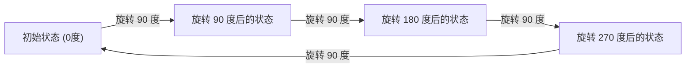
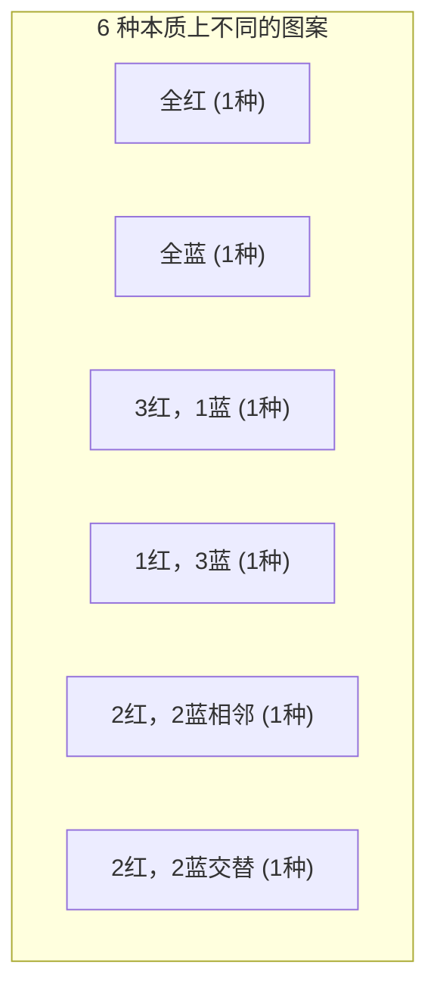

## 1. 简介：计数与对称性的问题

在组合数学中，“计算满足特定条件的对象的数量”是一个非常基础且重要的主题。使用学校教授的排列和组合公式，可以解决许多问题。然而，在考虑现实世界或几何问题时，我们有时会面临复杂的情况，这些情况不能仅凭应用公式来解决。

这方面的一个典型例子是 **“具有对称性的对象的计数”** 。对称性是指即使执行特定操作（如旋转或反射），整体形状或性质也不会改变的属性。

例如，假设我们通过将四颗珠子串成一个环来制作一条项链。可用的珠子颜色是“红色”和“蓝色”。在这种情况下，总共有多少种不同的项链设计？

在本文中，从这个看似简单的问题出发，我们将详细解释考虑对称性进行计数的强大数学工具—— **“[伯恩赛德引理](https://kenji.blog/zh-cn/p/burnsides-lemma/)”** ([Burnside's Lemma](https://kenji.blog/zh-cn/p/burnsides-lemma/))，从基础到其应用。这是群论实践入门的绝佳主题，所以请务必阅读到最后。

## 2. 简单计数的陷阱

首先，让我们以最简单的方式来思考。假设四颗珠子中的每一颗都可以独立选择颜色。对于每颗珠子，有2种选择：红色或蓝色。因此，颜色组合的总数如下：

$$
2 \times 2 \times 2 \times 2 = 2^4 = 16 \text{ 种}
$$

事实上，如果是将珠子排成一排的“绳子”，这个 $16$ 种的答案是正确的。然而，我们考虑的是“项链”。项链是要戴在脖子上的，并且可以在空间中自由移动。

这里重要的一点是， **“旋转后变得相同的物体应被视为相同的设计”** 。

例如，想象一条颜色为“红-蓝-蓝-蓝”的项链。如果您将其顺时针旋转90度，它会变成“蓝-红-蓝-蓝”。如果在固定于桌子上的坐标系中观察，这些是不同的状态，但作为一条物理项链，它们完全是同一个东西。

如果我们简单地说有 $16$ 种，我们就过度计算了，因为包含了“那些通过旋转重叠的设计”。我们如何才能准确地消除这种重复，并且只计算本质上不同的设计的数量？这就需要一个用数学来描述对称性的框架。

## 3. 描述对称性的“群”的基础知识

为了严格且系统地处理这种重复，现代数学使用了 **“群”** (Group) 的概念。群是对一个对象进行的“操作”或“变换”的集合，它满足以下四个公理（性质）：

1. **封闭性** : 连续执行群中包含的两个操作的结果也是群中包含的一个操作。
2. **结合律** : 当按顺序执行三个操作时，无论它们如何分组，最终结果都是相同的。
3. **单位元** : 包含一个“什么都不做”的操作，将其与任何其他操作结合都不会改变原操作。
4. **逆元** : 对于任何操作，总是存在一个“完全抵消（恢复）”它的操作。

在这个例子中，设 $G$ 为收集四颗珠子组成的项链（我们将其视为正方形的四个顶点）的“旋转操作”的群。该群 $G$ 包含以下4个操作（元素）：

- $R_0$ : 什么都不做（0度旋转；这是单位元）
- $R_{90}$ : 顺时针旋转90度
- $R_{180}$ : 顺时针旋转180度
- $R_{270}$ : 顺时针旋转270度

例如，执行 $R_{90}$ 后再执行 $R_{180}$ 与执行 $R_{270}$ 是一样的。另外，$R_{90}$ 的逆元是 $R_{270}$ （它们在一起形成360度旋转并返回到原始状态）。这样，这些操作满足了群的所有公理。这种群被称为 **“循环群”** (Cyclic group)，有时记为 $C_4$ 。

## 4. 群作用与轨道 (Orbits)

群 $G$ 对某个集合 $X$ 产生的影响在数学上称为 **“群作用”** (Group action)。在我们的例子中，集合 $X$ 是“忽略旋转的所有 $16$ 种图案的集合”，而群 $G$ 是“4个旋转操作”。

通过将群的所有操作应用于某个图案 $x$ 所获得的图案集合称为该 $x$ 的 **“轨道”** (Orbit)。

例如，将 $G$ 的操作应用于图案“红-蓝-蓝-蓝”会产生以下4种图案：
- 应用 $R_0$：“红-蓝-蓝-蓝”
- 应用 $R_{90}$：“蓝-红-蓝-蓝”
- 应用 $R_{180}$：“蓝-蓝-红-蓝”
- 应用 $R_{270}$：“蓝-蓝-蓝-红”

这4种图案属于同一个“轨道”。我们想知道的“本质上不同的设计数量”，恰恰就是 **“整个集合 $X$ 被划分成了多少个不同的轨道”** 。这用公式 $|X/G|$ 来表示。

## 5. [伯恩赛德引理](https://kenji.blog/zh-cn/p/burnsides-lemma/) ([Burnside's Lemma](https://kenji.blog/zh-cn/p/burnsides-lemma/))

终于，这次的主角 **[伯恩赛德引理](https://kenji.blog/zh-cn/p/burnsides-lemma/)** 登场了。它有时也被称为柯西-弗罗贝尼乌斯引理。这是一个惊人的定理，它允许我们在群 $G$ 作用于有限集合 $X$ 时，轻松计算“轨道的数量（本质上不同的图案的数量）”。

定理的公式如下：

$$
|X/G| = \frac{1}{|G|} \sum_{g \in G} |X^g|
$$

让我们详细看看公式中出现的每个符号的含义：

- $|X/G|$ : 要找到的本质上不同的图案的数量（轨道的总数）。
- $|G|$ : 群 $G$ 中包含的操作总数。在这个项链问题中，有4个旋转，所以 $|G| = 4$ 。
- $g$ : 群 $G$ 中包含的每个操作。
- $X^g$ : 即使执行了操作 $g$ 也“不发生变化（被固定）”的图案集合。
- $|X^g|$ : 被操作 $g$ 固定的图案数量。这被称为 **“不动点的数量”** 。

这个公式的含义非常直观。[伯恩赛德引理](https://kenji.blog/zh-cn/p/burnsides-lemma/)断言，我们可以通过 **“计算每个操作下‘不变图案的数量（不动点的数量）’，将它们全部加起来，然后除以操作的总数（即取平均值）”** 来获得所需的轨道数量。

这个定理的最大优势在于，它可以将对重复的复杂判断分解为“计算在每个操作下保持不变的内容”这种独立、简单的计算。

## 6. 项链问题的应用与计算

现在，让我们实际使用[伯恩赛德引理](https://kenji.blog/zh-cn/p/burnsides-lemma/)来计算有4颗珠子（2种颜色，红色和蓝色）的项链的设计数量。
图案的原始集合 $X$ 的元素数量是 $16$ 。我们将逐一考察群 $G$ 的每个操作 $g \in G$ 的不动点数量 $|X^g|$ 。

### 6.1. 什么都不做的操作 ($R_0$) 的不动点
这个操作是“什么都不移动”。因此，所有的 $16$ 种图案在这种操作下完全没有改变。
$$ |X^{R_0}| = 16 $$

### 6.2. 90度旋转 ($R_{90}$) 的不动点
旋转90度时需要做什么才能使它与旋转前的图案完全相同？
第1颗珠子移动到第2个位置，第2颗移动到第3个位置，第3颗移动到第4个位置，第4颗移动到第1个位置。为了使它们颜色相同， **“所有珠子必须是相同的颜色”** 。
唯一满足条件的是 $2$ 种情况：“全红”或“全蓝”。
$$ |X^{R_{90}}| = 2 $$

### 6.3. 180度旋转 ($R_{180}$) 的不动点
为了在旋转180度后与原始图案相同，彼此相对的珠子（在对角线上）必须颜色相同。
正方形有两条对角线。对于每对对角线，我们可以自由选择“红色”或“蓝色”。
因此，有 $2 \times 2 = 4$ 种情况。
$$ |X^{R_{180}}| = 4 $$

### 6.4. 270度旋转 ($R_{270}$) 的不动点
270度旋转（逆时针90度旋转）在物理上与90度旋转是相同的情况。除非所有珠子的颜色都相同，否则旋转前后的图案将不匹配。
因此，只有 $2$ 种情况：“全红”或“全蓝”。
$$ |X^{R_{270}}| = 2 $$

### 6.5. 最终结果的计算
现在，我们得到了所有操作的所有不动点数量。我们将它们代入[伯恩赛德引理](https://kenji.blog/zh-cn/p/burnsides-lemma/)的公式中。

$$
|X/G| = \frac{|X^{R_0}| + |X^{R_{90}}| + |X^{R_{180}}| + |X^{R_{270}}|}{|G|}
$$
$$
|X/G| = \frac{16 + 2 + 4 + 2}{4} = \frac{24}{4} = 6
$$

计算结果证明，当把旋转视为相同时，本质上不同的项链设计有 **$6$ 种** 。

下图展示了这 $6$ 种独立的图案。

## 7. 二面体群：考虑翻转的情况

一条真正的项链在放在桌子上时也可以“翻过来（翻转）”。如果我们加上一个条件，“翻转后变得相同的设计也被认为是相同的”，结果会发生什么变化？

在这种情况下，目标群 $G$ 将不仅包括“旋转”，还包括“反射（翻转）”操作。包含正多边形所有旋转和反射的群在数学上被称为 **“二面体群”** (Dihedral group)，记为 $D_n$ 。由于这是一个正方形，所以是 $D_4$ 。

除了前面的4个旋转外，二面体群 $D_4$ 还包括以下4个反射操作。因此，元素的总数是 $|G| = 8$ 。

- $F_v$ : 沿垂直轴反射
- $F_h$ : 沿水平轴反射
- $F_{d1}$ : 沿主对角线反射
- $F_{d2}$ : 沿副对角线反射

对于这些新操作，我们也用同样的方法计算不动点数量 $|X^g|$ 。

### 7.1. 沿垂直轴和水平轴反射 ($F_v, F_h$)
为了在沿垂直轴翻转时保持相同，它必须是左右对称的。如果我们自由选择左边两颗珠子的颜色（$2 \times 2 = 4$ 种情况），右边珠子的颜色就自动确定了。水平轴同样是上下对称的，所以有 $4$ 种情况。
$$ |X^{F_v}| = 4, \quad |X^{F_h}| = 4 $$

### 7.2. 沿对角线反射 ($F_{d1}, F_{d2}$)
沿主对角线翻转时，对角线上的两颗珠子不动，因此可以自由选择它们的颜色（$2 \times 2 = 4$ 种情况）。剩下的两颗珠子互相交换位置，因此它们需要是相同的颜色（$2$ 种情况）。这样，就是 $4 \times 2 = 8$ 种情况。副对角线也是一样的。
$$ |X^{F_{d1}}| = 8, \quad |X^{F_{d2}}| = 8 $$

### 7.3. 二面体群中结果的计算
将获得的所有不动点数量代入公式。

$$
|X/G| = \frac{16 (\text{旋转}) + 2 (\text{旋转}) + 4 (\text{旋转}) + 2 (\text{旋转}) + 4 (\text{反射}) + 4 (\text{反射}) + 8 (\text{反射}) + 8 (\text{反射})}{8}
$$
$$
|X/G| = \frac{48}{8} = 6
$$

巧合的是，在这个特定的例子（4颗珠子，2种颜色）中，我们发现即使考虑了反射，本质上不同的种类仍然是 **$6$ 种** 。这是因为我们之前找到的所有 $6$ 种图案都已经包含了它们自己的反射图案（如果包括旋转的话）。然而，如果珠子或颜色的数量增加，只有旋转的群 $C_n$ 和二面体群 $D_n$ 之间的结果会有很大不同。

## 8. [伯恩赛德引理](https://kenji.blog/zh-cn/p/burnsides-lemma/)的证明概要

为什么取“不动点数量的平均值”会得到“轨道数量”？这背后的原因在于群论中一个非常重要的定理，称为 **“轨道-稳定子定理”** (Orbit-Stabilizer Theorem)。

让我们简要解释一下证明的概要。
首先，考虑计算集合 $X$ 和群 $G$ 中元素的配对 $(x, g)$ 的总数，使得“$x$ 在操作 $g$ 下被固定（$g \cdot x = x$）”。我们用两种方式来计算。

1. **按操作 $g$ 计数的方法** :
   对于每个操作 $g$，将在其下被固定的 $x$ 的数量 $|X^g|$ 加起来。即 $\sum_{g \in G} |X^g|$ 。

2. **按元素 $x$ 计数的方法** :
   对于每个元素 $x$，将能够固定 $x$ 的操作 $g$ 的集合称为 **“稳定子”** (Stabilizer)，记为 $G_x$ 。那么总数就是 $\sum_{x \in X} |G_x|$ 。

根据轨道-稳定子定理，如果 $|O_x|$ 是元素 $x$ 所属轨道的长度，那么 $|G| = |O_x| \times |G_x|$ 成立。
对此进行变形，我们得到 $|G_x| = \frac{|G|}{|O_x|}$ 。

因此，
$$
\sum_{g \in G} |X^g| = \sum_{x \in X} |G_x| = \sum_{x \in X} \frac{|G|}{|O_x|} = |G| \sum_{x \in X} \frac{1}{|O_x|}
$$

在这里，如果我们把属于同一个轨道的元素收集起来并求和，$\sum_{x \in O_i} \frac{1}{|O_i|} = 1$ 。这意味着对所有 $x$ 求和等同于计算轨道的数量 $|X/G|$ 。

$$
|G| \sum_{x \in X} \frac{1}{|O_x|} = |G| \times |X/G|
$$

将等式两边除以 $|G|$，我们就得到了[伯恩赛德引理](https://kenji.blog/zh-cn/p/burnsides-lemma/)的公式。这是一个非常优美且精妙的逻辑推导过程。

## 9. 扩展到波利亚计数定理

[伯恩赛德引理](https://kenji.blog/zh-cn/p/burnsides-lemma/)很强大，但随着问题规模的增大，手动逐一计算不动点数量变得困难。例如，对于“有多少种方法用3种颜色涂满正十二面体的每一个面？”这样的问题，有60种旋转操作，计算量巨大。

进一步推广这一概念，并允许使用代数多项式（循环指数）进行机械计算的定理是 **“波利亚计数定理”** (Pólya Enumeration Theorem)。

[伯恩赛德引理](https://kenji.blog/zh-cn/p/burnsides-lemma/)是理解波利亚定理的重要步骤，为群论计数奠定了基础。

## 10. [伯恩赛德引理](https://kenji.blog/zh-cn/p/burnsides-lemma/)的历史背景

事实上，这个定理并非最先由威廉·伯恩赛德 (William Burnside) 发现。它是在伯恩赛德于1897年出版的《有限群论》(Theory of Groups of Finite Order) 一书中被介绍并广泛普及的，因此它以他的名字命名。

然而，在历史上，[奥古斯丁-路易·柯西](https://kenji.blog/zh-cn/p/cauchy/) ([Augustin-Louis Cauchy](https://kenji.blog/zh-cn/p/cauchy/)) 早在1845年就已经发表了这个定理的一个特例（关于对称群），后来在1887年，费迪南德·格奥尔格·弗罗贝尼乌斯 (Ferdinand Georg Frobenius) 给出了有限群的普遍证明。

因此，那些试图在数学历史上保持严谨的人有时会开玩笑地称这个定理为 **“柯西-弗罗贝尼乌斯引理”** 或 **“不属于伯恩赛德的引理”** 。无论其名字的由来如何，这个引理在群论和组合数学史上所发挥的作用之巨大是不可估量的。

## 11. 示例 2：正方体面的着色

为了进一步体会[伯恩赛德引理](https://kenji.blog/zh-cn/p/burnsides-lemma/)的威力，让我们再举一个著名的例子。问题是：“有多少种方法可以用红色和蓝色两种颜色涂满一个正方体的6个面？”在这里，我们也将旋转后变得相同的那些着色视为相同的。

正方体的旋转群包含以下24个操作：
1. **什么都不做** : 1个操作
2. **围绕连接相对面中心的轴的旋转** : 90度旋转有6个（3条轴 × 2），180度旋转有3个（3条轴 × 1）（共9个）
3. **围绕连接相对顶点的轴的旋转** : 4条对角线各有两个120度和240度旋转（共8个）
4. **围绕连接相对边中点的轴的旋转** : 6条轴各有一个180度旋转（共6个）

总共有 $1 + 9 + 8 + 6 = 24$ 个元素（$|G| = 24$）。

通过计算每个旋转操作下的不动点数量（即颜色不改变的着色方式）并取平均值，可以找到着色正方体方式的总数。即使对于直觉上极难计算的问题，使用[伯恩赛德引理](https://kenji.blog/zh-cn/p/burnsides-lemma/)也能将其简化为沿每个旋转轴的对称性的“局部”问题。结果表明，为这个正方体着色的方法有 **$10$ 种** 。

## 12. 结论

你觉得怎么样？在这篇文章中，我们以项链设计数量为例，详细讲解了[伯恩赛德引理](https://kenji.blog/zh-cn/p/burnsides-lemma/)。

*   简单的排列和组合不能很好地处理由于对称性造成的重复。
*   对称性可以使用 **“群”** 在数学上进行描述。
*   使用 **[伯恩赛德引理](https://kenji.blog/zh-cn/p/burnsides-lemma/)** ，可以通过“计算每个操作中不动点数量的平均值”的机械过程来计算本质上不同的图案数量。
*   这个定理建立在群论中一个称为轨道-稳定子定理的深刻性质之上。

[伯恩赛德引理](https://kenji.blog/zh-cn/p/burnsides-lemma/)是一个非常实用的定理，应用于广泛的领域，例如化学中分子异构体的枚举，图论中图同构的确定，甚至是物理学中的统计力学。

通过这次介绍的基础知识，我们希望你能一窥“群论”这个看似抽象的数学领域，是如何出色地解决现实世界中的具体问题的。
