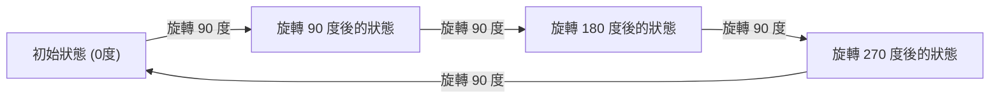
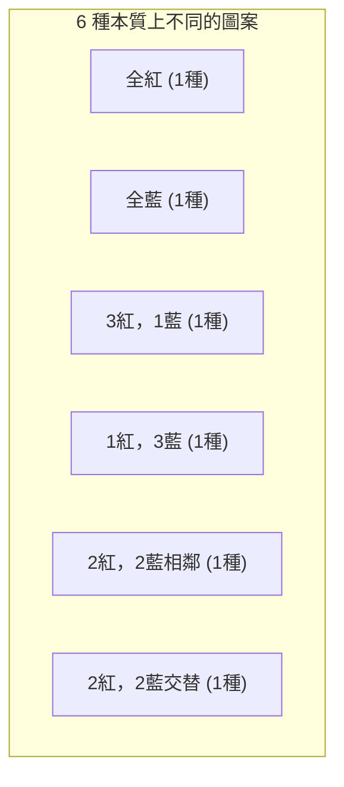

## 1. 簡介：計數與對稱性的問題

在組合數學中，「計算滿足特定條件的對象的數量」是一個非常基礎且重要的主題。使用學校教授的排列和組合公式，可以解決許多問題。然而，在考慮現實世界或幾何問題時，我們有時會面臨複雜的情況，這些情況不能僅憑應用公式來解決。

這方面的一個典型例子是 **「具有對稱性的對象的計數」** 。對稱性是指即使執行特定操作（如旋轉或反射），整體形狀或性質也不會改變的屬性。

例如，假設我們通過將四顆珠子串成一個環來製作一條項鍊。可用的珠子顏色是「紅色」和「藍色」。在這種情況下，總共有多少種不同的項鍊設計？

在本文中，從這個看似簡單的問題出發，我們將詳細解釋考慮對稱性進行計數的強大數學工具—— **「[伯恩賽德引理](https://kenji.blog/zh-tw/p/burnsides-lemma/)」** ([Burnside's Lemma](https://kenji.blog/zh-tw/p/burnsides-lemma/))，從基礎到其應用。這是群論實踐入門的絕佳主題，所以請務必閱讀到最後。

## 2. 簡單計數的陷阱

首先，讓我們以最簡單的方式來思考。假設四顆珠子中的每一顆都可以獨立選擇顏色。對於每顆珠子，有2種選擇：紅色或藍色。因此，顏色組合的總數如下：

$$
2 \times 2 \times 2 \times 2 = 2^4 = 16 \text{ 種}
$$

事實上，如果是將珠子排成一排的「繩子」，這個 $16$ 種的答案是正確的。然而，我們考慮的是「項鍊」。項鍊是要戴在脖子上的，並且可以在空間中自由移動。

這裡重要的一點是， **「旋轉後變得相同的物體應被視為相同的設計」** 。

例如，想像一條顏色為「紅-藍-藍-藍」的項鍊。如果您將其順時針旋轉90度，它會變成「藍-紅-藍-藍」。如果在固定於桌子上的坐標系中觀察，這些是不同的狀態，但作為一條物理項鍊，它們完全是同一個東西。

如果我們簡單地說有 $16$ 種，我們就過度計算了，因為包含了「那些通過旋轉重疊的設計」。我們如何才能準確地消除這種重複，並且只計算本質上不同的設計的數量？這就需要一個用數學來描述對稱性的框架。

## 3. 描述對稱性的「群」的基礎知識

為了嚴格且系統地處理這種重複，現代數學使用了 **「群」** (Group) 的概念。群是對一個對象進行的「操作」或「變換」的集合，它滿足以下四個公理（性質）：

1. **封閉性** : 連續執行群中包含的兩個操作的結果也是群中包含的一個操作。
2. **結合律** : 當按順序執行三個操作時，無論它們如何分組，最終結果都是相同的。
3. **單位元素** : 包含一個「什麼都不做」的操作，將其與任何其他操作結合都不會改變原操作。
4. **反元素** : 對於任何操作，總是存在一個「完全抵消（恢復）」它的操作。

在這個例子中，設 $G$ 為收集四顆珠子組成的項鍊（我們將其視為正方形的四個頂點）的「旋轉操作」的群。該群 $G$ 包含以下4個操作（元素）：

- $R_0$ : 什麼都不做（0度旋轉；這是單位元素）
- $R_{90}$ : 順時針旋轉90度
- $R_{180}$ : 順時針旋轉180度
- $R_{270}$ : 順時針旋轉270度

例如，執行 $R_{90}$ 後再執行 $R_{180}$ 與執行 $R_{270}$ 是一樣的。另外，$R_{90}$ 的反元素是 $R_{270}$ （它們在一起形成360度旋轉並返回到原始狀態）。這樣，這些操作滿足了群的所有公理。這種群被稱為 **「循環群」** (Cyclic group)，有時記為 $C_4$ 。

## 4. 群作用與軌道 (Orbits)

群 $G$ 對某個集合 $X$ 產生的影響在數學上稱為 **「群作用」** (Group action)。在我們的例子中，集合 $X$ 是「忽略旋轉的所有 $16$ 種圖案的集合」，而群 $G$ 是「4個旋轉操作」。

通過將群的所有操作應用於某個圖案 $x$ 所獲得的圖案集合稱為該 $x$ 的 **「軌道」** (Orbit)。

例如，將 $G$ 的操作應用於圖案「紅-藍-藍-藍」會產生以下4種圖案：
- 應用 $R_0$：「紅-藍-藍-藍」
- 應用 $R_{90}$：「藍-紅-藍-藍」
- 應用 $R_{180}$：「藍-藍-紅-藍」
- 應用 $R_{270}$：「藍-藍-藍-紅」

這4種圖案屬於同一個「軌道」。我們想知道的「本質上不同的設計數量」，恰恰就是 **「整個集合 $X$ 被劃分成了多少個不同的軌道」** 。這用公式 $|X/G|$ 來表示。

## 5. [伯恩賽德引理](https://kenji.blog/zh-tw/p/burnsides-lemma/) ([Burnside's Lemma](https://kenji.blog/zh-tw/p/burnsides-lemma/))

終於，這次的主角 **[伯恩賽德引理](https://kenji.blog/zh-tw/p/burnsides-lemma/)** 登場了。它有時也被稱為柯西-弗羅貝尼烏斯引理。這是一個驚人的定理，它允許我們在群 $G$ 作用於有限集合 $X$ 時，輕鬆計算「軌道的數量（本質上不同的圖案的數量）」。

定理的公式如下：

$$
|X/G| = \frac{1}{|G|} \sum_{g \in G} |X^g|
$$

讓我們詳細看看公式中出現的每個符號的含義：

- $|X/G|$ : 要找到的本質上不同的圖案的數量（軌道的總數）。
- $|G|$ : 群 $G$ 中包含的操作總數。在這個項鍊問題中，有4個旋轉，所以 $|G| = 4$ 。
- $g$ : 群 $G$ 中包含的每個操作。
- $X^g$ : 即使執行了操作 $g$ 也「不發生變化（被固定）」的圖案集合。
- $|X^g|$ : 被操作 $g$ 固定的圖案數量。這被稱為 **「不動點的數量」** 。

這個公式的含義非常直觀。[伯恩賽德引理](https://kenji.blog/zh-tw/p/burnsides-lemma/)斷言，我們可以通過 **「計算每個操作下『不變圖案的數量（不動點的數量）』，將它們全部加起來，然後除以操作的總數（即取平均值）」** 來獲得所需的軌道數量。

這個定理的最大優勢在於，它可以將對重複的複雜判斷分解為「計算在每個操作下保持不變的內容」這種獨立、簡單的計算。

## 6. 項鍊問題的應用與計算

現在，讓我們實際使用[伯恩賽德引理](https://kenji.blog/zh-tw/p/burnsides-lemma/)來計算有4顆珠子（2種顏色，紅色和藍色）的項鍊的設計數量。
圖案的原始集合 $X$ 的元素數量是 $16$ 。我們將逐一考察群 $G$ 的每個操作 $g \in G$ 的不動點數量 $|X^g|$ 。

### 6.1. 什麼都不做的操作 ($R_0$) 的不動點
這個操作是「什麼都不移動」。因此，所有的 $16$ 種圖案在這種操作下完全沒有改變。
$$ |X^{R_0}| = 16 $$

### 6.2. 90度旋轉 ($R_{90}$) 的不動點
旋轉90度時需要做什麼才能使它與旋轉前的圖案完全相同？
第1顆珠子移動到第2個位置，第2顆移動到第3個位置，第3顆移動到第4個位置，第4顆移動到第1個位置。為了使它們顏色相同， **「所有珠子必須是相同的顏色」** 。
唯一滿足條件的是 $2$ 種情況：「全紅」或「全藍」。
$$ |X^{R_{90}}| = 2 $$

### 6.3. 180度旋轉 ($R_{180}$) 的不動點
為了在旋轉180度後與原始圖案相同，彼此相對的珠子（在對角線上）必須顏色相同。
正方形有兩條對角線。對於每對對角線，我們可以自由選擇「紅色」或「藍色」。
因此，有 $2 \times 2 = 4$ 種情況。
$$ |X^{R_{180}}| = 4 $$

### 6.4. 270度旋轉 ($R_{270}$) 的不動點
270度旋轉（逆時針90度旋轉）在物理上與90度旋轉是相同的情況。除非所有珠子的顏色都相同，否則旋轉前後的圖案將不匹配。
因此，只有 $2$ 種情況：「全紅」或「全藍」。
$$ |X^{R_{270}}| = 2 $$

### 6.5. 最終結果的計算
現在，我們得到了所有操作的所有不動點數量。我們將它們代入[伯恩賽德引理](https://kenji.blog/zh-tw/p/burnsides-lemma/)的公式中。

$$
|X/G| = \frac{|X^{R_0}| + |X^{R_{90}}| + |X^{R_{180}}| + |X^{R_{270}}|}{|G|}
$$
$$
|X/G| = \frac{16 + 2 + 4 + 2}{4} = \frac{24}{4} = 6
$$

計算結果證明，當把旋轉視為相同時，本質上不同的項鍊設計有 **$6$ 種** 。

下圖展示了這 $6$ 種獨立的圖案。

## 7. 二面體群：考慮翻轉的情況

一條真正的項鍊在放在桌子上時也可以「翻過來（翻轉）」。如果我們加上一個條件，「翻轉後變得相同的設計也被認為是相同的」，結果會發生什麼變化？

在這種情況下，目標群 $G$ 將不僅包括「旋轉」，還包括「反射（翻轉）」操作。包含正多邊形所有旋轉和反射的群在數學上被稱為 **「二面體群」** (Dihedral group)，記為 $D_n$ 。由於這是一個正方形，所以是 $D_4$ 。

除了前面的4個旋轉外，二面體群 $D_4$ 還包括以下4個反射操作。因此，元素的總數是 $|G| = 8$ 。

- $F_v$ : 沿垂直軸反射
- $F_h$ : 沿水平軸反射
- $F_{d1}$ : 沿主對角線反射
- $F_{d2}$ : 沿副對角線反射

對於這些新操作，我們也用同樣的方法計算不動點數量 $|X^g|$ 。

### 7.1. 沿垂直軸和水平軸反射 ($F_v, F_h$)
為了在沿垂直軸翻轉時保持相同，它必須是左右對稱的。如果我們自由選擇左邊兩顆珠子的顏色（$2 \times 2 = 4$ 種情況），右邊珠子的顏色就自動確定了。水平軸同樣是上下對稱的，所以有 $4$ 種情況。
$$ |X^{F_v}| = 4, \quad |X^{F_h}| = 4 $$

### 7.2. 沿對角線反射 ($F_{d1}, F_{d2}$)
沿主對角線翻轉時，對角線上的兩顆珠子不動，因此可以自由選擇它們的顏色（$2 \times 2 = 4$ 種情況）。剩下的兩顆珠子互相交換位置，因此它們需要是相同的顏色（$2$ 種情況）。這樣，就是 $4 \times 2 = 8$ 種情況。副對角線也是一樣的。
$$ |X^{F_{d1}}| = 8, \quad |X^{F_{d2}}| = 8 $$

### 7.3. 二面體群中結果的計算
將獲得的所有不動點數量代入公式。

$$
|X/G| = \frac{16 (\text{旋轉}) + 2 (\text{旋轉}) + 4 (\text{旋轉}) + 2 (\text{旋轉}) + 4 (\text{反射}) + 4 (\text{反射}) + 8 (\text{反射}) + 8 (\text{反射})}{8}
$$
$$
|X/G| = \frac{48}{8} = 6
$$

巧合的是，在這個特定的例子（4顆珠子，2種顏色）中，我們發現即使考慮了反射，本質上不同的種類仍然是 **$6$ 種** 。這是因為我們之前找到的所有 $6$ 種圖案都已經包含了它們自己的反射圖案（如果包括旋轉的話）。然而，如果珠子或顏色的數量增加，只有旋轉的群 $C_n$ 和二面體群 $D_n$ 之間的結果會有很大不同。

## 8. [伯恩賽德引理](https://kenji.blog/zh-tw/p/burnsides-lemma/)的證明概要

為什麼取「不動點數量的平均值」會得到「軌道數量」？這背後的原因在於群論中一個非常重要的定理，稱為 **「軌道-穩定子定理」** (Orbit-Stabilizer Theorem)。

讓我們簡要解釋一下證明的概要。
首先，考慮計算集合 $X$ 和群 $G$ 中元素的配對 $(x, g)$ 的總數，使得「$x$ 在操作 $g$ 下被固定（$g \cdot x = x$）」。我們用兩種方式來計算。

1. **按操作 $g$ 計數的方法** :
   對於每個操作 $g$，將在其下被固定的 $x$ 的數量 $|X^g|$ 加起來。即 $\sum_{g \in G} |X^g|$ 。

2. **按元素 $x$ 計數的方法** :
   對於每個元素 $x$，將能夠固定 $x$ 的操作 $g$ 的集合稱為 **「穩定子」** (Stabilizer)，記為 $G_x$ 。那麼總數就是 $\sum_{x \in X} |G_x|$ 。

根據軌道-穩定子定理，如果 $|O_x|$ 是元素 $x$ 所屬軌道的長度，那麼 $|G| = |O_x| \times |G_x|$ 成立。
對此進行變形，我們得到 $|G_x| = \frac{|G|}{|O_x|}$ 。

因此，
$$
\sum_{g \in G} |X^g| = \sum_{x \in X} |G_x| = \sum_{x \in X} \frac{|G|}{|O_x|} = |G| \sum_{x \in X} \frac{1}{|O_x|}
$$

在這裡，如果我們把屬於同一個軌道的元素收集起來並求和，$\sum_{x \in O_i} \frac{1}{|O_i|} = 1$ 。這意味著對所有 $x$ 求和等同於計算軌道的數量 $|X/G|$ 。

$$
|G| \sum_{x \in X} \frac{1}{|O_x|} = |G| \times |X/G|
$$

將等式兩邊除以 $|G|$，我們就得到了[伯恩賽德引理](https://kenji.blog/zh-tw/p/burnsides-lemma/)的公式。這是一個非常優美且精妙的邏輯推導過程。

## 9. 擴展到波利亞計數定理

[伯恩賽德引理](https://kenji.blog/zh-tw/p/burnsides-lemma/)很強大，但隨著問題規模的增大，手動逐一計算不動點數量變得困難。例如，對於「有多少種方法用3種顏色塗滿正十二面體的每一個面？」這樣的問題，有60種旋轉操作，計算量巨大。

進一步推廣這一概念，並允許使用代數多項式（循環指數）進行機械計算的定理是 **「波利亞計數定理」** (Pólya Enumeration Theorem)。

[伯恩賽德引理](https://kenji.blog/zh-tw/p/burnsides-lemma/)是理解波利亞定理的重要步驟，為群論計數奠定了基礎。

## 10. [伯恩賽德引理](https://kenji.blog/zh-tw/p/burnsides-lemma/)的歷史背景

事實上，這個定理並非最先由威廉·伯恩賽德 (William Burnside) 發現。它是在伯恩賽德於1897年出版的《有限群論》(Theory of Groups of Finite Order) 一書中被介紹並廣泛普及的，因此它以他的名字命名。

然而，在歷史上，[奧古斯丁-路易·柯西](https://kenji.blog/zh-tw/p/cauchy/) ([Augustin-Louis Cauchy](https://kenji.blog/zh-tw/p/cauchy/)) 早在1845年就已經發表了這個定理的一個特例（關於對稱群），後來在1887年，費迪南德·格奧爾格·弗羅貝尼烏斯 (Ferdinand Georg Frobenius) 給出了有限群的普遍證明。

因此，那些試圖在數學歷史上保持嚴謹的人有時會開玩笑地稱這個定理為 **「柯西-弗羅貝尼烏斯引理」** 或 **「不屬於伯恩賽德的引理」** 。無論其名字的由來如何，這個引理在群論和組合數學史上所發揮的作用之巨大是不可估量的。

## 11. 示例 2：正方體面的著色

為了進一步體會[伯恩賽德引理](https://kenji.blog/zh-tw/p/burnsides-lemma/)的威力，讓我們再舉一個著名的例子。問題是：「有多少種方法可以用紅色和藍色兩種顏色塗滿一個正方體的6個面？」在這裡，我們也將旋轉後變得相同的那些著色視為相同的。

正方體的旋轉群包含以下24個操作：
1. **什麼都不做** : 1個操作
2. **圍繞連接相對面中心的軸的旋轉** : 90度旋轉有6個（3條軸 × 2），180度旋轉有3個（3條軸 × 1）（共9個）
3. **圍繞連接相對頂點的軸的旋轉** : 4條對角線各有两个120度和240度旋轉（共8個）
4. **圍繞連接相對邊中點的軸的旋轉** : 6條軸各有一個180度旋轉（共6個）

總共有 $1 + 9 + 8 + 6 = 24$ 個元素（$|G| = 24$）。

通過計算每個旋轉操作下的不動點數量（即顏色不改變的著色方式）並取平均值，可以找到著色正方體方式的總數。即使對於直覺上極難計算的問題，使用[伯恩賽德引理](https://kenji.blog/zh-tw/p/burnsides-lemma/)也能將其簡化為沿每個旋轉軸的對稱性的「局部」問題。結果表明，為這個正方體著色的方法有 **$10$ 種** 。

## 12. 結論

你覺得怎麼樣？在這篇文章中，我們以項鍊設計數量為例，詳細講解了[伯恩賽德引理](https://kenji.blog/zh-tw/p/burnsides-lemma/)。

*   簡單的排列和組合不能很好地處理由於對稱性造成的重複。
*   對稱性可以使用 **「群」** 在數學上進行描述。
*   使用 **[伯恩賽德引理](https://kenji.blog/zh-tw/p/burnsides-lemma/)** ，可以通過「計算每個操作中不動點數量的平均值」的機械過程來計算本質上不同的圖案數量。
*   這個定理建立在群論中一個稱為軌道-穩定子定理的深刻性質之上。

[伯恩賽德引理](https://kenji.blog/zh-tw/p/burnsides-lemma/)是一個非常實用的定理，應用於廣泛的領域，例如化學中分子異構體的枚舉，圖論中圖同構的確定，甚至是物理學中的統計力學。

通過這次介紹的基礎知識，我們希望你能一瞥「群論」這個看似抽象的數學領域，是如何出色地解決現實世界中的具體問題的。
