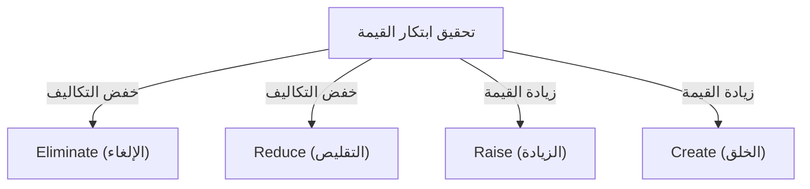

# استراتيجية المحيط الأزرق: نظرية الأعمال القصوى لخلق أسواق غير مستغلة بلا منافسة

## 1. مقدمة: لماذا نحتاج إلى "استراتيجية المحيط الأزرق" الآن؟

في بيئة الأعمال الحديثة، تتعرض الأسواق الحالية لمنافسة شديدة. مع تطور التكنولوجيا والعولمة، تتسارع عملية تحول المنتجات والخدمات إلى سلع استهلاكية، وتشتد المنافسة في الأسعار. تخوض الشركات معركة دموية من أجل البقاء للاستحواذ على حصة محدودة. أطلق الأستاذان دبليو تشان كيم ورينيه موبورن من كلية إنسياد (INSEAD) لإدارة الأعمال في فرنسا على هذه الأسواق التنافسية الحالية اسم "المحيط الأحمر".

الأساس في الاستراتيجيات التقليدية في المحيط الأحمر (مثل استراتيجية التنافس لمايكل بورتر) هو التغلب على المنافسين، أي "بناء ميزة تنافسية". ولكن في العصر الحالي حيث يتباطأ نمو السوق ويتجاوز العرض الطلب، فإن التنافس على الحصة الحالية يؤدي في النهاية إلى انخفاض هوامش الربح (حرب الأسعار)، ويصبح العامل الأكبر الذي يعيق النمو المستدام للشركات.

وهنا تم اقتراح "استراتيجية المحيط الأزرق". يعني المحيط الأزرق مساحة سوق غير مستغلة وبلا منافسة. جوهر هذه الاستراتيجية ليس "الفوز في المنافسة"، بل "جعل المنافسة بلا معنى". من خلال التوقف عن التنافس في نفس الساحة مع المنافسين، وخلق قيمة جديدة، وفتح الأسواق بجهود ذاتية، يصبح من الممكن بناء نموذج أعمال مستدام وعالي الربحية.

في هذا المقال، سنتعمق ونشرح بالتفصيل استراتيجية المحيط الأزرق، بدءًا من المفاهيم الأساسية، وصولاً إلى أطر العمل المحددة، وقصص النجاح، وعمليات التنفيذ، وحتى كيفية التغلب على العقبات التنظيمية.

## 2. الاختلاف الجوهري بين المحيط الأحمر والمحيط الأزرق

لفهم استراتيجية المحيط الأزرق، يجب أولاً إدراك الاختلاف بوضوح عن المحيط الأحمر. تقع العديد من الشركات في فخ المحيط الأحمر دون وعي.

*   **المحيط الأحمر (الأسواق الحالية)**
    *   **تعريف السوق:** التنافس في مساحة السوق الحالية. الحدود مرسومة بالفعل.
    *   **هدف الاستراتيجية:** التغلب على المنافسين. يتم التركيز على المقارنة المرجعية.
    *   **النهج تجاه الطلب:** التنافس على الطلب الحالي (العملاء).
    *   **العلاقة بين القيمة والتكلفة:** قبول المفاضلة بين القيمة والتكلفة. إما قيمة مضافة عالية (تكلفة عالية) أو سعر منخفض (تكلفة منخفضة) (استراتيجية التمايز أو استراتيجية قيادة التكلفة).
    *   **التوافق التنظيمي:** مواءمة جميع أنشطة الشركة لتتناسب مع إما استراتيجية التمايز أو التكلفة المنخفضة.

*   **المحيط الأزرق (الأسواق غير المستغلة)**
    *   **تعريف السوق:** خلق مساحة سوق جديدة خالية من المنافسة. إعادة رسم الحدود.
    *   **هدف الاستراتيجية:** جعل المنافسة بلا معنى. لا داعي للقلق بشأن المنافسين.
    *   **النهج تجاه الطلب:** استكشاف واستقطاب طلب جديد (غير العملاء).
    *   **العلاقة بين القيمة والتكلفة:** كسر المفاضلة بين القيمة والتكلفة. السعي لتحقيق قيمة مضافة عالية وتكلفة منخفضة في وقت واحد (ابتكار القيمة).
    *   **التوافق التنظيمي:** مواءمة جميع أنشطة الشركة لتحقيق التوازن بين التمايز والتكلفة المنخفضة.

كما يتضح من هذه المقارنة، فإن استراتيجية المحيط الأزرق ليست مجرد استراتيجية متخصصة (Niche). فبينما تستهدف الاستراتيجية المتخصصة منطقة ضيقة من السوق الحالي، فإن استراتيجية المحيط الأزرق هي نهج ديناميكي يوسع السوق نفسه أو يخلق سوقاً جديداً.

## 3. المفهوم الأساسي: "ابتكار القيمة"

يعد "ابتكار القيمة" حجر الزاوية في استراتيجية المحيط الأزرق.
في النظريات الاستراتيجية التقليدية، كان يُعتقد أن "التمايز (تقديم قيمة فريدة والبيع بسعر مرتفع)" و "التكلفة المنخفضة (بيع منتجات قياسية بسعر رخيص)" في علاقة مفاضلة. وكانت محاولة السعي وراء كليهما تؤدي إلى "الوقوع في المنتصف" (Stuck in the middle) والفشل.

ومع ذلك، يقلب ابتكار القيمة هذا المفهوم الشائع. فهو يهدف إلى تحقيق "زيادة القيمة للعملاء (التمايز)" و "خفض التكاليف للشركة" **في وقت واحد**.

ابتكار القيمة ليس مرادفاً للابتكار التكنولوجي. فبدون استخدام أحدث التقنيات، من الممكن خلق قيمة هائلة للعملاء بمجرد إعادة النظر في كيفية دمج التقنيات الحالية أو طرق تقديم الخدمات. من خلال زيادة العناصر التي تعزز القيمة للعملاء وتقليل أو إزالة العناصر غير الضرورية، يتم رسم منحنى قيمة غير مسبوق.

## 4. إطار عمل صياغة الاستراتيجية: مصفوفة الإجراءات (شبكة ERRC)

لتنفيذ ابتكار القيمة وكسر المفاضلة بين القيمة والتكلفة، يتم استخدام أداة محددة هي "الإجراءات الأربعة (شبكة ERRC)". يتم طرح الأسئلة الأربعة التالية حول عوامل المنافسة التي تعتبر بديهية في الصناعة:

1.  **Eliminate (الإلغاء)**: من بين العناصر التي تعتبر بديهية في الصناعة، ما الذي يجب إزالته؟ (مفتاح خفض التكاليف)
2.  **Reduce (التقليص)**: ما هي العناصر التي يجب تقليلها بشكل كبير مقارنة بمعايير الصناعة؟ (مفتاح خفض التكاليف)
3.  **Raise (الزيادة)**: ما هي العناصر التي يجب زيادتها بشكل كبير مقارنة بمعايير الصناعة؟ (مفتاح زيادة القيمة)
4.  **Create (الخلق)**: ما هي العناصر التي لم يتم تقديمها في الصناعة من قبل ويجب إضافتها حديثًا؟ (مفتاح زيادة القيمة)

من خلال هذه الإجراءات الأربعة، يتم تحسين هيكل التكاليف بشكل جذري مع تقديم قيمة جديدة للعملاء.

## 5. أمثلة ناجحة بارزة على استراتيجية المحيط الأزرق

بعد فهم النظرية، دعونا نلقي نظرة على أمثلة لشركات نجحت بالفعل في شق طريقها نحو المحيط الأزرق.

### المثال 1: سيرك دو سوليه (صناعة الترفيه)

خلق سيرك دو سوليه، الذي نشأ في كندا، سوقاً جديدة كلياً في صناعة السيرك التي كان يُقال إنها في تراجع.
كانت السيركات التقليدية تنفق تكاليف باهظة على نجوم العروض وعروض الحيوانات، وكانت تستهدف بشكل أساسي العائلات التي لديها أطفال. ومع ذلك، وبسبب الانتقادات من منظور حماية الحيوانات وظهور أشكال أخرى من الترفيه (مثل ألعاب الفيديو)، تدهورت الربحية.

طبق سيرك دو سوليه الإجراءات الأربعة على النحو التالي:
*   **الإلغاء**: التكاليف الباهظة لـ "عروض الحيوانات" و"نجوم العروض" و"الأداء في عدة حلبات متزامنة"
*   **التقليص**: التركيز المفرط على الإثارة والخطر
*   **الزيادة**: تجهيزات الخيمة الواحدة، الجانب الفني، والبيئة الراقية
*   **الخلق**: مواضيع العروض، عناصر المسرح والباليه، والموسيقى والرقص الفني

ونتيجة لذلك، نجحوا في خلق شكل جديد من الترفيه يدمج بين السيرك والمسرح، وتمكنوا من جذب "غير العملاء" من البالغين وطلبات ترفيه الشركات. استطاعوا تحديد أسعار التذاكر أعلى بكثير من السيرك التقليدي، وحققوا بنية عالية الربحية.

### المثال 2: نينتندو وي (Nintendo Wii) (صناعة ألعاب الفيديو)

في منتصف العقد الأول من القرن الحادي والعشرين، دخل سوق أجهزة ألعاب الفيديو المنزلية في منافسة المحيط الأحمر من حيث الأداء العالي والرسومات فائقة الدقة. ارتفعت تكاليف تصنيع الأجهزة، وأصبحت الألعاب معقدة ومقتصرة على اللاعبين المحترفين (Core gamers).

نينتندو نشرت استراتيجية المحيط الأزرق من خلال جهاز "Wii".
*   **الإلغاء**: المعالجات فائقة الأداء، الرسومات عالية الدقة، ووحدات التحكم المعقدة
*   **التقليص**: تعقيد الألعاب الموجهة للاعبين المحترفين
*   **الزيادة**: سهولة الاستخدام البديهية التي يمكن لجميع أفراد الأسرة الاستمتاع بها، وسرعة تشغيل الجهاز
*   **الخلق**: وحدة التحكم الحسية (Remote)، إدارة الصحة (Wii Fit)، وتجارب تجذب غير اللاعبين (مثل كبار السن)

من خلال الانسحاب من سباق التكنولوجيا، خفضوا تكاليف التصنيع بشكل كبير، وحققوا في الوقت نفسه ابتكار قيمة غير مسبوق يتمثل في "سهولة الاستخدام البديهية التي تتيح لجميع أفراد الأسرة اللعب معًا".

### المثال 3: كيو بي هاوس (QB House) (صناعة الحلاقة والتجميل)

في صناعة الحلاقة والتجميل في اليابان، ابتكرت كيو بي هاوس نموذج أعمال ثوريًا.
كانت صالونات الحلاقة التقليدية تقدم خدمات أخرى غير قص الشعر مثل غسل الشعر، الحلاقة، والتدليك، وكانت تستغرق حوالي ساعة وتكلف آلاف الينات.

*   **الإلغاء**: غسل الشعر، الحلاقة، التدليك، الحجز، واختيار الحلاق
*   **التقليص**: وقت البقاء (تم تقليصه إلى 10 دقائق)، والمساحات المهدرة في المتجر
*   **الزيادة**: سهولة الوصول (مثل التواجد داخل محطات القطار)، والنظافة (شفط الشعر بنظام تنقية الهواء)
*   **الخلق**: سعر واضح ومناسب قدره 1000 ين (في ذلك الوقت)، والدفع المسبق عبر آلة التذاكر

من خلال تلبية الاحتياجات الكامنة للعملاء مثل "رجال الأعمال الذين ليس لديهم وقت" أو "الرغبة في قص الشعر فقط"، والتركيز حصريًا على قص الشعر، حققوا معدل دوران مرتفع.

## 6. "المسارات الستة" لاستكشاف المحيط الأزرق بشكل منهجي

لا تولد مساحات السوق الجديدة بمجرد ومضات العبقرية. قدم كيم وموبورن إطار عمل يتكون من "ستة مسارات" لاكتشاف المحيط الأزرق.

1.  **التعلم من الصناعات البديلة**: النظر إلى الصناعات المختلفة تمامًا (البدائل) التي يختارها العملاء بدلاً من منتجات أو خدمات الشركة.
2.  **التعلم من المجموعات الاستراتيجية الأخرى داخل الصناعة**: تحليل الاختلافات بين المجموعات الاستراتيجية المختلفة، مثل التوجه الفاخر والتوجه منخفض السعر، ودمج مزايا كليهما.
3.  **النظر إلى مجموعات المشترين**: إعادة النظر في من يتم التركيز عليه (متخذ قرار الشراء، المستخدم، أو المؤثر) وتغيير الفئة المستهدفة.
4.  **النظر إلى المنتجات والخدمات التكميلية**: تحليل سلوك العملاء والصعوبات التي يواجهونها قبل وأثناء وبعد استخدام منتج الشركة، وتقديم حلول شاملة.
5.  **التبديل بين التوجه الوظيفي والعاطفي للعملاء**: إضافة عناصر عاطفية إذا كانت الصناعة تتنافس على الوظائف، والتركيز على الوظائف إذا كانت الصناعة تتنافس عاطفياً.
6.  **استشراف الاتجاهات المستقبلية**: توقع كيف ستؤثر الاتجاهات المستقبلية الحتمية على قيمة العملاء، وتقديم القيمة بشكل استباقي.

## 7. إنشاء واستخدام لوحة الاستراتيجية

"لوحة الاستراتيجية" (Strategy Canvas) هي أداة قوية لرسم وتصور استراتيجية المحيط الأزرق.
يوضع على المحور الأفقي عوامل المنافسة في الصناعة (السعر، الجودة، الخدمة، التنوع، إلخ)، وعلى المحور الرأسي مستوى القيمة التي يحصل عليها العميل (عالي/منخفض). ثم يتم رسم منحنيات القيمة للشركة والمنافسين باستخدام رسم بياني خطي.

يتميز منحنى القيمة للشركات التي تنفذ استراتيجية المحيط الأزرق بثلاث خصائص:
1.  **التركيز**: لا يتم التركيز على جميع عوامل المنافسة، بل يتم حصرها في عوامل محددة.
2.  **التباين (التفرد)**: يتخذ شكلًا مختلفًا تمامًا عن منحنى القيمة للمنافسين.
3.  **شعار جذاب**: يمكن توصيل القيمة المقدمة للعملاء بوضوح في جملة واحدة.

## 8. "القيادة عند نقطة التحول" للتغلب على حواجز المؤسسة

مهما كانت استراتيجية المحيط الأزرق رائعة، فلا معنى لها إذا لم تتحرك المؤسسة لتنفيذها. "القيادة عند نقطة التحول" هي تقنية لاختراق جدار المؤسسة التي تفضل الحفاظ على الوضع الراهن. تهدف إلى تجاوز "العقبات الأربع" التي تعيق التغيير التنظيمي بأقل قدر من الجهد والوقت.

1.  **عقبة الإدراك**: تغيير الوعي بأن الوضع الراهن جيد. جعل الموظفين يختبرون الموقف المتأزم "مباشرة" لمخاطبة مشاعرهم.
2.  **عقبة الموارد**: حاجز نقص الموارد. إعادة توزيع الموارد بجرأة من المجالات غير المنتجة إلى المجالات الضرورية للتغيير.
3.  **عقبة التحفيز**: إثارة دافع الموظفين. تحريك الأشخاص الرئيسيين المؤثرين لدفع المؤسسة بأكملها بتأثير الدومينو.
4.  **عقبة السياسة**: منع تخريب قوى المقاومة. كسب المؤيدين للتغيير إلى جانبك وعزل قوى المقاومة.

## 9. تنفيذ الاستراتيجية والاستدامة (حواجز التقليد)

في مرحلة وضع الاستراتيجية قيد التنفيذ، تعتبر "العملية العادلة" أمرًا حيويًا. يمكن الحصول على التعاون الطوعي من خلال إشراك الموظفين في عملية صياغة الاستراتيجية، وشرح أسباب القرارات بوضوح، وتوضيح التوقعات للقواعد الجديدة.

علاوة على ذلك، يمكن لاستراتيجية المحيط الأزرق بناء "حواجز تقليد" قوية للأسباب التالية:
*   التناقض مع صورة العلامة التجارية الحالية (مثلاً: صعوبة تقليد العلامات التجارية الفاخرة لاستراتيجية الأسعار المنخفضة).
*   صعوبة تغيير الهيكل التنظيمي والثقافة.
*   اقتصاديات الحجم وتأثيرات التعلم بفضل ميزة الريادة (First-mover advantage).

## 10. الخلاصة: نحو رحلة بحرية أبدية

لا تنتهي استراتيجية المحيط الأزرق بمجرد تنفيذها مرة واحدة. بمرور الوقت، سيدخل المقلدون وتتحول السوق إلى محيط أحمر. لذلك، يجب على الشركات مراقبة لوحة الاستراتيجية باستمرار، وعندما تبدأ في التجانس، عليها الانطلاق مرة أخرى في رحلة للبحث عن محيط أزرق جديد.

إن التشكيك في المسلمات في صناعة الشركة، وإحداث "ابتكار القيمة" لفتح أسواق غير مطروقة، هو بلا شك البوصلة الأقوى لضمان استمرار نمو الشركات بشكل مستدام.
