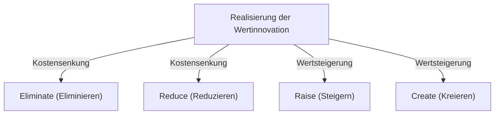
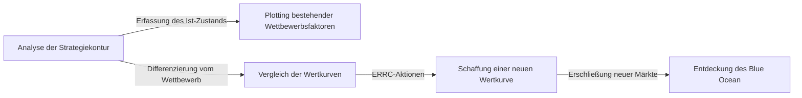

# Blue-Ocean-Strategie: Die ultimative Unternehmenstheorie zur Schaffung konkurrenzloser, unerschlossener Märkte

## 1. Einleitung: Warum brauchen wir heute die „Blue-Ocean-Strategie“?

Im heutigen Geschäftsumfeld sind bestehende Märkte einem harten Wettbewerb ausgesetzt. Durch den technologischen Fortschritt und die Globalisierung schreitet die Kommodifizierung von Produkten und Dienstleistungen rasant voran, was zu einem intensiven Preiskampf führt. Unternehmen kämpfen ums Überleben in einer blutigen Schlacht um ein begrenztes Stück vom Kuchen. Diesen bestehenden, wettbewerbsintensiven Markt bezeichneten die Professoren W. Chan Kim und Renée Mauborgne von der französischen Business School INSEAD als „Red Ocean“ (Roter Ozean).

Die Grundlage herkömmlicher Strategien im Red Ocean (wie z. B. die Wettbewerbsstrategie von Michael Porter) besteht darin, Konkurrenten zu besiegen, d. h. einen „Wettbewerbsvorteil aufzubauen“. In der heutigen Zeit jedoch, in der das Marktwachstum stagniert und das Angebot die Nachfrage übersteigt, führt der Kampf um den bestehenden Markt unweigerlich zu sinkenden Gewinnmargen (Preisverfall) und wird zum größten Hindernis für nachhaltiges Unternehmenswachstum.

Deshalb wurde die „Blue-Ocean-Strategie“ entwickelt. Ein Blue Ocean bezeichnet einen wettbewerbsfreien, unerschlossenen Marktraum (blauer Ozean). Der Kern dieser Strategie liegt nicht darin, „den Wettbewerb zu gewinnen“, sondern „den Wettbewerb irrelevant zu machen“. Indem man aufhört, im selben Feld wie die Konkurrenz zu kämpfen, neue Werte schafft und selbst den Markt erschließt, wird es möglich, ein nachhaltiges und hochprofitables Geschäftsmodell aufzubauen.

In diesem Artikel werden wir von den grundlegenden Konzepten der Blue-Ocean-Strategie über spezifische Frameworks, Erfolgsbeispiele und praktische Umsetzungsprozesse bis hin zur Überwindung organisatorischer Hürden alles detailliert und tiefgreifend erklären.

## 2. Der fundamentale Unterschied zwischen Red Ocean und Blue Ocean

Um die Blue-Ocean-Strategie zu verstehen, muss man sich zunächst des Unterschieds zum Red Ocean klar bewusst sein. Viele Unternehmen tappen unbewusst in die Falle des Red Ocean.

*   **Red Ocean (Bestehende Märkte)**
    *   **Marktdefinition:** Im bestehenden Marktraum konkurrieren. Die Grenzen sind bereits gezogen.
    *   **Strategisches Ziel:** Konkurrenten besiegen. Benchmarking wird großgeschrieben.
    *   **Ansatz der Nachfrage:** Um die bestehende Nachfrage (Kunden) kämpfen.
    *   **Verhältnis von Wert und Kosten:** Den Kompromiss (Trade-off) zwischen Wert und Kosten akzeptieren. Die Wahl zwischen hohem Mehrwert (hohe Kosten) und niedrigen Preisen (niedrige Kosten) (Differenzierungsstrategie vs. Kostenführerschaft).
    *   **Organisatorische Ausrichtung:** Die gesamten Unternehmensaktivitäten entweder auf eine Differenzierungs- oder eine Niedrigkostenstrategie ausrichten.

*   **Blue Ocean (Unerschlossene Märkte)**
    *   **Marktdefinition:** Einen neuen, wettbewerbsfreien Marktraum selbst schaffen. Die Grenzen neu ziehen.
    *   **Strategisches Ziel:** Den Wettbewerb irrelevant machen. Man muss sich nicht um die Konkurrenz kümmern.
    *   **Ansatz der Nachfrage:** Neue Nachfrage (Nicht-Kunden) erschließen und erfassen.
    *   **Verhältnis von Wert und Kosten:** Den Kompromiss zwischen Wert und Kosten durchbrechen. Gleichzeitiges Streben nach hohem Mehrwert und niedrigen Kosten (Wertinnovation).
    *   **Organisatorische Ausrichtung:** Die gesamten Unternehmensaktivitäten auf die Vereinbarkeit von Differenzierung und niedrigen Kosten ausrichten.

Wie aus diesem Vergleich hervorgeht, ist die Blue-Ocean-Strategie nicht einfach nur eine Nischenstrategie. Während eine Nischenstrategie auf einen engen Bereich eines bestehenden Marktes abzielt, ist die Blue-Ocean-Strategie ein dynamischer Ansatz, der den Markt selbst erweitert oder sogar völlig neue Märkte schafft.

## 3. Kernkonzept: „Wertinnovation“

Der Eckpfeiler der Blue-Ocean-Strategie ist das Konzept der „Wertinnovation“.
In klassischen Strategietheorien geht man davon aus, dass „Differenzierung“ (einen einzigartigen Wert bieten und teuer verkaufen) und „Niedrige Kosten“ (Standardprodukte günstig verkaufen) in einem Kompromiss-Verhältnis (Trade-off) zueinander stehen. Der Versuch, beides gleichzeitig zu erreichen, führe zu einem „Stuck in the Middle“ und sei zum Scheitern verurteilt.

Die Wertinnovation widerlegt diese gängige Annahme. Ihr Ziel ist es, **gleichzeitig** eine „Wertsteigerung (Differenzierung)“ für den Käufer und eine „Kostensenkung“ für das Unternehmen zu erreichen.

Wertinnovation ist nicht gleichbedeutend mit technologischer Innovation. Auch ohne modernste Technologien kann allein durch die Kombination bestehender Technologien oder die Überarbeitung der Bereitstellung von Dienstleistungen ein exponentieller Wert für den Kunden geschaffen werden. Indem man Faktoren, die den Wert für den Käufer erhöhen, steigert und unnötige Faktoren reduziert oder eliminiert, lässt sich eine beispiellose Wertkurve zeichnen.

## 4. Framework zur Strategieentwicklung: Aktionsmatrix (ERRC-Gitter)

Das konkrete Werkzeug zur Umsetzung der Wertinnovation und zur Durchbrechung des Trade-offs zwischen Wert und Kosten sind die „Vier Aktionen (ERRC-Gitter)“. Es stellt den branchenüblichen Wettbewerbsfaktoren die folgenden vier Fragen entgegen:

1.  **Eliminate (Eliminieren)**: Welche der branchenüblichen Faktoren, die als selbstverständlich gelten, sollten eliminiert werden? (Schlüssel zur Kostensenkung)
2.  **Reduce (Reduzieren)**: Welche Faktoren sollten weit unter den Branchenstandard reduziert werden? (Schlüssel zur Kostensenkung)
3.  **Raise (Steigern)**: Welche Faktoren sollten weit über den Branchenstandard gesteigert werden? (Schlüssel zur Wertsteigerung)
4.  **Create (Kreieren)**: Welche bisher in der Branche unerreichten Faktoren sollten neu kreiert werden? (Schlüssel zur Wertsteigerung)

Durch diese vier Aktionen lässt sich die Kostenstruktur drastisch verbessern und dem Kunden gleichzeitig ein neuer Wert bieten.

## 5. Repräsentative Erfolgsbeispiele der Blue-Ocean-Strategie

Nachdem wir die Theorie verstanden haben, schauen wir uns Beispiele von Unternehmen an, die tatsächlich einen Blue Ocean erschlossen haben.

### Beispiel 1: Cirque du Soleil (Unterhaltungsbranche)

Der aus Kanada stammende Cirque du Soleil schuf einen völlig neuen Markt in einer Zirkusbranche, die als sterbender Industriezweig galt.
Traditionelle Zirkusse gaben viel Geld für Star-Artisten und Tiershows aus und richteten sich hauptsächlich an Familien mit Kindern. Aufgrund von Kritik aus Tierschutzkreisen und dem Aufkommen anderer Unterhaltungsangebote (wie Videospiele) verschlechterte sich jedoch die Rentabilität.

Der Cirque du Soleil wandte die vier Aktionen wie folgt an:
*   **Eliminieren**: Kostenintensive „Tiershows“, „Star-Artisten“ und „gleichzeitige Vorführungen in mehreren Ringen“
*   **Reduzieren**: Übermäßige Betonung von Nervenkitzel und Gefahr
*   **Steigern**: Die Ausstattung eines einzigen Zeltes, Künstlerischer Anspruch, elegantes Umfeld
*   **Kreieren**: Thematischer Schwerpunkt, Elemente aus Theater und Ballett, künstlerische Musik und Tanz

Als Ergebnis schufen sie eine neue Art von Unterhaltung, die Zirkus und Theater verschmolz, und es gelang ihnen, „Nicht-Kunden“ wie Erwachsene und Firmenkunden zu gewinnen. Die Ticketpreise konnten viel höher angesetzt werden als bei herkömmlichen Zirkussen, was zu einer hochprofitablen Struktur führte.

### Beispiel 2: Nintendo Wii (Spieleindustrie)

Mitte der 2000er Jahre war der Markt für Heimkonsolen in einen Red-Ocean-Wettbewerb um hohe Leistung und hochauflösende Grafik eingetreten. Die Herstellungskosten für Hardware stiegen rasant an, Spiele wurden immer komplexer und tendierten dazu, nur noch für Hardcore-Gamer zugänglich zu sein.

Nintendo setzte mit der „Wii“ auf die Blue-Ocean-Strategie.
*   **Eliminieren**: Extrem leistungsstarke Prozessoren, hochauflösende Grafiken, komplexe Controller
*   **Reduzieren**: Komplexe Spielmechaniken für Hardcore-Gamer
*   **Steigern**: Intuitive Bedienung, die der ganzen Familie Spaß macht, Startgeschwindigkeit der Konsole
*   **Kreieren**: Bewegungsempfindliche Fernbedienungen, Gesundheitsmanagement (Wii Fit), Einbindung von Nicht-Gamern (wie Senioren)

Indem sich Nintendo aus dem technologischen Wettlauf zurückzog, konnten die Herstellungskosten drastisch gesenkt und gleichzeitig ein völlig neuer Wert geschaffen werden: „Spielspaß für die ganze Familie mit intuitiver Bedienung“.

### Beispiel 3: QB House (Friseurbranche)

In der japanischen Friseurbranche hat QB House ein bahnbrechendes Geschäftsmodell aufgebaut.
Bei herkömmlichen Friseursalons wurden neben dem Haarschnitt oft auch Haarwäsche, Rasur und Massagen angeboten, was in der Regel etwa eine Stunde dauerte und mehrere tausend Yen kostete.

*   **Eliminieren**: Haarwäsche, Rasur, Massage, Reservierungen, Namensnennung (Stylistenauswahl)
*   **Reduzieren**: Aufenthaltsdauer (auf 10 Minuten verkürzt), ungenutzte Ladenflächen
*   **Steigern**: Gute Erreichbarkeit (z. B. in Bahnhöfen), Hygiene (Absaugen von Haarschnittresten mit dem Air Washer)
*   **Kreieren**: Ein klarer, erschwinglicher Preis von 1000 Yen (damals), Vorauszahlung am Automaten

Indem man die potenziellen Bedürfnisse von „Geschäftsleuten ohne Zeit“ oder Kunden, denen ein „einfacher Haarschnitt ausreicht“, bediente und sich ausschließlich auf das Schneiden konzentrierte, konnte eine hohe Kundenrotation erzielt werden.

## 6. Die „6 Pfade“ zur systematischen Erkundung des Blue Ocean

Ein neuer Marktraum entsteht nicht allein durch den Geistesblitz eines Genies. Kim und Mauborgne stellen ein Framework namens „6 Pfade“ vor, um einen Blue Ocean zu entdecken.

1.  **Von Alternativbranchen lernen**: Den Blick auf völlig andere Branchen (Alternativen) richten, die Kunden anstelle der eigenen Produkte oder Dienstleistungen wählen.
2.  **Von anderen strategischen Gruppen innerhalb der Branche lernen**: Die Unterschiede zwischen verschiedenen strategischen Gruppen wie Premium- und Niedrigpreis-Segment analysieren und die Vorteile beider miteinander verschmelzen.
3.  **Den Blick auf die Käufergruppe richten**: Überprüfen, ob der Fokus auf den Einkäufern, den Nutzern oder den Beeinflussern liegt, und die Zielgruppe verlagern.
4.  **Ergänzende Produkte und Dienstleistungen betrachten**: Analysieren, wie sich Kunden vor, während und nach der Nutzung des eigenen Produkts verhalten und welche Schwierigkeiten (Pain Points) sie haben, um dann eine Gesamtlösung anzubieten.
5.  **Zwischen funktionaler und emotionaler Ausrichtung beim Kunden wechseln**: Wenn die Branche über Funktionalität konkurriert, Emotionen hinzufügen; wenn sie über Emotionen konkurriert, sich stärker auf Funktionalität konzentrieren.
6.  **Zukünftige Trends vorhersehen**: Vorhersagen, wie unvermeidliche zukünftige Trends den Kundennutzen beeinflussen werden, und proaktiv Wert bieten.

## 7. Erstellung und Nutzung der Strategiekontur

Ein leistungsfähiges Instrument zur Visualisierung und Konzeption der Blue-Ocean-Strategie ist die „Strategiekontur“ (Strategy Canvas).
Auf der horizontalen Achse werden die Wettbewerbsfaktoren der Branche (Preis, Qualität, Service, Vielfalt usw.) aufgetragen, und auf der vertikalen Achse das Niveau des Kundennutzens (hoch/niedrig). Anschließend zeichnet man die Wertkurven des eigenen Unternehmens und der Konkurrenz als Liniendiagramme ein.

Die Wertkurve eines Unternehmens, das die Blue-Ocean-Strategie umsetzt, weist folgende drei Merkmale auf:
1.  **Fokus (Schwerpunkt)**: Es werden nicht alle Wettbewerbsfaktoren priorisiert, sondern nur bestimmte, gezielte Faktoren.
2.  **Divergenz (Einzigartigkeit)**: Die Form unterscheidet sich grundlegend von den Wertkurven der Konkurrenz.
3.  **Überzeugendes Motto**: Der Wert, der dem Kunden geboten wird, lässt sich in einem einzigen Satz klar und deutlich vermitteln.

## 8. Die „Tipping-Point-Leadership“ zur Überwindung organisatorischer Hürden

Egal, wie großartig eine Blue-Ocean-Strategie auch sein mag – sie ist nutzlos, wenn die Organisation, die sie ausführen soll, nicht mitzieht. Der Ansatz, um die Barrieren einer den Status quo bevorzugenden Organisation zu durchbrechen, ist die „Tipping-Point-Leadership“. Damit lassen sich die „vier Hürden“, die eine organisatorische Transformation behindern, mit minimalem Aufwand und in kürzester Zeit überwinden.

1.  **Kognitive Hürde**: Das Bewusstsein ändern, dass der Status quo ausreichend ist. Mitarbeiter müssen die Krisensituation „direkt erleben“, um auf emotionaler Ebene angesprochen zu werden.
2.  **Ressourcen-Hürde**: Die Barriere des Ressourcenmangels. Ressourcen mutig von unrentablen Bereichen in solche umverteilen, die für den Wandel unerlässlich sind.
3.  **Motivations-Hürde**: Die Motivation der Mitarbeiter wecken. Schlüsselpersonen mit Einfluss mobilisieren, um eine Kettenreaktion in der gesamten Organisation auszulösen.
4.  **Politische Hürde**: Sabotage durch Widerstandskräfte verhindern. Befürworter des Wandels auf die eigene Seite ziehen und den Widerstand isolieren.

## 9. Ausführung und Nachhaltigkeit der Strategie (Imitationsbarrieren)

In der Phase der Strategieumsetzung ist ein „fairer Prozess“ unabdingbar. Indem man Mitarbeiter in den Prozess der Strategiefindung einbezieht, die Gründe für getroffene Entscheidungen klar erklärt und die Erwartungen an neue Regeln transparent macht, kann man ihre freiwillige Kooperation gewinnen.

Zudem kann die Blue-Ocean-Strategie aus folgenden Gründen starke „Imitationsbarrieren“ errichten:
*   Widersprüche zum bestehenden Markenimage (z. B. kann eine Premiummarke eine Niedrigpreisstrategie nicht so leicht kopieren)
*   Die Schwierigkeit, Organisationsstrukturen und -kultur zu verändern
*   Skaleneffekte und Lerneffekte durch den First-Mover-Advantage

## 10. Fazit: Auf zu einer dauerhaften Reise

Die Blue-Ocean-Strategie ist keine einmalige Maßnahme. Mit der Zeit treten Nachahmer in den Markt ein und er verwandelt sich in einen Red Ocean. Daher müssen Unternehmen ihre Strategiekontur ständig überwachen. Sobald eine Angleichung stattfindet, müssen sie sich erneut auf die Reise machen, um einen neuen Blue Ocean zu finden.

Den branchenüblichen Konsens in Frage stellen und durch „Wertinnovation“ unerforschte Märkte erschließen – genau das ist der stärkste Kompass für Unternehmen, um nachhaltig weiterzuwachsen.
