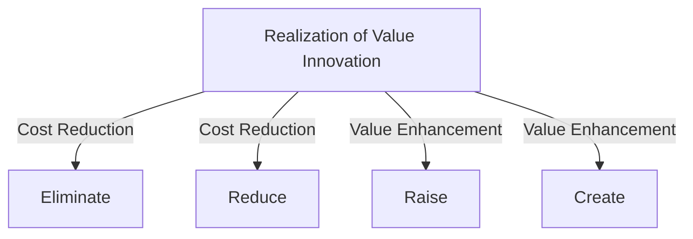
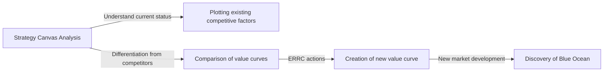

# Blue Ocean Strategy: The Ultimate Business Theory for Creating Uncontested Market Space

## 1. Introduction: Why is the "Blue Ocean Strategy" Needed Now?

In the modern business environment, existing markets are exposed to fierce competition. Due to technological evolution and globalization, the commoditization of products and services is rapidly advancing, intensifying price competition. Companies are engaged in bloody battles fighting for a limited pie in order to survive. Professors W. Chan Kim and Renée Mauborgne of the European Institute of Business Administration (INSEAD) in France named such existing competitive markets "Red Oceans."

The basis of traditional strategies in the red ocean (such as Michael Porter's competitive strategy) is to beat competitors, in other words, "building competitive advantage." However, in today's world where market growth is slowing down and supply exceeds demand, fighting for the existing pie eventually leads to a decline in profit margins (price destruction) and becomes the biggest factor hindering companies' sustainable growth.

Therefore, the "Blue Ocean Strategy" was advocated. A blue ocean means an unexplored market space (blue sea) without competition. The core of this strategy is not "to win the competition" but "to render the competition irrelevant." By stopping the fight in the same arena as competitors, creating new value, and opening up the market yourself, it becomes possible to build a sustainable and highly profitable business model.

In this article, we will delve deeply into and thoroughly explain the Blue Ocean Strategy, from its basic concepts to specific frameworks, success stories, processes for implementation, and even how to overcome organizational hurdles.

## 2. The Essential Differences Between Red Oceans and Blue Oceans

To understand the Blue Ocean Strategy, you must first clearly recognize its differences from the Red Ocean. Many companies unconsciously fall into the trap of the red ocean.

*   **Red Ocean (Existing Markets)**
    *   **Market Definition:** Compete in existing market space. The boundaries are already drawn.
    *   **Strategic Objective:** Beat the competition. Benchmarking is emphasized.
    *   **Approach to Demand:** Fight for existing demand (customers).
    *   **Relationship between Value and Cost:** Accept the trade-off between value and cost. A choice between high value-added (high cost) or low price (low cost) (differentiation strategy or cost leadership strategy).
    *   **Organizational Alignment:** Align the whole system of a firm's activities with its strategic choice of differentiation or low cost.

*   **Blue Ocean (Unexplored Markets)**
    *   **Market Definition:** Create uncontested new market space yourself. Redraw the boundaries.
    *   **Strategic Objective:** Make the competition irrelevant. No need to worry about competitors.
    *   **Approach to Demand:** Create and capture new demand (non-customers).
    *   **Relationship between Value and Cost:** Break the value-cost trade-off. Simultaneously pursue high value-added and low cost (Value Innovation).
    *   **Organizational Alignment:** Align the whole system of a firm's activities in pursuit of both differentiation and low cost.

As can be seen from this comparison, the Blue Ocean Strategy is not just a niche strategy. While a niche strategy targets a narrow area of an existing market, the Blue Ocean Strategy is a dynamic approach that expands the market itself or creates a new market.

## 3. Core Concept: "Value Innovation"

The foundational concept of the Blue Ocean Strategy is "Value Innovation."
In traditional strategic theory, "differentiation (providing unique value and selling at a high price)" and "low cost (selling standard items cheaply)" were considered a trade-off. It was believed that attempting to pursue both would result in being "stuck in the middle" and lead to failure.

However, Value Innovation overturns this common sense. Its purpose is to **simultaneously** achieve an "increase in value (differentiation)" for buyers and a "cost reduction" for the company.

Value Innovation is not synonymous with technological innovation. Even without using cutting-edge technology, it is possible to create dramatic value for customers simply by reviewing the combination of existing technologies or the methods of service delivery. By increasing the elements that raise value for buyers and reducing/eliminating unnecessary elements, an unprecedented value curve is drawn.

## 4. Framework for Strategy Formulation: The Action Matrix (ERRC Grid)

A specific tool for realizing Value Innovation and breaking the trade-off between value and cost is the "Four Actions Framework (ERRC Grid)." It poses the following four questions against the competitive factors that have become industry common sense.

1.  **Eliminate**: Which of the factors that the industry takes for granted should be eliminated? (Key to cost reduction)
2.  **Reduce**: Which factors should be reduced well below the industry's standard? (Key to cost reduction)
3.  **Raise**: Which factors should be raised well above the industry's standard? (Key to value enhancement)
4.  **Create**: Which factors should be created that the industry has never offered? (Key to value enhancement)

Through these four actions, the cost structure is dramatically improved while providing new value to customers.

## 5. Representative Success Stories of Blue Ocean Strategy

Having understood the theory, let's look at examples of companies that actually opened up blue oceans.

### Case 1: Cirque du Soleil (Entertainment Industry)

Originating in Canada, Cirque du Soleil created a completely new market in the circus industry, which was said to be a declining industry.
Traditional circuses spent a lot of money on star performers and animal shows, mainly targeting families with children. However, due to criticism from the perspective of animal welfare and the rise of other entertainment (such as video games), profitability was deteriorating.

Cirque du Soleil applied the four actions as follows:
*   **Eliminate**: Costly "animal shows," "star performers," and "multiple ring simultaneous progression"
*   **Reduce**: Excessive emphasis on thrill and danger
*   **Raise**: The facilities of a single tent, artistry, and a refined environment
*   **Create**: Thematic elements, theatrical and ballet elements, artistic music and dance

As a result, they created a new entertainment blending circus and theater, successfully capturing "non-customers" such as adults and corporate entertainment demand. Ticket prices could be set much higher than traditional circuses, realizing a highly profitable structure.

### Case 2: Nintendo Wii (Gaming Industry)

In the mid-2000s, the home video game console market had entered a red ocean competition of higher performance and higher image quality. Hardware manufacturing costs soared, games became more complex, and they were becoming something only core gamers could enjoy.

Nintendo deployed a blue ocean strategy with the "Wii."
*   **Eliminate**: Ultra-high performance processors, high-definition graphics, complex controllers
*   **Reduce**: Complex gameplay for core gamers
*   **Raise**: Intuitive operability that the whole family can enjoy, the startup speed of the console itself
*   **Create**: Motion-sensing remote controllers, health management (Wii Fit), experiences involving non-gamers (such as seniors)

By stepping out of the technological race, they significantly reduced manufacturing costs while achieving completely new value creation: "playing with the whole family using intuitive controls."

### Case 3: QB House (Barber/Beauty Industry)

In the Japanese barber and beauty industry, QB House built an innovative business model.
Conventional barbershops typically provided services other than haircuts, such as hair washing, shaving, and massages, taking about an hour and costing several thousand yen.

*   **Eliminate**: Hair washing, shaving, massages, reservations, staff nomination
*   **Reduce**: Stay time (shortened to 10 minutes), wasted space in the store
*   **Raise**: Accessibility such as inside train stations, hygiene (hair dust suction by air washer)
*   **Create**: Clear and affordable pricing of 1000 yen (at the time), advance payment by ticket machine

They responded to the latent needs of customers such as "business people with no time" and "just wanting a haircut is enough," realizing a high turnover rate by specializing only in haircuts.

## 6. "Six Paths" to Systematically Explore Blue Oceans

A new market space is not born solely from the flashes of a genius. Kim and Mauborgne present a framework called the "Six Paths" for discovering blue oceans.

1.  **Look across alternative industries**: Focus on completely different industries (alternatives) that customers choose instead of your company's products/services.
2.  **Look across strategic groups within an industry**: Analyze the differences between different strategic groups, such as high-end and low-price orientation, and fuse the benefits of both.
3.  **Look across the chain of buyers**: Review whether the focus is on the purchaser, user, or influencer, and shift the target.
4.  **Look across complementary product and service offerings**: Analyze what actions customers take and what pains they feel before, during, and after using your product, and provide a total solution.
5.  **Look across functional or emotional appeal to buyers**: Add emotion to an industry competing on functionality, or emphasize functionality in an industry competing on emotion.
6.  **Look across time**: Predict how certain future trends will impact customer value, and proactively provide value.

## 7. Creation and Utilization of the Strategy Canvas

A powerful tool for mapping out and visualizing a blue ocean strategy is the "Strategy Canvas."
The horizontal axis represents the industry's competitive factors (price, quality, service, diversity, etc.), and the vertical axis represents the level enjoyed by customers (high/low). Then, you draw the value curves of your company and competitors as line graphs.

The value curve of a company executing a blue ocean strategy has the following three characteristics:
1.  **Focus**: It does not focus on all competitive factors, but narrows down to specific ones.
2.  **Divergence**: It has a completely different shape from competitors' value curves.
3.  **Compelling Tagline**: The value provided to customers is clearly conveyed in a single phrase.

## 8. "Tipping Point Leadership" to Overcome Organizational Hurdles

No matter how brilliant a blue ocean strategy you draw, it is meaningless if the organization executing it does not move. The method to break through the wall of an organization that prefers the status quo is "Tipping Point Leadership." It overcomes the "four hurdles" blocking organizational transformation with minimal effort and time.

1.  **Cognitive Hurdle**: Change the mindset that the status quo is fine. Have employees "directly experience" the crisis situation and appeal to their emotions.
2.  **Resource Hurdle**: The wall of resource shortage. Boldly reallocate resources from areas with no results to areas essential for transformation.
3.  **Motivational Hurdle**: Bring out employee motivation. Move key persons with influence to chain-reactively move the entire organization.
4.  **Political Hurdle**: Prevent interference from resisting forces. Get those who support the transformation on your side and isolate resisting forces.

## 9. Strategy Execution and Sustainability (Barriers to Imitation)

In the stage of putting strategy into practice, a "fair process" is indispensable. By involving employees in the strategy formulation process, clearly explaining the reasons for decisions, and clarifying expectations for new rules, voluntary cooperation can be obtained.

Also, a blue ocean strategy can build strong "barriers to imitation" for the following reasons:
*   Contradictions with existing brand images (e.g., a luxury brand cannot imitate a low-price strategy)
*   The difficulty of changing organizational structure and culture
*   Economies of scale and learning effects from first-mover advantages

## 10. Conclusion: Towards an Eternal Voyage

The Blue Ocean Strategy does not end once it is executed. Over time, imitators enter and it turns into a red ocean. Therefore, companies must constantly monitor their strategy canvas, and if homogenization begins, they must set sail again to find a blue ocean.

Doubting the common sense of your company's industry and causing "Value Innovation" to open up unexplored markets. That is precisely the strongest compass for a company to continue growing sustainably.
