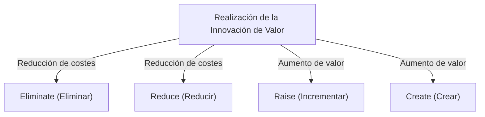
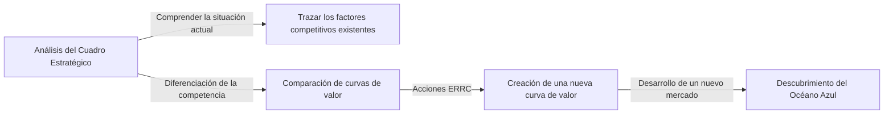

# Estrategia del Océano Azul: La teoría empresarial definitiva para crear un mercado inexplorado y sin competencia

## 1. Introducción: ¿Por qué es necesaria la "Estrategia del Océano Azul" ahora?

En el entorno empresarial moderno, los mercados existentes están expuestos a una feroz competencia. Debido a la evolución de la tecnología y la globalización, la mercantilización (comoditización) de productos y servicios avanza rápidamente, intensificando la competencia de precios. Las empresas luchan sangrientamente por sobrevivir y arrebatar un pastel limitado. Los profesores W. Chan Kim y Renée Mauborgne de la escuela de negocios europea (INSEAD) en Francia, denominaron a este mercado competitivo existente "Océano Rojo".

La base de las estrategias tradicionales en el Océano Rojo (como la estrategia competitiva de Michael Porter) es vencer a la competencia, es decir, "construir una ventaja competitiva". Sin embargo, en la actualidad, donde el crecimiento del mercado se desacelera y la oferta supera la demanda, luchar por el pastel existente resulta en una disminución de los márgenes de beneficio (destrucción de precios) y se convierte en el mayor obstáculo para el crecimiento sostenible de las empresas.

Por ello, se propuso la "Estrategia del Océano Azul". Un Océano Azul significa un espacio de mercado inexplorado y sin competencia. El núcleo de esta estrategia no es "ganar a la competencia", sino "hacer que la competencia sea irrelevante". Al dejar de luchar en el mismo terreno que la competencia, creando un nuevo valor y abriendo el mercado por sí mismos, es posible construir un modelo de negocio sostenible y altamente rentable.

En este artículo, profundizaremos y explicaremos exhaustivamente desde los conceptos básicos de esta Estrategia del Océano Azul, hasta los marcos específicos, casos de éxito, procesos para la implementación y, además, cómo superar las barreras organizacionales.

## 2. Diferencias fundamentales entre el Océano Rojo y el Océano Azul

Para comprender la Estrategia del Océano Azul, primero es necesario reconocer claramente las diferencias con el Océano Rojo. Muchas empresas caen inconscientemente en la trampa del Océano Rojo.

*   **Océano Rojo (Mercado Existente)**
    *   **Definición del mercado:** Competir en el espacio de mercado existente. Las fronteras ya están trazadas.
    *   **Propósito de la estrategia:** Vencer a la competencia. Se hace hincapié en el benchmarking.
    *   **Enfoque hacia la demanda:** Luchar por la demanda (clientes) existente.
    *   **Relación entre valor y coste:** Aceptar el compromiso (trade-off) entre valor y coste. Elegir entre alto valor añadido (alto coste) o bajo precio (bajo coste) (estrategia de diferenciación o estrategia de liderazgo en costes).
    *   **Alineación organizacional:** Alinear todas las actividades de la empresa con la estrategia de diferenciación o la de bajo coste.

*   **Océano Azul (Mercado Inexplorado)**
    *   **Definición del mercado:** Crear un nuevo espacio de mercado sin competencia por uno mismo. Redibujar las fronteras.
    *   **Propósito de la estrategia:** Hacer que la competencia sea irrelevante. No es necesario preocuparse por la competencia.
    *   **Enfoque hacia la demanda:** Descubrir y captar nueva demanda (no clientes).
    *   **Relación entre valor y coste:** Romper el compromiso (trade-off) entre valor y coste. Perseguir simultáneamente un alto valor añadido y un bajo coste (Innovación de Valor).
    *   **Alineación organizacional:** Alinear todas las actividades de la empresa para lograr tanto la diferenciación como el bajo coste simultáneamente.

Como se puede observar en esta comparación, la Estrategia del Océano Azul no es simplemente una estrategia de nicho. Mientras que una estrategia de nicho apunta a una pequeña área del mercado existente, la Estrategia del Océano Azul es un enfoque dinámico que amplía el mercado en sí mismo o crea nuevos mercados.

## 3. Concepto principal: "Innovación de Valor" (Value Innovation)

El concepto que sirve de piedra angular para la Estrategia del Océano Azul es la "Innovación de Valor".
En la teoría estratégica tradicional, se pensaba que la "diferenciación (ofrecer un valor único y vender a un precio alto)" y el "bajo coste (vender algo estándar a un precio bajo)" estaban en una relación de trade-off (compromiso). Se creía que intentar perseguir ambos llevaría a quedarse "atrapado en el medio" y fracasar.

Sin embargo, la Innovación de Valor rompe con este sentido común. Su objetivo es lograr **simultáneamente** una "mejora del valor (diferenciación)" para el comprador y una "reducción de costes" para la empresa.

La Innovación de Valor no es sinónimo de innovación tecnológica. Incluso sin utilizar la tecnología más avanzada, es posible crear un valor exponencial para los clientes simplemente revisando la combinación de tecnologías existentes o la forma en que se prestan los servicios. Al aumentar los elementos que aumentan el valor para el comprador y reducir/eliminar los elementos innecesarios, se dibuja una curva de valor sin precedentes.

## 4. Marco para la formulación de estrategias: Matriz de Acción (Cuadrícula ERRC)

La herramienta específica para lograr la Innovación de Valor y romper el compromiso entre valor y coste son las "Cuatro Acciones (Cuadrícula ERRC)". Se plantean las siguientes cuatro preguntas con respecto a los factores de competencia que son de sentido común en la industria:

1.  **Eliminate (Eliminar)**: De los factores que la industria da por sentados, ¿cuáles deben eliminarse? (Clave para la reducción de costes)
2.  **Reduce (Reducir)**: ¿Qué factores deben reducirse significativamente por debajo del estándar de la industria? (Clave para la reducción de costes)
3.  **Raise (Incrementar)**: ¿Qué factores deben incrementarse significativamente por encima del estándar de la industria? (Clave para el aumento de valor)
4.  **Create (Crear)**: ¿Qué factores que nunca se han ofrecido en la industria deben crearse? (Clave para el aumento de valor)

A través de estas cuatro acciones, se proporciona un nuevo valor a los clientes al tiempo que se mejora drásticamente la estructura de costes.

## 5. Casos de éxito representativos de la Estrategia del Océano Azul

Una vez comprendida la teoría, veamos ejemplos de empresas que realmente abrieron un Océano Azul.

### Caso 1: Cirque du Soleil (Industria del Entretenimiento)

El Cirque du Soleil, originario de Canadá, creó un mercado completamente nuevo en la industria del circo, que se consideraba una industria en declive.
Los circos tradicionales gastaban mucho dinero en artistas estrella y espectáculos de animales, y se dirigían principalmente a familias con niños. Sin embargo, la rentabilidad estaba disminuyendo debido a las críticas desde la perspectiva del bienestar animal y el auge de otros entretenimientos (como los videojuegos).

El Cirque du Soleil aplicó las 4 acciones de la siguiente manera:
*   **Eliminar**: "Espectáculos con animales", "artistas estrella" y "espectáculos simultáneos en múltiples pistas", que son costosos.
*   **Reducir**: El énfasis excesivo en el peligro y la emoción.
*   **Incrementar**: Las instalaciones de una sola carpa, el nivel artístico y un entorno refinado.
*   **Crear**: Una temática, elementos teatrales y de ballet, música artística y danza.

Como resultado, creó un nuevo entretenimiento que fusionó el circo y el teatro, y logró captar a los "no clientes", como los adultos y la demanda de entretenimiento corporativo. Los precios de las entradas pudieron establecerse mucho más altos que los de los circos tradicionales, logrando una estructura altamente rentable.

### Caso 2: Nintendo Wii (Industria de los Videojuegos)

A mediados de la década de 2000, el mercado de las consolas de videojuegos domésticas había entrado en una competencia de Océano Rojo de alto rendimiento y alta resolución. Los costes de fabricación del hardware se dispararon, los juegos se volvieron más complejos y se estaban convirtiendo en algo que solo los jugadores incondicionales (hardcore gamers) podían disfrutar.

Nintendo desplegó la Estrategia del Océano Azul con la "Wii".
*   **Eliminar**: Procesadores de altísimo rendimiento, gráficos de alta definición, controladores complejos.
*   **Reducir**: La jugabilidad compleja orientada a jugadores incondicionales.
*   **Incrementar**: Operatividad intuitiva que toda la familia puede disfrutar, velocidad de arranque de la consola.
*   **Crear**: Mandos sensibles al movimiento, gestión de la salud (Wii Fit), experiencias que involucran a los no jugadores (como la tercera edad).

Al retirarse de la carrera tecnológica, Nintendo redujo drásticamente los costes de fabricación y, al mismo tiempo, logró crear un valor completamente nuevo: "operatividad intuitiva para que toda la familia juegue junta".

### Caso 3: QB House (Industria de la Peluquería)

En la industria de la peluquería en Japón, QB House construyó un modelo de negocio revolucionario.
Las barberías tradicionales ofrecían servicios distintos al corte de pelo, como lavado, afeitado y masajes, y generalmente requerían alrededor de una hora y costaban miles de yenes.

*   **Eliminar**: Lavado de cabello, afeitado, masajes, reservas, nominación de estilistas.
*   **Reducir**: Tiempo de estancia (reducido a 10 minutos), espacio inútil en la tienda.
*   **Incrementar**: Accesibilidad (como en las estaciones de tren), higiene (succión de cabello con "air washer").
*   **Crear**: Precios claros y asequibles de 1000 yenes (en ese momento), pago por adelantado a través de máquinas expendedoras de billetes.

Respondieron a las necesidades latentes de los clientes como "personas de negocios sin tiempo" o "aquellos para quienes un corte de pelo es suficiente", y lograron una alta tasa de rotación especializándose solo en cortes.

## 6. Los "6 caminos" para explorar sistemáticamente los Océanos Azules

Un nuevo espacio de mercado no nace solo por destellos de genialidad. Kim y Mauborgne proponen un marco de "6 caminos" para descubrir Océanos Azules.

1.  **Aprender de las industrias alternativas**: Fijarse en industrias completamente diferentes (productos alternativos) que los clientes eligen en lugar de los productos y servicios de su propia empresa.
2.  **Aprender de otros grupos estratégicos dentro de la industria**: Analizar las diferencias entre diferentes grupos estratégicos, como el enfoque de alta gama y el de bajo precio, y fusionar las ventajas de ambos.
3.  **Fijarse en los grupos de compradores**: Revisar en quién se está centrando (compradores, usuarios, influenciadores) y cambiar el objetivo.
4.  **Observar los productos y servicios complementarios**: Analizar qué acciones toman los clientes y qué dolores sienten antes, durante y después de usar el producto de su empresa, y proporcionar una solución total.
5.  **Cambiar entre el atractivo funcional y emocional hacia el cliente**: Si es una industria que compite por la funcionalidad, añadir atractivo emocional; si es una industria que compite por la emoción, enfatizar la funcionalidad.
6.  **Prever las tendencias futuras**: Predecir cómo las tendencias futuras que ocurrirán con seguridad afectarán el valor para el cliente, y proporcionar valor de manera anticipada.

## 7. Creación y uso del Cuadro Estratégico

El "Cuadro Estratégico" es una poderosa herramienta para dibujar y visualizar la Estrategia del Océano Azul.
El eje horizontal representa los factores competitivos de la industria (precio, calidad, servicio, diversidad, etc.), y el eje vertical representa el nivel que disfrutan los clientes (alto/bajo). Luego, se dibuja la curva de valor de su propia empresa y de la competencia con un gráfico de líneas.

Las curvas de valor de las empresas que ejecutan la Estrategia del Océano Azul tienen las siguientes tres características:
1.  **Foco**: No se centran en todos los factores competitivos, sino que se limitan a factores específicos.
2.  **Divergencia (Singularidad)**: Tiene una forma completamente diferente a la curva de valor de la competencia.
3.  **Mensaje contundente**: El valor proporcionado al cliente se transmite claramente en una sola frase.

## 8. Superar las barreras organizacionales: "Liderazgo de punto de inflexión" (Tipping Point Leadership)

Por muy brillante que sea la Estrategia del Océano Azul diseñada, no tiene sentido si la organización que la ejecuta no se mueve. El método para romper los muros de una organización que prefiere mantener el status quo es el "Liderazgo de punto de inflexión". Supera los "4 obstáculos" que impiden el cambio organizacional con el mínimo esfuerzo y tiempo.

1.  **Obstáculo cognitivo**: Cambiar la mentalidad de que el status quo está bien. Hacer que los empleados "experimenten directamente" la situación de crisis y apelar a sus emociones.
2.  **Obstáculo de recursos**: El muro de la falta de recursos. Reasignar audazmente los recursos de las áreas que no producen resultados a las áreas esenciales para el cambio.
3.  **Obstáculo de motivación**: Despertar la motivación de los empleados. Movilizar a las personas clave con influencia para mover a toda la organización en cadena.
4.  **Obstáculo político**: Evitar el sabotaje de las fuerzas de resistencia. Poner de su lado a los partidarios del cambio y aislar a las fuerzas de resistencia.

## 9. Ejecución de la estrategia y sostenibilidad (Barreras a la imitación)

En la etapa de poner en práctica la estrategia, un "proceso justo" es esencial. Involucrar a los empleados en el proceso de formulación de la estrategia, explicar claramente las razones de las decisiones tomadas y dejar claras las expectativas de las nuevas reglas permite obtener una cooperación voluntaria.

Además, la Estrategia del Océano Azul puede construir sólidas "barreras a la imitación" por las siguientes razones:
*   Contradicciones con la imagen de marca existente (por ejemplo, una marca de lujo no puede imitar una estrategia de bajo precio).
*   Dificultad para cambiar la estructura y la cultura de la organización.
*   Economías de escala y efectos de aprendizaje debidos a la ventaja del pionero.

## 10. Conclusión: Hacia un viaje perpetuo

La Estrategia del Océano Azul no se termina una vez ejecutada. Con el paso del tiempo, los imitadores entrarán y se convertirá en un Océano Rojo. Por lo tanto, las empresas deben monitorear constantemente su cuadro estratégico y, cuando comiencen a homogeneizarse, embarcarse nuevamente en un viaje para encontrar un nuevo Océano Azul.

Cuestionar el sentido común de la propia industria y crear una "Innovación de Valor" para abrir mercados inexplorados. Eso en sí mismo es la brújula más fuerte para que una empresa continúe creciendo de manera sostenible.
