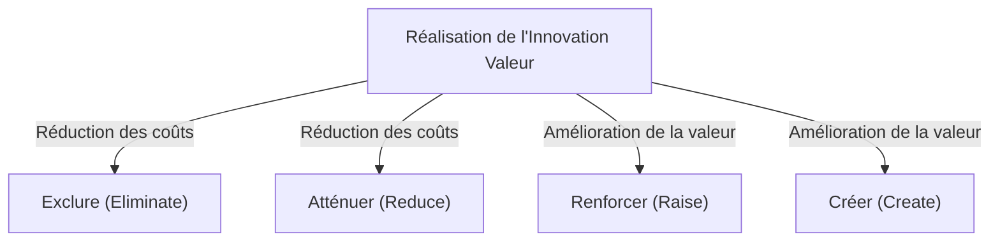
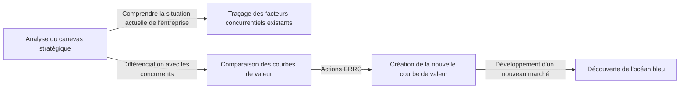

# Stratégie Océan Bleu : La théorie commerciale ultime pour créer des marchés inexploités sans concurrence

## 1. Introduction : Pourquoi la « Stratégie Océan Bleu » est-elle nécessaire aujourd'hui ?

Dans l'environnement commercial moderne, les marchés existants sont soumis à une concurrence féroce. Avec l'évolution de la technologie et la mondialisation, la banalisation des produits et services progresse rapidement, et la guerre des prix s'intensifie. Les entreprises se livrent à des batailles sanglantes pour s'arracher une part limitée du gâteau afin de survivre. Ce marché concurrentiel existant a été nommé « océan rouge » par les professeurs W. Chan Kim et Renée Mauborgne de l'INSEAD, l'école de commerce européenne basée en France.

La base des stratégies traditionnelles dans l'océan rouge (comme la stratégie concurrentielle de Michael Porter) est de vaincre les concurrents, c'est-à-dire de « construire un avantage concurrentiel ». Cependant, à une époque où la croissance du marché ralentit et où l'offre dépasse la demande, se battre pour les parts de marché existantes entraîne une baisse des marges bénéficiaires (destruction des prix) et devient le principal obstacle à la croissance durable des entreprises.

C'est là qu'intervient la « stratégie océan bleu ». L'océan bleu désigne un espace de marché inexploité et sans concurrence (une mer bleue). Le cœur de cette stratégie n'est pas de « gagner la concurrence », mais de « rendre la concurrence non pertinente ». En cessant de se battre sur le même terrain que les concurrents, en créant une nouvelle valeur et en ouvrant vous-même le marché, il est possible de construire un modèle commercial durable et hautement rentable.

Cet article explorera en profondeur et expliquera tout sur cette stratégie océan bleu, de ses concepts de base aux cadres spécifiques, en passant par les exemples de réussite, le processus pratique, et même la façon de surmonter les obstacles organisationnels.

## 2. La différence essentielle entre l'Océan Rouge et l'Océan Bleu

Pour comprendre la stratégie océan bleu, vous devez d'abord reconnaître clairement la différence avec l'océan rouge. De nombreuses entreprises tombent inconsciemment dans le piège de l'océan rouge.

*   **Océan Rouge (Marchés existants)**
    *   **Définition du marché :** Concurrencer dans l'espace de marché existant. Les frontières sont déjà tracées.
    *   **Objectif de la stratégie :** Vaincre la concurrence. L'étalonnage concurrentiel (benchmarking) est valorisé.
    *   **Approche de la demande :** S'arracher la demande existante (les clients).
    *   **Relation entre valeur et coût :** Accepter le compromis entre valeur et coût. Choisir entre une valeur ajoutée élevée (coût élevé) ou un prix bas (coût faible) (stratégie de différenciation ou stratégie de domination par les coûts).
    *   **Alignement organisationnel :** Aligner l'ensemble des activités de l'entreprise sur l'une des deux stratégies, soit la différenciation, soit les coûts réduits.

*   **Océan Bleu (Marchés inexploités)**
    *   **Définition du marché :** Créer soi-même un nouvel espace de marché sans concurrence. Redessiner les frontières.
    *   **Objectif de la stratégie :** Rendre la concurrence non pertinente. Nul besoin de se soucier des concurrents.
    *   **Approche de la demande :** Découvrir et capturer une nouvelle demande (les non-clients).
    *   **Relation entre valeur et coût :** Briser le compromis entre valeur et coût. Poursuivre simultanément une valeur ajoutée élevée et un coût faible (Innovation Valeur).
    *   **Alignement organisationnel :** Aligner l'ensemble des activités de l'entreprise pour concilier différenciation et coûts réduits.

Comme le montre cette comparaison, la stratégie océan bleu n'est pas une simple stratégie de niche. Alors qu'une stratégie de niche cible un segment étroit du marché existant, la stratégie océan bleu est une approche dynamique qui élargit le marché lui-même ou crée de nouveaux marchés.

## 3. Concept principal : « L'Innovation Valeur »

Le concept fondamental de la stratégie océan bleu est « l'Innovation Valeur ».
Dans la théorie stratégique conventionnelle, on considérait que la « différenciation (offrir une valeur unique et vendre à un prix élevé) » et les « coûts réduits (vendre des produits standardisés à bas prix) » s'excluaient mutuellement (compromis). Tenter de poursuivre les deux menait à une position « coincée au milieu » et aboutissait à l'échec.

Cependant, l'Innovation Valeur bouleverse ce bon sens. Elle vise à atteindre **simultanément** une « augmentation de la valeur (différenciation) » pour l'acheteur et une « réduction des coûts » pour l'entreprise.

L'Innovation Valeur n'est pas synonyme d'innovation technologique. Même sans utiliser de technologies de pointe, une combinaison de technologies existantes ou une révision de la méthode de prestation de services peut suffire à créer une valeur exponentielle pour les clients. En augmentant les éléments qui rehaussent la valeur pour l'acheteur et en réduisant ou éliminant les éléments inutiles, vous dessinez une courbe de valeur sans précédent.

## 4. Cadre d'élaboration de la stratégie : La grille ERRC (Les quatre actions)

L'outil concret pour réaliser l'Innovation Valeur et briser le compromis valeur-coût est la grille « des quatre actions » (ERRC). Elle pose les quatre questions suivantes concernant les facteurs de concurrence qui sont considérés comme la norme de l'industrie :

1.  **Exclure (Eliminate)** : Parmi les éléments considérés comme acquis dans l'industrie, lesquels doivent être éliminés ? (Clé de la réduction des coûts)
2.  **Atténuer (Reduce)** : Quels éléments doivent être considérés bien en deçà de la norme de l'industrie ? (Clé de la réduction des coûts)
3.  **Renforcer (Raise)** : Quels éléments doivent être considérés bien au-delà de la norme de l'industrie ? (Clé de l'amélioration de la valeur)
4.  **Créer (Create)** : Quels éléments qui n'ont jamais été offerts par l'industrie doivent être créés ? (Clé de l'amélioration de la valeur)

Grâce à ces quatre actions, la structure des coûts est radicalement améliorée tout en offrant une nouvelle valeur aux clients.

## 5. Exemples de réussite représentatifs de la stratégie Océan Bleu

Maintenant que nous avons compris la théorie, examinons les exemples d'entreprises qui ont réellement ouvert des océans bleus.

### Exemple 1 : Cirque du Soleil (Industrie du divertissement)

Originaire du Canada, le Cirque du Soleil a créé un marché entièrement nouveau dans l'industrie du cirque, qui était considérée comme une industrie sur le déclin.
Les cirques traditionnels dépensaient énormément pour les artistes vedettes et les spectacles d'animaux, ciblant principalement les familles avec enfants. Cependant, la rentabilité se détériorait en raison des critiques liées au bien-être animal et de la montée d'autres formes de divertissement (comme les jeux vidéo).

Le Cirque du Soleil a appliqué les quatre actions comme suit :
*   **Exclure** : « Spectacles d'animaux » coûteux, « artistes vedettes », « plusieurs pistes simultanées »
*   **Atténuer** : Attrait excessif pour le frisson et le danger
*   **Renforcer** : Installations d'un seul chapiteau, aspect artistique, environnement sophistiqué
*   **Créer** : Thématique, éléments théâtraux et de ballet, musique et danse artistiques

En conséquence, ils ont créé un nouveau divertissement fusionnant le cirque et le théâtre, et ont réussi à attirer des « non-clients » tels que les adultes et la demande de divertissement d'entreprise. Le prix des billets a pu être fixé beaucoup plus haut que celui des cirques traditionnels, ce qui a permis d'obtenir une structure hautement rentable.

### Exemple 2 : Nintendo Wii (Industrie du jeu vidéo)

Au milieu des années 2000, le marché des consoles de jeux vidéo domestiques entrait dans une course d'océan rouge pour des performances et des graphismes de plus en plus élevés. Les coûts de fabrication du matériel montaient en flèche, les jeux devenaient plus complexes et ne s'adressaient qu'aux joueurs chevronnés (hardcore gamers).

Nintendo a déployé la stratégie océan bleu avec la « Wii ».
*   **Exclure** : Processeurs ultra-performants, graphismes haute définition, manettes complexes
*   **Atténuer** : Gameplay complexe destiné aux hardcore gamers
*   **Renforcer** : Opérabilité intuitive appréciée par toute la famille, vitesse de démarrage de la console
*   **Créer** : Télécommande basée sur le mouvement, gestion de la santé (Wii Fit), expérience impliquant les non-joueurs (comme les personnes âgées)

En se retirant de la course technologique, ils ont considérablement réduit les coûts de fabrication tout en réalisant une création de valeur totalement nouvelle : « une opérabilité intuitive permettant à toute la famille de jouer ensemble ».

### Exemple 3 : QB House (Industrie de la coiffure)

Dans l'industrie japonaise de la coiffure, QB House a construit un modèle commercial révolutionnaire.
Les salons de coiffure traditionnels offraient des services autres que la coupe de cheveux, tels que le lavage, le rasage et le massage, prenant généralement environ une heure et coûtant plusieurs milliers de yens.

*   **Exclure** : Lavage de cheveux, rasage, massage, réservation, choix du coiffeur
*   **Atténuer** : Temps passé (réduit à 10 minutes), espace gaspillé en magasin
*   **Renforcer** : Accessibilité (comme dans les gares), hygiène (aspiration des cheveux par "Air Washer")
*   **Créer** : Tarification claire et abordable de 1 000 yens (à l'époque), paiement préalable par distributeur de billets

En répondant aux besoins latents des « hommes d'affaires pressés » et des clients pour qui « une simple coupe de cheveux suffit », ils ont atteint un taux de rotation élevé en se spécialisant uniquement dans la coupe.

## 6. Les « Six Pistes » pour explorer systématiquement l'Océan Bleu

Un nouvel espace de marché ne naît pas seulement d'un éclair de génie. Kim et Mauborgne proposent un cadre appelé les « Six Pistes » pour découvrir les océans bleus.

1.  **Observer les industries alternatives** : Regarder des industries complètement différentes (produits de substitution) que les clients choisissent à la place des produits ou services de l'entreprise.
2.  **Observer les autres groupes stratégiques au sein du secteur** : Analyser les différences entre des groupes stratégiques (comme l'orientation haut de gamme vs l'orientation bas prix) et fusionner les avantages des deux.
3.  **Observer la chaîne des acheteurs** : Reconsidérer qui du prescripteur, de l'utilisateur ou de l'influenceur est ciblé, et déplacer ce focus.
4.  **Observer les offres de produits et de services complémentaires** : Analyser ce que font les clients et quelles douleurs ils ressentent avant, pendant et après l'utilisation de votre produit, et fournir une solution totale.
5.  **Observer le contenu fonctionnel ou émotionnel de l'attrait exercé sur l'acheteur** : Ajouter de l'émotion si le secteur est en concurrence sur la fonctionnalité, et souligner la fonctionnalité si le secteur est en concurrence sur l'émotion.
6.  **Observer le temps (tendances futures)** : Prédire comment les tendances futures inévitables affecteront la valeur perçue par le client, et offrir de la valeur de manière proactive.

## 7. Création et utilisation du canevas stratégique

Le « canevas stratégique » est un outil puissant pour dessiner et visualiser la stratégie océan bleu.
L'axe horizontal représente les facteurs de concurrence de l'industrie (prix, qualité, service, diversité, etc.), et l'axe vertical représente le niveau dont bénéficie le client (élevé/bas). Ensuite, la courbe de valeur de votre entreprise et celles de vos concurrents sont tracées sous forme de graphique linéaire.

La courbe de valeur d'une entreprise qui exécute la stratégie océan bleu présente les trois caractéristiques suivantes :
1.  **Focalisation (Focus)** : L'entreprise ne se concentre pas sur tous les facteurs concurrentiels, mais sur des facteurs spécifiques.
2.  **Divergence (Originalité)** : La forme de la courbe de valeur est complètement différente de celle de la concurrence.
3.  **Un message percutant (Slogan attrayant)** : La valeur offerte au client est communiquée clairement en quelques mots.

## 8. Le « Leadership de Point de Bascule » pour surmonter les obstacles organisationnels

Peu importe la qualité de la stratégie océan bleu que vous dessinez, elle n'a aucun sens si l'organisation qui l'exécute ne bouge pas. La méthode pour briser le mur des organisations qui préfèrent le statu quo est le « Leadership de point de bascule ». Il permet de surmonter les « quatre obstacles » qui entravent le changement organisationnel avec un minimum d'efforts et de temps.

1.  **Obstacle cognitif** : Changer la mentalité selon laquelle le statu quo est suffisant. Faire vivre aux employés la situation de crise par une « expérience directe » et faire appel à leurs émotions.
2.  **Obstacle lié aux ressources** : Le mur du manque de ressources. Réaffecter audacieusement les ressources des domaines non performants vers les domaines essentiels au changement.
3.  **Obstacle motivationnel** : Stimuler la motivation des employés. Mobiliser les personnes clés influentes pour créer un mouvement en chaîne dans toute l'organisation.
4.  **Obstacle politique** : Empêcher l'obstruction par les forces de résistance. Mettre les partisans du changement de votre côté et isoler les forces de résistance.

## 9. Exécution et durabilité de la stratégie (Barrières à l'imitation)

Au stade de la mise en œuvre de la stratégie, un « processus équitable » est indispensable. Impliquer les employés dans le processus de formulation de la stratégie, expliquer clairement les raisons des décisions prises et clarifier les attentes envers les nouvelles règles permet d'obtenir une coopération volontaire.

De plus, la stratégie océan bleu peut ériger de puissantes « barrières à l'imitation » pour les raisons suivantes :
*   Contradiction avec l'image de marque existante (ex. : une marque de luxe ne peut pas imiter une stratégie à bas prix).
*   Difficulté à transformer la structure et la culture organisationnelles.
*   Économies d'échelle ou effets d'apprentissage dus à l'avantage du pionnier.

## 10. Conclusion : Vers un voyage perpétuel

La stratégie océan bleu ne s'arrête pas une fois exécutée. Au fil du temps, des imitateurs entrent sur le marché, le transformant en un océan rouge. Par conséquent, les entreprises doivent constamment surveiller leur canevas stratégique et, lorsque l'homogénéisation commence, repartir en voyage pour trouver un nouvel océan bleu.

Remettre en question le bon sens de votre industrie et déclencher une « Innovation Valeur » pour ouvrir des marchés inexplorés. C'est là que réside la boussole la plus puissante pour permettre à une entreprise de continuer à croître de manière durable.
