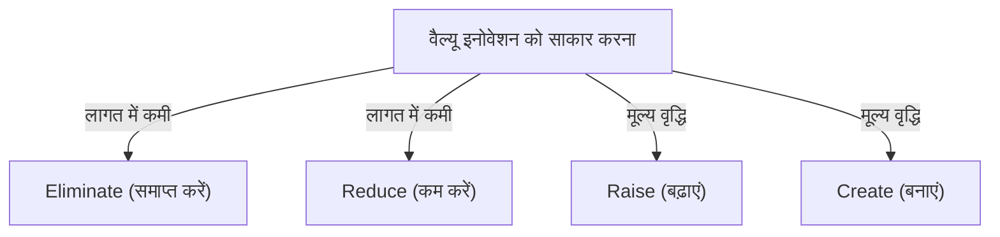
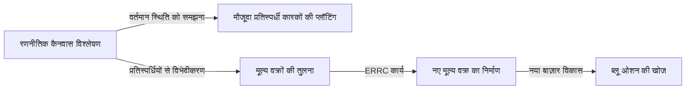

# ब्लू ओशन स्ट्रैटेजी: प्रतिस्पर्धा-मुक्त अनछुए बाज़ार बनाने का अंतिम बिजनेस सिद्धांत

## 1. प्रस्तावना: आज "ब्लू ओशन स्ट्रैटेजी" की आवश्यकता क्यों है?

आज के व्यावसायिक वातावरण में, मौजूदा बाज़ारों को तीव्र प्रतिस्पर्धा का सामना करना पड़ रहा है। प्रौद्योगिकी के विकास और वैश्वीकरण के कारण, उत्पादों और सेवाओं का कमोडिटीकरण तेजी से बढ़ रहा है, और मूल्य प्रतिस्पर्धा तेज हो गई है। कंपनियाँ जीवित रहने के लिए सीमित हिस्सेदारी छीनने की खूनी लड़ाई लड़ रही हैं। फ्रांस के INSEAD के प्रोफेसर डब्ल्यू. चान किम और रेनी मोबोर्गने ने ऐसे मौजूदा प्रतिस्पर्धी बाज़ारों को "रेड ओशन (लाल महासागर)" का नाम दिया।

रेड ओशन में पारंपरिक रणनीतियों (जैसे माइकल पोर्टर की प्रतिस्पर्धी रणनीति) का आधार प्रतिस्पर्धियों को हराना है, यानी "प्रतिस्पर्धी लाभ का निर्माण"। हालाँकि, आज के युग में जहाँ बाज़ार की वृद्धि धीमी हो गई है और आपूर्ति मांग से अधिक हो गई है, मौजूदा हिस्सेदारी छीनने से अंततः लाभ मार्जिन में कमी (मूल्य विनाश) होती है, जो कंपनियों के निरंतर विकास को रोकने वाला सबसे बड़ा कारक बन जाता है।

यहीं पर "ब्लू ओशन स्ट्रैटेजी" का प्रस्ताव रखा गया। ब्लू ओशन का अर्थ प्रतिस्पर्धा-मुक्त, अनछुआ बाज़ार स्थान (नीला महासागर) है। इस रणनीति का मूल "प्रतिस्पर्धा जीतना" नहीं है, बल्कि "प्रतिस्पर्धा को अप्रासंगिक बनाना" है। प्रतिस्पर्धियों के समान अखाड़े में लड़ना बंद करके, नए मूल्य पैदा करके, और स्वयं बाज़ार का निर्माण करके, एक टिकाऊ और उच्च-लाभकारी व्यवसाय मॉडल का निर्माण करना संभव है।

इस लेख में, हम ब्लू ओशन स्ट्रैटेजी की मूल अवधारणा से लेकर विशिष्ट रूपरेखाओं, सफलता की कहानियों, कार्यान्वयन की प्रक्रिया, और संगठनात्मक बाधाओं को पार करने के तरीकों तक, हर चीज़ की गहराई से व्याख्या करेंगे।

## 2. रेड ओशन और ब्लू ओशन के बीच मौलिक अंतर

ब्लू ओशन रणनीति को समझने के लिए, सबसे पहले रेड ओशन के साथ इसके अंतर को स्पष्ट रूप से पहचानना आवश्यक है। कई कंपनियाँ अनजाने में रेड ओशन के जाल में फँस जाती हैं।

*   **रेड ओशन (मौजूदा बाज़ार)**
    *   **बाज़ार की परिभाषा:** मौजूदा बाज़ार स्थान में प्रतिस्पर्धा करें। सीमाएँ पहले ही खींची जा चुकी हैं।
    *   **रणनीति का उद्देश्य:** प्रतिस्पर्धियों को हराएं। बेंचमार्किंग पर ज़ोर दिया जाता है।
    *   **मांग के प्रति दृष्टिकोण:** मौजूदा मांग (ग्राहकों) को छीनें।
    *   **मूल्य और लागत का संबंध:** मूल्य और लागत के ट्रेड-ऑफ़ को स्वीकार करें। उच्च वर्धित मूल्य (उच्च लागत) या कम कीमत (कम लागत) के बीच एक विकल्प (विभेदीकरण रणनीति या लागत-नेतृत्व रणनीति)।
    *   **संगठनात्मक संरेखण:** कंपनी की सभी गतिविधियों को विभेदीकरण या कम लागत की रणनीति के अनुसार संरेखित करें।

*   **ब्लू ओशन (अनछुआ बाज़ार)**
    *   **बाज़ार की परिभाषा:** प्रतिस्पर्धा के बिना एक नया बाज़ार स्थान स्वयं बनाएँ। सीमाएँ फिर से खींचें।
    *   **रणनीति का उद्देश्य:** प्रतिस्पर्धा को अप्रासंगिक बनाएँ। प्रतिस्पर्धियों की चिंता करने की ज़रूरत नहीं है।
    *   **मांग के प्रति दृष्टिकोण:** नई मांग (गैर-ग्राहकों) को उजागर करें और उन पर कब्जा करें।
    *   **मूल्य और लागत का संबंध:** मूल्य और लागत के ट्रेड-ऑफ़ को तोड़ें। एक ही समय में उच्च वर्धित मूल्य और कम लागत का पीछा करें (वैल्यू इनोवेशन)।
    *   **संगठनात्मक संरेखण:** कंपनी की सभी गतिविधियों को विभेदीकरण और कम लागत दोनों की प्राप्ति के लिए संरेखित करें।

इस तुलना से देखा जा सकता है कि ब्लू ओशन रणनीति महज़ एक आला (निश) रणनीति नहीं है। आला रणनीति मौजूदा बाज़ार के एक संकीर्ण क्षेत्र को लक्षित करती है, लेकिन ब्लू ओशन रणनीति बाज़ार का विस्तार करने या एक नया बाज़ार बनाने का एक गतिशील दृष्टिकोण है।

## 3. मुख्य अवधारणा: "वैल्यू इनोवेशन" (मूल्य नवाचार)

ब्लू ओशन रणनीति की आधारशिला "वैल्यू इनोवेशन (मूल्य नवाचार)" की अवधारणा है।
पारंपरिक रणनीति सिद्धांत में, "विभेदीकरण (अद्वितीय मूल्य प्रदान करना और उच्च कीमत पर बेचना)" और "कम लागत (मानक चीजें सस्ते में बेचना)" को एक ट्रेड-ऑफ़ संबंध माना गया है। ऐसा माना जाता था कि दोनों को एक साथ हासिल करने की कोशिश "बीच में फँसने (स्टक इन द मिडल)" का कारण बनती है, जिसके परिणामस्वरूप विफलता मिलती है।

हालाँकि, वैल्यू इनोवेशन इस सामान्य ज्ञान को पलट देता है। इसका उद्देश्य खरीदारों के लिए "मूल्य में वृद्धि (विभेदीकरण)" और कंपनी के लिए "लागत में कमी" को **एक साथ** प्राप्त करना है।

वैल्यू इनोवेशन तकनीकी नवाचार का पर्याय नहीं है। नवीनतम तकनीक का उपयोग किए बिना भी, केवल मौजूदा तकनीकों के संयोजन या सेवाओं के वितरण के तरीके पर पुनर्विचार करके ग्राहकों के लिए नाटकीय मूल्य बनाना संभव है। खरीदार के लिए मूल्य बढ़ाने वाले तत्वों को बढ़ाकर और अनावश्यक तत्वों को कम या समाप्त करके, एक अभूतपूर्व मूल्य वक्र खींचा जा सकता है।

## 4. रणनीति निर्माण की रूपरेखा: एक्शन मैट्रिक्स (ERRC ग्रिड)

वैल्यू इनोवेशन को साकार करने और मूल्य और लागत के ट्रेड-ऑफ़ को तोड़ने के लिए एक विशिष्ट उपकरण "4 एक्शन (ERRC ग्रिड)" है। उद्योग के सामान्य ज्ञान बन चुके प्रतिस्पर्धात्मक कारकों पर, हम निम्नलिखित 4 प्रश्न पूछते हैं:

1.  **Eliminate (समाप्त करें)**: उद्योग के सामान्य ज्ञान के रूप में प्रदान किए जाने वाले कारकों में से किसे समाप्त किया जाना चाहिए? (लागत में कमी की कुंजी)
2.  **Reduce (कम करें)**: उद्योग के मानकों की तुलना में किन कारकों को काफी कम किया जाना चाहिए? (लागत में कमी की कुंजी)
3.  **Raise (बढ़ाएं)**: उद्योग के मानकों की तुलना में किन कारकों को काफी बढ़ाया जाना चाहिए? (मूल्य वृद्धि की कुंजी)
4.  **Create (बनाएं)**: उद्योग ने अब तक जो प्रदान नहीं किया है, उनमें से किन नए कारकों को जोड़ा जाना चाहिए? (मूल्य वृद्धि की कुंजी)

इन 4 कार्यों के माध्यम से, हम लागत संरचना में नाटकीय रूप से सुधार करते हुए ग्राहकों को नया मूल्य प्रदान करते हैं।

## 5. ब्लू ओशन रणनीति की प्रमुख सफलता की कहानियाँ

सिद्धांत को समझने के बाद, आइए उन कंपनियों के उदाहरण देखें जिन्होंने वास्तव में ब्लू ओशन को खोला है।

### उदाहरण 1: Cirque du Soleil (सर्कस डु सोलेल - मनोरंजन उद्योग)

कनाडा में उत्पन्न सर्कस डु सोलेल ने सर्कस उद्योग में एक बिल्कुल नया बाज़ार बनाया, जिसे ढलान पर जा रहा उद्योग कहा जाता था।
पारंपरिक सर्कस स्टार कलाकारों और जानवरों के शो पर बहुत पैसा खर्च करते थे, और मुख्य रूप से बच्चों वाले परिवारों को लक्षित करते थे। हालाँकि, पशु कल्याण के दृष्टिकोण से आलोचना और अन्य मनोरंजन (वीडियो गेम, आदि) के उदय के कारण लाभप्रदता खराब हो रही थी।

सर्कस डु सोलेल ने 4 कार्यों को इस प्रकार लागू किया:
*   **समाप्त करें**: महंगे "पशु शो", "स्टार कलाकार", "कई रिंगों में एक साथ शो"
*   **कम करें**: रोमांच और खतरे की अत्यधिक अपील
*   **बढ़ाएं**: एक तम्बू की सुविधा, कलात्मकता, परिष्कृत वातावरण
*   **बनाएं**: विषय-वस्तु, रंगमंच और बैले के तत्व, कलात्मक संगीत और नृत्य

परिणामस्वरूप, इसने सर्कस और रंगमंच को मिलाकर एक नया मनोरंजन बनाया और वयस्कों और कॉर्पोरेट मनोरंजन की मांग के "गैर-ग्राहकों" को पकड़ने में सफल रहा। टिकट की कीमतें पारंपरिक सर्कस की तुलना में बहुत अधिक निर्धारित की जा सकती थीं, और एक उच्च-लाभकारी संरचना हासिल की गई।

### उदाहरण 2: Nintendo Wii (गेमिंग उद्योग)

2000 के दशक के मध्य में, होम वीडियो गेम कंसोल का बाज़ार उच्च प्रदर्शन और उच्च ग्राफिक्स गुणवत्ता के रेड ओशन प्रतियोगिता में प्रवेश कर चुका था। हार्डवेयर निर्माण लागत बढ़ गई थी, खेल अधिक जटिल हो गए थे, और वे केवल हार्डकोर गेमर्स द्वारा आनंद लिए जाने वाले बन रहे थे।

Nintendo ने "Wii" के साथ ब्लू ओशन रणनीति विकसित की।
*   **समाप्त करें**: अति उच्च-प्रदर्शन वाले प्रोसेसर, हाई-डेफिनिशन ग्राफिक्स, जटिल नियंत्रक
*   **कम करें**: हार्डकोर गेमर्स के लिए जटिल गेमप्ले
*   **बढ़ाएं**: सहज संचालन क्षमता जिसका पूरा परिवार आनंद ले सके, कंसोल की गति शुरू करें
*   **बनाएं**: मोशन-सेंसिंग रिमोट कंट्रोल, स्वास्थ्य प्रबंधन (Wii Fit), गैर-गेमर्स (जैसे वरिष्ठ नागरिक) को शामिल करने वाले अनुभव

तकनीकी दौड़ से बाहर निकलकर, इसने निर्माण लागत में काफी कमी की और "सहज ज्ञान युक्त नियंत्रण जिससे पूरा परिवार खेल सके" का एक बिल्कुल नया मूल्य बनाया।

### उदाहरण 3: QB House (नाई/सौंदर्य उद्योग)

जापान के नाई और सौंदर्य उद्योग में, QB हाउस ने एक अभूतपूर्व व्यवसाय मॉडल बनाया।
पारंपरिक नाई की दुकानों में बालों को धोने, शेविंग करने और मालिश करने जैसी बालों को काटने के अलावा अन्य सेवाएँ भी प्रदान की जाती थीं, जिनमें आम तौर पर लगभग एक घंटे का समय लगता था और कई हज़ार येन खर्च होते थे।

*   **समाप्त करें**: बाल धोना, शेविंग, मालिश, आरक्षण, नामांकन
*   **कम करें**: बिताया गया समय (10 मिनट तक कम), दुकान में व्यर्थ की जगह
*   **बढ़ाएं**: स्टेशन परिसर आदि में अच्छी पहुँच, स्वच्छता (एयर वॉशर द्वारा बालों की कतरनों को चूसना)
*   **बनाएं**: 1000 येन (उस समय) का स्पष्ट और किफायती मूल्य निर्धारण, टिकट मशीन द्वारा पूर्व-भुगतान

इसने "समय की कमी वाले व्यवसायियों" या "केवल बाल काटना ही पर्याप्त है" की ग्राहकों की छिपी हुई ज़रूरतों का जवाब दिया, और केवल बालों को काटने में विशेषज्ञता प्राप्त करके उच्च टर्नओवर दर हासिल की।

## 6. ब्लू ओशन को व्यवस्थित रूप से खोजने के "6 रास्ते"

एक नया बाज़ार स्थान केवल किसी जीनियस की चमक से पैदा नहीं होता है। किम और मोबोर्गने ने ब्लू ओशन खोजने के लिए एक रूपरेखा, "6 रास्ते" प्रस्तुत किए हैं।

1.  **वैकल्पिक उद्योगों पर गौर करें**: पूरी तरह से अलग उद्योगों (विकल्पों) को देखें जिन्हें ग्राहक आपकी कंपनी के उत्पादों या सेवाओं के स्थान पर चुन रहे हैं।
2.  **उद्योग के भीतर अन्य रणनीतिक समूहों को देखें**: विभिन्न रणनीतिक समूहों (जैसे विलासिता-उन्मुख और कम कीमत-उन्मुख) के बीच अंतर का विश्लेषण करें और दोनों के लाभों को मिलाएं।
3.  **क्रेता श्रृंखला को देखें**: पुनर्विचार करें कि क्या ध्यान खरीदार, उपयोगकर्ता, या प्रभावक पर केंद्रित है, और लक्ष्य को बदल दें।
4.  **पूरक उत्पाद और सेवा प्रस्तावों को देखें**: विश्लेषण करें कि आपके उत्पाद का उपयोग करने से पहले, उसके दौरान और उसके बाद ग्राहक क्या कार्य करते हैं और उन्हें क्या परेशानी होती है, और संपूर्ण समाधान प्रदान करें।
5.  **खरीदारों के प्रति कार्यात्मक और भावनात्मक अपील पर पुनर्विचार करें**: यदि कोई उद्योग कार्यक्षमता पर प्रतिस्पर्धा कर रहा है, तो भावना जोड़ें; यदि वह भावना पर प्रतिस्पर्धा कर रहा है, तो कार्यक्षमता पर ध्यान केंद्रित करें।
6.  **समय के रुझान को आकार दें**: भविष्यवाणी करें कि भविष्य के रुझान जो निश्चित रूप से घटित होंगे, वे ग्राहकों के मूल्य को कैसे प्रभावित करेंगे, और पहले से ही मूल्य प्रदान करें।

## 7. रणनीतिक कैनवास बनाना और उसका उपयोग करना

ब्लू ओशन रणनीति को चित्रित करने और उसे विज़ुअलाइज़ करने का एक शक्तिशाली उपकरण "रणनीतिक कैनवास" है।
क्षैतिज अक्ष उद्योग के प्रतिस्पर्धी कारकों (कीमत, गुणवत्ता, सेवा, विविधता आदि) को दर्शाता है, और ऊर्ध्वाधर अक्ष ग्राहकों द्वारा प्राप्त स्तर (उच्च/निम्न) को दर्शाता है। इसके बाद, अपनी कंपनी और प्रतिस्पर्धियों के मूल्य वक्रों को एक लाइन ग्राफ़ पर खींचा जाता है।

ब्लू ओशन रणनीति को क्रियान्वित करने वाली कंपनियों के मूल्य वक्रों में निम्नलिखित तीन विशेषताएं होती हैं:
1.  **फोकस (ध्यान)**: सभी प्रतिस्पर्धी कारकों पर ध्यान केंद्रित करने के बजाय, यह कुछ विशिष्ट कारकों को सीमित करता है।
2.  **विचलन (विशिष्टता)**: इसका आकार प्रतिस्पर्धियों के मूल्य वक्र से बिल्कुल अलग होता है।
3.  **आकर्षक टैगलाइन**: ग्राहकों को प्रदान किया जाने वाला मूल्य एक शब्द में स्पष्ट रूप से बताया जाता है।

## 8. संगठनात्मक बाधाओं को पार करना: "टिपिंग पॉइंट लीडरशिप"

आप चाहे कितनी भी शानदार ब्लू ओशन रणनीति बना लें, यह तब तक अर्थहीन है जब तक इसे क्रियान्वित करने वाला संगठन हरकत में न आए। यथास्थिति पसंद करने वाले संगठनों की बाधाओं को तोड़ने की विधि "टिपिंग पॉइंट लीडरशिप" है। यह न्यूनतम प्रयास और समय के साथ संगठनात्मक परिवर्तन में बाधा डालने वाली "4 बाधाओं" को पार करता है।

1.  **संज्ञानात्मक बाधा**: इस धारणा को बदलना कि यथास्थिति ठीक है। कर्मचारियों को संकट की स्थिति का "प्रत्यक्ष अनुभव" कराएं और उनकी भावनाओं को जगाएं।
2.  **संसाधन बाधा**: संसाधनों की कमी की दीवार। संसाधन उन क्षेत्रों से हटाकर परिवर्तन के लिए आवश्यक क्षेत्रों में साहसपूर्वक पुनः आवंटित किए जाते हैं जहाँ परिणाम नहीं आ रहे हैं।
3.  **प्रेरणा बाधा**: कर्मचारियों को प्रेरित करना। प्रभावशाली प्रमुख लोगों को आगे बढ़ाना, जिससे पूरे संगठन में एक श्रृंखला प्रतिक्रिया होती है।
4.  **राजनीतिक बाधा**: विरोधियों के हस्तक्षेप को रोकना। परिवर्तन का समर्थन करने वालों को अपने पक्ष में करें और विरोधियों को अलग-थलग करें।

## 9. रणनीति का निष्पादन और स्थिरता (नकल के विरुद्ध बाधाएँ)

रणनीति को क्रियान्वित करने के चरण में, एक "निष्पक्ष प्रक्रिया" आवश्यक है। रणनीति निर्माण प्रक्रिया में कर्मचारियों को शामिल करके, निर्णयों के कारणों को स्पष्ट रूप से समझाकर, और नए नियमों के लिए अपेक्षाओं को स्पष्ट करके स्वैच्छिक सहयोग प्राप्त किया जा सकता है।

इसके अतिरिक्त, ब्लू ओशन रणनीति निम्नलिखित कारणों से एक मजबूत "नकल के विरुद्ध बाधा" बना सकती है:
*   मौजूदा ब्रांड छवि के साथ विरोधाभास (उदा. एक लक्जरी ब्रांड कम कीमत की रणनीति की नकल नहीं कर सकता)
*   संगठनात्मक संरचना और संस्कृति को बदलने में कठिनाई
*   प्रथम-प्रस्तावक लाभ के कारण पैमाने की अर्थव्यवस्थाएं और सीखने का प्रभाव

## 10. निष्कर्ष: एक स्थायी यात्रा की ओर

ब्लू ओशन रणनीति कोई ऐसी चीज़ नहीं है जिसे आप एक बार करते हैं और फिर भूल जाते हैं। समय के साथ, नकल करने वाले प्रवेश करते हैं और बाज़ार एक रेड ओशन बन जाता है। इसलिए, कंपनियों को लगातार रणनीतिक कैनवास की निगरानी करनी चाहिए और अगर वे एक जैसा बनना शुरू करते हैं तो फिर से ब्लू ओशन खोजने के लिए यात्रा पर निकलना चाहिए।

अपने उद्योग के सामान्य ज्ञान पर सवाल उठाकर और "वैल्यू इनोवेशन" लाकर, आप अनछुए बाज़ारों को खोल सकते हैं। यही कंपनियों के निरंतर विकास को जारी रखने के लिए सबसे मजबूत दिशासूचक बन जाता है।
