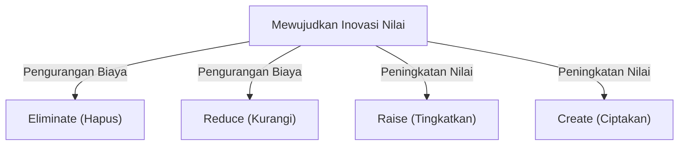
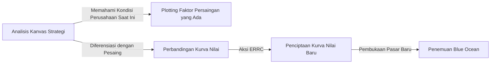

# Strategi Blue Ocean: Teori Bisnis Tertinggi untuk Menciptakan Pasar Belum Terjamah Tanpa Persaingan

## 1. Pendahuluan: Mengapa "Strategi Blue Ocean" Dibutuhkan Sekarang?

Dalam lingkungan bisnis saat ini, pasar yang ada dihadapkan pada persaingan yang sengit. Dengan evolusi teknologi dan globalisasi, komoditisasi produk dan layanan berjalan dengan cepat, sehingga persaingan harga pun semakin ketat. Perusahaan berjuang dalam pertempuran berdarah untuk memperebutkan kue yang terbatas agar dapat bertahan hidup. Pasar kompetitif yang sudah ada ini dinamakan "Red Ocean (Lautan Merah)" oleh Profesor W. Chan Kim dan Profesor Renée Mauborgne dari INSEAD (Institut Eropa untuk Administrasi Bisnis) di Prancis.

Dasar dari strategi konvensional (seperti strategi kompetitif Michael Porter) di Red Ocean adalah mengalahkan pesaing, dengan kata lain, "membangun keunggulan kompetitif". Namun, di era di mana pertumbuhan pasar melambat dan pasokan melebihi permintaan, memperebutkan kue yang sudah ada pada akhirnya akan menyebabkan penurunan margin keuntungan (penghancuran harga) dan menjadi faktor penghambat terbesar bagi pertumbuhan perusahaan yang berkelanjutan.

Oleh karena itu, diusulkanlah "Strategi Blue Ocean". Blue Ocean berarti ruang pasar (lautan biru) yang belum terjamah dan tanpa persaingan. Inti dari strategi ini bukanlah "memenangkan persaingan", melainkan "membuat persaingan menjadi tidak relevan". Dengan berhenti bertarung di arena yang sama dengan pesaing, menciptakan nilai baru, dan membuka pasar sendiri, perusahaan dapat membangun model bisnis yang berkelanjutan dan sangat menguntungkan.

Artikel ini akan menggali dan menjelaskan secara mendalam tentang strategi Blue Ocean, mulai dari konsep dasar, kerangka kerja konkret, studi kasus keberhasilan, proses menuju implementasi praktis, hingga cara mengatasi hambatan dalam organisasi.

## 2. Perbedaan Mendasar antara Red Ocean dan Blue Ocean

Untuk memahami strategi Blue Ocean, pertama-tama kita harus mengenali dengan jelas perbedaannya dengan Red Ocean. Banyak perusahaan tanpa sadar telah jatuh ke dalam perangkap Red Ocean.

*   **Red Ocean (Pasar yang Ada)**
    *   **Definisi Pasar:** Bersaing dalam ruang pasar yang sudah ada. Batas-batasnya sudah ditarik.
    *   **Tujuan Strategi:** Mengalahkan pesaing. Benchmarking sangat diutamakan.
    *   **Pendekatan terhadap Permintaan:** Memperebutkan permintaan (pelanggan) yang ada.
    *   **Hubungan antara Nilai dan Biaya:** Menerima tarik-ulur (trade-off) antara nilai dan biaya. Pilihan antara nilai tambah tinggi (biaya tinggi) atau harga rendah (biaya rendah) (strategi diferensiasi atau strategi kepemimpinan biaya).
    *   **Penyelarasan Organisasi:** Menyelaraskan seluruh aktivitas perusahaan dengan salah satu strategi: diferensiasi atau biaya rendah.

*   **Blue Ocean (Pasar Belum Terjamah)**
    *   **Definisi Pasar:** Menciptakan ruang pasar baru tanpa persaingan. Menggambar ulang batas-batas pasar.
    *   **Tujuan Strategi:** Membuat persaingan menjadi tidak relevan. Tidak perlu memedulikan pesaing.
    *   **Pendekatan terhadap Permintaan:** Menggali dan menangkap permintaan baru (non-pelanggan).
    *   **Hubungan antara Nilai dan Biaya:** Mendobrak tarik-ulur antara nilai dan biaya. Mengejar nilai tambah tinggi dan biaya rendah secara bersamaan (Inovasi Nilai / Value Innovation).
    *   **Penyelarasan Organisasi:** Menyelaraskan seluruh aktivitas perusahaan untuk mencapai kombinasi antara diferensiasi dan biaya rendah secara bersamaan.

Seperti yang terlihat dari perbandingan ini, strategi Blue Ocean bukan sekadar strategi ceruk (niche). Jika strategi ceruk menargetkan area sempit dalam pasar yang ada, strategi Blue Ocean adalah pendekatan dinamis untuk memperluas pasar itu sendiri, atau menciptakan pasar yang sama sekali baru.

## 3. Konsep Inti: "Inovasi Nilai (Value Innovation)"

Konsep yang menjadi landasan strategi Blue Ocean adalah "Inovasi Nilai (Value Innovation)".
Dalam teori strategi konvensional, diyakini ada hubungan tarik-ulur antara "diferensiasi (menawarkan nilai unik dan menjual dengan harga mahal)" dan "biaya rendah (menjual produk standar dengan harga murah)". Upaya untuk mengejar keduanya dianggap akan menghasilkan posisi "terjebak di tengah (stuck in the middle)" dan berujung pada kegagalan.

Namun, inovasi nilai mematahkan pemikiran umum ini. Tujuannya adalah untuk mencapai "peningkatan nilai (diferensiasi)" bagi pembeli dan "pengurangan biaya" bagi perusahaan secara **bersamaan**.

Inovasi nilai tidak identik dengan inovasi teknologi. Tanpa menggunakan teknologi tercanggih sekalipun, hanya dengan meninjau kombinasi teknologi yang ada atau cara penyediaan layanan, sangat mungkin untuk menciptakan nilai yang melompat jauh bagi pelanggan. Dengan menambah elemen yang meningkatkan nilai bagi pembeli, serta mengurangi dan menghilangkan elemen yang tidak perlu, perusahaan dapat menggambarkan kurva nilai yang belum pernah ada sebelumnya.

## 4. Kerangka Kerja Formulasi Strategi: Matriks Aksi (Skema ERRC)

Alat konkret untuk mewujudkan inovasi nilai dan mendobrak tarik-ulur antara nilai dan biaya adalah "Kerangka Kerja 4 Langkah (Skema ERRC / ERRC Grid)". Kerangka kerja ini mengajukan empat pertanyaan berikut terhadap faktor-faktor persaingan yang telah menjadi hal yang umum dalam industri:

1.  **Eliminate (Hapus)**: Dari elemen-elemen yang sudah menjadi standar industri, mana yang harus dihapus? (Kunci pengurangan biaya)
2.  **Reduce (Kurangi)**: Elemen mana yang harus dikurangi secara drastis dibandingkan dengan standar industri? (Kunci pengurangan biaya)
3.  **Raise (Tingkatkan)**: Elemen mana yang harus ditingkatkan secara drastis melebihi standar industri? (Kunci peningkatan nilai)
4.  **Create (Ciptakan)**: Elemen baru apa yang belum pernah ditawarkan dalam industri yang harus diciptakan? (Kunci peningkatan nilai)

Melalui empat aksi ini, perusahaan dapat memperbaiki struktur biaya secara dramatis sambil menawarkan nilai baru kepada pelanggan.

## 5. Studi Kasus Keberhasilan Strategi Blue Ocean

Setelah memahami teorinya, mari kita lihat beberapa contoh perusahaan yang berhasil membuka Blue Ocean.

### Kasus 1: Cirque du Soleil (Industri Hiburan)

Cirque du Soleil yang berasal dari Kanada menciptakan pasar yang sama sekali baru dalam industri sirkus yang saat itu dianggap sebagai industri yang sedang meredup.
Sirkus konvensional menghabiskan banyak biaya untuk bintang penampil dan pertunjukan hewan, serta terutama menargetkan keluarga yang membawa anak-anak. Namun, karena kritik dari sudut pandang perlindungan hewan dan kemunculan hiburan lain (seperti video game), profitabilitas mereka semakin memburuk.

Cirque du Soleil menerapkan empat aksi sebagai berikut:
*   **Hapus**: "Pertunjukan hewan", "Bintang penampil", dan "Pertunjukan simultan di beberapa arena" yang memakan biaya.
*   **Kurangi**: Penekanan berlebihan pada sensasi dan bahaya.
*   **Tingkatkan**: Fasilitas satu tenda, nilai artistik, dan lingkungan yang elegan.
*   **Ciptakan**: Tema cerita, elemen teater dan balet, serta musik dan tarian artistik.

Hasilnya, mereka berhasil menciptakan hiburan baru yang menggabungkan sirkus dan teater, serta sukses menarik "non-pelanggan" seperti orang dewasa dan klien korporat untuk menjamu tamu. Harga tiket bisa dipatok jauh lebih tinggi daripada sirkus konvensional, sehingga mewujudkan struktur profitabilitas yang tinggi.

### Kasus 2: Nintendo Wii (Industri Game)

Pada pertengahan tahun 2000-an, pasar konsol game rumahan telah memasuki persaingan Red Ocean dengan berfokus pada peningkatan kinerja dan resolusi grafis yang tinggi. Biaya produksi perangkat keras melonjak, game menjadi semakin kompleks, dan mulai menjadi sesuatu yang hanya dapat dinikmati oleh para *gamer hardcore*.

Nintendo mengembangkan strategi Blue Ocean melalui "Wii".
*   **Hapus**: Prosesor berperforma sangat tinggi, grafis resolusi sangat tinggi, dan pengontrol yang rumit.
*   **Kurangi**: Permainan kompleks yang ditujukan untuk *gamer hardcore*.
*   **Tingkatkan**: Pengoperasian intuitif yang dapat dinikmati oleh seluruh keluarga, dan kecepatan memuat mesin game.
*   **Ciptakan**: Remote control sensor gerak (motion-sensing), pemantauan kesehatan (Wii Fit), dan pengalaman yang melibatkan *non-gamer* (seperti kelompok lansia).

Dengan keluar dari perlombaan teknologi, mereka secara drastis memangkas biaya produksi, sekaligus menciptakan nilai yang sama sekali baru: "dapat dimainkan oleh seluruh keluarga dengan pengoperasian yang intuitif".

### Kasus 3: QB House (Industri Pangkas Rambut)

Dalam industri pangkas rambut Jepang, QB House membangun model bisnis yang revolusioner.
Tukang cukur konvensional umumnya menyediakan layanan selain memotong rambut, seperti mencuci rambut, mencukur kumis/jenggot, dan pijat, yang memakan waktu sekitar satu jam dan berbiaya ribuan yen.

*   **Hapus**: Mencuci rambut, mencukur kumis/jenggot, pijat, reservasi, dan pemilihan kapster.
*   **Kurangi**: Waktu kunjungan (dipersingkat menjadi 10 menit) dan ruang toko yang tidak perlu.
*   **Tingkatkan**: Kemudahan akses seperti di dalam stasiun, dan kebersihan (menyedot sisa rambut dengan pembersih udara "Air Washer").
*   **Ciptakan**: Penetapan harga yang jelas dan terjangkau sebesar 1.000 yen (saat itu), dan pembayaran di muka menggunakan mesin tiket.

Dengan merespons kebutuhan terpendam dari "pelaku bisnis yang tidak memiliki waktu" atau pelanggan yang merasa "potong rambut saja sudah cukup", serta berfokus hanya pada pemotongan rambut, mereka berhasil mencapai tingkat pergantian pelanggan (turnover) yang tinggi.

## 6. 6 Jalur (Paths) untuk Menjelajahi Blue Ocean secara Sistematis

Ruang pasar yang baru tidak serta merta lahir dari kilat kejeniusan. Kim dan Mauborgne mempresentasikan kerangka kerja "6 Jalur" untuk menemukan Blue Ocean.

1.  **Pelajari Industri Alternatif**: Perhatikan industri yang sama sekali berbeda (produk substitusi) yang dipilih pelanggan sebagai pengganti produk/layanan Anda.
2.  **Pelajari Kelompok Strategis Lain dalam Industri**: Analisis perbedaan antara kelompok strategis yang berbeda, seperti orientasi kemewahan dan orientasi harga rendah, lalu gabungkan manfaat keduanya.
3.  **Lihat Kelompok Pembeli**: Tinjau ulang apakah fokus ditujukan pada pengambil keputusan pembelian, pengguna, atau pemberi pengaruh, lalu geser targetnya.
4.  **Perhatikan Produk dan Layanan Pelengkap**: Analisis tindakan yang diambil pelanggan dan rasa frustrasi yang mereka alami sebelum, selama, dan setelah menggunakan produk Anda, lalu berikan solusi total.
5.  **Beralih antara Orientasi Fungsional dan Emosional terhadap Pelanggan**: Jika sebuah industri bersaing pada aspek fungsionalitas, tambahkan nilai emosional. Jika industri bersaing pada aspek emosi, berikan penekanan pada fungsionalitas.
6.  **Prakirakan Tren Masa Depan**: Prediksikan bagaimana tren masa depan yang pasti akan terjadi memengaruhi nilai pelanggan, dan tawarkan nilai dengan mengambil langkah lebih awal.

## 7. Pembuatan dan Pemanfaatan Kanvas Strategi

Alat yang ampuh untuk menggambar dan memvisualisasikan strategi Blue Ocean adalah "Kanvas Strategi".
Sumbu horizontal mewakili faktor persaingan industri (harga, kualitas, layanan, keragaman, dll.), dan sumbu vertikal mewakili tingkat (tinggi/rendah) yang diterima oleh pelanggan. Kemudian, kurva nilai perusahaan sendiri dan pesaing digambarkan menggunakan grafik garis.

Kurva nilai perusahaan yang menjalankan strategi Blue Ocean memiliki tiga karakteristik berikut:
1.  **Fokus**: Tidak memusatkan perhatian pada semua faktor persaingan, tetapi fokus pada faktor-faktor tertentu.
2.  **Divergensi (Keunikan)**: Memiliki bentuk yang sama sekali berbeda dari kurva nilai pesaing.
3.  **Slogan yang Menarik**: Nilai yang ditawarkan kepada pelanggan dikomunikasikan dengan jelas dalam satu frasa.

## 8. "Kepemimpinan Titik Tipping (Tipping Point Leadership)" untuk Mengatasi Hambatan Organisasi

Sebagus apa pun strategi Blue Ocean yang dirancang, tidak akan ada artinya jika organisasi yang menjalankannya tidak bergerak. Pendekatan untuk mendobrak dinding organisasi yang menyukai *status quo* adalah "Kepemimpinan Titik Tipping (Tipping Point Leadership)". Metode ini mengatasi "4 rintangan" yang menghalangi perubahan organisasi dengan usaha dan waktu yang minimal.

1.  **Rintangan Kesadaran (Kognitif)**: Mengubah kesadaran bahwa *status quo* sudah cukup baik. Buat karyawan "merasakan langsung" situasi krisis dan sentuh emosi mereka.
2.  **Rintangan Sumber Daya**: Hambatan berupa kekurangan sumber daya. Alokasikan ulang sumber daya secara berani dari area yang tidak membuahkan hasil ke area yang sangat penting untuk perubahan.
3.  **Rintangan Motivasi**: Membangkitkan semangat karyawan. Gerakkan tokoh kunci (*key person*) yang memiliki pengaruh untuk memicu pergerakan seluruh organisasi secara berantai.
4.  **Rintangan Politis**: Mencegah sabotase dari kelompok yang menolak. Jadikan mereka yang mendukung perubahan sebagai sekutu dan isolasi kelompok penentang.

## 9. Eksekusi Strategi dan Keberlanjutan (Hambatan Imitasi)

Pada tahap penerapan strategi, "proses yang adil (fair process)" sangatlah penting. Dengan melibatkan karyawan dalam proses perumusan strategi, menjelaskan alasan pengambilan keputusan secara jelas, dan memperjelas harapan terhadap aturan baru, perusahaan bisa mendapatkan kerja sama yang sukarela.

Selain itu, strategi Blue Ocean dapat membangun "hambatan imitasi (barrier to imitation)" yang kuat karena alasan berikut:
*   Kontradiksi dengan citra merek yang ada (contoh: merek mewah tidak dapat meniru strategi harga rendah).
*   Kesulitan dalam mengubah struktur dan budaya organisasi.
*   Skala ekonomi atau efek pembelajaran (*learning effect*) dari keunggulan penggerak pertama (*first-mover advantage*).

## 10. Kesimpulan: Menuju Pelayaran yang Abadi

Strategi Blue Ocean bukan berarti selesai setelah dijalankan satu kali. Seiring berjalannya waktu, para peniru akan memasuki pasar, dan pasar tersebut akan berubah menjadi Red Ocean. Oleh karena itu, perusahaan harus selalu memantau Kanvas Strategi dan jika mulai terjadi homogenisasi, mereka harus kembali berlayar mencari Blue Ocean yang baru.

Meragukan hal-hal yang dianggap umum dalam industri perusahaan dan menciptakan "Inovasi Nilai" untuk membuka pasar yang belum terjamah. Itulah kompas terkuat agar perusahaan dapat terus tumbuh secara berkelanjutan.
