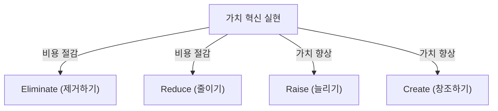
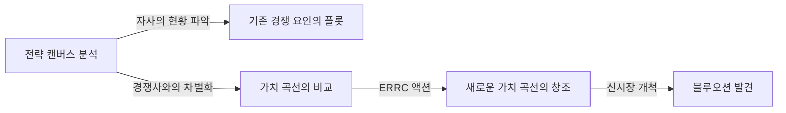

# 블루오션 전략: 경쟁 없는 미개척 시장을 창조하는 궁극의 비즈니스 이론

## 1. 서장: 왜 지금, '블루오션 전략'이 필요한가?

현대의 비즈니스 환경에서 기존 시장은 치열한 경쟁에 노출되어 있습니다. 기술의 진화와 글로벌화로 인해 제품과 서비스의 범용화가 급속히 진행되고, 가격 경쟁이 격화되고 있습니다. 기업들은 살아남기 위해 한정된 파이를 두고 피투성이의 싸움을 벌이고 있습니다. 이러한 기존의 경쟁 시장을 프랑스 유럽경영대학원(INSEAD)의 W. 찬 김 교수와 르네 마보안 교수는 '레드오션(붉은 바다)'이라고 명명했습니다.

레드오션에서의 종래 전략(마이클 포터의 경쟁 전략 등)의 기본은 경쟁사에게 이기는 것, 즉 '경쟁 우위의 구축'입니다. 그러나 시장의 성장이 둔화되고 공급이 수요를 넘어서는 현대에 있어, 기존의 파이를 뺏고 뺏기는 것은 결과적으로 이익률 저하(가격 파괴)를 초래하고 기업의 지속적인 성장을 저해하는 최대의 요인이 됩니다.

그래서 제창된 것이 '블루오션 전략'입니다. 블루오션이란 경쟁이 없는 미개척의 시장 공간(푸른 바다)을 의미합니다. 이 전략의 핵심은 '경쟁에서 이기는' 것이 아니라 '경쟁을 무의미하게 만드는' 것에 있습니다. 경쟁사와 같은 무대에서 싸우는 것을 그만두고, 새로운 가치를 창조하며, 스스로 시장을 개척함으로써 지속 가능하고 수익성이 높은 비즈니스 모델을 구축하는 것이 가능해집니다.

본 기사에서는 이 블루오션 전략의 기본 개념부터 구체적인 프레임워크, 성공 사례, 그리고 실천을 향한 프로세스, 나아가 조직적인 장벽을 넘어서는 방법까지 상세히 철저하게 파헤치고 해설해 나갈 것입니다.

## 2. 레드오션과 블루오션의 본질적 차이

블루오션 전략을 이해하기 위해서는 먼저 레드오션과의 차이를 명확히 인식해야 합니다. 많은 기업들이 무의식중에 레드오션의 함정에 빠져 있습니다.

*   **레드오션(기존 시장)**
    *   **시장의 정의:** 기존의 시장 공간에서 경쟁한다. 경계선은 이미 그어져 있다.
    *   **전략의 목적:** 경쟁사를 이긴다. 벤치마킹이 중시된다.
    *   **수요에 대한 접근:** 기존의 수요(고객)를 뺏고 뺏긴다.
    *   **가치와 비용의 관계:** 가치와 비용의 트레이드오프(상충관계)를 받아들인다. 고부가가치(고비용)인가, 저가격(저비용)인가 하는 양자택일(차별화 전략인가 비용 우위 전략인가).
    *   **조직의 정렬:** 기업 활동 전체를 차별화나 저비용 중 한쪽의 전략에 맞춘다.

*   **블루오션(미개척 시장)**
    *   **시장의 정의:** 경쟁이 없는 새로운 시장 공간을 스스로 창조한다. 경계선을 다시 긋는다.
    *   **전략의 목적:** 경쟁을 무의미하게 만든다. 경쟁사를 신경 쓸 필요가 없다.
    *   **수요에 대한 접근:** 새로운 수요(비고객)를 발굴하고 끌어들인다.
    *   **가치와 비용의 관계:** 가치와 비용의 트레이드오프를 타파한다. 고부가가치와 저비용을 동시에 추구한다(가치 혁신).
    *   **조직의 정렬:** 기업 활동 전체를 차별화와 저비용의 양립을 향해 맞춘다.

이 비교에서 알 수 있듯이, 블루오션 전략은 단순한 틈새 전략이 아닙니다. 틈새 전략은 기존 시장의 좁은 영역을 노리는 것이지만, 블루오션 전략은 시장 자체를 넓히거나 새로운 시장을 창출하는 역동적인 접근법입니다.

## 3. 핵심 개념: '가치 혁신'

블루오션 전략의 주춧돌이 되는 개념이 '가치 혁신(Value Innovation)'입니다.
종래의 전략론에서는 '차별화(독자적인 가치를 제공하여 비싸게 판다)'와 '저비용(표준적인 것을 싸게 판다)'은 트레이드오프의 관계에 있다고 여겨져 왔습니다. 양쪽을 추구하려고 하면 '어중간해져서(스턱 인 더 미들)' 실패한다고 여겨졌습니다.

그러나 가치 혁신은 이 상식을 뒤엎습니다. 구매자에 대한 '가치 향상(차별화)'과 기업에 대한 '비용 절감'을 **동시에** 달성하는 것을 목적으로 합니다.

가치 혁신은 테크놀로지의 혁신(기술 혁신)과 동의어가 아닙니다. 최첨단 기술을 사용하지 않더라도 기존 기술의 조합이나 서비스 제공 방법을 재검토하는 것만으로 고객에게 있어 비약적인 가치를 만들어내는 것은 가능합니다. 구매자에게 있어 가치를 높이는 요소를 늘리고, 불필요한 요소를 줄이거나 제거함으로써 유례없는 가치 곡선을 그려냅니다.

## 4. 전략 수립을 위한 프레임워크: 액션 매트릭스(ERRC 그리드)

가치 혁신을 실현하고 가치와 비용의 트레이드오프를 타파하기 위한 구체적인 도구가 '4가지 액션(ERRC 그리드)'입니다. 업계의 상식이 되어 있는 경쟁 요인에 대해 다음 4가지 질문을 던집니다.

1.  **Eliminate(제거하기)**: 업계의 상식으로 갖춰져 있는 요소 중, 제거해야 할 것은 무엇인가? (비용 절감의 열쇠)
2.  **Reduce(줄이기)**: 업계 표준과 비교하여, 과감하게 줄여야 할 요소는 무엇인가? (비용 절감의 열쇠)
3.  **Raise(늘리기)**: 업계 표준과 비교하여, 과감하게 늘려야 할 요소는 무엇인가? (가치 향상의 열쇠)
4.  **Create(창조하기)**: 업계에서 지금까지 제공되지 않은, 새롭게 덧붙여야 할 요소는 무엇인가? (가치 향상의 열쇠)

이 4가지 액션을 통해 비용 구조를 극적으로 개선하면서 고객에게 새로운 가치를 제공합니다.

## 5. 블루오션 전략의 대표적 성공 사례

이론을 이해했으니 실제로 블루오션을 개척한 기업의 사례를 살펴봅시다.

### 사례 1: 태양의 서커스(엔터테인먼트 업계)

캐나다에서 시작된 태양의 서커스(Cirque du Soleil)는 사양 산업이라 불리던 서커스 업계에서 전혀 새로운 시장을 창출했습니다.
기존의 서커스는 스타 퍼포머나 동물 쇼에 많은 비용을 들이고, 주로 아이를 동반한 가족을 타겟으로 삼았습니다. 그러나 동물 보호 관점에서의 비판이나 다른 오락(비디오 게임 등)의 대두로 인해 수익성은 악화되고 있었습니다.

태양의 서커스는 4가지 액션을 다음과 같이 적용했습니다.
*   **제거하기**: 비용이 드는 '동물 쇼', '스타 퍼포머', '여러 링에서의 동시 진행'
*   **줄이기**: 스릴과 위험성에 관한 과도한 어필
*   **늘리기**: 하나의 텐트 설비, 예술성, 세련된 환경
*   **창조하기**: 테마성, 연극이나 발레의 요소, 예술적인 음악과 댄스

결과적으로 서커스와 연극을 융합시킨 새로운 엔터테인먼트를 창출하여 어른이나 기업의 접대 수요라는 '비고객'을 끌어들이는 데 성공했습니다. 티켓 가격은 기존 서커스보다 훨씬 높게 설정할 수 있었고 고수익 체질을 실현했습니다.

### 사례 2: 닌텐도 Wii(게임 업계)

2000년대 중반, 가정용 게임기 시장은 고성능화·고화질화의 레드오션 경쟁에 돌입해 있었습니다. 하드웨어 제조 비용은 급등하고 게임은 복잡해져서 코어 게이머만이 즐길 수 있는 것이 되어 가고 있었습니다.

닌텐도는 'Wii'로 블루오션 전략을 전개했습니다.
*   **제거하기**: 초고성능 프로세서, 고정밀 그래픽스, 복잡한 컨트롤러
*   **줄이기**: 코어 게이머를 위한 복잡한 게임성
*   **늘리기**: 가족 전원이 즐길 수 있는 직관적인 조작성, 게임기 본체의 기동 속도
*   **창조하기**: 체감형 리모컨, 건강 관리(Wii Fit), 비게이머(시니어 층 등)를 끌어들이는 경험

기술 경쟁에서 물러남으로써 제조 비용을 대폭 삭감하면서도, '직관적인 조작으로 가족 모두가 놀 수 있다'라는 전혀 새로운 가치 창조를 이뤄냈습니다.

### 사례 3: QB하우스(이발 및 미용 업계)

일본의 이발 및 미용 업계에서 QB하우스는 획기적인 비즈니스 모델을 구축했습니다.
기존 이발소는 머리 감기, 면도, 마사지 등 커트 이외의 서비스도 제공하여 1시간 정도의 시간과 수천 엔의 요금이 드는 것이 일반적이었습니다.

*   **제거하기**: 머리 감기, 면도, 마사지, 예약, 지명
*   **줄이기**: 체류 시간(10분으로 단축), 점포의 낭비되는 공간
*   **늘리기**: 역 구내 등 뛰어난 접근성, 위생면(에어 워셔에 의한 머리카락 부스러기 흡인)
*   **창조하기**: 1000엔(당시)이라는 명확하고 저렴한 가격 설정, 자판기에 의한 사전 정산

'시간이 없는 비즈니스맨'이나 '머리를 자르는 것만으로 충분하다'는 고객의 잠재적 니즈에 부응하여, 커트에만 특화함으로써 높은 회전율을 실현했습니다.

## 6. 블루오션을 체계적으로 탐색하는 '6가지 패스(경로)'

새로운 시장 공간은 천재의 번뜩임만으로 태어나는 것이 아닙니다. 김 교수와 마보안 교수는 블루오션을 발견하기 위한 '6가지 패스'라는 프레임워크를 제시하고 있습니다.

1.  **대체 산업에서 배운다**: 고객이 자사의 제품·서비스 대신 선택하고 있는 전혀 다른 산업(대체품)에 눈을 돌린다.
2.  **업계 내의 다른 전략 그룹에서 배운다**: 고급 지향과 저가격 지향 등 다른 전략 그룹 간의 차이를 분석하고 양쪽의 장점을 융합한다.
3.  **구매자 그룹에 눈을 돌린다**: 구매 결정자, 사용자, 영향을 미치는 사람 중 어디에 초점이 맞추어져 있는지 재검토하고 타겟을 이동시킨다.
4.  **보완적인 제품이나 서비스를 살펴본다**: 고객이 자사 제품을 사용하기 전, 도중, 후에 어떤 행동을 취하고 어떤 고통을 느끼는지를 분석하여 토털 솔루션을 제공한다.
5.  **고객에 대한 기능적 지향과 감성적 지향을 전환한다**: 기능성으로 경쟁하고 있는 업계라면 감성을 부가하고, 감성으로 경쟁하고 있는 업계라면 기능성을 중시한다.
6.  **미래의 트렌드를 내다본다**: 확실히 일어날 미래의 트렌드가 고객 가치에 어떤 영향을 미칠지 예측하고 선제적으로 가치를 제공한다.

## 7. 전략 캔버스의 작성과 활용

블루오션 전략을 그리고 시각화하기 위한 강력한 도구가 '전략 캔버스'입니다.
가로축에 업계의 경쟁 요인(가격, 품질, 서비스, 다양성 등)을 두고, 세로축에 고객이 누리는 수준(높음·낮음)을 둡니다. 그리고 자사와 경쟁사의 가치 곡선을 꺾은선 그래프로 그립니다.

블루오션 전략을 실행하는 기업의 가치 곡선은 다음과 같은 3가지 특징을 가집니다.
1.  **강약(포커스)**: 경쟁 요인 모두에 주력하는 것이 아니라 특정 요인에 집중하고 있다.
2.  **발산(독자성)**: 경쟁사의 가치 곡선과는 전혀 다른 형태를 띠고 있다.
3.  **뛰어난 캐치프레이즈**: 고객에게 제공하는 가치가 한마디로 명확하게 전달된다.

## 8. 조직의 장벽을 뛰어넘는 '티핑 포인트 리더십'

아무리 훌륭한 블루오션 전략을 그려도 그것을 실행할 조직이 움직이지 않으면 의미가 없습니다. 현상 유지를 선호하는 조직의 벽을 타파하는 기법이 '티핑 포인트 리더십'입니다. 조직 변혁을 가로막는 '4가지 허들'을 최소한의 노력과 시간으로 넘어섭니다.

1.  **인식의 허들**: 현상 유지로 좋다는 인식을 바꾼다. 사원에게 위기 상황을 '직접 체험'하게 하여 감정에 호소한다.
2.  **자원의 허들**: 자원 부족의 벽. 성과가 나오지 않는 분야에서 변혁에 불가결한 분야로 자원을 과감하게 재분배한다.
3.  **동기 부여의 허들**: 사원의 의욕을 이끌어낸다. 영향력을 가진 핵심 인물을 움직여 조직 전체를 연쇄적으로 움직이게 한다.
4.  **정치적 허들**: 저항 세력의 방해를 막는다. 변혁을 지지하는 사람을 내 편으로 만들고 저항 세력을 고립시킨다.

## 9. 전략의 실행과 지속 가능성(모방의 방벽)

전략을 실행으로 옮기는 단계에서는 '공정한 프로세스'가 불가결합니다. 전략 수립 프로세스에 사원을 참여시키고 결정 사항의 이유를 명확하게 설명하며 새로운 규칙에 대한 기대를 명확히 함으로써 자발적인 협력을 얻을 수 있습니다.

또한, 블루오션 전략은 다음과 같은 이유로 강력한 '모방의 방벽'을 쌓을 수 있습니다.
*   기존의 브랜드 이미지와의 모순(고급 브랜드가 저가격 전략을 흉내 낼 수 없는 등)
*   조직 구조나 문화의 변혁의 어려움
*   선발자의 이익에 의한 규모의 경제성이나 학습 효과

## 10. 결론: 영구적인 항해를 향해

블루오션 전략은 한 번 실행하고 끝나는 것이 아닙니다. 시간이 지남에 따라 모방자가 진입하고 레드오션화되어 갑니다. 그 때문에 기업은 항상 전략 캔버스를 감시하고 동질화되기 시작하면 다시 블루오션을 찾는 여행을 떠날 필요가 있습니다.

자사 업계의 상식을 의심하고 '가치 혁신'을 일으킴으로써 미답의 시장을 개척해 나가는 것. 그것이야말로 기업이 지속적으로 성장해 나가기 위한 최강의 나침반이 될 것입니다.
