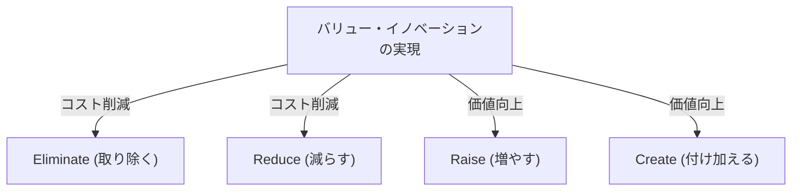
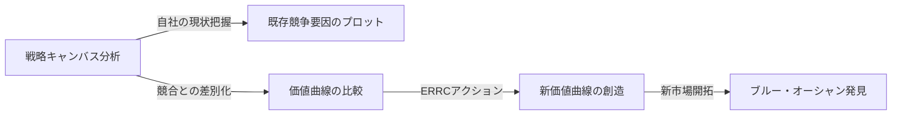

# ブルー・オーシャン戦略：競争なき未開拓市場を創造する究極のビジネス理論

## 1. 序章：なぜ今、「ブルー・オーシャン戦略」が必要なのか？

現代のビジネス環境において、既存の市場は激しい競争に晒されています。テクノロジーの進化やグローバリゼーションにより、製品やサービスのコモディティ化が急速に進み、価格競争が激化しています。企業は生き残りをかけて、限られたパイを奪い合う血みどろの戦いを繰り広げています。このような既存の競争市場を、フランスの欧州経営大学院（INSEAD）のW・チャン・キム教授とレネ・モボルニュ教授は「レッド・オーシャン（赤い海）」と名付けました。

レッド・オーシャンにおける従来の戦略（マイケル・ポーターの競争戦略など）の基本は、競合他社に打ち勝つこと、つまり「競争優位の構築」です。しかし、市場の成長が鈍化し、供給が需要を上回る現代において、既存のパイを奪い合うことは、結果的に利益率の低下（価格破壊）を招き、企業の持続的な成長を阻害する最大の要因となります。

そこで提唱されたのが、「ブルー・オーシャン戦略」です。ブルー・オーシャンとは、競争のない未開拓の市場空間（青い海）を意味します。この戦略の核心は、「競争に勝つ」ことではなく、「競争を無意味にする」ことにあります。競合と同じ土俵で戦うのをやめ、新しい価値を創造し、自ら市場を切り拓くことで、持続可能で高収益なビジネスモデルを構築することが可能となります。

本記事では、このブルー・オーシャン戦略の基本概念から、具体的なフレームワーク、成功事例、そして実践に向けたプロセス、さらには組織的な壁の乗り越え方までを、詳細にわたって徹底的に深掘りし、解説していきます。

## 2. レッド・オーシャンとブルー・オーシャンの本質的差異

ブルー・オーシャン戦略を理解するためには、まずレッド・オーシャンとの違いを明確に認識する必要があります。多くの企業は無意識のうちにレッド・オーシャンの罠に陥っています。

*   **レッド・オーシャン（既存市場）**
    *   **市場の定義:** 既存の市場空間で競争する。境界線は既に引かれている。
    *   **戦略の目的:** 競合他社に打ち勝つ。ベンチマーキングが重視される。
    *   **需要へのアプローチ:** 既存の需要（顧客）を奪い合う。
    *   **価値とコストの関係:** 価値とコストのトレードオフを受け入れる。高付加価値（高コスト）か、低価格（低コスト）かの二者択一（差別化戦略かコスト・リーダーシップ戦略か）。
    *   **組織のアラインメント:** 企業の活動全体を、差別化か低コストのどちらか一方の戦略に適合させる。

*   **ブルー・オーシャン（未開拓市場）**
    *   **市場の定義:** 競争のない新しい市場空間を自ら創造する。境界線を引き直す。
    *   **戦略の目的:** 競争を無意味にする。競合を気にする必要がない。
    *   **需要へのアプローチ:** 新しい需要（非顧客）を掘り起こし、取り込む。
    *   **価値とコストの関係:** 価値とコストのトレードオフを打ち破る。高付加価値と低コストを同時に追求する（バリュー・イノベーション）。
    *   **組織のアラインメント:** 企業の活動全体を、差別化と低コストの両立に向けて適合させる。

この比較からわかる通り、ブルー・オーシャン戦略は単なるニッチ戦略ではありません。ニッチ戦略は既存市場の狭い領域を狙うものですが、ブルー・オーシャン戦略は市場そのものを広げ、あるいは新しい市場を創出するダイナミックなアプローチです。

## 3. コア・コンセプト：「バリュー・イノベーション」

ブルー・オーシャン戦略の礎石となる概念が「バリュー・イノベーション（価値革新）」です。
従来の戦略論では、「差別化（独自の価値を提供して高く売る）」と「低コスト（標準的なものを安く売る）」はトレードオフの関係にあると考えられてきました。両方を追求しようとすると「どっちつかず（スタック・イン・ザ・ミドル）」になり、失敗するとされてきました。

しかし、バリュー・イノベーションは、この常識を覆します。買い手に対する「価値の向上（差別化）」と、企業にとっての「コスト削減」を**同時**に達成することを目的とします。

バリュー・イノベーションは、テクノロジーの革新（技術革新）と同義ではありません。最先端の技術を使わなくても、既存の技術の組み合わせや、サービスの提供方法を見直すだけで、顧客にとっての飛躍的な価値を生み出すことは可能です。買い手にとっての価値を高める要素を増やし、不要な要素を減らす・取り除くことで、かつてない価値曲線を描き出します。

## 4. 戦略策定のためのフレームワーク：アクション・マトリクス（ERRCグリッド）

バリュー・イノベーションを実現し、価値とコストのトレードオフを打破するための具体的なツールが「4つのアクション（ERRCグリッド）」です。業界の常識となっている競争要因に対して、以下の4つの問いを投げかけます。

1.  **Eliminate（取り除く）**: 業界の常識として備わっている要素のうち、取り除くべきものは何か？（コスト削減の鍵）
2.  **Reduce（減らす）**: 業界の標準と比べて、大胆に減らすべき要素は何か？（コスト削減の鍵）
3.  **Raise（増やす）**: 業界の標準と比べて、大胆に増やすべき要素は何か？（価値向上の鍵）
4.  **Create（付け加える）**: 業界でこれまで提供されていない、新たに付け加えるべき要素は何か？（価値向上の鍵）

この4つのアクションを通じて、コスト構造を劇的に改善しながら、顧客に新たな価値を提供します。

## 5. ブルー・オーシャン戦略の代表的成功事例

理論を理解したところで、実際にブルー・オーシャンを切り拓いた企業の事例を見てみましょう。

### 事例1：シルク・ドゥ・ソレイユ（エンターテインメント業界）

カナダ発祥のシルク・ドゥ・ソレイユは、斜陽産業と言われていたサーカス業界において、全く新しい市場を創出しました。
従来のサーカスは、スター・パフォーマーや動物ショーに多額のコストをかけ、主に子供連れの家族をターゲットにしていました。しかし、動物愛護の観点からの批判や、他の娯楽（テレビゲームなど）の台頭により、収益性は悪化していました。

シルク・ドゥ・ソレイユは4つのアクションを以下のように適用しました。
*   **取り除く**: コストのかかる「動物ショー」「スター・パフォーマー」「複数のリングでの同時進行」
*   **減らす**: スリルと危険性に関する過度なアピール
*   **増やす**: 一つのテントの設備、芸術性、洗練された環境
*   **付け加える**: テーマ性、演劇やバレエの要素、芸術的な音楽とダンス

結果として、サーカスと演劇を融合させた新しいエンターテインメントを創出し、大人や企業の接待需要という「非顧客」を取り込むことに成功しました。チケット価格は従来のサーカスよりもはるかに高く設定でき、高収益体質を実現しました。

### 事例2：任天堂 Wii（ゲーム業界）

2000年代半ば、家庭用ゲーム機市場は高性能化・高画質化のレッド・オーシャン競争に突入していました。ハードウェアの製造コストは高騰し、ゲームは複雑化し、コアゲーマーにしか楽しめないものになりつつありました。

任天堂は「Wii」でブルー・オーシャン戦略を展開しました。
*   **取り除く**: 超高性能なプロセッサ、高精細グラフィックス、複雑なコントローラー
*   **減らす**: コアゲーマー向けの複雑なゲーム性
*   **増やす**: 家族全員で楽しめる直感的な操作性、ゲーム機本体の起動スピード
*   **付け加える**: 体感型のリモコン、健康管理（Wii Fit）、非ゲーマー（シニア層など）を巻き込む体験

技術競争から降りることで製造コストを大幅に削減しつつ、「直感的な操作で家族みんなで遊べる」という全く新しい価値創造を成し遂げました。

### 事例3：QBハウス（理美容業界）

日本の理美容業界において、QBハウスは画期的なビジネスモデルを構築しました。
従来の理髪店は、洗髪、髭剃り、マッサージなど、カット以外のサービスも提供し、1時間程度の時間と数千円の料金がかかるのが一般的でした。

*   **取り除く**: 洗髪、髭剃り、マッサージ、予約、指名
*   **減らす**: 滞在時間（10分に短縮）、店舗の無駄なスペース
*   **増やす**: 駅構内などのアクセスの良さ、衛生面（エアウォッシャーによる毛くず吸引）
*   **付け加える**: 1000円（当時）という明確で手頃な価格設定、券売機による事前精算

「時間がないビジネスパーソン」や「髪を切るだけで十分」という顧客の潜在的なニーズに応え、カットのみに特化することで高回転率を実現しました。

## 6. ブルー・オーシャンを体系的に探索する「6つのパス（経路）」

新しい市場空間は、天才の閃きだけで生まれるものではありません。キムとモボルニュは、ブルー・オーシャンを発見するための「6つのパス」というフレームワークを提示しています。

1.  **代替産業に学ぶ**: 顧客が自社の製品・サービスの代わりに選んでいる全く別の産業（代替品）に目を向ける。
2.  **業界内の他の戦略グループから学ぶ**: 高級志向と低価格志向など、異なる戦略グループ間の違いを分析し、両方のメリットを融合する。
3.  **買い手グループに目を向ける**: 購買決定者、使用者、影響者のどれに焦点が当たっているかを見直し、ターゲットをずらす。
4.  **補完的な製品やサービスを見渡す**: 顧客が自社製品を使用する前、最中、後にどんな行動をとり、どんな苦痛を感じているかを分析し、トータルソリューションを提供する。
5.  **顧客に対する機能的志向と感性的志向を切り替える**: 機能性で競争している業界なら感性を付加し、感性で競争している業界なら機能性を重視する。
6.  **将来のトレンドを見通す**: 確実に起こる未来のトレンドが顧客価値にどう影響するかを予測し、先回りして価値を提供する。

## 7. 戦略キャンバスの作成と活用

ブルー・オーシャン戦略を描き、可視化するための強力なツールが「戦略キャンバス」です。
横軸に業界の競争要因（価格、品質、サービス、多様性など）を取り、縦軸に顧客が享受するレベル（高い・低い）を取ります。そして、自社と競合他社の価値曲線を折れ線グラフで描きます。

ブルー・オーシャン戦略を実行する企業の価値曲線は、以下の3つの特徴を持ちます。
1.  **メリハリ（フォーカス）**: 競争要因のすべてに注力するのではなく、特定の要因に絞り込んでいる。
2.  **発散（独自性）**: 競合他社の価値曲線とは全く異なる形状をしている。
3.  **優れたキャッチフレーズ**: 顧客に提供する価値が一言で明確に伝わる。

## 8. 組織の壁を乗り越える「ティッピング・ポイント・リーダーシップ」

いくら素晴らしいブルー・オーシャン戦略を描いても、それを実行する組織が動かなければ意味がありません。現状維持を好む組織の壁を打ち破る手法が「ティッピング・ポイント・リーダーシップ」です。組織変革を阻む「4つのハードル」を、最小の労力と時間で乗り越えます。

1.  **意識のハードル**: 現状維持で良いという意識を変える。社員に危機的状況を「直接体験」させ、感情に訴える。
2.  **リソースのハードル**: リソース不足の壁。成果の出ない分野から、変革に不可欠な分野へ資源を大胆に再配分する。
3.  **モチベーションのハードル**: 社員のやる気を引き出す。影響力を持つキーパーソンを動かし、組織全体を連鎖的に動かす。
4.  **政治的なハードル**: 抵抗勢力の妨害を防ぐ。変革を支持する人を味方につけ、抵抗勢力を孤立させる。

## 9. 戦略の実行と持続可能性（模倣の防壁）

戦略を実行に移す段階では、「公正なプロセス」が不可欠です。戦略策定のプロセスに社員を参加させ、決定事項の理由を明確に説明し、新しいルールへの期待を明確にすることで、自発的な協力を得ることができます。

また、ブルー・オーシャン戦略は、以下のような理由から強力な「模倣の防壁」を築くことができます。
*   既存のブランド・イメージとの矛盾（高級ブランドが低価格戦略を真似できない等）
*   組織構造や文化の変革の難しさ
*   先行者利益による規模の経済性や学習効果

## 10. 結論：永続的な航海へ向けて

ブルー・オーシャン戦略は、一度実行して終わりではありません。時間の経過とともに模倣者が参入し、レッド・オーシャン化していきます。そのため、企業は常に戦略キャンバスを監視し、同質化し始めたら再びブルー・オーシャンを探す旅に出る必要があります。

自社の業界の常識を疑い、「バリュー・イノベーション」を起こすことで、未踏の市場を切り拓いていくこと。それこそが、企業が持続的に成長し続けるための最強の羅針盤となるのです。
