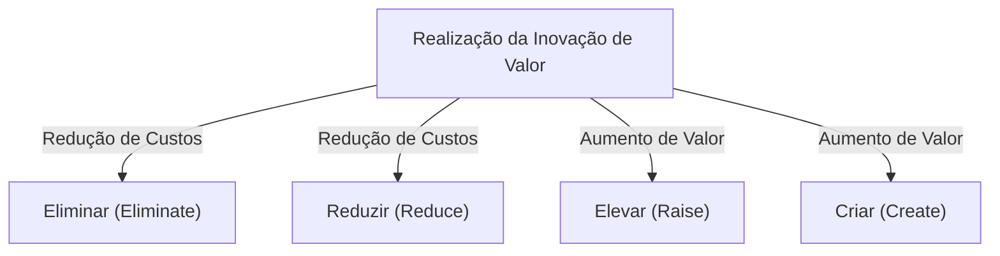
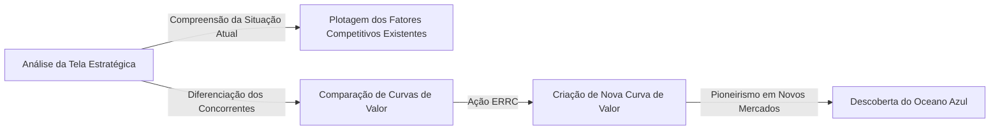

# Estratégia do Oceano Azul: A Teoria de Negócios Definitiva para Criar Mercados Inexplorados Sem Concorrência

## 1. Introdução: Por que a "Estratégia do Oceano Azul" é necessária agora?

No ambiente de negócios moderno, os mercados existentes estão expostos a uma concorrência acirrada. Devido à evolução da tecnologia e à globalização, a comoditização de produtos e serviços avança rapidamente e a guerra de preços se intensifica. As empresas travam batalhas sangrentas disputando um mercado limitado para sobreviver. Esses mercados competitivos existentes foram nomeados "Oceano Vermelho" (Red Ocean) pelos professores W. Chan Kim e Renée Mauborgne da escola de negócios europeia INSEAD, na França.

A base das estratégias convencionais (como a estratégia competitiva de Michael Porter) no Oceano Vermelho é derrotar os concorrentes, ou seja, "construir uma vantagem competitiva". No entanto, em uma era em que o crescimento do mercado desacelera e a oferta excede a demanda, disputar uma fatia do mercado existente resulta em uma diminuição das margens de lucro (destruição de preços) e se torna o maior fator que impede o crescimento sustentável das empresas.

A "Estratégia do Oceano Azul" foi proposta como resposta a isso. O Oceano Azul significa um espaço de mercado inexplorado e sem concorrência. A essência desta estratégia não está em "vencer a concorrência", mas em "tornar a concorrência irrelevante". Ao parar de lutar na mesma arena que os concorrentes, criar novos valores e abrir seu próprio mercado, torna-se possível construir um modelo de negócios sustentável e altamente lucrativo.

Neste artigo, vamos explorar profundamente e explicar detalhadamente desde os conceitos básicos desta Estratégia do Oceano Azul até frameworks específicos, casos de sucesso, processos práticos e como superar as barreiras organizacionais.

## 2. A Diferença Essencial Entre o Oceano Vermelho e o Oceano Azul

Para entender a Estratégia do Oceano Azul, primeiro é preciso reconhecer claramente a diferença em relação ao Oceano Vermelho. Muitas empresas caem inconscientemente na armadilha do Oceano Vermelho.

*   **Oceano Vermelho (Mercados Existentes)**
    *   **Definição do Mercado:** Competir no espaço de mercado existente. As fronteiras já estão traçadas.
    *   **Objetivo da Estratégia:** Derrotar os concorrentes. O benchmarking é priorizado.
    *   **Abordagem à Demanda:** Disputar a demanda (clientes) existente.
    *   **Relação Valor-Custo:** Aceitar o trade-off entre valor e custo. É uma escolha entre alto valor agregado (alto custo) ou preço baixo (baixo custo) - (Estratégia de Diferenciação vs Estratégia de Liderança em Custos).
    *   **Alinhamento Organizacional:** Alinhar as atividades gerais da empresa a apenas uma estratégia, diferenciação ou baixo custo.

*   **Oceano Azul (Mercados Inexplorados)**
    *   **Definição do Mercado:** Criar por conta própria um novo espaço de mercado sem concorrência. Redefinir as fronteiras.
    *   **Objetivo da Estratégia:** Tornar a concorrência irrelevante. Não é necessário se preocupar com os concorrentes.
    *   **Abordagem à Demanda:** Descobrir e capturar uma nova demanda (não-clientes).
    *   **Relação Valor-Custo:** Quebrar o trade-off entre valor e custo. Buscar simultaneamente alto valor agregado e baixo custo (Inovação de Valor).
    *   **Alinhamento Organizacional:** Alinhar as atividades gerais da empresa para equilibrar a diferenciação e o baixo custo.

Como se pode ver nesta comparação, a Estratégia do Oceano Azul não é uma mera estratégia de nicho. Enquanto a estratégia de nicho mira em uma área restrita do mercado existente, a Estratégia do Oceano Azul é uma abordagem dinâmica que expande o mercado em si, ou cria um novo mercado.

## 3. Conceito Central: "Inovação de Valor"

O conceito que forma a pedra angular da Estratégia do Oceano Azul é a "Inovação de Valor" (Value Innovation).
Nas teorias estratégicas convencionais, acreditava-se que "diferenciação (fornecer valor único e vender mais caro)" e "baixo custo (vender produtos padrão mais baratos)" estavam em uma relação de trade-off. Tentar buscar ambos resultaria em ficar "preso no meio" (stuck in the middle) e, consequentemente, em falha.

No entanto, a Inovação de Valor inverte esse senso comum. Seu objetivo é alcançar o "aumento do valor (diferenciação)" para o comprador e a "redução de custos" para a empresa **simultaneamente**.

A Inovação de Valor não é sinônimo de inovação tecnológica. Mesmo sem o uso de tecnologia de ponta, é possível criar um valor exponencial para o cliente simplesmente repensando as combinações de tecnologias existentes e os métodos de prestação de serviços. Ao aumentar os fatores que elevam o valor para os compradores e reduzir ou remover elementos desnecessários, é delineada uma curva de valor sem precedentes.

## 4. Framework para Formulação de Estratégias: Matriz de Ação (Grid ERRC)

A ferramenta específica para realizar a Inovação de Valor e quebrar o trade-off entre valor e custo são as "4 Ações (Grid ERRC)". São feitas as seguintes 4 perguntas em relação aos fatores competitivos que são senso comum na indústria:

1.  **Eliminar (Eliminate)**: Quais fatores, tidos como comuns na indústria, devem ser eliminados? (Chave para a redução de custos)
2.  **Reduzir (Reduce)**: Quais fatores devem ser reduzidos substancialmente abaixo do padrão da indústria? (Chave para a redução de custos)
3.  **Elevar (Raise)**: Quais fatores devem ser elevados substancialmente acima do padrão da indústria? (Chave para aumento de valor)
4.  **Criar (Create)**: Quais fatores que a indústria nunca ofereceu devem ser criados? (Chave para aumento de valor)

Através dessas 4 ações, fornecemos um novo valor ao cliente, ao mesmo tempo que melhoramos dramaticamente a estrutura de custos.

## 5. Casos Representativos de Sucesso da Estratégia do Oceano Azul

Depois de compreender a teoria, vejamos exemplos de empresas que de fato exploraram os Oceanos Azuis.

### Caso 1: Cirque du Soleil (Indústria de Entretenimento)

O Cirque du Soleil, originário do Canadá, criou um mercado inteiramente novo em uma indústria de circo em declínio.
O circo tradicional investia fortemente em artistas estrela e espetáculos com animais, e visava principalmente famílias com crianças. No entanto, a lucratividade havia deteriorado devido a críticas sobre direitos dos animais e a ascensão de outras formas de entretenimento (como os videogames).

O Cirque du Soleil aplicou as 4 ações da seguinte maneira:
*   **Eliminar**: "Espetáculos com animais", "artistas estrela" e "múltiplos picadeiros simultâneos", que encareciam os custos.
*   **Reduzir**: Apelos excessivos a risco e perigo.
*   **Elevar**: Um único ambiente sofisticado com instalações e arte próprias.
*   **Criar**: Temática, elementos de teatro e balé, bem como música e dança artísticas.

Como resultado, conseguiu criar um novo entretenimento unindo circo e teatro e capturar os "não-clientes", como adultos ou demanda corporativa. Foi capaz de fixar preços de ingressos bem mais altos que os dos circos tradicionais, alcançando alta lucratividade.

### Caso 2: Nintendo Wii (Indústria de Videogames)

Em meados da década de 2000, o mercado de consoles de videogame havia entrado em um Oceano Vermelho de disputa por alto desempenho e alta resolução. Os custos de fabricação de hardware aumentaram, os jogos tornaram-se mais complexos e restritos apenas aos jogadores inveterados.

A Nintendo implantou a Estratégia do Oceano Azul com o "Wii".
*   **Eliminar**: Processador de altíssimo desempenho, gráficos em alta definição e controladores complexos.
*   **Reduzir**: Jogabilidade complexa voltada para jogadores inveterados.
*   **Elevar**: Operação intuitiva que todos na família podem desfrutar e velocidade de inicialização do console.
*   **Criar**: Controle de movimento, gestão de saúde (Wii Fit) e experiência envolvente para não-gamers (como idosos).

Abdicando da corrida tecnológica, a Nintendo reduziu substancialmente os custos de fabricação e realizou a criação de um valor inédito: "um jogo para ser apreciado por toda a família com controles intuitivos".

### Caso 3: QB House (Indústria de Barbearia e Cabeleireiros)

Na indústria japonesa de barbearia, a QB House construiu um modelo de negócios revolucionário.
As barbearias convencionais ofereciam serviços além do corte, como lavagem de cabelo, barbear e massagem, o que exigia geralmente cerca de 1 hora de tempo e a cobrança de vários milhares de ienes.

*   **Eliminar**: Lavagem de cabelo, barbear, massagem, agendamento e escolha de profissional.
*   **Reduzir**: Tempo de permanência (reduzido a 10 minutos) e espaço inútil da loja.
*   **Elevar**: Facilidade de acesso (como dentro de estações de trem) e higiene (aspiração de pelos através de lavadores a ar).
*   **Criar**: Sistema de preços claro e acessível de 1000 ienes (na época), com pagamento antecipado em máquinas.

Atendendo às necessidades potenciais dos clientes, como "pessoas de negócios sem tempo" ou "pessoas para quem apenas o corte de cabelo é suficiente", conseguiu uma alta taxa de rotatividade ao se concentrar apenas no corte.

## 6. As "6 Vias (Caminhos)" Para Explorar Sistematicamente os Oceanos Azuis

Novos espaços de mercado não surgem apenas da intuição de um gênio. Kim e Mauborgne apresentam o framework das "6 vias" para descobrir os Oceanos Azuis.

1.  **Observar as indústrias alternativas**: Direcionar a atenção para setores totalmente diferentes (substitutos) que os clientes escolhem no lugar dos produtos ou serviços da própria empresa.
2.  **Observar outros grupos estratégicos no setor**: Analisar as diferenças entre diferentes grupos estratégicos (por exemplo, orientados a luxo e baixo preço) e combinar os benefícios de ambos.
3.  **Observar a cadeia de compradores**: Mudar o alvo repensando quem é o foco: os compradores diretos, os usuários ou os influenciadores.
4.  **Observar os produtos e serviços complementares**: Analisar os comportamentos e sofrimentos dos clientes antes, durante e após o uso do produto e fornecer uma solução total.
5.  **Repensar o apelo emocional ou funcional para os compradores**: Se a indústria compete em funcionalidade, adicionar apelo emocional; se compete com base em apelo emocional, enfatizar a funcionalidade.
6.  **Olhar para o tempo (tendências futuras)**: Prever como as tendências futuras irreversíveis afetarão o valor para o cliente e se antecipar para criar valor.

## 7. Criação e Utilização da Tela Estratégica (Strategy Canvas)

A "Tela Estratégica" é uma ferramenta poderosa para mapear e visualizar a Estratégia do Oceano Azul.
O eixo horizontal representa os fatores competitivos da indústria (preço, qualidade, serviço, variedade, etc.) e o eixo vertical o nível percebido pelo cliente (alto ou baixo). Em seguida, desenha-se um gráfico de linhas correspondente à curva de valor de sua própria empresa e das concorrentes.

A curva de valor de uma empresa que executa a Estratégia do Oceano Azul possui as três características a seguir:
1.  **Foco (Destaque)**: Não há dedicação em todos os fatores competitivos, mas apenas em fatores específicos.
2.  **Divergência (Exclusividade)**: Apresenta um formato completamente diferente da curva de valor dos concorrentes.
3.  **Slogan atraente**: O valor fornecido ao cliente é transmitido de forma clara em uma única frase.

## 8. Superando as Barreiras Organizacionais: "Liderança do Ponto de Virada"

Não importa quão magnífica seja a Estratégia do Oceano Azul, ela não terá sentido se a organização responsável não puder executá-la. A "Liderança do Ponto de Virada" é um método para quebrar as barreiras de organizações que preferem o status quo. Ajuda a superar os "4 obstáculos" à mudança organizacional com um mínimo de esforço e tempo.

1.  **Obstáculo Cognitivo**: Mudar a mentalidade de que manter o status quo está bom. Apelar para as emoções, permitindo aos funcionários "experimentar diretamente" as situações de crise.
2.  **Obstáculo de Recursos**: A barreira da escassez de recursos. Realocar recursos de forma ousada de áreas improdutivas para áreas indispensáveis para a mudança.
3.  **Obstáculo Motivacional**: Despertar o ânimo dos funcionários. Mobilizar pessoas-chave influentes e impulsionar uma reação em cadeia em toda a organização.
4.  **Obstáculo Político**: Prevenir as interferências das forças de resistência. Conquistar o apoio de quem apoia a mudança e isolar as forças de oposição.

## 9. Execução da Estratégia e Sustentabilidade (Barreiras Contra Imitações)

Na fase de execução da estratégia, é fundamental contar com um "Processo Justo". Ao envolver os funcionários no processo de formulação estratégica, explicar claramente as razões para as decisões e clarificar as expectativas de novas regras, pode-se obter a cooperação voluntária.

Além disso, a Estratégia do Oceano Azul pode construir fortes "barreiras contra imitações" pelas seguintes razões:
*   Incoerência com a imagem da marca existente (por exemplo, marcas de luxo não podem imitar estratégias de baixo custo).
*   A dificuldade de transformar a estrutura e cultura organizacional.
*   Economia de escala e curva de aprendizagem geradas pela vantagem do pioneirismo.

## 10. Conclusão: Rumo a Uma Viagem Eterna

A Estratégia do Oceano Azul não se encerra após ser executada uma única vez. Com o tempo, os imitadores entram no mercado e este volta a ser um Oceano Vermelho. Portanto, as empresas precisam monitorar constantemente a tela estratégica e, quando começarem a notar homogeneização, iniciar novamente a jornada na busca por outro Oceano Azul.

Duvidar do senso comum de sua própria indústria e criar "Inovação de Valor" para desbravar mercados inexplorados. Esta é a bússola mais poderosa para que as empresas possam continuar a crescer de forma sustentável.
