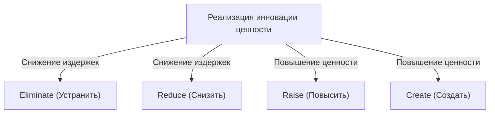
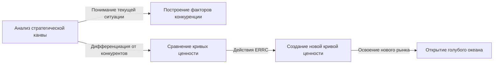

# Стратегия голубого океана: Ультимативная бизнес-теория создания неосвоенных рынков без конкуренции

## 1. Введение: Почему "Стратегия голубого океана" необходима именно сейчас?

В современной бизнес-среде существующие рынки подвержены жесткой конкуренции. Из-за развития технологий и глобализации коммодитизация продуктов и услуг стремительно ускоряется, а ценовая конкуренция обостряется. Компании ведут кровопролитные бои за ограниченный кусок пирога в попытках выжить. Профессора Европейского института управления бизнесом (INSEAD) У. Чан Ким и Рене Моборн назвали такие существующие конкурентные рынки "красными океанами".

Основа традиционных стратегий в красном океане (таких как конкурентная стратегия Майкла Портера) — это победа над конкурентами, то есть "создание конкурентного преимущества". Однако в наши дни, когда рост рынка замедлился, а предложение превышает спрос, борьба за существующий пирог в итоге приводит к снижению рентабельности (разрушению цен) и становится главным фактором, препятствующим устойчивому росту компаний.

Именно поэтому была предложена "Стратегия голубого океана". Голубой океан означает неосвоенное рыночное пространство (синее море) без конкуренции. Суть этой стратегии не в том, чтобы "выиграть в конкурентной борьбе", а в том, чтобы "сделать конкуренцию бессмысленной". Перестав бороться с конкурентами на одном поле, создавая новую ценность и самостоятельно открывая рынки, можно построить устойчивую и высокоприбыльную бизнес-модель.

В этой статье мы подробно и глубоко разберем стратегию голубого океана: от базовых концепций до конкретных фреймворков, примеров успеха, процесса внедрения, а также способов преодоления организационных барьеров.

## 2. Сущностная разница между красным и голубым океанами

Чтобы понять стратегию голубого океана, прежде всего необходимо четко осознать ее отличия от красного океана. Многие компании неосознанно попадают в ловушку красного океана.

*   **Красный океан (существующий рынок)**
    *   **Определение рынка:** Конкуренция в существующем рыночном пространстве. Границы уже проведены.
    *   **Цель стратегии:** Победить конкурентов. Большое значение придается бенчмаркингу.
    *   **Подход к спросу:** Борьба за существующий спрос (клиентов).
    *   **Отношение между ценностью и издержками:** Принятие компромисса между ценностью и издержками. Выбор между высокой добавленной стоимостью (высокими издержками) и низкой ценой (низкими издержками) (стратегия дифференциации или стратегия лидерства по издержкам).
    *   **Организационное выравнивание:** Приведение всей деятельности компании в соответствие либо со стратегией дифференциации, либо со стратегией низких издержек.

*   **Голубой океан (неосвоенный рынок)**
    *   **Определение рынка:** Самостоятельное создание нового рыночного пространства без конкуренции. Перерисовка границ.
    *   **Цель стратегии:** Сделать конкуренцию бессмысленной. Нет необходимости оглядываться на конкурентов.
    *   **Подход к спросу:** Раскрытие и привлечение нового спроса (неклиентов).
    *   **Отношение между ценностью и издержками:** Преодоление компромисса между ценностью и издержками. Одновременное стремление к высокой добавленной стоимости и низким издержкам (инновация ценности).
    *   **Организационное выравнивание:** Приведение всей деятельности компании в соответствие с одновременным достижением дифференциации и низких издержек.

Как видно из этого сравнения, стратегия голубого океана — это не просто нишевая стратегия. Нишевая стратегия нацелена на узкий сегмент существующего рынка, тогда как стратегия голубого океана — это динамичный подход, расширяющий сам рынок или создающий совершенно новый.

## 3. Ключевая концепция: "Инновация ценности"

Краеугольным камнем стратегии голубого океана является концепция "инновации ценности".
В традиционной теории стратегии считалось, что "дифференциация (предоставление уникальной ценности и продажа по высокой цене)" и "низкие издержки (продажа стандартного продукта дешево)" находятся в отношениях компромисса. Попытка достичь и того, и другого одновременно приводила к "застреванию посередине" и считалась обреченной на провал.

Однако инновация ценности опровергает этот стереотип. Ее цель — **одновременное** достижение "повышения ценности (дифференциации)" для покупателя и "снижения издержек" для компании.

Инновация ценности не является синонимом технологических инноваций. Даже не используя передовые технологии, а просто пересмотрев комбинацию существующих технологий или способ предоставления услуг, можно создать колоссальную ценность для клиентов. Увеличивая элементы, повышающие ценность для покупателя, и сокращая/устраняя ненужные, вы рисуете беспрецедентную кривую ценности.

## 4. Фреймворк для разработки стратегии: Матрица действий (Сетка ERRC)

Конкретным инструментом для реализации инновации ценности и разрушения компромисса между ценностью и издержками являются "4 действия (Сетка ERRC)". По отношению к факторам конкуренции, ставшим отраслевым стандартом, задаются следующие четыре вопроса:

1.  **Eliminate (Устранить)**: Какие элементы, являющиеся стандартом отрасли, следует устранить? (Ключ к снижению издержек)
2.  **Reduce (Снизить)**: Какие элементы следует значительно снизить по сравнению с отраслевыми стандартами? (Ключ к снижению издержек)
3.  **Raise (Повысить)**: Какие элементы следует значительно повысить по сравнению с отраслевыми стандартами? (Ключ к повышению ценности)
4.  **Create (Создать)**: Какие элементы, ранее не предлагавшиеся в отрасли, следует добавить? (Ключ к повышению ценности)

С помощью этих четырех действий радикально улучшается структура издержек, при этом клиентам предлагается новая ценность.

## 5. Типичные примеры успеха стратегии голубого океана

Поняв теорию, давайте рассмотрим примеры компаний, которые на практике открыли свой голубой океан.

### Пример 1: Cirque du Soleil (Индустрия развлечений)

Cirque du Soleil, зародившийся в Канаде, создал совершенно новый рынок в цирковой индустрии, которая считалась приходящей в упадок.
Традиционные цирки тратили огромные средства на звездных исполнителей и шоу с животными, ориентируясь в основном на семьи с детьми. Однако из-за критики с точки зрения защиты животных и появления других развлечений (таких как видеоигры) их рентабельность падала.

Cirque du Soleil применил 4 действия следующим образом:
*   **Устранить**: Дорогостоящие "шоу с животными", "звездных исполнителей" и "одновременные выступления на нескольких аренах"
*   **Снизить**: Чрезмерный акцент на острых ощущениях и опасности
*   **Повысить**: Оборудование одного шатра, артистизм и изысканную атмосферу
*   **Создать**: Тематичность, элементы театра и балета, художественную музыку и танец

В результате они создали новый вид развлечений, объединивший цирк и театр, и успешно привлекли "неклиентов" — взрослых и корпоративных клиентов (деловые приемы). Цены на билеты можно было установить гораздо выше, чем в традиционном цирке, что обеспечило высокую рентабельность бизнеса.

### Пример 2: Nintendo Wii (Игровая индустрия)

В середине 2000-х годов рынок домашних игровых консолей вступил в соревнование красного океана за высокую производительность и высокое качество графики. Стоимость производства оборудования росла, игры становились все сложнее, превращаясь в продукт исключительно для хардкорных геймеров.

Nintendo развернула стратегию голубого океана с консолью "Wii".
*   **Устранить**: Сверхмощные процессоры, графику высокой четкости, сложные контроллеры
*   **Снизить**: Сложный геймплей, ориентированный на хардкорных геймеров
*   **Повысить**: Интуитивное управление, понятное всей семье, скорость запуска консоли
*   **Создать**: Чувствительный к движениям пульт, контроль здоровья (Wii Fit), опыт, привлекающий негеймеров (например, пожилых людей)

Отказавшись от технологической гонки, компания значительно снизила производственные затраты и при этом создала совершенно новую ценность: "интуитивное управление, позволяющее играть всей семье".

### Пример 3: QB House (Индустрия парикмахерских услуг)

В японской парикмахерской индустрии QB House построил новаторскую бизнес-модель.
Традиционные парикмахерские обычно предлагали помимо стрижки и другие услуги: мытье головы, бритье, массаж и т.д., что занимало около часа и стоило несколько тысяч иен.

*   **Устранить**: Мытье головы, бритье, массаж, предварительную запись, выбор мастера
*   **Снизить**: Время пребывания (сокращено до 10 минут), неэффективное использование пространства салона
*   **Повысить**: Доступность (например, расположение на станциях), гигиену (всасывание волос с помощью "эйр-вошера")
*   **Создать**: Четкую и доступную цену в 1000 иен (на тот момент), предварительную оплату через автомат

Ответив на скрытые потребности "занятых бизнесменов" и клиентов, которым "нужно только подстричься", компания сосредоточилась исключительно на стрижке, тем самым обеспечив высокую оборачиваемость.

## 6. "6 путей" систематического поиска голубого океана

Новое рыночное пространство не рождается только из озарений гениев. Ким и Моборн предлагают фреймворк из "6 путей" для поиска голубого океана.

1.  **Учиться у альтернативных отраслей**: Обратить внимание на совершенно другие отрасли (товары-субституты), которые клиенты выбирают вместо продуктов и услуг вашей компании.
2.  **Учиться у других стратегических групп внутри отрасли**: Проанализировать различия между разными стратегическими группами, такими как сегмент премиум-класса и сегмент низких цен, и объединить их преимущества.
3.  **Смотреть на цепочку покупателей**: Пересмотреть, на кого делается акцент — на того, кто принимает решение о покупке, пользователя или человека, оказывающего влияние — и сместить целевую аудиторию.
4.  **Рассматривать дополнительные продукты и услуги**: Проанализировать, что делают и какие трудности испытывают клиенты до, во время и после использования вашего продукта, и предложить комплексное решение.
5.  **Переключаться между функциональной и эмоциональной привлекательностью для клиентов**: Если отрасль конкурирует за счет функциональности, добавьте эмоциональную составляющую; если конкуренция основана на эмоциях — сделайте акцент на функциональности.
6.  **Всматриваться в будущие тренды**: Спрогнозировать, как неизбежные тренды будущего повлияют на ценность для клиентов, и начать предлагать эту ценность заранее.

## 7. Создание и использование стратегической канвы

Мощным инструментом для визуализации и прорисовки стратегии голубого океана является "стратегическая канва".
По горизонтальной оси откладываются факторы конкуренции в отрасли (цена, качество, сервис, ассортимент и т.д.), а по вертикальной — уровень, который получают клиенты (высокий/низкий). Затем в виде линейного графика рисуются кривые ценности вашей компании и конкурентов.

Кривая ценности компании, реализующей стратегию голубого океана, имеет три следующие особенности:
1.  **Фокус**: Усилия концентрируются не на всех факторах конкуренции, а лишь на некоторых из них.
2.  **Дивергенция (Уникальность)**: Форма кривой кардинально отличается от кривых ценности конкурентов.
3.  **Привлекательный девиз**: Ценность, предлагаемая клиенту, четко передается одной фразой.

## 8. Преодоление организационных барьеров с помощью "Лидерства переломного момента"

Каким бы прекрасным ни был план стратегии голубого океана, он не имеет смысла, если организация, которая должна его реализовывать, не действует. "Лидерство переломного момента" — это метод прорыва через стены организации, предпочитающей статус-кво. Он позволяет преодолеть "4 препятствия", мешающих организационным изменениям, с минимальными затратами сил и времени.

1.  **Препятствие осведомленности**: Изменить мнение о том, что текущее положение дел — это нормально. Дать сотрудникам возможность "напрямую столкнуться" с кризисной ситуацией и воздействовать на их эмоции.
2.  **Препятствие ограниченных ресурсов**: Стена нехватки ресурсов. Радикально перераспределить ресурсы из неприбыльных сфер в области, жизненно важные для трансформации.
3.  **Препятствие мотивации**: Пробудить мотивацию сотрудников. Привлечь ключевых фигур, обладающих влиянием, и запустить цепную реакцию по всей организации.
4.  **Политическое препятствие**: Предотвратить саботаж со стороны противников изменений. Привлечь на свою сторону тех, кто поддерживает трансформацию, и изолировать силы сопротивления.

## 9. Реализация стратегии и устойчивость (Барьеры для имитации)

На этапе воплощения стратегии в жизнь необходим "справедливый процесс". Вовлечение сотрудников в процесс разработки стратегии, четкое объяснение причин принятых решений и прояснение ожиданий от новых правил позволяет добиться их добровольного сотрудничества.

Кроме того, стратегия голубого океана может выстроить мощные "барьеры для имитации" по следующим причинам:
*   Противоречие существующему имиджу бренда (например, элитный бренд не может скопировать стратегию низких цен).
*   Сложность изменения организационной структуры и культуры.
*   Экономия от масштаба и эффект обучения за счет преимущества первопроходца.

## 10. Заключение: К бесконечному плаванию

Стратегия голубого океана — это не то, что можно применить один раз и на этом закончить. Со временем приходят подражатели, и океан становится красным. Поэтому компаниям необходимо постоянно отслеживать стратегическую канву и, как только начинается процесс гомогенизации, вновь отправляться на поиски голубого океана.

Ставить под сомнение общепринятые стандарты своей отрасли и открывать неизведанные рынки посредством "инновации ценности" — именно это станет лучшим компасом для устойчивого роста компании.
