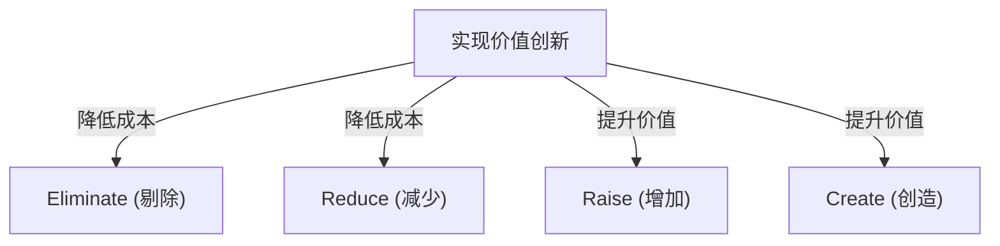
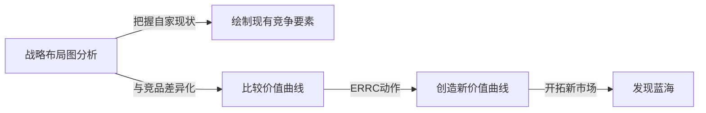

# 蓝海战略：创造无竞争未开拓市场的终极商业理论

## 1. 序章：为什么现在需要“蓝海战略”？

在现代商业环境中，现有市场面临着激烈的竞争。随着技术的进步和全球化，产品和服务的商品化迅速发展，价格竞争日益激烈。企业为了生存，在争夺有限市场份额的血腥战斗中挣扎。这种现有的竞争市场，被法国欧洲工商管理学院（INSEAD）的W·钱·金教授和勒妮·莫博涅教授称为“红海”。

红海中传统战略（如迈克尔·波特的竞争战略等）的基础是战胜竞争对手，即“建立竞争优势”。然而，在市场增长放缓、供大于求的今天，争夺现有的市场份额最终会导致利润率下降（价格破坏），成为阻碍企业可持续增长的最大因素。

因此，“蓝海战略”应运而生。蓝海指的是没有竞争的未开拓市场空间。这一战略的核心不在于“在竞争中取胜”，而在于“让竞争变得毫无意义”。停止在同一个竞技场上与竞争对手作战，通过创造新价值、开拓属于自己的市场，企业可以建立起可持续的高利润商业模式。

本文将从蓝海战略的基本概念出发，深入探讨具体的框架、成功案例、实施过程，甚至如何克服组织障碍，为您提供详细而彻底的解说。

## 2. 红海与蓝海的本质区别

要理解蓝海战略，首先必须明确它与红海的区别。许多企业在不知不觉中就陷入了红海的陷阱。

*   **红海（现有市场）**
    *   **市场定义:** 在现有的市场空间中竞争。边界已经被划定。
    *   **战略目的:** 战胜竞争对手。重视基准测试（Benchmarking）。
    *   **需求获取:** 争夺现有的需求（客户）。
    *   **价值与成本的关系:** 接受价值与成本之间的权衡（Trade-off）。在高附加值（高成本）和低价格（低成本）之间二选一（差异化战略或成本领先战略）。
    *   **组织对齐:** 将企业的整体活动与差异化或低成本其中一种战略相匹配。

*   **蓝海（未开拓市场）**
    *   **市场定义:** 自行创造没有竞争的新市场空间。重新划定边界。
    *   **战略目的:** 让竞争变得毫无意义。无需在意竞争对手。
    *   **需求获取:** 挖掘并获取新需求（非客户）。
    *   **价值与成本的关系:** 打破价值与成本的权衡。同时追求高附加值和低成本（价值创新）。
    *   **组织对齐:** 将企业的整体活动与兼顾差异化和低成本相匹配。

从这个比较中可以看出，蓝海战略绝非单纯的利基（Niche）战略。利基战略旨在瞄准现有市场中的狭小领域，而蓝海战略则是一种扩大市场本身或创造新市场的动态方法。

## 3. 核心概念：“价值创新”

蓝海战略的基石概念是“价值创新（Value Innovation）”。
在传统的战略理论中，“差异化（提供独特价值以高价销售）”和“低成本（以低价销售标准产品）”被认为是鱼和熊掌不可兼得的权衡关系。如果试图同时追求这两者，就会陷入“夹在中间（Stuck in the middle）”的境地并最终失败。

然而，价值创新颠覆了这一常识。它的目标是**同时**实现针对买方的“价值提升（差异化）”和对企业而言的“成本降低”。

价值创新不等于技术革新。即使不使用最前沿的技术，仅仅通过重新组合现有技术或改变服务提供方式，也能为客户创造出飞跃性的价值。通过增加能够提升买方价值的要素，同时减少或消除不必要的要素，企业可以描绘出前所未有的价值曲线。

## 4. 制定战略的框架：四步动作框架（ERRC网格）

实现价值创新、打破价值与成本权衡的具体工具是“四步动作（ERRC网格）”。针对行业内习以为常的竞争要素，提出以下四个问题：

1.  **Eliminate（剔除）**: 行业内习以为常的要素中，有哪些是应该剔除的？（降低成本的关键）
2.  **Reduce（减少）**: 哪些要素应该被大幅度减少至行业标准以下？（降低成本的关键）
3.  **Raise（增加）**: 哪些要素应该被大幅度增加至行业标准以上？（提升价值的关键）
4.  **Create（创造）**: 行业内从未提供过、应该被全新创造的要素是什么？（提升价值的关键）

通过这四个动作，在大幅改善成本结构的同时，向客户提供全新的价值。

## 5. 蓝海战略的典型成功案例

了解了理论之后，让我们来看看实际开拓出蓝海的企业案例。

### 案例1：太阳马戏团（娱乐产业）

源自加拿大的太阳马戏团，在被称为夕阳产业的马戏行业中，创造出了一个全新的市场。
传统的马戏团斥巨资聘请明星表演者和动物表演，主要面向带小孩的家庭。然而，由于动物保护方面的批评以及其他娱乐方式（如电子游戏）的崛起，其盈利能力不断恶化。

太阳马戏团如下应用了四个动作：
*   **剔除**: 成本高昂的“动物表演”、“明星表演者”、“多个场地的同时表演”
*   **减少**: 对刺激和危险性的过度宣传
*   **增加**: 单个帐篷的设施、艺术性、优雅的环境
*   **创造**: 主题性、戏剧和芭蕾舞元素、艺术性的音乐和舞蹈

结果，他们成功创造出了一种融合了马戏和戏剧的全新娱乐形式，并吸引了成年人和企业接待需求这些“非客户”。门票价格得以定得比传统马戏团高得多，实现了高盈利体制。

### 案例2：任天堂 Wii（游戏产业）

在2000年代中期，家用游戏机市场陷入了追求高性能、高画质的红海竞争。硬件制造成本飙升，游戏变得越来越复杂，几乎变成了只有硬核玩家才能享受的东西。

任天堂凭借“Wii”展开了蓝海战略。
*   **剔除**: 超高性能处理器、超高清图形、复杂的控制器
*   **减少**: 面向硬核玩家的复杂游戏性
*   **增加**: 全家都能享受的直观操作性、游戏机主机的启动速度
*   **创造**: 体感型遥控器、健康管理（Wii Fit）、吸引非玩家（如老年人）参与的体验

通过退出技术竞争，在大幅削减制造成本的同时，实现了“通过直观操作让全家一起玩”的全新价值创造。

### 案例3：QB House（理发美容产业）

在日本的理发美容行业，QB House构建了革命性的商业模式。
传统的理发店除了理发外，还提供洗发、刮胡子、按摩等服务，通常需要耗费1小时左右的时间和数千日元的费用。

*   **剔除**: 洗发、刮胡子、按摩、预约、指定理发师
*   **减少**: 停留时间（缩短至10分钟）、店铺的无用空间
*   **增加**: 车站内等极佳的交通便利性、卫生方面（使用空气洗涤器吸走碎发）
*   **创造**: 1000日元（当时）这样明确且实惠的价格设定、使用售票机提前结账

它满足了“没有时间的商务人士”和“只想剪发就够了”等客户的潜在需求，通过专攻理发服务实现了高翻台率。

## 6. 系统性探索蓝海的“六条路径”

新的市场空间并非仅靠天才的灵光一现就能诞生。金和莫博涅提出了寻找蓝海的框架——“六条路径”。

1.  **向替代产业学习**: 关注客户用来代替自家产品或服务的完全不同的产业（替代品）。
2.  **向行业内的其他战略群体学习**: 分析高端导向与低价导向等不同战略群体之间的差异，并融合双方的优势。
3.  **关注买方群体**: 重新审视焦点是放在购买决策者、使用者还是影响者身上，并转移目标群体。
4.  **放眼互补性产品和服务**: 分析客户在使用自家产品之前、期间和之后会采取什么行动、感受到什么痛苦，并提供整体解决方案。
5.  **在针对客户的功能性导向与情感性导向之间切换**: 如果是在功能性竞争的行业，就增加情感因素；如果是在情感竞争的行业，就重视功能性。
6.  **预测未来趋势**: 预测必然发生的未来趋势将如何影响客户价值，并提前提供价值。

## 7. 绘制和运用战略布局图

“战略布局图（Strategy Canvas）”是描绘蓝海战略并将其可视化的强大工具。
横轴代表行业的竞争要素（价格、质量、服务、多样性等），纵轴代表客户享受的水平（高或低）。然后，用折线图画出自家企业和竞争对手的价值曲线。

执行蓝海战略的企业的价值曲线具有以下三个特征：
1.  **重点突出（Focus）**: 并非在所有竞争要素上都投入精力，而是聚焦于特定的要素。
2.  **独树一帜（Divergence）**: 形状与竞争对手的价值曲线截然不同。
3.  **引人入胜的标语（Compelling Tagline）**: 能用一句话清晰传达提供给客户的价值。

## 8. 跨越组织障碍的“引爆点领导力”

无论描绘出多么出色的蓝海战略，如果负责执行的组织按兵不动，那就毫无意义。“引爆点领导力（Tipping Point Leadership）”是打破组织喜欢维持现状之壁垒的方法。它以最小的努力和时间，跨越阻碍组织变革的“四大障碍”。

1.  **认知障碍**: 改变安于现状的意识。让员工“亲身体验”危机状况，诉诸情感。
2.  **资源障碍**: 资源不足的壁垒。将资源从不出成果的领域大幅重新分配到变革不可或缺的领域。
3.  **动力障碍**: 激发员工的积极性。调动具有影响力的关键人物，引发整个组织的连锁反应。
4.  **政治障碍**: 防止抵制势力的阻挠。拉拢支持变革的人，孤立抵制势力。

## 9. 战略的执行与可持续性（模仿壁垒）

在将战略付诸执行的阶段，“公平过程（Fair Process）”是不可或缺的。让员工参与战略制定过程，明确解释决策的理由，并阐明对新规则的期望，从而获得他们的自发合作。

此外，蓝海战略能够基于以下原因筑起强大的“模仿壁垒”：
*   与现有品牌形象的矛盾（例如高级品牌无法模仿低价战略等）
*   组织结构和文化变革的困难
*   先行者优势带来的规模经济和学习效应

## 10. 结论：驶向永恒的航海

蓝海战略并非一次性执行就结束了。随着时间的推移，模仿者会涌入，市场会再次变成红海。因此，企业必须时刻监控战略布局图，一旦开始出现同质化，就必须再次踏上寻找蓝海的旅程。

质疑自家行业的常识，通过引发“价值创新”来开拓未知的市场。这正是企业实现可持续增长的最强指南针。
