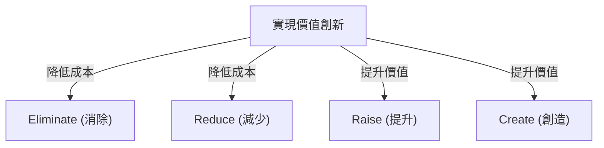
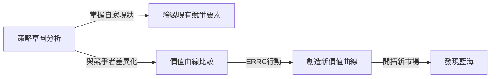

# 藍海策略：創造無競爭未開發市場的終極商業理論

## 1. 序章：為什麼現在需要「藍海策略」？

在現代的商業環境中，現有市場面臨著激烈的競爭。隨著科技的進步與全球化的發展，產品與服務的商品化迅速推進，價格競爭日益激烈。企業為了生存，展開了爭奪有限大餅的血腥戰鬥。法國歐洲工商管理學院（INSEAD）的W·錢·金教授與勒妮·莫博涅教授將這種現有的競爭市場命名為「紅海」。

在紅海中，傳統策略（如麥可·波特的競爭策略）的基本原則是擊敗競爭對手，也就是「建立競爭優勢」。然而，在市場成長放緩、供過於求的現代，爭奪現有的大餅最終會導致利潤率下降（價格破壞），成為阻礙企業持續成長的最大因素。

因此，他們提出了「藍海策略」。藍海指的是無競爭、尚未開發的市場空間。這項策略的核心不在於「贏得競爭」，而在於「讓競爭變得毫無意義」。企業應停止在同一個競技場上與對手廝殺，而是創造新價值，親自開拓市場，藉此建立可持續且高利潤的商業模式。

本文將從藍海策略的基本概念出發，深入探討其具體框架、成功案例、實踐流程，以及如何克服組織障礙，進行全面且徹底的解說。

## 2. 紅海與藍海的本質差異

為了理解藍海策略，首先必須明確體認它與紅海的不同。許多企業在不知不覺中陷入了紅海的陷阱。

*   **紅海（現有市場）**
    *   **市場的定義:** 在現有市場空間內競爭。邊界已經劃定。
    *   **策略的目的:** 擊敗競爭對手。重視標竿學習。
    *   **對需求的處理:** 爭奪現有需求（顧客）。
    *   **價值與成本的關係:** 接受價值與成本的權衡。在高附加價值（高成本）或低價格（低成本）之間二選一（差異化策略或成本領導策略）。
    *   **組織的契合度:** 將企業的整體活動調整為適合差異化或低成本其中一種策略。

*   **藍海（未開發市場）**
    *   **市場的定義:** 創造無競爭的新市場空間。重新劃定邊界。
    *   **策略的目的:** 讓競爭變得毫無意義。無須在意競爭對手。
    *   **對需求的處理:** 挖掘並吸引新需求（非顧客）。
    *   **價值與成本的關係:** 打破價值與成本的權衡。同時追求高附加價值與低成本（價值創新）。
    *   **組織的契合度:** 將企業的整體活動調整為兼顧差異化與低成本。

從這個比較可以看出，藍海策略並不僅僅是利基策略。利基策略瞄準的是現有市場中的狹小領域，而藍海策略則是一種擴展市場本身或創造新市場的動態方法。

## 3. 核心概念：「價值創新」

藍海策略的基石概念是「價值創新」。
在傳統的策略理論中，「差異化（提供獨特價值並以高價銷售）」與「低成本（以低價銷售標準化產品）」被認為是權衡關係。如果試圖同時追求兩者，就會陷入「夾在中間」的困境而導致失敗。

然而，價值創新顛覆了這個常識。它的目標是**同時**實現對買方的「提升價值（差異化）」與對企業的「降低成本」。

價值創新並不等同於科技創新。即使不使用最先進的技術，只要重新組合現有技術或調整服務的提供方式，就有可能為顧客創造突破性的價值。藉由增加能提升買方價值的要素，並減少或消除不必要的要素，就能描繪出前所未有的價值曲線。

## 4. 制定策略的框架：行動矩陣（ERRC方格）

為了實現價值創新並打破價值與成本的權衡，具體的工具是「四步動作框架（ERRC方格）」。針對業界習以為常的競爭要素，提出以下四個問題：

1.  **Eliminate（消除）**: 在業界習以為常的要素中，有哪些應該被消除？（降低成本的關鍵）
2.  **Reduce（減少）**: 相比業界標準，有哪些要素應該被大幅減少？（降低成本的關鍵）
3.  **Raise（提升）**: 相比業界標準，有哪些要素應該被大幅提升？（提升價值的關鍵）
4.  **Create（創造）**: 有哪些業界從未提供過、應該新創造的要素？（提升價值的關鍵）

透過這四個行動，不僅能大幅改善成本結構，還能為顧客提供新價值。

## 5. 藍海策略的代表性成功案例

理解了理論之後，讓我們來看看實際開拓出藍海的企業案例。

### 案例1：太陽劇團（娛樂產業）

發源於加拿大的太陽劇團，在被稱為夕陽產業的馬戲團業界中，創造了一個全新的市場。
傳統的馬戲團花費大量成本聘請明星表演者和動物表演，主要針對帶小孩的家庭。然而，由於動物保護觀點的批評，加上其他娛樂（如電視遊戲）的崛起，其獲利能力不斷惡化。

太陽劇團應用了四個行動如下：
*   **消除**: 成本高昂的「動物表演」、「明星表演者」、「多個場地同時進行」
*   **減少**: 對刺激和危險性的過度強調
*   **提升**: 單一帳篷的設備、藝術性、精緻的環境
*   **創造**: 主題性、戲劇和芭蕾元素、藝術性的音樂與舞蹈

結果，他們創造了融合馬戲與戲劇的全新娛樂，成功吸引了成年人與企業招待需求等「非顧客」。其票價得以定得比傳統馬戲團高出許多，實現了高獲利體質。

### 案例2：任天堂 Wii（遊戲產業）

在2000年代中期，家用遊戲機市場陷入了追求高效能、高畫質的紅海競爭。硬體的製造成本飆升，遊戲變得複雜，逐漸成為只有核心玩家才能享受的產品。

任天堂透過「Wii」展開了藍海策略。
*   **消除**: 超高效能的處理器、高解析度圖形、複雜的控制器
*   **減少**: 針對核心玩家的複雜遊戲性
*   **提升**: 全家都能享受的直覺操作性、遊戲機主機的開機速度
*   **創造**: 體感型遙控器、健康管理（Wii Fit）、吸引非玩家（如銀髮族）參與的體驗

透過退出技術競爭，他們大幅降低了製造成本，同時實現了「以直覺操作讓全家一起玩」的全新價值創造。

### 案例3：QB HOUSE（理容美髮產業）

在日本的理容美髮產業中，QB HOUSE建立了革命性的商業模式。
傳統的理髮店通常提供洗髮、刮鬍、按摩等剪髮以外的服務，一般需要花費大約1小時的時間和數千日圓的費用。

*   **消除**: 洗髮、刮鬍、按摩、預約、指定設計師
*   **減少**: 停留時間（縮短至10分鐘）、店舖的無謂空間
*   **提升**: 車站內等優良的交通便利性、衛生面（使用空氣洗髮器吸除毛屑）
*   **創造**: 1000日圓（當時）的明確親民價格、透過售票機預先付費

他們回應了「沒有時間的商務人士」和「只需剪髮就夠了」的潛在顧客需求，藉由專注於剪髮服務實現了高週轉率。

## 6. 系統性探索藍海的「六條途徑」

新市場空間並非單靠天才的靈光一閃就能產生。金與莫博涅提出了一個名為「六條途徑」的框架，用以發現藍海。

1.  **向替代產業學習**: 關注顧客在尋求自身產品或服務的替代方案時所選擇的完全不同的產業（替代品）。
2.  **向業界內的其他策略群組學習**: 分析高階市場與低價市場等不同策略群組之間的差異，並融合兩者的優點。
3.  **重新界定買方群體**: 檢視目前的焦點是放在購買決定者、使用者還是影響者身上，並轉移目標群體。
4.  **放眼互補性產品與服務**: 分析顧客在使用自家產品之前、期間、之後會採取什麼行動，並感受到什麼痛點，進而提供整體解決方案。
5.  **改變對顧客的功能性訴求與感性訴求**: 如果是在以功能性競爭的業界，就增加感性元素；如果在以感性競爭的業界，就轉為重視功能性。
6.  **洞察未來趨勢**: 預測必然發生的未來趨勢將如何影響顧客價值，並搶先一步提供價值。

## 7. 製作與運用策略草圖

用來描繪並將藍海策略視覺化的強大工具是「策略草圖」。
橫軸代表業界的競爭要素（價格、品質、服務、多樣性等），縱軸代表顧客享受到的水準（高或低）。然後，以折線圖描繪出自家與競爭對手的價值曲線。

執行藍海策略的企業，其價值曲線具有以下三個特徵：
1.  **重點突出（Focus）**: 不將資源分散於所有競爭要素，而是集中於特定要素。
2.  **與眾不同（Divergence）**: 形狀與競爭對手的價值曲線截然不同。
3.  **引人入勝的標語**: 能用一句話明確傳達提供給顧客的價值。

## 8. 克服組織障礙的「引爆點領導」

無論描繪出多麼完美的藍海策略，如果執行的組織不動如山，那也毫無意義。打破喜歡維持現狀的組織障礙的手法，就是「引爆點領導」。它能以最小的勞力與時間，克服阻礙組織變革的「四道障礙」。

1.  **認知障礙**: 改變「維持現狀就好」的認知。讓員工「直接體驗」危機狀況，訴諸情感。
2.  **資源障礙**: 資源不足的障礙。將資源從沒有成效的領域，大膽重新分配到變革不可或缺的領域。
3.  **動機障礙**: 激發員工的動力。推動具有影響力的關鍵人物，引發整個組織的連鎖反應。
4.  **政治障礙**: 防止抗拒勢力的阻撓。拉攏支持變革的人成為盟友，孤立抗拒勢力。

## 9. 策略的執行與永續性（防禦模仿的壁壘）

在將策略付諸實行的階段，「公平的流程」是不可或缺的。讓員工參與策略制定的過程，明確解釋決定事項的理由，並清楚說明對新規則的期望，藉此獲得員工的自發性合作。

此外，藍海策略能夠建立起強大的「防禦模仿壁壘」，理由如下：
*   與現有品牌形象的矛盾（例如高級品牌無法輕易模仿低價策略）
*   變革組織結構與文化的困難度
*   先行者優勢帶來的規模經濟或學習效果

## 10. 結論：航向永續的旅程

藍海策略並不是執行一次就結束了。隨著時間推移，模仿者會陸續進入，市場會逐漸「紅海化」。因此，企業必須隨時監控策略草圖，一旦開始出現同質化現象，就必須再次踏上尋找藍海的旅程。

質疑自身業界的常識，透過引發「價值創新」來開拓未知的市場。這才是企業持續成長的最強羅盤。
