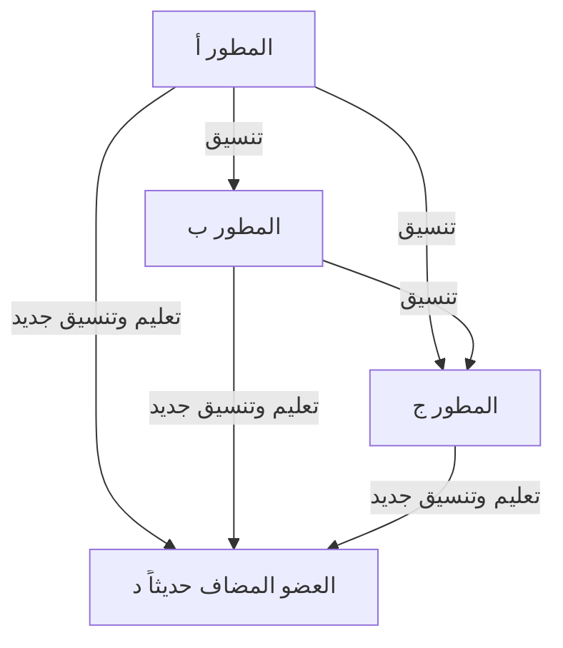
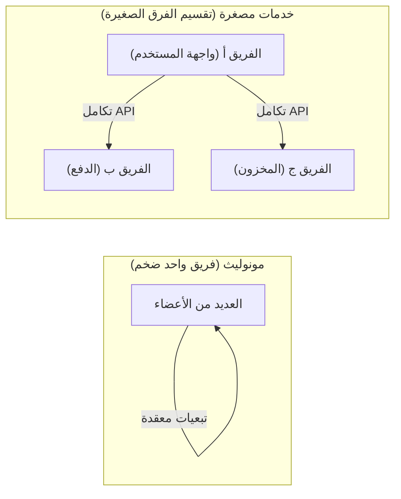

# مقدمة: ما هو قانون بروكس؟

إذا كنت منخرطًا في تطوير الأنظمة، أو هندسة البرمجيات، أو إدارة المشاريع بشكل عام، فمن المحتمل أنك سمعت بمصطلح "قانون بروكس" (Brooks's law) من قبل.

قانون بروكس هو قاعدة تجريبية مشهورة جدًا ومتناقضة في مشاريع تطوير البرمجيات، اقترحها فريدريك ب. بروكس جونيور (Frederick P. Brooks Jr.) في عام 1975 في كتابه "شهر الإنسان الأسطوري: لا توجد رصاصة فضية لقتل المستذئبين" (The Mythical Man-Month). ويمكن تلخيص هذا القانون في جملة واحدة:

> **"إضافة القوى العاملة إلى مشروع برمجيات متأخر يجعله أكثر تأخراً."**
> *(Adding manpower to a late software project makes it later.)*

بشكل حدسي، قد يبدو أنه إذا كان المشروع متأخراً، فإن إضافة المزيد من الأشخاص سيؤدي إلى تسريع العمل وتقدمه. هذا هو المنطق الذي يقول: "إذا كان العمل يستغرق 10 أيام لشخص واحد، فيجب أن ينتهي في يوم واحد مع 10 أشخاص". ومع ذلك، في عالم تطوير البرمجيات، هذه المعادلة التي تعتمد على "شهر الإنسان" (man-month) لا تنطبق.

في هذا المقال، سنوضح لماذا يحدث قانون بروكس من خلال الكشف عن أسبابه الجذرية، وسنتعمق في التفاصيل حول كيفية تجنب أو التخفيف من هذا القانون في أساليب تطوير البرمجيات الحديثة (مثل Agile و DevOps وما إلى ذلك).

---

# لماذا تؤدي إضافة الأفراد إلى تفاقم التأخير؟ 3 أسباب جذرية

لماذا تؤدي إضافة أفراد، والتي يقوم بها مدير المشروع بحسن نية لتعويض التأخير، إلى نتيجة تُشبه "صب الزيت على النار"؟ يذكر بروكس الأسباب الثلاثة الرئيسية التالية لذلك.

## 1. الزيادة الهائلة في أعباء التواصل (Communication Overhead)

كلما زاد عدد الأشخاص، زادت تكاليف التواصل (العبء الإضافي) لمشاركة المعلومات والتنسيق.
يزداد عدد مسارات (طرق) التواصل بين أعضاء الفريق وفقًا للصيغة $\frac{n(n-1)}{2}$ بالنسبة لعدد الأعضاء $n$.

- فريق من 3 أشخاص يمتلك 3 مسارات للتواصل
- فريق من 5 أشخاص يمتلك 10 مسارات
- فريق من 10 أشخاص يمتلك 45 مساراً
- فريق من 20 شخصاً يمتلك 190 مساراً

وبهذه الطريقة، مع زيادة عدد الأفراد، تزداد مسارات التواصل **بشكل أسي (بشكل توافقي لتكون أكثر دقة)**. عند إضافة أشخاص جدد، يحتاج الجميع إلى التنسيق لمعرفة من يقوم بماذا، وما هي سياسة التصميم، وما هي مواصفات الواجهة، والوقت الذي كان من المفترض أن يُستخدم للتطوير يُهدر في الاجتماعات والمناقشات وتأكيد المهام.

## 2. ظهور تكاليف الإعداد والدمج (التعليم والتعلم)

عندما يتم إضافة أعضاء جدد في المراحل النهائية من المشروع أو عندما يكون في حالة فوضى، يجب على الأعضاء الحاليين تعليم الأعضاء الجدد خلفية المشروع، وهندسة النظام، ومعايير كتابة التعليمات البرمجية، والمعرفة بمجال العمل.

عملية "التعليم" هذه ستسلب وقت أفضل المهندسين الذين يفهمون المشروع بشكل أعمق. يحتاج الأعضاء الجدد إلى فترة تعلم معينة (Ramp-up time) قبل أن يصبحوا قوة فعالة (يبدأوا في المساهمة في المشروع)، وخلال هذا الوقت، تنخفض الإنتاجية الإجمالية للفريق بالفعل **إلى أقل مما كانت عليه قبل الإضافة**.

## 3. عدم قابلية المهام للتقسيم (تسلسل المهام)

لا يمكن تقسيم كل المهام بوضوح وبشكل متساوٍ على عدد الأشخاص.
في كتابه، استخدم بروكس استعارة شهيرة: **"حتى لو كان هناك 9 نساء حوامل، فإنهن لا يستطعن إنجاب طفل في شهر واحد"**.

- **المهام القابلة للتقسيم بالكامل:** مثل حصد الأعشاب في الحقل أو الإدخال البسيط للبيانات. مضاعفة عدد الأشخاص ستخفض الوقت إلى النصف.
- **المهام غير القابلة للتقسيم:** التصميم الأساسي للبرمجيات، التحقيق في الأخطاء المعقدة (Bugs)، ابتكار الخوارزميات، وغيرها. هذه تتطلب فهماً للسياق العام والصورة الكاملة، ومحاولة تقسيمها بالقوة على عدة أشخاص سيؤدي إلى ظهور أخطاء وتناقضات عند محاولة دمجها.

العديد من العمليات في تطوير البرمجيات تعتمد على بعضها البعض بشكل متسلسل، حيث توجد تبعيات (مسار حرج) بحيث لا يمكن اختبار الوحدة ب حتى يتم إكمال الوحدة أ. إن ضخ عدد كبير من الأشخاص هنا لن يؤدي إلا إلى زيادة وقت الانتظار ولن يُسرّع التقدم.

---

# بنية "مسيرة الموت" (Death March) في المشاريع الواقعية

يظهر قانون بروكس بأقسى أشكاله في المراحل النهائية عندما تقترب المواعيد النهائية للمشروع.

1. **اكتشاف التأخير:** تظهر أخطاء غير متوقعة ومتكررة أثناء مرحلة اختبار التكامل، ويتم اكتشاف تأخير في الجدول الزمني.
2. **ضغط من الإدارة العليا:** تصدر تعليمات: "الموعد النهائي غير قابل للتغيير. سنوفر الميزانية، لذا أضف المزيد من الأفراد لإنجاز الأمر".
3. **إضافة أفراد:** يتم إحضار مهندسين متاحين (ولكن بدون معرفة بمجال العمل) من مشاريع أخرى، أو يتم جلب عدد كبير من المبرمجين من شركات متعاونة.
4. **ذروة الفوضى:** ينشغل الأعضاء الحاليون بتعليم الجدد والإجابة على الأسئلة، مما يمنعهم من التركيز على مهامهم الخاصة. تنفجر مسارات التواصل وتتزايد الاجتماعات باستمرار.
5. **انخفاض الجودة:** بسبب التسرع وضعف التواصل، يقوم الأعضاء الجدد بإجراء تعديلات تدمر افتراضات النظام الأساسية، مما يخلق أخطاء جديدة (تدهور أو Degradation) بكميات كبيرة.
6. **مزيد من التأخير:** ونتيجة لذلك، يتأخر الإنجاز أكثر من الجدول الزمني الأصلي، ويصبح موقع العمل مرهقاً بالكامل (اكتمال مسيرة الموت).

لكسر هذه الحلقة المفرغة، يجب أن يمتلك المدير خيارات أخرى غير "إضافة المزيد من الأشخاص".

---

# الأساليب والتدابير الحديثة للتعامل مع قانون بروكس

على الرغم من اقتراحه في عام 1975، لا يزال هذا القانون ساري المفعول جوهريًا حتى في هندسة البرمجيات الحديثة، حتى بعد مرور ما يقرب من نصف قرن. ومع ذلك، لدينا "تدابير مضادة" تعلمناها من إخفاقات الماضي. كيف تتغلب أساليب تطوير Agile الحديثة و DevOps ومنظمات الهندسة المتميزة على قانون بروكس؟

## التدبير 1: إعادة التفكير في الجدول الزمني وتقليل النطاق (Scope)

عندما يتأخر المشروع، فإن الحلول الأكثر عقلانية والأقل إيلامًا هي التالية:

- **تمديد الموعد النهائي:** إعادة رسم الجدول الزمني بناءً على تقديرات واقعية.
- **تقليل النطاق (Scope):** إزالة الميزات غير الضرورية (Nice to have) من إصدار الإطلاق، وتقديم القيمة الأساسية (Core Value) فقط بحلول الموعد النهائي.

القاعدة الذهبية هي "زيادة الوقت" أو "تقليل المهام" بدلاً من "إضافة الأشخاص". في تطوير Agile (مثل سكروم Scrum)، يتم استهلاك "Backlog يمكن إكماله فقط" خلال فترات (Sprints) ثابتة، مما يمنع فرض نطاقات عمل غير واقعية.

## التدبير 2: فرق صغيرة متعددة التخصصات (Two-Pizza Team)

يُعد "قاعدة البيتزاتين" (Two-Pizza Team) التي اقترحها جيف بيزوس من أمازون واحدة من الردود المثالية على قانون بروكس. تنص القاعدة على أن "حجم الفريق يجب ألا يتجاوز عدد الأشخاص الذين يمكنهم التشارك في تناول بيتزاتين (حوالي 6 إلى 8 أشخاص كحد أقصى)".

يؤدي الحفاظ على صغر حجم الفريق إلى منع انفجار مسارات التواصل. عند بناء نظام واسع النطاق، فبدلاً من تشكيل فريق واحد ضخم، يتم تقسيم النظام إلى أجزاء فضفاضة الترابط (Loosely coupled) باستخدام معمارية الخدمات المصغرة (Microservices)، ويتولى كل فريق صغير مستقل مسؤولية مكون محدد.

## التدبير 3: التكامل المستمر (CI) وأتمتة الاختبارات

الشيء الأكثر إثارة للخوف عند إضافة أفراد جدد هو "أن يقوم العضو الجديد بكسر الكود الحالي (تدهور)".
ما يمنع ذلك هو آليات الاختبار الآلي والتكامل المستمر (Continuous Integration - CI).
إذا كانت هناك بيئة تقوم بتشغيل آلاف الاختبارات الآلية في غضون دقائق بمجرد قيام أي شخص بتغيير الكود، ويتم اكتشاف أي خطأ على الفور، فيمكن للأعضاء الجدد تعديل الكود بثقة. هذا النهج يستخدم التكنولوجيا لتقليل تكاليف التعلم والمخاطر.

## التدبير 4: إعداد الوثائق والقضاء على المعرفة الضمنية (Tacit Knowledge)

لخفض تكاليف الإعداد والدمج (Onboarding)، من الضروري تقليل "المعرفة الضمنية التي لا يمكن فهمها إلا بسؤال الأعضاء الحاليين مباشرة" وزيادة "المعرفة الصريحة التي يمكن فهمها بمجرد قراءتها".
- إعداد ملفات README ممتازة أو صفحات Wiki.
- الاحتفاظ بسجلات قرارات الهندسة المعمارية (ADR - Architecture Decision Record).
- كود نظيف وسهل القراءة يوثق نفسه بنفسه.
من خلال تجهيز هذه الأمور في أوقات السلم، يمكن تقليل "تكلفة التعليم" بشكل كبير عند إضافة أشخاص جدد.

---

# خاتمة: لمواجهة الأسطورة

في كتاب "شهر الإنسان الأسطوري"، صرح فريدريك بروكس بوضوح أنه "لا توجد رصاصة فضية" (لا توجد تقنية سحرية أو طريقة يمكنها حل جميع المشاكل في تطوير البرمجيات بضربة واحدة).

فكرة الإضافة البسيطة التي تقول "بما أننا تأخرنا، دعنا نضيف المزيد من الأشخاص" لا تنجح في الكيانات الفكرية الإبداعية المعقدة وغير المرئية التي تسمى البرمجيات. من أجل قيادة المشروع إلى النجاح، ليس لدينا خيار سوى فهم بنية التواصل، والحفاظ على الحجم المناسب للفريق، وتراكم الممارسات الهندسية اليومية بثبات (الأتمتة، الوحدات التركيبية، والتوثيق).

يتطلب قانون بروكس منا أن نستيقظ من "وهم شهر الإنسان" وأن نواجه جوهر "العمل الجماعي" الذي تنسجه كيانات معقدة تسمى البشر.
