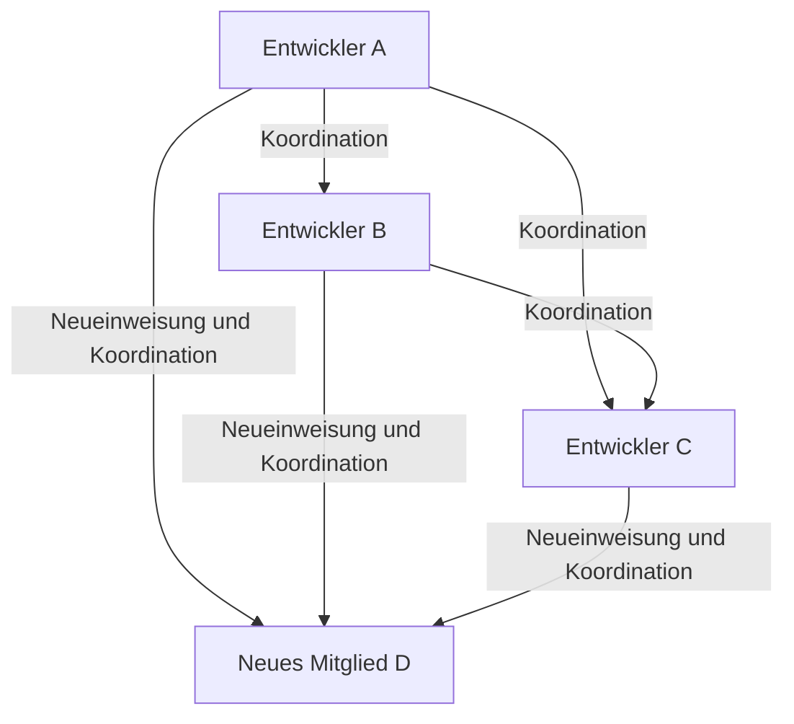
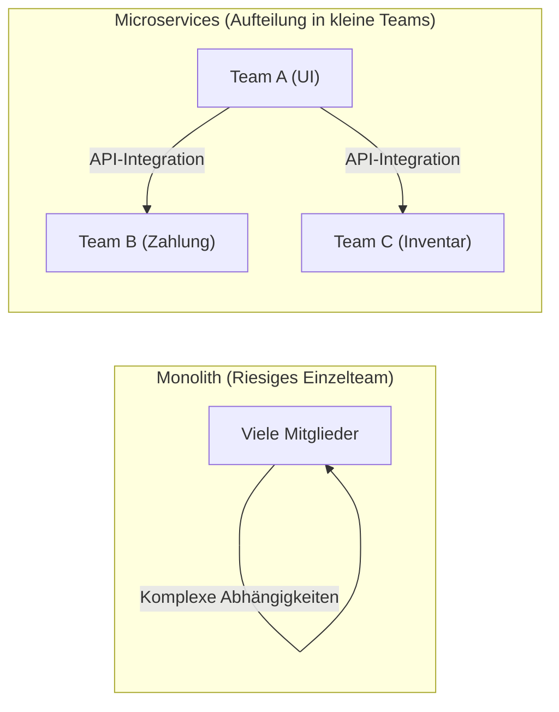

# Einführung: Was ist Brooks' Gesetz?

Jeder, der in den Bereichen Systementwicklung, Software Engineering oder allgemeines Projektmanagement tätig ist, hat wahrscheinlich schon einmal den Begriff "Brooks' Gesetz" (Brooks's law) gehört.

Brooks' Gesetz ist eine sehr bekannte und paradoxe Faustregel in Softwareentwicklungsprojekten, die 1975 von Frederick P. Brooks Jr. in seinem Buch "Vom Mythos des Mann-Monats: Essays über Software-Engineering" (The Mythical Man-Month) aufgestellt wurde. Das Gesetz lässt sich in folgendem Satz zusammenfassen:

> **"Das Hinzufügen von Arbeitskräften zu einem verspäteten Softwareprojekt verzögert es nur noch weiter."**
> *(Adding manpower to a late software project makes it later.)*

Intuitiv könnte man meinen, dass, wenn ein Projekt in Verzug ist, das Hinzufügen von mehr Personen die Arbeit entsprechend beschleunigt. Die Logik lautet: "Wenn eine Person 10 Tage für eine Aufgabe braucht, sollten 10 Personen sie in einem Tag erledigen können." In der Welt der Softwareentwicklung funktioniert diese "Mann-Monat"-Berechnungsformel jedoch nicht.

In diesem Artikel werden wir aufdecken, warum Brooks' Gesetz auftritt und was die grundlegenden Ursachen dafür sind. Außerdem werden wir im Detail untersuchen, wie man dieses Gesetz in modernen Softwareentwicklungsmethoden (Agile, DevOps usw.) vermeiden oder abmildern kann.

---

# Warum das Hinzufügen von Personal die Verzögerung verschlimmert: 3 Hauptursachen

Warum führt das Hinzufügen von Personal, das Projektmanager in guter Absicht tun, um Verzögerungen aufzuholen, dazu, dass "Öl ins Feuer gegossen wird"? Brooks nennt dafür hauptsächlich die folgenden drei Faktoren.

## 1. Explosiver Anstieg des Kommunikations-Overheads

Je mehr Personen beteiligt sind, desto höher werden die Kommunikationskosten (Overhead) für Informationsaustausch und Koordination.
Die Anzahl der Kommunikationswege (Pfade) zwischen den Teammitgliedern steigt für eine Anzahl von $n$ Mitgliedern nach der Formel $\frac{n(n-1)}{2}$.

- Bei einem Team von 3 Personen gibt es 3 Kommunikationswege
- Bei einem Team von 5 Personen sind es 10 Wege
- Bei einem Team von 10 Personen sind es 45 Wege
- Bei einem Team von 20 Personen sind es 190 Wege

Wie Sie sehen können, steigen die Kommunikationswege mit zunehmender Personenzahl **exponentiell (genauer gesagt kombinatorisch)** an. Wenn neue Personen hinzukommen, müssen sich alle abstimmen, wer was macht, wie die Designrichtlinien aussehen und was die Spezifikationen der Schnittstellen sind. Die Zeit, die eigentlich für die Entwicklung genutzt werden sollte, geht durch Meetings, Besprechungen und das Überprüfen von Nachrichten verloren.

## 2. Entstehung von Onboarding-Kosten (Schulung und Einarbeitung)

Wenn in der Endphase eines Projekts oder mitten in einer Krise neue Mitglieder hinzugefügt werden, müssen die bestehenden Mitglieder diese neuen Mitglieder über den Hintergrund des Projekts, die Systemarchitektur, Programmierrichtlinien, Geschäftsdomänenwissen und mehr unterrichten.

Dieser Akt des "Lehrens" nimmt die Zeit der besten Ingenieure in Anspruch, die das Projekt am tiefsten verstehen. Es bedarf einer gewissen Einarbeitungszeit (Ramp-up-Zeit), bis neue Mitglieder produktiv werden (anfangen, zum Projekt beizutragen). Während dieser Zeit sinkt die Gesamtproduktivität des Teams sogar **unter das Niveau vor der Hinzufügung**.

## 3. Unteilbarkeit der Arbeit (Serielle Natur von Aufgaben)

Nicht alle Arbeiten lassen sich sauber auf die Anzahl der Personen aufteilen.
Brooks verwendet in seinem Buch die berühmte Metapher: **"Selbst wenn neun Frauen schwanger sind, können sie nicht in einem Monat ein Baby zur Welt bringen."**

- **Vollständig teilbare Aufgaben:** Unkraut jäten auf einem Feld oder einfache Dateneingabe. Verdoppelt man die Anzahl der Personen, halbiert sich die Zeit.
- **Unteilbare Aufgaben:** Grundlegendes Software-Design, komplexe Fehlerbehebung, Algorithmenentwicklung usw. Das Verständnis des Kontextes und des Gesamtbildes ist erforderlich. Wenn man versucht, solche Aufgaben gewaltsam auf mehrere Personen aufzuteilen, führt dies bei der Integration zu Fehlern oder Inkonsistenzen.

Viele Phasen in der Softwareentwicklung sind voneinander abhängig. Es gibt serielle Abhängigkeiten (Kritischer [Pfad](/de/p/windows-%E3%81%A7pfad%E3%81%AE%E9%80%9A%E3%81%A3%E3%81%9Fausf%C3%BChrbare-datei%E3%81%AE%E5%A0%B4%E6%89%80%E3%82%92%E8%A6%8B%E3%81%A4%E3%81%91%E3%82%8B%E6%96%B9%E6%B3%95/)), wie z.B., dass Modul B nicht getestet werden kann, bevor Modul A abgeschlossen ist. Auch wenn man hier eine große Anzahl von Personen einsetzt, erhöht sich nur die Wartezeit, ohne dass der Fortschritt beschleunigt wird.

---

# Die Struktur des "Death March" in realen Projekten

Brooks' Gesetz zeigt sich am grausamsten in der Endphase, wenn die Deadline eines Projekts näher rückt.

1. **Entdeckung der Verzögerung:** In Phasen wie dem Integrationstest treten unerwartet viele Fehler auf, und eine Verzögerung im Zeitplan wird festgestellt.
2. **Druck vom Management:** Die Anweisung lautet: "Die Deadline ist absolut unverrückbar. Wir stellen das Budget zur Verfügung, also fügt Personal hinzu und löst das Problem."
3. **Hinzufügen von Personal:** Freigewordene (aber ohne Geschäftsdomänenwissen) Ingenieure aus anderen Projekten oder eine große Anzahl von Programmierern von Partnerunternehmen werden hinzugezogen.
4. **Höhepunkt des Chaos:** Bestehende Mitglieder sind mit der Schulung von Neueinsteigern und der Beantwortung von Fragen überlastet und können sich nicht auf ihre eigenen Aufgaben konzentrieren. Kommunikationswege explodieren, und die Meetings nehmen überhand.
5. **Qualitätsverlust:** Aus Eile und mangelnder Kommunikation nehmen neue Mitglieder Änderungen vor, die die Grundlagen des Systems zerstören und eine große Menge neuer Fehler (Regressionen) erzeugen.
6. **Weitere Verzögerungen:** Infolgedessen verzögert sich die Fertigstellung noch weiter als ursprünglich geplant, und das Team vor Ort ist völlig erschöpft (Vollendung des Death March).

Um diesen Teufelskreis zu durchbrechen, müssen Manager andere Optionen haben, als nur "Personen hinzuzufügen".

---

# Moderne Gegenmaßnahmen und Ansätze zu Brooks' Gesetz

Dieses 1975 vorgeschlagene Gesetz ist auch im modernen Software Engineering nach fast einem halben Jahrhundert im Kern noch gültig. Allerdings haben wir "Gegenmaßnahmen", die wir aus Fehlern der Vergangenheit gelernt haben. Wie überwinden moderne agile Entwicklungen, DevOps und exzellente Engineering-Organisationen dieses Gesetz von Brooks?

## Maßnahme 1: Überdenken des Zeitplans und Reduzierung des Umfangs

Wenn sich ein Projekt verzögert, sind die rationalsten und schmerzlosesten Lösungen die folgenden zwei:

- **Verlängerung der Deadline:** Den Zeitplan basierend auf realistischen Schätzungen neu aufstellen.
- **Reduzierung des Umfangs:** Nicht zwingend erforderliche Funktionen (Nice to have) aus dem Release ausschließen und bis zum Stichtag nur den Kernwert liefern.

Die eiserne Regel lautet, nicht "Personen hinzuzufügen", sondern "die Zeit zu verlängern" oder "die Aufgaben zu reduzieren". In der agilen Entwicklung (wie Scrum) ist ein Mechanismus integriert, der verhindert, dass ein unzumutbarer Umfang hineingedrückt wird, da innerhalb eines festen Sprints nur das Backlog abgearbeitet wird, das abgeschlossen werden kann.

## Maßnahme 2: Kleine, funktionsübergreifende Teams (Two-Pizza Team)

Die von Amazon-Gründer Jeff Bezos vorgeschlagene "Zwei-Pizzen-Regel" (Two-Pizza Team) ist eine der perfekten Antworten auf Brooks' Gesetz. Die Regel besagt: "Die Größe eines Teams sollte auf die Anzahl an Personen begrenzt sein, die sich zwei Pizzen teilen können (etwa 6 bis 8 Personen)."

Indem man Teams klein hält, verhindert man die Explosion der Kommunikationswege. Beim Aufbau großer Systeme bildet man nicht ein einziges riesiges Team, sondern teilt das System lose gekoppelt auf, z.B. mit einer [Microservices-Architektur](/de/p/microservices-architecture-bff-api-gateway/), und weist jede Komponente einem unabhängigen kleinen Team zu.

## Maßnahme 3: Continuous Integration (CI) und Testautomatisierung

Das Beängstigendste beim Hinzufügen von Personen ist, dass "neue Mitglieder bestehenden Code zerstören (Regression)".
Dies wird durch automatisierte Tests und CI-Mechanismen (Continuous Integration) verhindert.
Wenn es eine Umgebung gibt, in der innerhalb von Minuten Tausende automatisierter Tests ausgeführt werden, unabhängig davon, wer den Code ändert, und Fehler sofort erkannt werden, können auch neue Mitglieder den Code beruhigt ändern. Dies ist ein Ansatz zur Reduzierung von Lernkosten und Risiken durch Technologie.

## Maßnahme 4: Pflege der Dokumentation und Beseitigung impliziten Wissens

Um die Onboarding-Kosten zu senken, ist es notwendig, das "implizite Wissen, das man nicht versteht, ohne die bestehenden Mitglieder direkt zu fragen", zu reduzieren und das "explizite Wissen, das man durch Lesen versteht", zu erhöhen.
- Pflege exzellenter READMEs oder Wikis
- ADR (Architecture Decision Record), um die Hintergründe von Architekturentscheidungen festzuhalten
- Sauberer, leicht lesbarer und selbstdokumentierter Code
Indem man diese Dinge in normalen Zeiten pflegt, kann man die "Schulungskosten" beim Hinzufügen von Personal erheblich reduzieren.

---

# Fazit: Um sich dem Mythos zu stellen

Frederick Brooks erklärte in "The Mythical Man-Month": "Es gibt keine silberne Kugel" (keine magische Technologie oder Methode, die alle Probleme in der Softwareentwicklung auf einen Schlag löst).

Der einfache Additionsgedanke "Wir sind in Verzug, also lasst uns Leute hinzufügen" funktioniert nicht bei komplexen, unsichtbaren, intellektuellen Kreationen wie Software. Um ein Projekt zum Erfolg zu führen, gibt es keinen anderen Weg, als die Struktur der Kommunikation zu verstehen, das Team auf einer angemessenen Größe zu halten und stetig alltägliche Engineering-Praktiken (Automatisierung, Modularisierung, Dokumentation) zu akkumulieren.

Brooks' Gesetz fordert uns auf, aus der "Illusion des Mann-Monats" aufzuwachen und uns der wahren Natur der "Teamarbeit" zu stellen, die von den komplexen Wesen namens Menschen gewoben wird.
