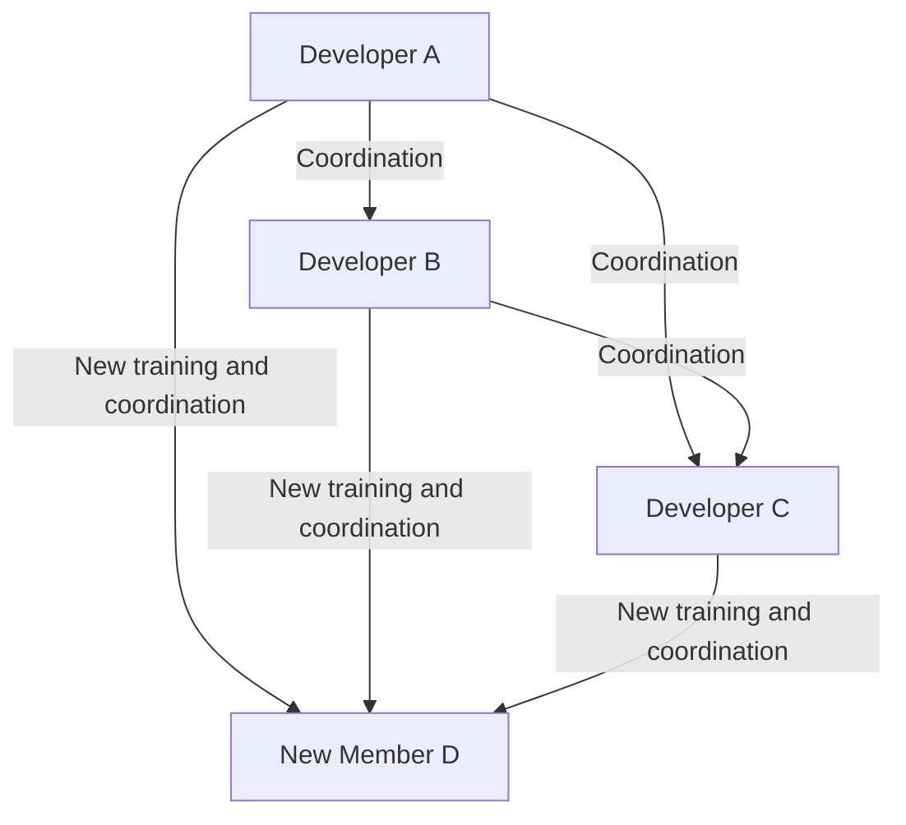
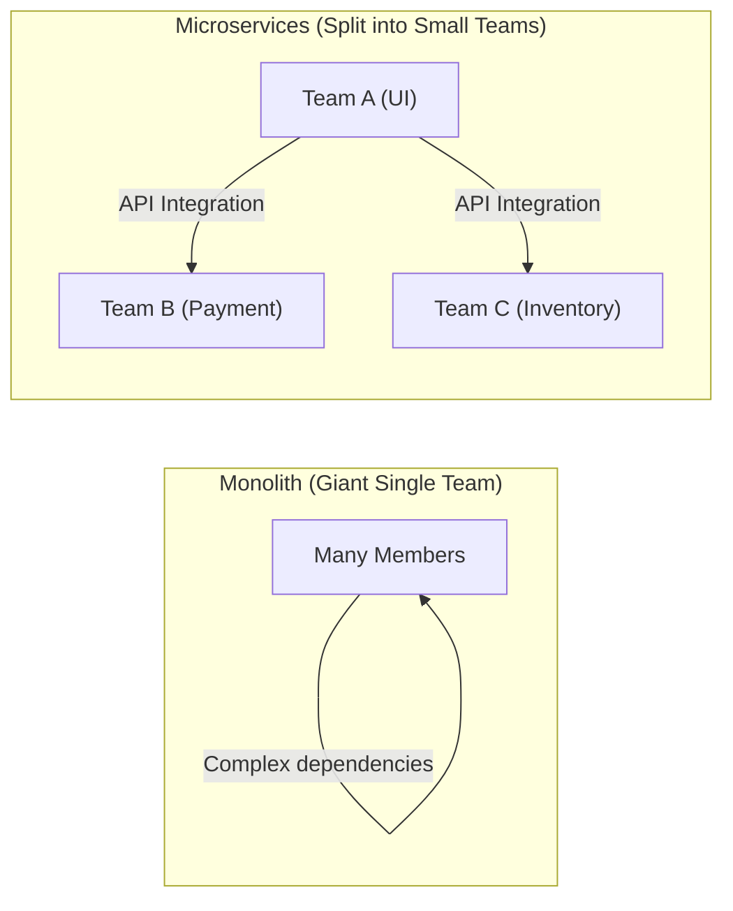

# Introduction: What is Brooks's Law?

Anyone involved in system development, software engineering, or general project management has likely heard the term "Brooks's Law" at least once.

Brooks's Law is a very famous and paradoxical rule of thumb in software development projects, proposed by Frederick P. Brooks Jr. in his 1975 book, *The Mythical Man-Month: Essays on Software Engineering*. The law is summarized in the following sentence:

> **"Adding manpower to a late software project makes it later."**

Intuitively, it seems that if a project is delayed, adding more people will advance the work proportionately. The logic goes, "If a job takes 10 days for 1 person, it should take 1 day for 10 people." However, in the world of software development, this "man-month" calculation does not hold true.

In this article, we will unravel the root causes of why Brooks's Law occurs and deeply explore how to avoid or mitigate this law in modern software development methodologies (such as Agile, DevOps, etc.).

---

# Why Does Adding Manpower Exacerbate Delays? The 3 Root Causes

Why does adding personnel, which a project manager did with good intentions to recover from delays, end up "adding fuel to the fire"? Brooks cites the following three main factors as the reasons.

## 1. Explosive Increase in Communication Overhead

The more people there are, the greater the communication costs (overhead) for information sharing and coordination.
The number of communication paths (routes) between team members increases with the number of members $n$ according to the formula $\frac{n(n-1)}{2}$.

- For a team of 3, there are 3 communication paths
- For a team of 5, there are 10 paths
- For a team of 10, there are 45 paths
- For a team of 20, there are 190 paths

In this way, as the number of people increases, the communication paths increase **exponentially (more precisely, combinatorially)**. When a new person is added, everyone must align on who is doing what, what the design policies are, and what the interface specifications are, robbing time that could have been used for development for meetings, discussions, and confirming communications.

## 2. Occurrence of Onboarding (Training and Learning) Costs

When a new member is added in the late stages of a project or in the middle of a crisis, existing members must teach the new member the background of the project, system architecture, coding conventions, and business domain knowledge.

This act of "teaching" takes time away from the top-tier engineers who understand the project most deeply. It requires a certain learning period (ramp-up time) before a new member becomes a productive force (starts contributing to the project), and during that time, the overall productivity of the team actually **drops below what it was before the addition**.

## 3. Indivisibility of Work (Sequentiality of Tasks)

Not all work can be neatly divided by the number of people.
In his book, Brooks uses the famous metaphor: **"Nine women can't make a baby in one month."**

- **Perfectly divisible tasks:** Mowing a field or simple data entry. Doubling the people halves the time.
- **Indivisible tasks:** Basic software design, complex bug investigation, algorithm creation, etc. They require grasping the surrounding context and the big picture, and forcibly dividing them among multiple people conversely causes bugs and inconsistencies during integration.

Many processes in software development have interdependent relationships, such as a sequential dependency (critical path) where module B cannot be tested until module A is completed. Injecting a large number of people here will only increase waiting time and will not speed up progress.

---

# The Structure of a "Death March" in Real Projects

Brooks's Law appears most cruelly in the final stages when a project's deadline is looming.

1. **Discovery of Delay:** Unexpected bugs occur frequently during the integration testing phase, revealing schedule delays.
2. **Pressure from Management:** Orders come down saying, "The deadline is absolutely fixed. We'll provide the budget, so throw people at it and figure it out."
3. **Adding Manpower:** Engineers freed up from other projects (but lacking business knowledge) or large numbers of programmers from partner companies are thrown in.
4. **Peak Confusion:** Existing members are overwhelmed with training newcomers and answering questions, unable to focus on their own tasks. Communication paths explode, and meetings only increase.
5. **Quality Degradation:** Due to rush and lack of communication, new members make modifications that break the system's assumptions, creating a massive amount of new bugs (degradations).
6. **Further Delays:** As a result, completion is delayed even further than originally planned, and the field is completely exhausted (the completion of a death march).

To break this vicious cycle, managers must have options other than "adding people."

---

# Modern Countermeasures and Approaches to Brooks's Law

Proposed in 1975, this law is essentially still valid in modern software engineering nearly half a century later. However, we have "countermeasures" learned from past failures. How do modern Agile development, DevOps, and excellent engineering organizations overcome this Brooks's Law?

## Countermeasure 1: Reconsidering the Schedule and Reducing Scope

When a project is delayed, the most rational and painless solutions are the following two:

- **Extend the Deadline:** Redraw the schedule based on realistic estimates.
- **Reduce the Scope:** Remove non-essential features (Nice to have) from the release target and deliver only the core value by the deadline.

The ironclad rule is not to "add people," but to "increase time" or "reduce what needs to be done." Agile development (such as Scrum) incorporates mechanisms to prevent forcing unreasonable scopes by consuming "only the backlog that can be completed" within a fixed sprint.

## Countermeasure 2: Cross-Functional Small Teams (Two-Pizza Team)

The "Two-Pizza Team" rule proposed by Amazon's Jeff Bezos is one of the perfect answers to Brooks's Law. The rule is that "the number of people on a team should be capped at the number who can share two pizzas (roughly 6 to 8 people)."

Keeping teams small prevents the explosion of communication paths. When building a large-scale system, rather than creating one giant team, the system is divided into loosely coupled components using microservices architecture, and independent small teams are assigned to each component.

## Countermeasure 3: Continuous Integration (CI) and Test Automation

The most terrifying thing when adding people is that "new members will break existing code (degradation)."
What prevents this is the mechanism of automated testing and CI (Continuous Integration).
If there is an environment where thousands of automated tests run within minutes whenever anyone changes the code, immediately detecting any bugs, new members can confidently modify the code. It is an approach that lowers learning costs and risks using technology.

## Countermeasure 4: Establishing Documentation and Eliminating Tacit Knowledge

To lower onboarding costs, it is necessary to reduce "tacit knowledge that can only be understood by asking existing members directly" and increase "explicit knowledge that can be understood by reading."
- Establishing excellent READMEs and Wikis
- ADRs (Architecture Decision Records) that preserve the background of architectural decisions
- Clean, readable, self-documenting code
By establishing these during normal times, the "training cost" when adding people can be significantly reduced.

---

# Conclusion: To Stand Against the Myth

In *The Mythical Man-Month*, Frederick Brooks declared, "There is no silver bullet (a magical technology or technique that solves every problem in software development in one shot)."

The simple addition thinking of "if it's delayed, just add people" does not work for a complex and invisible intellectual creation like software. To lead a project to success, one has no choice but to understand the structure of communication, keep team sizes appropriate, and steadily accumulate daily engineering practices (automation, modularization, documentation).

Brooks's Law demands that we wake up from the "illusion of the man-month" and face the essence of "teamwork" woven by the complex beings known as humans.
